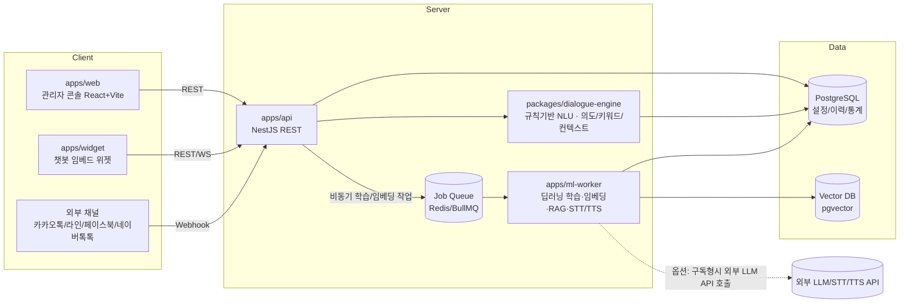

# 개발명세서 (아키텍처 / 데이터모델 / API)

> 기반 문서: `docs/01-requirements/기능요구사항.md`, `docs/03-design/UIUX_준수기준.md`
> 참고 컨벤션: 형제 프로젝트 `Auto QA`(pnpm 모노레포, NestJS+React, `.claude/agents` 하네스) 구조를 재사용하여 팀 내 기술스택 일관성을 유지한다.
> 세부 설계서/ADR 목록은 **§7**을 참고한다. 기능그룹 단위 상세 설계는 별도 문서로 두고 이 문서는 전체 골격과 결정사항을 유지한다.

## 1. 전체 아키텍처



**설계 원칙**
- **기본기능(GPU 불필요)은 `apps/api` + `packages/dialogue-engine`에서 동기 처리**한다. 규칙/경량 매칭 기반이라 별도 GPU 인프라 없이 즉시 응답한다 (`01-requirements` GPU 1~2 항목 전부).
- **확장기능/옵션 중 GPU가 필요한 항목(DLE 증강학습, 임베딩, 군집분석, RAG, 음성/멀티모달 등)은 `apps/ml-worker`로 분리**하고 Job Queue로 비동기 처리한다. 구축형은 자체 GPU 서버에서, 구독형은 동일 인터페이스로 외부 LLM/STT/TTS API를 호출하도록 **Provider 추상화**를 둔다(Auto QA의 `LlmEvaluationProvider` 패턴 재사용).
- 채널 연동(카카오톡 등)은 API의 **채널 어댑터 계층**에서 흡수하고, 내부적으로는 채널 무관한 단일 대화 처리 파이프라인을 태운다. 어댑터 계약(`normalizeInbound`/`renderOutbound`/`supportedOutputTypes`)은 No.11에서 확정됐으며, **채널 타입 분기는 팩토리 1곳에만 존재한다**(ADR-0011). Webhook 수신 경로(`POST /webhooks/:channel`)는 외부 채널 Phase에 신설한다.

## 2. 모노레포 구조

```
Chat Bot/
├── apps/
│   ├── web/           # 관리자 콘솔 — React + Vite + TS
│   ├── widget/        # 챗봇 임베드 위젯 — 경량 번들(gzip <100KB), 런타임 의존성 0(ADR-0012)
│   ├── api/           # NestJS — 챗봇관리/대화설계/대화처리/채널/보안/이력/통계
│   └── ml-worker/     # 딥러닝 학습엔진/임베딩/RAG/음성/멀티모달 워커(GPU) — 확장기능 Phase
├── packages/
│   ├── shared-types/  # FE/BE 공유 DTO (zod) + zod 무의존 서브패스(`/output-view`, `/contrast`)
│   ├── dialogue-engine/ # 의도·키워드 매칭, 컨텍스트(슬롯필링), 대화그래프 실행기, 턴 오케스트레이터
│   └── llm-provider/  # LLM/STT/TTS Provider 추상화 (mock | on-prem | cloud) — 확장기능 Phase
├── infra/             # docker-compose, Dockerfile(api/web/widget/ml-worker) — 확장기능 Phase
├── docs/              # 00-source ~ 05-ops (현재 구조 유지)
└── .claude/           # agents, commands
```

| 워크스페이스 | 상태 |
|---|---|
| `apps/api`, `apps/web`, `packages/shared-types`, `packages/dialogue-engine` | 구현 중(No.1~11 완료, **No.12~13 설계 완료**) |
| **`apps/widget`** | **No.10~11 Phase에 신규 스캐폴딩**(ADR-0012) — Vite 라이브러리 모드(IIFE) `widget.js` + `/c/:slug` 전체화면. **No.12~13에서는 수정하지 않는다** |
| `apps/ml-worker`, `packages/llm-provider`, `infra/` | 미생성. 확장기능(No.16~) 착수 시점에 도입(§6-4) |

기술스택은 `Auto QA`(NestJS+React+pnpm)와 일치시켜 팀 내 재사용성을 높인다. **예외 1건**: `apps/widget`은 번들 예산(gzip 100KB)과 호스트 페이지 침투 최소화를 위해 React를 쓰지 않고 순수 TS로 구현한다 — 빌드 도구·언어·테스트 러너·스크립트 이름은 동일하게 유지한다(ADR-0012).

### 2.1 `apps/api` 내부 계층 규약 (전 기능그룹 공통)

도메인 모듈은 다음 4계층으로 고정한다. 기능그룹이 늘어도 구조를 복제해 일관성을 유지한다.

| 계층 | 파일 | 책임 | 금지 |
|---|---|---|---|
| `*.controller.ts` | 컨트롤러 | 경로·HTTP 상태코드·zod 파이프·권한 데코레이터 | Prisma 타입 노출, 비즈니스 분기 |
| `*.service.ts` | 서비스 | 비즈니스 규칙의 **단일 진입점**이며 **`AuditLog` 기록 지점이다**(No.12부터 실제 동작 — `AuditLogService.record()` 명시 호출, ADR-0016). Prisma 직접 의존 허용 | HTTP 개념(Request/Response) 의존 |
| `*.mapper.ts` | 매퍼 | Prisma row ↔ zod DTO 변환(`null ↔ undefined`, JSON 문자열 ↔ 객체, enum 파싱 폴백) | 비즈니스 분기 |
| `lib/*.ts` | 순수 함수 | DB·Nest 무의존 로직(파생 규칙, 전이 판정, 집계, 기간 계산, 마스킹, 차이 판정, **비밀번호 정책·권한 판정·금지어 매칭·감사 스냅샷**) | 외부 I/O |

- **감사 기록 규약**: 컨트롤러·매퍼·`lib/`는 `AuditLog`를 알지 못한다(FR-0-27). **명시적 예외 1건** — 인증·인가 이력(`LOGIN`/`LOGIN_FAILED`/`LOGOUT`/`PERMISSION_DENIED`)은 서비스 계층이 아니라 `auth` 서비스와 `common/auth`의 `PermissionGuard`가 기록한다. 권한 거부는 가드 외에 관측 지점이 없기 때문이다(ADR-0016).
- **`actor` 전달 규약**: 서비스는 `Request`에 의존하지 않는다. 감사 기록용 주체는 `common/request-context`(AsyncLocalStorage)가 운반하며, **`RequestContextService.get()`을 호출해도 되는 곳은 `AuditLogService` 1곳뿐**이다. actor가 비즈니스 인자인 경우(본인 비밀번호 변경 등)에만 컨트롤러의 `@CurrentUser()`로 받아 서비스 시그니처에 명시적으로 넘긴다(ADR-0016).

공통 횡단 관심사는 `apps/api/src/common/`에 둔다 — `zod-validation.pipe.ts`, `zod-query.pipe.ts`, `zod-param.pipe.ts`, `api.exception.ts`, `all-exceptions.filter.ts`, `pagination.ts`, `auth/`(`permission.guard.ts`·`require-permission.decorator.ts`·`public.decorator.ts`·`current-user.decorator.ts`·`lib/cookie.ts`·`lib/password-hash.ts`), `request-context/`(AsyncLocalStorage), `rate-limit/`(토큰버킷 store·순수함수 — No.12에 `conversation/`에서 승격). 환경변수 검증은 `apps/api/src/config/env.validation.ts`에서 부팅 시 수행한다.

### 2.2 기능그룹별 모듈 배치

| 기능그룹 | NestJS 모듈 | 상태 |
|---|---|---|
| 챗봇 운영관리 (No.1~4) | `chatbot-groups`, `chatbots`, `stats` | 설계 완료 → `chatbot-operations-설계.md` §6에 파일 단위 구조 명시 |
| 대화 설계 (No.5~9) | `intents`, `keywords`, `homonyms`, `contexts`, `dialog-nodes`, `faqs` + 횡단 모듈 `dialogue-common`(엔진 번들 조립 / 참조 사전검사 / 대량 업로드) | 설계 완료 → `dialogue-design-설계.md` §6에 파일 단위 구조 명시 |
| 품질/채널 (No.10~11) | `simulation`(시뮬레이션·비교), `channels`(채널 CRUD), `conversation`(공개 대화 파이프라인·채널 어댑터·로그 적재·PII 마스킹) + `dialogue-common`(번들 캐시 확장) | 설계 완료 → `quality-channel-설계.md` §6 |
| **보안/이력 (No.12~13)** | **`auth`(로그인·세션·비밀번호), `users`(+`roles` 상수 조회), `banned-words`(사전·필터), `audit-logs`(기록·조회)** + **횡단 `common/auth`(가드 실구현·전역 등록·`@Public()`·`@CurrentUser()`) · `common/request-context`(신규) · `common/rate-limit`(`conversation/`에서 승격)** | **설계 완료 → `security-audit-설계.md` §6** |
| 통계 (No.14~15) | `stats`(확장) | 미착수 |

> **`packages/dialogue-engine` 사용 개시(No.5~9)**: 매칭·컨텍스트 세션 전이·설계 점검·FAQ 유사 후보 산출은 `apps/api`의 `lib/`가 아니라 **엔진 패키지의 순수 함수**에 둔다. 런타임 진입점은 `resolveResponse()`이며 DB·NestJS에 의존하지 않는다(ADR-0008). 챗봇 스코프 검증(`/chatbots/:chatbotId/...` 404·`CHATBOT_ARCHIVED` 409)은 `ChatbotsModule`이 내보내는 `ChatbotScopeService` 한 곳에서 수행한다.
>
> **엔진 진입점 3층화(No.10~11)**: 텍스트 해석 `resolveResponse()`, 버튼 노드 실행 `resolveByNodeId()`, 턴 오케스트레이터 **`resolveTurn()`** 으로 나눈다. **API 소비자(시뮬레이션·비교·공개 대화)는 `resolveTurn()`만 호출**하며, 대화 상태 봉투 검증·버튼 라우팅·다음 상태 조립은 전부 엔진이 책임진다(ADR-0010). 대화 상태는 서버에 저장하지 않고 클라이언트가 보관해 왕복한다(ADR-0009).
>
> **엔진 불가침(No.12~13)**: 인증·권한·금지어는 **`apps/api` 경계에만 존재**한다. `packages/dialogue-engine`은 이들을 알지 못하며 이번 그룹에서 수정 0줄이다(ADR-0008 규약 유지). 금지어 필터는 `conversation` 모듈의 파이프라인 2지점(입력 수신 직후 / 응답 반환 직전)에만 적용된다.

## 3. 핵심 데이터 모델 (엔터티 개요)

| 엔터티 | 설명 | 관련 기능 |
|---|---|---|
| `ChatbotGroup` | 챗봇 그룹(폴더). 1단계 평면 구조(계층 폴더 미지원) | 1 |
| `Chatbot` | 챗봇 인스턴스(이름/아바타/URL/스킨/상태). `skin`은 JSON 직렬화 문자열, API 경계에서는 객체 | 1, 3, 4 |
| `Intent` | 의도 — 예문 목록(JSON) 포함. `nameNormalized`로 정규화 유일성 강제(ADR-0006) | 6 |
| `Keyword` | 키워드/엔티티 사전 — 동의어 목록(JSON). API 경로는 `/keywords`(구 `/entities` 표기 정정) | 6 |
| `HomonymDictionary` | 동음이의어/다의어 사전 — 의미별 문맥힌트·연결의도(JSON) + 모호성 해소 정책 | 7 |
| `DialogNode` | 대화그래프 노드. 인풋조건은 조인 테이블 `DialogNodeIntent`/`DialogNodeKeyword` + `contextVariableId` FK, 아웃풋 12종은 JSON(ADR-0005) | 5 |
| `DialogNodeIntent` | 노드↔의도 다대다 조인. 역참조 조회(`linkedNodeCount`)·삭제 사전검사의 근거(ADR-0005) | 5, 6 |
| `DialogNodeKeyword` | 노드↔키워드 다대다 조인(동일) | 5, 6 |
| `ContextVariable` | 세션 컨텍스트(슬롯필링) 폼 정의 — 슬롯·취소어·타임아웃 | 8 |
| `FaqEntry` | FAQ/스몰톡/셀프서비스/오류응답 응답셋 — 대체질문(JSON)·활성여부 | 9 |
| `Channel` | 채널 배포 설정. `(chatbotId, type)` 유일, 타입별 `config` 판별 유니온(WEB / 준비 중). 자격증명은 저장하지 않으며(NFR-S7) `enabled` 기본값은 `false`다(ADR-0011) | 11 |
| **`User`** | **회원. 인증 수단(`passwordHash` — scrypt)·`status`(ACTIVE/DISABLED)·`mustChangePassword`·로그인 실패 카운터/잠금·`lastLoginAt` 보유. 물리 삭제는 제공하지 않고 비활성으로 대체한다. `role`은 String + zod enum 단일 소스이며 **`Role`/`Permission` 테이블은 만들지 않는다**(역할 3종 고정, 역할→권한 매핑은 `shared-types` 코드 상수 — ADR-0015)** | 12 |
| **`Session`** | **서버 보관 불투명 세션. 토큰 원문은 저장하지 않고 `tokenHash`(sha256)만 둔다. 유휴 만료 + 절대 만료 2중이며 로그아웃·비밀번호 변경·계정 비활성 시 즉시 무효화된다(ADR-0014)** | 12 |
| **`BannedWord`** | **금지어/비속어 사전. 챗봇 스코프가 아닌 전역 1벌이며 `wordNormalized` 유일. 정규식은 받지 않는다(리터럴 매칭)** | 12 |
| `AuditLog` | **변경 이력(감사추적) 전용**. 전 도메인 쓰기 동작의 단일 기록 대상이며 **append-only**(수정·삭제 API 없음). 기록 시점 스냅샷(`actorEmail`/`actorRole`/`targetName`)과 `chatbotId`를 함께 보관하고 `actorId`/`chatbotId`/`targetId`에 FK를 걸지 않는다. **API 연동 상세로그는 이 테이블이 아니라 No.26 착수 시 `ApiCallLog`로 분리한다**(ADR-0016) | 13 |
| `ConversationLog` | 대화 원문 로그(통계/학습현황 소스). **세션 식별자 `sessionId` 보유** — No.2 접속수 산정 근거(ADR-0001). **공개 대화 API(No.11)가 유일한 쓰기 주체이며 저장 전 금지어 마스킹 → PII 마스킹 순서가 필수다(ADR-0013). `matchedNodeId`/`matchedFaqId`로 응답 출처를, `blockedByFilter`로 금지어 차단 턴을 추적한다** | 14, 15 |
| `TrainingJob` | DLE 증강학습/임베딩/군집분석 Job (ml-worker 큐) | 16, 18, 21 |
| `EmbeddingVector` | 텍스트 임베딩(pgvector) | 18, 30(RAG) |
| `TestCase` / `TestRun` | 대화검증시스템 TC 테스트 | 19, 20 |
| `ChatbotVersion` | 버전 스냅샷(복원용) | 25 |
| `Survey` / `SurveyResponse` | 설문관리 | 27 |
| `DeploySchedule` | 운영 예약 배포 | 28 |

> **미도입 결정 6건**
> ① 대화그래프의 **명시적 엣지 테이블(`DialogNodeEdge`)·캔버스 좌표(`canvasX`/`canvasY`)** — 근거와 재검토 시점은 `dialogue-design-설계.md` §2.1·§12.
> ② **컨텍스트 세션 영속화 테이블** — 대화 상태는 클라이언트 보관 봉투로 왕복하고 서버가 매 턴 재검증한다. 재검토 트리거는 No.24(상담원 인계)·No.42(옴니채널)·대화 이력 복원(**ADR-0009**).
> ③ **`ConversationLog`의 추가 인덱스·`turnIndex`·`responseTimeMs`** — 소비하는 수용기준이 없다(ADR-0004 기준). No.14/No.15로 이관(`quality-channel-설계.md` §2.2).
> ④ **`Role`/`Permission` 테이블·사용자 그룹(조직) 테이블** — 역할 3종 고정 + 코드 상수 매핑으로 대체한다. 커스텀 역할·멀티테넌시가 실제로 필요해지는 시점(No.22/No.45)에 재검토(**ADR-0015**).
> ⑤ **`ApiCallLog`(레거시 API 연동 상세 로그)** — 기록 대상인 No.26이 미구현이라 쓰기 주체가 없다. 감사로그와 보존기간·용량·마스킹 요건이 달라 같은 테이블에 섞지 않는다(**ADR-0016**).
> ⑥ **MFA 관련 컬럼** — 시크릿 암호화 저장 방식이 미결정이다. 확장 지점은 로그인 응답의 `status` 판별 필드 1개뿐이며 스키마는 건드리지 않는다(**ADR-0014**).

### 3.1 데이터 모델 공통 규약

- **enum**: SQLite에 네이티브 enum이 없으므로 DB는 `String`으로 두고, 값 제약은 `packages/shared-types`의 zod enum이 단일 소스다. 매퍼에서 파싱 실패 시 안전값 폴백 + 경고 로그.
- **배열/객체 필드**: `String`에 JSON 직렬화(`skin`, `examples`, `synonyms`, `outputs`, `slots`, `meanings`, `altQuestions`, `config`, `beforeValue`/`afterValue` 등). **API 경계에서는 항상 객체/배열**로 송수신한다. 파싱 실패 시 기본값 폴백 + 경고 로그.
- **참조 무결성**: 전 관계에 `onDelete: Restrict, onUpdate: Cascade`를 **명시**한다. 암묵적 cascade는 **조인 테이블에서도 금지**하며(ADR-0005 DD-15), 삭제는 서비스 계층 사전 검사 → `409`로 거부한다(ADR-0002). 사전 검사는 UX용, DB 제약은 최종 방어선이다.
  - **예외(의도적)**: `ConversationLog`의 `matchedIntentId`/`matchedNodeId`/`matchedFaqId`와 **`AuditLog`의 `actorId`/`chatbotId`/`targetId`** 는 **FK를 걸지 않는다**. 로그는 "그 시점의 사실 기록"이며, FK를 걸면 `Restrict` 규약 때문에 로그가 쌓인 노드/의도/FAQ/챗봇/사용자를 영원히 삭제할 수 없게 된다. `channelType`이 문자열인 것과 같은 판단이다. 대신 표시용 스냅샷(`targetName`/`actorEmail`/`actorRole`)을 함께 보관해 목록이 UUID 나열이 되지 않게 한다.
- **정규화 유일성**: 이름류 유일성은 원문이 아니라 `normalizeText()` 결과 컬럼(`nameNormalized`/`wordNormalized`/`questionNormalized`) + `@@unique([chatbotId, *Normalized])`로 강제한다(ADR-0006). 정규화 구현은 `packages/shared-types/src/common.ts` 한 곳뿐이다. **예외: `User.email`은 정규화 결과(trim + 소문자)를 `email` 컬럼에 그대로 저장하고 기존 `@unique`를 쓴다** — 이메일의 정규화는 손실이 아니며 별도 컬럼을 둘 이유가 없다(`security-audit-설계.md` §3.3).
- **부분 수정 시맨틱**: 키 없음/`undefined` = 미변경, `null` = 값 삭제, 값 = 교체. `null` 허용 필드는 스키마에 `.nullable()`로 명시한다. **단 `Channel.config`는 전체 교체**다(배열 필드에서 "삭제"를 표현할 수 없게 되는 것을 막는다).
- **인덱스**: 목록 필터/정렬 컬럼과 기간 집계 컬럼에 복합 인덱스를 둔다. 현재 적용분 — `conversation_logs(chatbotId, createdAt)`, `chatbots(groupId, status)`, `chatbots(updatedAt)`, `intents|keywords|homonym_dictionaries|context_variables|faq_entries(chatbotId, updatedAt)`, `dialog_nodes(chatbotId, priority)`, `dialog_nodes(chatbotId, nodeType)`, `faq_entries(chatbotId, category)`, `dialog_node_intents(intentId)`, `dialog_node_keywords(keywordId)`, `channels(chatbotId, type) UNIQUE`, **`users(role)`, `users(status, createdAt)`, `sessions(tokenHash) UNIQUE`, `sessions(userId)`, `sessions(expiresAt)`, `banned_words(wordNormalized) UNIQUE`, `audit_logs(createdAt)`, `audit_logs(actorId, createdAt)`, `audit_logs(chatbotId, createdAt)`**.

## 4. API 설계 개요 (REST, `/api/v1/`)

경로는 `setGlobalPrefix('api')` + URI 버저닝 기본값 `1`로 구성한다(ADR-0003). `health`만 `VERSION_NEUTRAL`로 `/api/health`를 유지한다.

| 그룹 | 대표 엔드포인트 | 대응 기능 |
|---|---|---|
| 챗봇 운영관리 | `/chatbot-groups`(+`/:id/copy`), `/chatbots`(+`/:id/settings｜skin｜status｜group｜copy｜permanent-delete｜embed-code`, `/slug-available`) | 1, 3, 4 |
| 대화 설계 | **`/chatbots/:chatbotId/`** 하위 중첩 — `intents`(+`/:id/examples`, `/bulk-delete`, `/import/validate｜commit｜template`, `/export`), `keywords`(+동일 import 계열), `homonyms`(+`/test`), `contexts`, `dialog-nodes`(+`/:id/copy`, `/validate`, `/flow`), `faqs`(+`/suggest`, `/bulk-delete`, import 계열) | 5~9 |
| 품질/시뮬레이션 | `POST /chatbots/:chatbotId/simulate`, `POST /chatbots/:chatbotId/simulate/compare` | 10 |
| 채널 | `GET /chatbots/:chatbotId/channels`, `PATCH｜DELETE /chatbots/:chatbotId/channels/:type`. **`POST /webhooks/:channel`은 미구현(외부 채널 Phase)** | 11 |
| **공개 대화(인증 없음)** | **`GET /public/chatbots/:slug/config`, `POST /public/chatbots/:slug/messages`** | 11 |
| **인증** | **`POST /auth/login｜logout`, `GET /auth/me`, `POST /auth/password`** | 12 |
| **회원·권한** | **`/users`(+`/:id/status`, `/:id/password-reset`), `/roles`(역할·권한 **상수 조회 API** — 테이블 기반 CRUD가 아니다)** | 12 |
| **보안(금지어)** | **`/banned-words`(+`/test`)** | 12 |
| **이력** | **`GET /audit-logs`(+`/:id`, `/export`). 쓰기·수정·삭제 경로가 존재하지 않는다(append-only)** | 13 |
| 통계 | `GET /stats/dashboard`, `/stats/usage`, `/stats/training-status` | 2, 14, 15 |
| AI 엔진(ml-worker 프록시) | `POST /training-jobs`(DLE/임베딩/군집분석), `GET /training-jobs/:id` | 16~18, 21 |
| 검증 | `/test-cases`, `POST /test-runs` | 19, 20 |
| 상담연계 | `/monitoring/live`, `/monitoring/hints` | 24 |
| 버전/배포 | `/chatbots/:id/versions`, `POST /chatbots/:id/deploy-schedule` | 25, 28 |
| 연동 | `/legacy-apis`, `/surveys` | 26, 27 |
| 옵션(RAG 등) | `POST /rag/query`, `/agentic/tasks`, `/voice/stt`, `/voice/tts` | 30~39 |

> **정정 이력(2026-09-19)**: 대화 설계 행의 `/entities`는 Prisma 모델·모듈명(`Keyword`/`keywords`)과 불일치하여 **`/keywords`로 정정**했고, 이 그룹 전체를 `/chatbots/:chatbotId/...` 중첩 경로로 통일했다(`dialogue-design-설계.md` §5.3, 요구사항 FR-0-9).
> **정정 이력(2026-09-20)**: 품질/채널 행의 `:id`를 **`:chatbotId`로 통일**하고, `/compare`를 **`/simulate/compare`**(시뮬레이션 하위 자원)로, 채널을 챗봇 스코프 중첩 경로로 정정했다. `/webhooks/:channel`은 이번 Phase에 **만들지 않으므로** 미구현으로 표기하고, **공개 대화 API 행을 신설**했다(`quality-channel-설계.md` §5.4).
> **정정 이력(2026-09-21)**: 기존 "보안/이력 행(`/users`, `/roles`, `/audit-logs`)"을 **인증 / 회원·권한 / 보안(금지어) / 이력 4행으로 분리**하고 `/auth/*` 4개와 `/banned-words/*` 5개를 추가했다. `/roles`가 **상수 조회 API**임과 이력에 쓰기 경로가 없음을 명시했다(`security-audit-설계.md` §5.1·§5.2).

모든 응답은 `packages/shared-types`의 zod 스키마로 검증한다(Auto QA `eval-schema` 패턴 재사용).

### 4.1 API 공통 규약 (전 기능그룹 공통, ADR-0003)

| 항목 | 규칙 |
|---|---|
| 검증 | 요청/응답 모두 zod 단일 소스. `ZodValidationPipe`(body) / `ZodQueryPipe`(query), strip 모드 |
| 목록 응답 | `{ items, total, page, pageSize }`. `page`는 1부터, `pageSize` 기본 20 · 최대 100. **항목 수가 enum 크기로 고정된 목록(채널 8종, 역할 3종)은 예외로 `{ items }`만 반환한다** |
| 목록 쿼리 | `q`(부분 일치), `sort`/`order`(기본 `updatedAt desc`)를 공통 제공. **예외 2건** — `/users`는 기본 `createdAt desc`, `/audit-logs`는 **`createdAt desc` 고정**(정렬 파라미터를 받지 않는다) |
| 복수 선택 쿼리 | 콤마 구분 단일 파라미터(`?status=DRAFT,ACTIVE`) |
| 날짜 | ISO-8601 UTC 송수신, 화면 표시는 `Asia/Seoul` |
| 오류 봉투 | `{ statusCode, code, message, details?: [{ field, message }] }`. `code`는 `ApiErrorCode` enum(프런트는 메시지 문자열이 아니라 `code`로 분기) |
| 상태코드 | **401(미인증·세션만료·자격증명 오류)** / **403(권한 부족·비밀번호 변경 강제)** / 404(미존재) / 409(고유 제약·상태 충돌·참조 무결성) / 400(형식·불허 전이·기간 오류) / 429(공개 API 레이트리밋·**로그인 폭주**) |
| 챗봇 스코프 | 챗봇 하위 리소스는 `/chatbots/:chatbotId/...` 중첩. **교차 챗봇 접근은 `403`이 아니라 `404`**(존재 노출 금지), `ARCHIVED` 챗봇의 쓰기는 `409 CHATBOT_ARCHIVED`. **단 이 규칙은 권한 판정을 통과한 뒤에만 적용된다**(권한 없음 + 미존재 ID = `403`) |
| **공개 API 계열** | **`/api/v1/public/...` 프리픽스. 관리자 계열과 컨트롤러·DTO·오류 메시지를 공유하지 않으며, 응답에 내부 식별자·`trace`를 포함하지 않는다. 존재 노출 규약의 유일한 예외로 미존재는 `404`, 비활성은 `403`을 쓴다(ADR-0011 §4). 인증 대상이 아니며 CORS·레이트리밋·Origin 가드 동작이 No.12 도입 후에도 변하지 않는다** |
| **인증** | **관리자 API는 세션 쿠키(`cb_session`, `HttpOnly`·`SameSite=Lax`·`Path=/api`) 인증이 기본이다. 세션은 서버 보관 불투명 토큰이며 DB에는 해시만 둔다. CSRF는 `SameSite=Lax` + 상태 변경 API 전부 비-GET 구조로 방어한다(ADR-0014)** |
| 권한 | **No.12에서 구현 완료. `PermissionGuard`는 `APP_GUARD` 전역 가드(fail-closed)이며, 공개 경로는 `@Public()`으로 명시 opt-out 한다(정확히 5곳: `/api/health`, 공개 대화 2, `/auth/login`, `/auth/logout`). 권한 문자열의 단일 소스는 `shared-types`의 `Permission` 유니온 14종이며 `@RequirePermission` 인자 타입이 이를 강제한다(오타는 빌드 실패). 데코레이터가 없는 핸들러는 "인증만 요구"로 통과한다. `403` 응답 본문에 요구 권한 문자열을 담지 않는다(ADR-0015)** |
| 파괴적 동작 | GET으로 노출 금지. 영구 삭제류는 별도 POST 경로 + 확인값 서버 재검증. **이 규약은 CSRF 방어의 전제다**(NFR-S9) — 위반 시 `SameSite=Lax` 보호가 무력화되므로 코드리뷰 상시 점검 항목이다 |
| 파일 업로드 | `memoryStorage()` + 크기/행수 상한. 디스크에 남기지 않고 파싱 후 즉시 폐기(ADR-0007) |

## 5. 비기능 요구사항

- **성능**: 규칙기반 매칭 응답 200ms 이내(P95), LLM/RAG 경유 응답은 3초 이내(P95, 옵션기능). 목록 조회 300ms(P95), 통계 집계 500ms(P95). 대량 업로드는 5,000행 기준 검증 10초 / 커밋 20초 이내. 공개 대화 API는 번들 캐시 적중 시 500ms(P95) / 콜드 1.5초(P95), 비교 실행(20문장×2번들) 3초(P95), 위젯 `widget.js`는 gzip 100KB 이내. **권한 가드 오버헤드는 요청당 20ms(P95) 이내(세션+사용자 1쿼리), 비밀번호 해시 검증은 로그인 경로에서만 수행하며 300ms(P95) 이내, 감사로그 기록이 기존 API 응답시간을 20% 이상 늘리지 않는다, 이력 목록 조회는 100만 행 기준 1초(P95) 이내.**
- **보안**: 금지어/비속어 필터(사전 매칭, No.12 — 적용 지점은 *입력 수신 직후*와 *응답 반환 직전* 2곳이며 **관리자 콘솔 입력과 관리자 시뮬레이션에는 적용하지 않는다**), 로그인 정책(**MFA는 1차 범위 제외** — 시크릿 관리 방식 미결정, `security-audit-설계.md` §15), RBAC(**역할 3종 고정, 역할→권한 매핑은 `shared-types` 코드 상수 — ADR-0015**). **관리자 API는 전역 fail-closed 가드로 보호되며 공개 경로 5곳만 `@Public()`으로 opt-out 한다. 세션은 서버 보관 불투명 토큰 + httpOnly 쿠키이고 비밀번호는 신규 의존성 없이 Node 내장 `scrypt`로 해시하며, 평문·해시·세션 토큰은 응답·로그·이력 어디에도 나타나지 않는다(ADR-0014). 전 도메인의 쓰기 동작은 `AuditLogService` 단일 진입점을 통해 `AuditLog`에 기록되고, 이력은 불변이다(ADR-0016).** **PII(주민번호/카드/계좌/전화/이메일)는 대화로그 저장 전 마스킹이 필수이며, 적용 지점은 `ConversationLogService.record()` 내부 단 1곳이다(ADR-0013 — No.12부터 금지어 마스킹 → PII 마스킹 순서로 수행).** 마스킹 구현은 현재 `apps/api`의 순수 함수이며 소비자가 2곳 이상이 되면 `packages/pii-mask`로 승격한다(Auto QA `packages/pii-mask` 패턴 참고). 사용자 입력 URL은 `http`/`https` 스킴만 허용한다(zod `.url()`은 `javascript:`를 통과시키므로 별도 refine 필수). 업로드 파서는 취약점 이력이 없는 유지보수 버전만 사용한다(ADR-0007). **인증 없는 공개 API는 레이트리밋(세션 30/분·IP 120/분)과 Origin 인가 가드로 보호하며, CORS는 인가 수단으로 쓰지 않는다(ADR-0011 §5). No.12의 CORS 변경은 경로 분기 delegate로 공개 경로의 현행 동작을 100% 보존한다(ADR-0014 §4).** **채널 자격증명은 저장하지 않는다** — config 스키마에 해당 필드를 두지 않으며, 연동 착수 시점에 암호화·시크릿 관리 방식을 먼저 결정한다.
- **접근성/UI 품질**: `docs/03-design/UIUX_준수기준.md` 전 항목 준수(색상대비 4.5:1, 키보드 접근성 등). 신규 화면은 레이블 있는 폼 + 키보드 접근 가능 컴포넌트 구조를 전제로 설계한다. **순서 변경은 위/아래 버튼으로 제공하고 드래그앤드롭을 유일한 수단으로 두지 않는다.** **`apps/widget`은 이 기준의 (a) 대상 그 자체이므로 §1~§8 전 항목을 충족하며, axe 자동 스캔에서 대비 위반 0건이어야 한다.** **로그인·403 안내·세션 만료 모달도 동일 기준을 만족하며, 역할·상태·감사 동작 배지는 색상만이 아니라 텍스트를 병기한다.**
- **확장성**: ml-worker는 Job Queue 기반 수평 확장, 구독형 배포 시 외부 LLM API로 즉시 대체 가능(Provider 추상화). **단일 인스턴스 전제의 서버 상태(업로드 스테이징·번들 캐시·레이트리밋 카운터·금지어 사전 캐시)는 전부 인터페이스로 추상화해 두어, 다중 인스턴스 전환 시 교체 지점이 각각 1곳이다**(ADR-0007 / `quality-channel-설계.md` §8.1·§8.6 / `security-audit-설계.md` §11). **세션은 처음부터 DB 테이블이라 프로세스 로컬 상태가 아니다.**
- **가용성**: 대화처리(API)와 딥러닝 학습(ml-worker)을 프로세스 분리하여, 학습 부하가 실시간 대화 응답에 영향 주지 않도록 격리. **대화 엔진은 손상된 데이터에 예외를 던지지 않는다**(무시 + trace 경고, 가용성 우선 — ADR-0008). **대화로그 적재 실패가 대화 응답을 실패시키지 않는다**(응답 반환 후 best-effort). **감사로그 기록 실패가 본 동작을 실패시키지 않는다**(커밋 후 별도 쓰기 + 예외 흡수 — ADR-0016). **부트스트랩 관리자 계정이 없어도 API는 기동하며 경고 로그만 남긴다.**
- **배포형태 중립**: 구축형/구독형이 **동일 코드**로 동작해야 하며, 외부 URL(API/위젯 base 등)은 환경변수로만 주입한다(하드코딩 금지). 필수 환경변수는 부팅 시 검증해 기동 단계에서 실패시킨다. **선택 환경변수는 기본값을 두어 기동 실패 조건을 늘리지 않는다.** **보안/이력 그룹이 추가한 9종은 전부 선택이며, 부트스트랩 계정 변수 2종은 seed 전용이라 API 기동 조건이 아니다.** **네이티브 빌드가 필요한 의존성(bcrypt/argon2 등)은 온프레미스 설치 실패 위험 때문에 도입하지 않는다.**
- **DB 이식성**: 원시 SQL은 불가피한 경우에만 사용하고 해당 서비스 파일 1곳으로 격리한다. SQLite/Postgres 공통 문법만 사용해 §6-4의 Postgres 전환 시 영향 범위를 서비스 계층으로 한정한다. **트랜잭션 내부에서 실패한 쿼리를 삼키지 않는다**(Postgres의 aborted transaction 동작 — 감사 기록을 커밋 후로 뺀 이유, ADR-0016 §4).

### 5.1 환경변수 목록 (현행)

| 변수 | 위치 | 필수 | dev 예시 | 용도 |
|---|---|---|---|---|
| `DATABASE_URL` | `apps/api/.env` | ✅ | `file:./dev.db` | Prisma 접속 |
| `API_PORT` | `apps/api/.env` | — | `3000` | API 포트 |
| `WIDGET_BASE_URL` | `apps/api/.env` | ✅ | `http://localhost:5174` | 임베드 스크립트/공개 URL 베이스(No.4). **No.11부터 실제 `apps/widget` 서빙 주소** |
| `PUBLIC_API_BASE_URL` | `apps/api/.env` | ✅ | `http://localhost:3000/api/v1` | 임베드 스니펫이 위젯에 주입하는 API 베이스 |
| `VITE_API_BASE_URL` | `apps/web/.env` | ✅ | **`/api/v1`** | 관리자 콘솔 API 베이스. **No.12부터 Vite `/api` 프록시를 타는 동일 출처 값으로 바꾼다**(쿠키 인증 — ADR-0014 §4) |
| `PUBLIC_RATE_LIMIT_SESSION_PER_MIN` | `apps/api/.env` | — | `30` | 공개 대화 API 세션 기준 분당 상한(No.11) |
| `PUBLIC_RATE_LIMIT_IP_PER_MIN` | `apps/api/.env` | — | `120` | 공개 대화 API IP 기준 분당 상한(No.11) |
| `TRUST_PROXY` | `apps/api/.env` | — | `false` | `true`일 때만 `X-Forwarded-For`를 신뢰(레이트리밋 IP 산출) |
| `DIALOGUE_BUNDLE_CACHE_TTL_MS` | `apps/api/.env` | — | `60000` | 대화 자산 번들 캐시 TTL(No.11) |
| `VITE_PUBLIC_API_BASE_URL` | `apps/widget/.env` | ✅(전체화면 빌드) | `http://localhost:3000/api/v1` | `/c/:slug` 모드의 API 베이스. 임베드 모드는 `data-api-base`에서 주입. **위젯은 크로스오리진이 본질이므로 이 값을 동일 출처로 바꾸지 않는다** |
| **`SESSION_IDLE_TIMEOUT_MIN`** | `apps/api/.env` | — | `120` | 세션 유휴 만료(분, 슬라이딩 갱신) |
| **`SESSION_ABSOLUTE_TIMEOUT_HOURS`** | `apps/api/.env` | — | `12` | 세션 절대 만료(시간, 갱신 불가) |
| **`LOGIN_MAX_FAILURES`** | `apps/api/.env` | — | `5` | 계정 잠금 임계 |
| **`LOGIN_LOCKOUT_MIN`** | `apps/api/.env` | — | `15` | 잠금 지속(분) |
| **`LOGIN_RATE_LIMIT_IP_PER_MIN`** | `apps/api/.env` | — | `20` | 로그인 IP 분당 상한 |
| **`AUDIT_QUERY_MAX_RANGE_DAYS`** | `apps/api/.env` | — | `90` | 이력 조회 기간 상한 |
| **`BANNED_WORD_CACHE_TTL_MS`** | `apps/api/.env` | — | `60000` | 금지어 사전 캐시 TTL |
| **`AUTH_COOKIE_SECURE`** | `apps/api/.env` | — | `false` | 운영은 `true`(HTTPS 전제) |
| **`ADMIN_WEB_ORIGIN`** | `apps/api/.env` | — | 미설정 | 쿠키 인증 CORS allowlist(콤마 구분). **미설정 = 동일 출처 전용**(권장 구성) |
| **`BOOTSTRAP_ADMIN_EMAIL`** | seed 전용 | — | `admin@chat-bot.local` | 초기 ADMIN 계정. **`EnvSchema` 대상이 아니다**(API 기동 조건이 되어서는 안 된다) |
| **`BOOTSTRAP_ADMIN_PASSWORD`** | seed 전용 | — | `ChangeMe!2026` | 초기 비밀번호(`mustChangePassword=true`로 생성) |

> 대화 설계 그룹(No.5~9)은 신규 환경변수를 추가하지 않았다. 업로드 상한·토큰 TTL 등은 `shared-types`의 `IMPORT_LIMITS` 상수로 고정한다.
> 품질/채널 그룹(No.10~11)이 추가한 5개는 **`VITE_PUBLIC_API_BASE_URL`을 제외하고 전부 선택(기본값 있음)** 이므로 기동 실패 조건이 늘지 않는다.
> 보안/이력 그룹(No.12~13)이 추가한 9개는 **전부 선택(기본값 있음)** 이며, 부트스트랩 2종은 seed 전용이라 **환경변수를 하나도 설정하지 않아도 API가 기동한다**.

## 6. 결정 사항

1. **기술스택 확정(2026-09-19)**: NestJS+React+pnpm 모노레포(Auto QA와 동일 컨벤션)로 진행.
2. **구축형/구독형 우선순위**: 1차 범위(기본기능 15개)는 전부 GPU 필요도 1~2, 구축형/구독형 모두 ○(적합)이라 이 결정이 구현을 막지 않음 — ml-worker/Provider 추상화가 필요해지는 확장기능(16번~) 착수 시점에 결정.
3. **1차 개발 범위 확정(2026-09-19)**: 기본기능 15개(No.1~15) 전체. `docs/01-requirements/기능요구사항.md` §2 참고.
4. **dev DB는 SQLite(2026-09-19, Phase 0 스캐폴딩 시 확정)**: `Auto QA`의 실제 설정을 조사한 결과 Postgres가 아니라 Prisma+SQLite(`file:./dev.db`)로 가볍게 운영 중임을 확인, 동일 컨벤션을 그대로 따른다. 본 §1 다이어그램의 Postgres+pgvector/Redis/ml-worker/docker-compose는 확장기능(16번~, GPU 필요) 착수 시점에 도입한다 — 그 전까지 `infra/`는 존재하지 않는다.
5. **API 버저닝·검증·오류 형식 확정(2026-09-19)**: 경로는 `/api/v1/*`(URI 버저닝, `health`만 버전 중립), 검증은 zod 단일 체계(전역 `class-validator` 파이프 제거), 오류는 `{ statusCode, code, message, details }` 봉투로 통일. → **ADR-0003**
6. **접속수(visitCount) 산정 기준 확정(2026-09-19)**: `ConversationLog.sessionId`(nullable) 추가, `visitCount = distinct sessionId + sessionId가 null인 행 수`. 세션 값이 없으면 자동으로 "로그 건수"와 동일해져 대화 엔진 도입 시 API 변경 없이 정확한 정의로 승격된다. 응답의 `visitCountBasis`로 UI 캡션을 서버가 결정한다. → **ADR-0001**
7. **삭제 정책 확정(2026-09-19)**: 암묵적 cascade 금지. 삭제는 2단계(보관 → 영구삭제)이며 영구삭제는 하위 레코드 사전 검사 후 `409`로 거부한다. 영구삭제는 `POST /:id/permanent-delete` + `confirmName` 서버 재검증. → **ADR-0002**
8. **통계 집계 전략 확정(2026-09-19)**: DB `groupBy`로 카디널리티를 줄인 뒤 애플리케이션 순수 함수가 정규화·병합·정렬한다. 집계 로직은 DB 무의존 순수 함수로 분리해 단위 테스트 대상으로 삼는다. → **ADR-0004**
9. **`packages/shared-types` 파일 배치 규칙(2026-09-19)**: 도메인 스키마는 해당 도메인 파일에 append(`chatbot.ts`, `stats.ts` 등), 여러 도메인이 공유하는 횡단 관심사(페이지네이션·오류 봉투·정렬·안전 URL·**텍스트 정규화**)만 `common.ts`에 둔다. 파생 스키마(`.pick()/.partial()`)를 원본과 다른 파일에 두지 않는다(순환 import·탐색 비용 방지). 관심사가 명확히 다르고 도메인 파일이 비대해질 때만 **단방향 의존의 새 도메인 파일**을 만든다(예: `dialogue-engine.ts`, `bulk-import.ts`, `conversation.ts`, **`audit.ts`**).
10. **대화 노드 인풋 조건은 조인 테이블(2026-09-19)**: `DialogNode.intentIds`/`keywordIds` JSON 컬럼을 폐지하고 `DialogNodeIntent`/`DialogNodeKeyword`로 대체, `contextVariableId`는 FK로 승격한다. API 계약(`intentIds: string[]`)은 불변이며 mapper가 변환한다. → **ADR-0005**
11. **정규화 기준 유일성은 컬럼 + 유니크 인덱스(2026-09-19)**: SQLite/Prisma가 함수 기반 인덱스를 지원하지 않아 정규화 비교를 DB에 내릴 수 없으므로, `normalizeText()` 결과를 컬럼(`*Normalized`)으로 저장하고 `@@unique([chatbotId, *Normalized])`를 건다. 정규화는 `NFKC → trim → 소문자 → 연속 공백 축약`이며 구현은 전 프로젝트에 하나뿐이다. → **ADR-0006**
12. **대량 업로드 파서·스테이징 확정(2026-09-19)**: `.xlsx` 지원은 유지하되 파서는 **`exceljs`**(서버 전용 의존성)를 쓴다. SheetJS `xlsx`(npm 0.18.5)는 알려진 취약점의 수정 버전을 npm에서 받을 수 없어 **서버 업로드 경로에 부적합**하므로 기각. dry-run 결과(`importToken`)는 **서버 메모리 스테이징**(TTL 10분, 인터페이스 추상화)에 두고 `ImportBatch` 테이블은 만들지 않는다. → **ADR-0007**
13. **대화 해석 파이프라인 확정(2026-09-19)**: `packages/dialogue-engine`에 `resolveResponse()`를 추가하고 우선순위를 `세션 → 동음이의어 → 노드 → FAQ → 의도단독 → 폴백`으로 고정한다. 기존 `simulate`는 시그니처를 유지한 채 내부 위임으로 리팩터링한다(노드가 0건인 번들에서 기존 동작이 그대로 재현되어 기존 테스트가 통과). `SCENARIO`/`SURVEY`/`API_CONDITION` 3종은 실행하지 않고 `unsupportedOutputs`로 보고한다. → **ADR-0008**
14. **대화 상태는 서버에 저장하지 않는다(2026-09-20)**: 컨텍스트 세션·되묻기 대기를 담은 **`ConversationState` 봉투**를 클라이언트(시뮬레이터·위젯)가 보관해 매 요청에 실어 보내고, 서버는 이를 신뢰하지 않고 매 턴 재검증한다(스키마·`version`·크기 상한·챗봇 스코프·최대 수명 24시간). 세션 테이블·Redis를 도입하지 않으며, 재검토 트리거는 No.24(상담원 인계)·No.42(옴니채널)·대화 이력 복원이다. → **ADR-0009**
    - **주의(2026-09-21)**: No.12에서 도입한 `Session` 테이블은 **관리자 인증 세션**이며, 이 결정이 말하는 "대화 세션"과 무관하다. 둘은 다른 도메인이다.
15. **엔진 진입점 3층화와 되묻기 종결(2026-09-20)**: 버튼 `action:'NODE'`를 실행할 `resolveByNodeId()`와, 상태 봉투·버튼 라우팅을 담당하는 턴 오케스트레이터 **`resolveTurn()`** 을 추가한다. API 소비자는 `resolveTurn()`만 호출한다. 동음이의어 되묻기는 봉투의 `pendingClarify`와 파이프라인 S1.5 단계로 종결하며, 해소 시 의도를 **부스트가 아니라 확정**한다(부스트는 예문 매칭 실패 시 효과가 없다). 기존 시그니처·테스트는 수정 0건으로 유지한다. → **ADR-0010**
16. **채널 구현 등급과 공개 API 표면 확정(2026-09-20)**: 채널 8종을 모두 노출하되 `ChannelImplementation`(`IMPLEMENTED`/`CONFIG_ONLY`)으로 등급을 나눠 **WEB만 활성화 가능**하게 하고, 나머지는 설정(메모) 저장만 허용한다(`409 CHANNEL_NOT_IMPLEMENTED`). 자격증명 필드는 스키마에 두지 않는다. 채널 어댑터 계약을 확정하되 구현체는 WEB 1종만 만들고 타입 분기는 팩토리 1곳에 둔다. 공개 API는 존재 노출 규약의 예외로 **미존재 404 / 비활성 403**을 쓰며, Origin 인가는 CORS가 아니라 서버 가드로 판정한다. → **ADR-0011**
17. **`apps/widget` 스택과 표시 로직 공유 방식 확정(2026-09-20)**: 위젯은 **런타임 의존성 0의 순수 TS + Vite 라이브러리 모드(IIFE)** 로 만들고 React를 쓰지 않는다(번들 예산 gzip 100KB + Shadow DOM 격리 + 화면 1개). 관리자 콘솔과는 마크업이 아니라 **표시 모델 변환·버튼 액션 판정·대비 계산**만 공유하며, zod 반입을 막기 위해 `@chat-bot/shared-types/output-view`·`/contrast` **서브패스 export**로 제공한다. 빌드 스크립트가 gzip 100KB를 초과하면 실패한다. → **ADR-0012**
18. **대화로그 PII 마스킹 정책 확정(2026-09-20)**: 마스킹은 `ConversationLogService.record()` **내부 단 1곳**에서 수행하며, 주민등록번호·카드·계좌는 **전량 placeholder**, 전화번호·이메일은 **부분 마스킹**으로 차등 적용한다. `completionMessage`의 `{슬롯}` 치환으로 사용자 입력이 봇 응답에 섞이므로 **`botResponse`도 반드시 마스킹**한다. 구현은 `apps/api`의 순수 함수로 시작하고 소비자가 2곳 이상이 되면 `packages/pii-mask`로 승격한다. → **ADR-0013**
19. **세션 기반 인증과 자격증명 보관 방식 확정(2026-09-21)**: 서버 보관 **불투명 세션 토큰**(`Session` 테이블, DB에는 sha256 해시만) + **httpOnly·SameSite=Lax 쿠키**로 확정하고 JWT를 기각한다(권한 변경·로그아웃의 즉시 반영이 수용기준이며, 무상태 JWT는 블랙리스트를 붙이는 순간 장점이 사라진다). 비밀번호는 **신규 의존성 없이 Node 내장 `crypto.scrypt`**(N=2^15, r=8, p=1, **maxmem 64MiB 명시 필수**)로 해시하고 파라미터를 해시 문자열에 포함해 재해싱 경로를 남긴다. CORS는 **경로 분기 delegate**로 공개 API의 현행 동작(`*`·무자격증명)을 100% 보존한 채 관리자 경로만 `ADMIN_WEB_ORIGIN` allowlist + `credentials`를 연다. dev는 이미 존재하는 Vite `/api` 프록시로 동일 출처를 구성한다. MFA는 범위 밖이며 확장 지점은 로그인 응답의 `status` 판별 필드 1개뿐이다. → **ADR-0014**
20. **권한 모델의 코드 상수화와 fail-closed 전역 가드 확정(2026-09-21)**: `Role`/`Permission` 테이블과 사용자 그룹(조직) 테이블을 **만들지 않고**, 역할 3종(ADMIN/EDITOR/VIEWER) 고정 + 역할→권한 매핑을 `packages/shared-types`의 `ROLE_PERMISSIONS` 상수로 둔다(권한 문자열이 이미 코드 데코레이터에 하드코딩돼 있어 DB화는 유연성의 착시다). 권한은 `Permission` 유니온 **14종**이 단일 소스이며 `@RequirePermission` 인자 타입이 이를 강제해 오타가 빌드 실패로 드러난다. `PermissionGuard`를 **`APP_GUARD` 전역 등록**해 기본 보호 상태로 만들고(기존 11개 컨트롤러의 `@UseGuards` 제거), 공개 경로 **5곳만 `@Public()`** 으로 명시 opt-out 한다. 권한 판정은 리소스 조회보다 먼저 수행된다. → **ADR-0015**
21. **감사로그 소급 범위·기록 단위·기록 위치 확정(2026-09-21)**: 기존 9개 도메인 모듈 **40개 쓰기 지점에 전면 소급**한다(감사로그는 백필이 불가능해 미루면 그 기간이 영구 결손된다). 기록은 각 서비스가 **`AuditLogService.record()`를 명시 호출**하며 인터셉터·Prisma 미들웨어를 기각한다(`beforeValue` 확보 불가·`targetType` 추론 취약·대량 요약 불가). `actor`는 **`AsyncLocalStorage` 요청 컨텍스트**로 전달해 9개 모듈의 서비스 시그니처를 바꾸지 않는다(요청 스코프 provider는 싱글턴 캐시·레이트리밋 카운터를 파괴하므로 기각). 기록은 **본 동작 커밋 직후 별도 쓰기**로 수행해 FR-13-12/13의 모순을 해소하고, 기록 실패는 흡수한다. 대량 작업은 **배치 1건 + 요약**, `before`/`after`는 **필드 화이트리스트 스냅샷**(8KB 상한, 대량 필드는 건수로 대체)이다. 이력은 **append-only**이며 수정·삭제 API가 존재하지 않는다. API 연동 상세 로그는 `AuditLog`에서 분리해 **No.26의 `ApiCallLog`로 이관**한다. → **ADR-0016**

## 7. 세부 설계서 · 결정 기록(ADR) 인덱스

| 문서 | 대상 | 비고 |
|---|---|---|
| `chatbot-operations-설계.md` | 챗봇 운영관리 No.1~4 — 데이터모델 변경, shared-types 배치, 19개 엔드포인트 명세, NestJS 파일 구조, 핵심 로직 규격, seed 전략 | 요구사항: `docs/requirements/chatbot-operations.md` |
| `dialogue-design-설계.md` | 대화 설계(빌더) No.5~9 + 매칭 엔진 실행기 — Prisma 변경안(조인테이블/정규화 컬럼), shared-types 4파일 배치, 50개 엔드포인트 명세, 6+1 모듈 구조, `resolveResponse` 파이프라인, 대량 업로드, 설계 점검, seed | 요구사항: `docs/requirements/dialogue-design.md` |
| `quality-channel-설계.md` | 품질/채널 No.10~11 + 엔진 실행공백 보강 + `apps/widget` 스캐폴딩 — Prisma 변경안(Channel 제약/ConversationLog 컬럼), shared-types 배치(`conversation.ts` 신설·서브패스), 7개 엔드포인트 명세(관리자 5 + 공개 2), 3+1 모듈 구조, `resolveTurn`/`resolveByNodeId`/`pendingClarify` 설계, 번들 캐시·레이트리밋·Origin 인가·PII 마스킹, 위젯 설계, seed | 요구사항: `docs/requirements/quality-channel.md` |
| **`security-audit-설계.md`** | **보안/이력 No.12~13 — Prisma 변경안(`User` 확장 · `Session`·`BannedWord` 신설 · `AuditLog` 보강), shared-types 배치(`security.ts` 재정비 · `audit.ts` 신설 · `ApiErrorCode` 13종), 19개 엔드포인트 명세, 4+3 모듈 구조, 세션 인증·전역 RBAC 가드·`AsyncLocalStorage` actor 전달·감사 소급 40지점·금지어 2지점 필터·레이트리미터 승격, CORS 경로 분기, 프런트 인증 제약, 통합테스트 인증 헬퍼, seed** | 요구사항: `docs/requirements/security-audit.md` |
| `decisions/ADR-0001-visit-count-session-id.md` | 접속수 산정 기준과 `sessionId` 도입 | 요구사항 D-1, D-2 |
| `decisions/ADR-0002-permanent-delete-referential-integrity.md` | 영구 삭제 참조 무결성(cascade 금지) | 요구사항 D-3 |
| `decisions/ADR-0003-api-versioning-and-error-envelope.md` | `/api/v1` 버저닝 · zod 단일 검증 · 오류 봉투 | 전 기능그룹 공통 규약 |
| `decisions/ADR-0004-dashboard-aggregation-strategy.md` | 대시보드 집계 전략 | 요구사항 FR-2-x, NFR-P2/M3 |
| `decisions/ADR-0005-dialog-node-reference-join-tables.md` | 대화 노드 인풋 조건의 조인 테이블 전환(JSON 폐지) + `contextVariableId` FK 승격 | 요구사항 DD-5, DD-6 |
| `decisions/ADR-0006-normalized-name-uniqueness.md` | 정규화 기준 이름 유일성(`*Normalized` 컬럼 + 유니크 인덱스) | 요구사항 DD-4, FR-0-13 |
| `decisions/ADR-0007-bulk-import-parser-and-staging.md` | 엑셀/CSV 파서 의존성 선택과 `importToken` 스테이징 전략 | 요구사항 DD-7, DD-8 |
| `decisions/ADR-0008-dialogue-resolution-pipeline.md` | `resolveResponse` 해석 우선순위와 `simulate` 하위호환 | 요구사항 FR-E-1~E-11 |
| `decisions/ADR-0009-client-held-conversation-state.md` | 대화 상태 봉투(클라이언트 보관) · 대화 세션 테이블 미도입 재확인 · 매 턴 재검증 | 요구사항 DD-18, FR-10-3/4, NFR-S5 |
| `decisions/ADR-0010-engine-turn-entrypoints-and-pending-clarify.md` | 엔진 진입점 3층화(`resolveTurn`/`resolveByNodeId`) · `pendingClarify` 되묻기 종결 | 요구사항 FR-E2-1~E2-6 |
| `decisions/ADR-0011-channel-implementation-tier-and-public-surface.md` | 채널 구현 등급(`CONFIG_ONLY`) · 어댑터 계약 · 공개 API 403/404 예외 · Origin 인가 | 요구사항 J-2, FR-11-1~19, NFR-S1/S3/S7/S10 |
| `decisions/ADR-0012-widget-stack-and-shared-view-logic.md` | `apps/widget` 스택(의존성 0 순수 TS) · Shadow DOM 격리 · 표시 로직 서브패스 공유 | 요구사항 J-3, DD-24/DD-25, FR-W-* |
| `decisions/ADR-0013-pii-masking-policy-and-placement.md` | PII 마스킹 구현 위치(서비스 내부 1곳)와 종류별 차등 정책 | 요구사항 DD-21, FR-11-23, NFR-S4 |
| **`decisions/ADR-0014-session-auth.md`** | **세션 기반 인증(불투명 토큰·httpOnly 쿠키) · scrypt 비밀번호 해시 · CORS 경로 분기 · MFA 확장 지점** | 요구사항 J-1/J-2, FR-12-1~15, NFR-S1~S4/S9/S10 |
| **`decisions/ADR-0015-role-permission-model.md`** | **역할/권한 코드 상수화(`Role`·`Permission` 테이블 미생성) · `Permission` 유니온 · fail-closed 전역 가드 · `@Public()` 5곳** | 요구사항 J-6/J-7, FR-0-24/25, FR-12-16~23, NFR-S5~S7 |
| **`decisions/ADR-0016-audit-log-backfill-scope.md`** | **감사로그 소급 범위(9모듈 40지점) · 기록 단위(배치 1건·화이트리스트 스냅샷) · 기록 위치와 트랜잭션 경계 · `AsyncLocalStorage` actor 전달 · `ApiCallLog` 분리** | 요구사항 J-4/J-5, FR-13-1~24, NFR-M1/M3/M7 |

**ADR 작성 규칙**: 설계 결정에 대안이 존재하고 되돌리는 비용이 큰 경우에만 남긴다. 번호는 `ADR-<4자리 일련번호>-<slug>`로 증가시키며, 기존 ADR을 수정하지 않고 새 ADR로 `Supersedes`를 명시해 대체한다.
