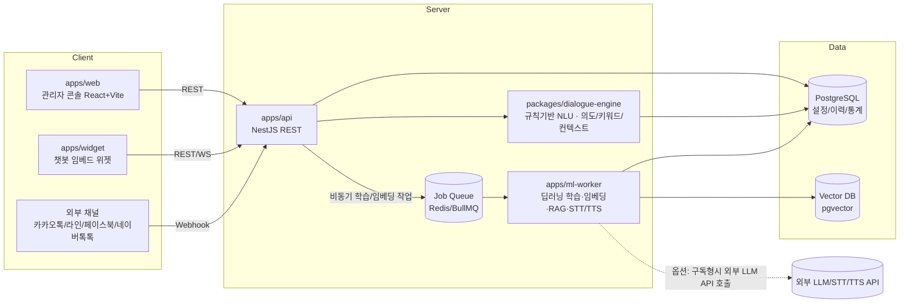

# 개발명세서 (아키텍처 / 데이터모델 / API)

> 기반 문서: `docs/01-requirements/기능요구사항.md`, `docs/03-design/UIUX_준수기준.md`
> 참고 컨벤션: 형제 프로젝트 `Auto QA`(pnpm 모노레포, NestJS+React, `.claude/agents` 하네스) 구조를 재사용하여 팀 내 기술스택 일관성을 유지한다.
> 세부 설계서/ADR 목록은 **§7**을 참고한다. 기능그룹 단위 상세 설계는 별도 문서로 두고 이 문서는 전체 골격과 결정사항을 유지한다.

## 1. 전체 아키텍처



**설계 원칙**
- **기본기능(GPU 불필요)은 `apps/api` + `packages/dialogue-engine`에서 동기 처리**한다. 규칙/경량 매칭 기반이라 별도 GPU 인프라 없이 즉시 응답한다 (`01-requirements` GPU 1~2 항목 전부).
- **확장기능/옵션 중 GPU가 필요한 항목(DLE 증강학습, 임베딩, 군집분석, RAG, 음성/멀티모달 등)은 `apps/ml-worker`로 분리**하고 Job Queue로 비동기 처리한다. 구축형은 자체 GPU 서버에서, 구독형은 동일 인터페이스로 외부 LLM/STT/TTS API를 호출하도록 **Provider 추상화**를 둔다(Auto QA의 `LlmEvaluationProvider` 패턴 재사용).
- 채널 연동(카카오톡 등)은 API의 Webhook 어댑터 계층에서 흡수하고, 내부적으로는 채널 무관한 단일 대화 처리 파이프라인을 태운다.

## 2. 모노레포 구조 (제안)

```
Chat Bot/
├── apps/
│   ├── web/          # 관리자 콘솔 — React + Vite + TS
│   ├── widget/        # 챗봇 임베드 위젯 — 경량 번들(<100KB), 스킨 테마 지원
│   ├── api/           # NestJS — 챗봇관리/대화처리/통계/이력/채널Webhook
│   └── ml-worker/     # 딥러닝 학습엔진/임베딩/RAG/음성/멀티모달 워커(GPU)
├── packages/
│   ├── shared-types/  # FE/BE 공유 DTO (zod)
│   ├── dialogue-engine/ # 의도·키워드 매칭, 컨텍스트(슬롯필링), 대화그래프 실행기
│   └── llm-provider/  # LLM/STT/TTS Provider 추상화 (mock | on-prem | cloud)
├── infra/             # docker-compose, Dockerfile(api/web/widget/ml-worker)
├── docs/              # 00-source ~ 05-ops (현재 구조 유지)
└── .claude/           # agents, commands (§5 멀티에이전트 구성 참고)
```

기술스택은 `Auto QA`(NestJS+React+pnpm)와 일치시켜 팀 내 재사용성을 높인다. 사용자 확정 전까지는 **제안(초안)**이며, 실제 구현 착수 전 승인 필요.

### 2.1 `apps/api` 내부 계층 규약 (전 기능그룹 공통)

도메인 모듈은 다음 4계층으로 고정한다. 기능그룹이 늘어도 구조를 복제해 일관성을 유지한다.

| 계층 | 파일 | 책임 | 금지 |
|---|---|---|---|
| `*.controller.ts` | 컨트롤러 | 경로·HTTP 상태코드·zod 파이프·권한 가드 | Prisma 타입 노출, 비즈니스 분기 |
| `*.service.ts` | 서비스 | 비즈니스 규칙의 **단일 진입점**(향후 `AuditLog` 기록 지점), Prisma 직접 의존 허용 | HTTP 개념(Request/Response) 의존 |
| `*.mapper.ts` | 매퍼 | Prisma row ↔ zod DTO 변환(`null ↔ undefined`, JSON 문자열 ↔ 객체, enum 파싱 폴백) | 비즈니스 분기 |
| `lib/*.ts` | 순수 함수 | DB·Nest 무의존 로직(파생 규칙, 전이 판정, 집계, 기간 계산). 단위 테스트 1차 타깃 | 외부 I/O |

공통 횡단 관심사는 `apps/api/src/common/`에 둔다 — `zod-validation.pipe.ts`, `zod-query.pipe.ts`, `api.exception.ts`, `all-exceptions.filter.ts`, `pagination.ts`, `auth/permission.guard.ts`(Phase 1 no-op), `auth/require-permission.decorator.ts`. 환경변수 검증은 `apps/api/src/config/env.validation.ts`에서 부팅 시 수행한다.

### 2.2 기능그룹별 모듈 배치

| 기능그룹 | NestJS 모듈 | 상태 |
|---|---|---|
| 챗봇 운영관리 (No.1~4) | `chatbot-groups`, `chatbots`, `stats` | 설계 완료 → `chatbot-operations-설계.md` §6에 파일 단위 구조 명시 |
| 대화 설계 (No.5~9) | `dialog-nodes`, `intents`, `keywords`, `homonyms`, `contexts`, `faqs` | 미착수 |
| 품질/채널/보안/통계 (No.10~15) | `simulation`, `channels`, `auth`, `audit-logs`, `stats`(확장) | 미착수 |

## 3. 핵심 데이터 모델 (엔터티 개요)

| 엔터티 | 설명 | 관련 기능 |
|---|---|---|
| `ChatbotGroup` | 챗봇 그룹(폴더). 1단계 평면 구조(계층 폴더 미지원) | 1 |
| `Chatbot` | 챗봇 인스턴스(이름/아바타/URL/스킨/상태). `skin`은 JSON 직렬화 문자열, API 경계에서는 객체 | 1, 3, 4 |
| `Intent` | 의도 — 예문 목록 포함 | 6 |
| `Entity`(Keyword) | 키워드/엔티티 사전 | 6 |
| `HomonymDictionary` | 동음이의어/다의어 사전 | 7 |
| `DialogNode` | 대화그래프 노드(인풋조건/아웃풋타입 12종) | 5 |
| `ContextVariable` | 세션 컨텍스트(슬롯필링) 변수 정의 | 8 |
| `FaqEntry` | FAQ/스몰톡/셀프서비스 응답셋 | 9 |
| `Channel` | 채널 연동 설정(카카오/라인/FB/네이버 등) | 11 |
| `User` / `Role` / `Permission` | 회원·권한·보안 | 12 |
| `AuditLog` | 변경 이력 + API 연동 상세로그 | 13 |
| `ConversationLog` | 대화 원문 로그(통계/학습현황 소스). **세션 식별자 `sessionId` 보유** — No.2 접속수 산정 근거(ADR-0001) | 14, 15 |
| `TrainingJob` | DLE 증강학습/임베딩/군집분석 Job (ml-worker 큐) | 16, 18, 21 |
| `EmbeddingVector` | 텍스트 임베딩(pgvector) | 18, 30(RAG) |
| `TestCase` / `TestRun` | 대화검증시스템 TC 테스트 | 19, 20 |
| `ChatbotVersion` | 버전 스냅샷(복원용) | 25 |
| `Survey` / `SurveyResponse` | 설문관리 | 27 |
| `DeploySchedule` | 운영 예약 배포 | 28 |

### 3.1 데이터 모델 공통 규약

- **enum**: SQLite에 네이티브 enum이 없으므로 DB는 `String`으로 두고, 값 제약은 `packages/shared-types`의 zod enum이 단일 소스다. 매퍼에서 파싱 실패 시 안전값 폴백 + 경고 로그.
- **배열/객체 필드**: `String`에 JSON 직렬화(`skin`, `examples`, `synonyms`, `outputs` 등). **API 경계에서는 항상 객체/배열**로 송수신한다. 파싱 실패 시 기본값 폴백 + 경고 로그.
- **참조 무결성**: 전 관계에 `onDelete: Restrict, onUpdate: Cascade`를 **명시**한다. 암묵적 cascade는 금지하며, 삭제는 서비스 계층 사전 검사 → `409`로 거부한다(ADR-0002).
- **부분 수정 시맨틱**: 키 없음/`undefined` = 미변경, `null` = 값 삭제, 값 = 교체. `null` 허용 필드는 스키마에 `.nullable()`로 명시한다.
- **인덱스**: 목록 필터/정렬 컬럼과 기간 집계 컬럼에 복합 인덱스를 둔다. 현재 적용분 — `conversation_logs(chatbotId, createdAt)`, `chatbots(groupId, status)`, `chatbots(updatedAt)`.

## 4. API 설계 개요 (REST, `/api/v1/`)

경로는 `setGlobalPrefix('api')` + URI 버저닝 기본값 `1`로 구성한다(ADR-0003). `health`만 `VERSION_NEUTRAL`로 `/api/health`를 유지한다.

| 그룹 | 대표 엔드포인트 | 대응 기능 |
|---|---|---|
| 챗봇 운영관리 | `/chatbot-groups`(+`/:id/copy`), `/chatbots`(+`/:id/settings｜skin｜status｜group｜copy｜permanent-delete｜embed-code`, `/slug-available`) | 1, 3, 4 |
| 대화 설계 | `/chatbots/:id/dialog-nodes`, `/intents`, `/entities`, `/homonyms`, `/contexts`, `/faqs` | 5~9 |
| 품질/시뮬레이션 | `POST /chatbots/:id/simulate`, `/chatbots/:id/compare` | 10 |
| 채널 | `POST /webhooks/:channel`, `/channels` | 11 |
| 보안/이력 | `/users`, `/roles`, `/audit-logs` | 12, 13 |
| 통계 | `GET /stats/dashboard`, `/stats/usage`, `/stats/training-status` | 2, 14, 15 |
| AI 엔진(ml-worker 프록시) | `POST /training-jobs`(DLE/임베딩/군집분석), `GET /training-jobs/:id` | 16~18, 21 |
| 검증 | `/test-cases`, `POST /test-runs` | 19, 20 |
| 상담연계 | `/monitoring/live`, `/monitoring/hints` | 24 |
| 버전/배포 | `/chatbots/:id/versions`, `POST /chatbots/:id/deploy-schedule` | 25, 28 |
| 연동 | `/legacy-apis`, `/surveys` | 26, 27 |
| 옵션(RAG 등) | `POST /rag/query`, `/agentic/tasks`, `/voice/stt`, `/voice/tts` | 30~39 |

모든 응답은 `packages/shared-types`의 zod 스키마로 검증한다(Auto QA `eval-schema` 패턴 재사용).

### 4.1 API 공통 규약 (전 기능그룹 공통, ADR-0003)

| 항목 | 규칙 |
|---|---|
| 검증 | 요청/응답 모두 zod 단일 소스. `ZodValidationPipe`(body) / `ZodQueryPipe`(query), strip 모드 |
| 목록 응답 | `{ items, total, page, pageSize }`. `page`는 1부터, `pageSize` 기본 20 · 최대 100 |
| 복수 선택 쿼리 | 콤마 구분 단일 파라미터(`?status=DRAFT,ACTIVE`) |
| 날짜 | ISO-8601 UTC 송수신, 화면 표시는 `Asia/Seoul` |
| 오류 봉투 | `{ statusCode, code, message, details?: [{ field, message }] }`. `code`는 `ApiErrorCode` enum(프런트는 메시지 문자열이 아니라 `code`로 분기) |
| 상태코드 | 404(미존재) / 409(고유 제약·상태 충돌·참조 무결성) / 400(형식·불허 전이·기간 오류) |
| 권한 | 변경 계열 `@RequirePermission('*:write')`, 조회 계열 `*:read` 데코레이터를 지금부터 부착. Phase 1 가드는 no-op이며 No.12에서 구현만 채운다 |
| 파괴적 동작 | GET으로 노출 금지. 영구 삭제류는 별도 POST 경로 + 확인값 서버 재검증 |

## 5. 비기능 요구사항

- **성능**: 규칙기반 매칭 응답 200ms 이내(P95), LLM/RAG 경유 응답은 3초 이내(P95, 옵션기능). 목록 조회 300ms(P95), 통계 집계 500ms(P95).
- **보안**: 금지어/비속어 필터(사전 매칭), 로그인 정책(MFA 선택), RBAC. PII(전화번호/이메일 등)는 대화로그 저장 전 마스킹 검토(Auto QA `packages/pii-mask` 패턴 참고). 사용자 입력 URL은 `http`/`https` 스킴만 허용한다(zod `.url()`은 `javascript:`를 통과시키므로 별도 refine 필수).
- **접근성/UI 품질**: `docs/03-design/UIUX_준수기준.md` 전 항목 준수(색상대비 4.5:1, 키보드 접근성 등). 신규 화면은 레이블 있는 폼 + 키보드 접근 가능 컴포넌트 구조를 전제로 설계한다.
- **확장성**: ml-worker는 Job Queue 기반 수평 확장, 구독형 배포 시 외부 LLM API로 즉시 대체 가능(Provider 추상화).
- **가용성**: 대화처리(API)와 딥러닝 학습(ml-worker)을 프로세스 분리하여, 학습 부하가 실시간 대화 응답에 영향 주지 않도록 격리.
- **배포형태 중립**: 구축형/구독형이 **동일 코드**로 동작해야 하며, 외부 URL(API/위젯 base 등)은 환경변수로만 주입한다(하드코딩 금지). 필수 환경변수는 부팅 시 검증해 기동 단계에서 실패시킨다.
- **DB 이식성**: 원시 SQL은 불가피한 경우에만 사용하고 해당 서비스 파일 1곳으로 격리한다. SQLite/Postgres 공통 문법만 사용해 §6-4의 Postgres 전환 시 영향 범위를 서비스 계층으로 한정한다.

### 5.1 환경변수 목록 (현행)

| 변수 | 위치 | 필수 | dev 예시 | 용도 |
|---|---|---|---|---|
| `DATABASE_URL` | `apps/api/.env` | ✅ | `file:./dev.db` | Prisma 접속 |
| `API_PORT` | `apps/api/.env` | — | `3000` | API 포트 |
| `WIDGET_BASE_URL` | `apps/api/.env` | ✅ | `http://localhost:5174` | 임베드 스크립트/공개 URL 베이스(No.4) |
| `PUBLIC_API_BASE_URL` | `apps/api/.env` | ✅ | `http://localhost:3000/api/v1` | 임베드 스니펫이 위젯에 주입하는 API 베이스 |
| `VITE_API_BASE_URL` | `apps/web/.env` | ✅ | `http://localhost:3000/api/v1` | 관리자 콘솔 API 베이스 |

## 6. 결정 사항

1. **기술스택 확정(2026-09-19)**: NestJS+React+pnpm 모노레포(Auto QA와 동일 컨벤션)로 진행.
2. **구축형/구독형 우선순위**: 1차 범위(기본기능 15개)는 전부 GPU 필요도 1~2, 구축형/구독형 모두 ○(적합)이라 이 결정이 구현을 막지 않음 — ml-worker/Provider 추상화가 필요해지는 확장기능(16번~) 착수 시점에 결정.
3. **1차 개발 범위 확정(2026-09-19)**: 기본기능 15개(No.1~15) 전체. `docs/01-requirements/기능요구사항.md` §2 참고.
4. **dev DB는 SQLite(2026-09-19, Phase 0 스캐폴딩 시 확정)**: `Auto QA`의 실제 설정을 조사한 결과 Postgres가 아니라 Prisma+SQLite(`file:./dev.db`)로 가볍게 운영 중임을 확인, 동일 컨벤션을 그대로 따른다. 본 §1 다이어그램의 Postgres+pgvector/Redis/ml-worker/docker-compose는 확장기능(16번~, GPU 필요) 착수 시점에 도입한다 — 그 전까지 `infra/`는 존재하지 않는다.
5. **API 버저닝·검증·오류 형식 확정(2026-09-19)**: 경로는 `/api/v1/*`(URI 버저닝, `health`만 버전 중립), 검증은 zod 단일 체계(전역 `class-validator` 파이프 제거), 오류는 `{ statusCode, code, message, details }` 봉투로 통일. → **ADR-0003**
6. **접속수(visitCount) 산정 기준 확정(2026-09-19)**: `ConversationLog.sessionId`(nullable) 추가, `visitCount = distinct sessionId + sessionId가 null인 행 수`. 세션 값이 없으면 자동으로 "로그 건수"와 동일해져 대화 엔진 도입 시 API 변경 없이 정확한 정의로 승격된다. 응답의 `visitCountBasis`로 UI 캡션을 서버가 결정한다. → **ADR-0001**
7. **삭제 정책 확정(2026-09-19)**: 암묵적 cascade 금지. 삭제는 2단계(보관 → 영구삭제)이며 영구삭제는 하위 레코드 사전 검사 후 `409`로 거부한다. 영구삭제는 `POST /:id/permanent-delete` + `confirmName` 서버 재검증. → **ADR-0002**
8. **통계 집계 전략 확정(2026-09-19)**: DB `groupBy`로 카디널리티를 줄인 뒤 애플리케이션 순수 함수가 정규화·병합·정렬한다. 집계 로직은 DB 무의존 순수 함수로 분리해 단위 테스트 대상으로 삼는다. → **ADR-0004**
9. **`packages/shared-types` 파일 배치 규칙(2026-09-19)**: 도메인 스키마는 해당 도메인 파일에 append(`chatbot.ts`, `stats.ts` 등), 여러 도메인이 공유하는 횡단 관심사(페이지네이션·오류 봉투·정렬·안전 URL)만 `common.ts`에 둔다. 파생 스키마(`.pick()/.partial()`)를 원본과 다른 파일에 두지 않는다(순환 import·탐색 비용 방지).

## 7. 세부 설계서 · 결정 기록(ADR) 인덱스

| 문서 | 대상 | 비고 |
|---|---|---|
| `chatbot-operations-설계.md` | 챗봇 운영관리 No.1~4 — 데이터모델 변경, shared-types 배치, 19개 엔드포인트 명세, NestJS 파일 구조, 핵심 로직 규격, seed 전략 | 요구사항: `docs/requirements/chatbot-operations.md` |
| `decisions/ADR-0001-visit-count-session-id.md` | 접속수 산정 기준과 `sessionId` 도입 | 요구사항 D-1, D-2 |
| `decisions/ADR-0002-permanent-delete-referential-integrity.md` | 영구 삭제 참조 무결성(cascade 금지) | 요구사항 D-3 |
| `decisions/ADR-0003-api-versioning-and-error-envelope.md` | `/api/v1` 버저닝 · zod 단일 검증 · 오류 봉투 | 전 기능그룹 공통 규약 |
| `decisions/ADR-0004-dashboard-aggregation-strategy.md` | 대시보드 집계 전략 | 요구사항 FR-2-x, NFR-P2/M3 |

**ADR 작성 규칙**: 설계 결정에 대안이 존재하고 되돌리는 비용이 큰 경우에만 남긴다. 번호는 `ADR-<4자리 일련번호>-<slug>`로 증가시키며, 기존 ADR을 수정하지 않고 새 ADR로 `Supersedes`를 명시해 대체한다.
