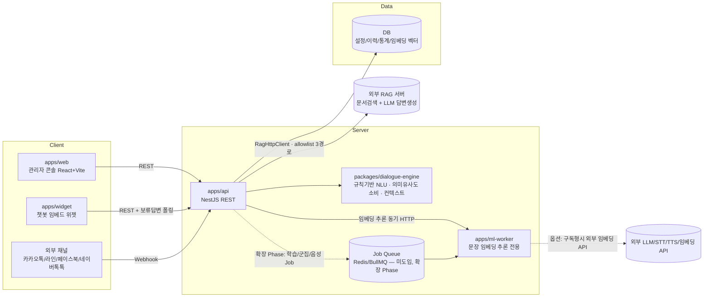

# 개발명세서 (아키텍처 / 데이터모델 / API)

> 기반 문서: `docs/01-requirements/기능요구사항.md`, `docs/03-design/UIUX_준수기준.md`
> 참고 컨벤션: 형제 프로젝트 `Auto QA`(pnpm 모노레포, NestJS+React, `.claude/agents` 하네스) 구조를 재사용하여 팀 내 기술스택 일관성을 유지한다.
> 세부 설계서/ADR 목록은 **§7**을 참고한다. 기능그룹 단위 상세 설계는 별도 문서로 두고 이 문서는 전체 골격과 결정사항을 유지한다.

## 1. 전체 아키텍처



**설계 원칙**
- **기본기능(GPU 불필요)은 `apps/api` + `packages/dialogue-engine`에서 동기 처리**한다. 규칙/경량 매칭 기반이라 별도 GPU 인프라 없이 즉시 응답한다 (`01-requirements` GPU 1~2 항목 전부).
- **확장기능/옵션 중 GPU가 필요한 항목(DLE 증강학습, 임베딩, 군집분석, RAG, 음성/멀티모달 등)은 `apps/ml-worker`로 분리**한다. 구축형은 자체 GPU 서버에서, 구독형은 동일 인터페이스로 외부 API를 호출하도록 **Provider 추상화**를 둔다(Auto QA의 `LlmEvaluationProvider` 패턴 재사용).
  - **1차 도입 형태(No.18 부분, 2026-09-22)**: ml-worker는 **학습 없는 추론 전용 임베딩 서비스**(`POST /embed`, `GET /health`)로 시작하며 **Job Queue를 쓰지 않는다**. 질의 임베딩은 대화 턴 안에서 **동기 HTTP 1회**(타임아웃 300ms·회로차단·저하 모드)로 처리하고, 재색인만 `apps/api` 내부의 단일 인스턴스 in-process 큐로 배치 처리한다. Redis/BullMQ·`TrainingJob`은 **계속 유보**한다(**ADR-0024**).
- **생성형 AI/RAG(No.30 부분)는 자체 엔진을 만들지 않고 외부 RAG 서버에 위임**한다. 접촉면은 `apps/api` 안의 **`RagHttpClient` 단일 게이트 + 경로 allowlist 3개**(`POST /api/rag/query`, `GET /api/status`, `GET /api/documents/metadata`)뿐이며, 파괴적 무인증 엔드포인트(문서 초기화·삭제·전역 설정·프롬프트 관리)는 **코드에 문자열로도 존재하지 않는다**(정적 검사로 강제). 우리 API에 RAG 프록시 엔드포인트를 만들지 않는다(**ADR-0022**).
- 채널 연동(카카오톡 등)은 API의 **채널 어댑터 계층**에서 흡수하고, 내부적으로는 채널 무관한 단일 대화 처리 파이프라인을 태운다. 어댑터 계약(`normalizeInbound`/`renderOutbound`/`supportedOutputTypes`)은 No.11에서 확정됐으며, **채널 타입 분기는 팩토리 1곳에만 존재한다**(ADR-0011). Webhook 수신 경로(`POST /webhooks/:channel`)는 외부 채널 Phase에 신설한다.

## 2. 모노레포 구조

```
Chat Bot/
├── apps/
│   ├── web/           # 관리자 콘솔 — React + Vite + TS
│   ├── widget/        # 챗봇 임베드 위젯 — 경량 번들(gzip <100KB), 런타임 의존성 0(ADR-0012)
│   ├── api/           # NestJS — 챗봇관리/대화설계/대화처리/채널/보안/이력/통계/답변설정·임베딩·RAG
│   └── ml-worker/     # [신설] 문장 임베딩 추론 서비스(Python FastAPI). 학습·Job Queue 없음(ADR-0024)
├── packages/
│   ├── shared-types/  # FE/BE 공유 DTO (zod) + zod 무의존 서브패스(`/output-view`, `/contrast`)
│   ├── dialogue-engine/ # 의도·키워드 매칭, 컨텍스트(슬롯필링), 대화그래프 실행기, 턴 오케스트레이터
│   ├── pii-mask/      # [신설] PII 마스킹 순수 함수 1벌(저장 경로 + 외부 송신 경로 공용 — ADR-0013)
│   └── llm-provider/  # LLM/STT/TTS Provider 추상화 (mock | on-prem | cloud) — 여전히 미생성
├── infra/             # docker-compose, Dockerfile(api/web/widget/ml-worker) — 배포 Phase
├── docs/              # 00-source ~ 05-ops (현재 구조 유지)
└── .claude/           # agents, commands
```

| 워크스페이스 | 상태 |
|---|---|
| `apps/api`, `apps/web`, `packages/shared-types`, `packages/dialogue-engine` | 구현 중(No.1~15 완료, **FAQ/의도 매칭 고도화 설계 완료**) |
| **`apps/widget`** | **No.10~11 Phase에 신규 스캐폴딩**(ADR-0012) — Vite 라이브러리 모드(IIFE) `widget.js` + `/c/:slug` 전체화면. No.12~15에서는 수정하지 않았으나 **매칭 고도화 그룹에서는 수정한다**(보류 답변 폴링·대기 UI·되묻기 버튼·출처 표기) |
| **`apps/ml-worker`** | **매칭 고도화 Phase에 신규 스캐폴딩**(ADR-0024) — Python 3.11 + FastAPI, 추론 전용. `EMBEDDING_BASE_URL` 미설정 시 API는 정상 기동하고 의미 매칭만 비활성 |
| **`packages/pii-mask`** | **매칭 고도화 Phase에 승격** — 기존 `apps/api/src/conversation/lib/pii-mask.ts`를 이동(동작 변경 0). 소비자가 저장·외부 송신 2곳이 되어 §5의 승격 조건 충족 |
| `packages/llm-provider`, `infra/` | 미생성. LLM 직접 호출이 필요한 기능(No.16/No.24 등) 착수 시점에 도입(§6-4) |

기술스택은 `Auto QA`(NestJS+React+pnpm)와 일치시켜 팀 내 재사용성을 높인다. **예외 2건**: ① `apps/widget`은 번들 예산(gzip 100KB)과 호스트 페이지 침투 최소화를 위해 React를 쓰지 않고 순수 TS로 구현한다(ADR-0012). ② **`apps/ml-worker`는 Python**이다 — 한국어 문장 임베딩 모델의 1차 배포 형태가 사실상 전부 PyTorch/HF이고, "최고 성능 모델을 고를 자유"가 런타임 선택을 지배하기 때문이다. 두 예외 모두 **빌드 도구·스크립트 이름·테스트 명령은 동일하게 유지**하며, ml-worker의 접촉면은 HTTP 2개로 한정해 `apps/api`가 언어를 알지 못하게 한다(ADR-0024).

### 2.1 `apps/api` 내부 계층 규약 (전 기능그룹 공통)

도메인 모듈은 다음 4계층으로 고정한다. 기능그룹이 늘어도 구조를 복제해 일관성을 유지한다.

| 계층 | 파일 | 책임 | 금지 |
|---|---|---|---|
| `*.controller.ts` | 컨트롤러 | 경로·HTTP 상태코드·zod 파이프·권한 데코레이터 | Prisma 타입 노출, 비즈니스 분기 |
| `*.service.ts` | 서비스 | 비즈니스 규칙의 **단일 진입점**이며 **`AuditLog` 기록 지점이다**(No.12부터 실제 동작 — `AuditLogService.record()` 명시 호출, ADR-0016). Prisma 직접 의존 허용 | HTTP 개념(Request/Response) 의존 |
| `*.mapper.ts` | 매퍼 | Prisma row ↔ zod DTO 변환(`null ↔ undefined`, JSON 문자열 ↔ 객체, enum 파싱 폴백) | 비즈니스 분기 |
| `lib/*.ts` | 순수 함수 | DB·Nest 무의존 로직(파생 규칙, 전이 판정, 집계, 기간 계산, 마스킹, 차이 판정, **비밀번호 정책·권한 판정·금지어 매칭·감사 스냅샷**, **시계열 버킷·응답출처 판정·추천 유사도**, **코사인·벡터 인코딩·점수 합성·RAG 성패 판정·출처 정제·외부 metadata 파싱**) | 외부 I/O |

- **감사 기록 규약**: 컨트롤러·매퍼·`lib/`는 `AuditLog`를 알지 못한다(FR-0-27). **명시적 예외 1건** — 인증·인가 이력(`LOGIN`/`LOGIN_FAILED`/`LOGOUT`/`PERMISSION_DENIED`)은 서비스 계층이 아니라 `auth` 서비스와 `common/auth`의 `PermissionGuard`가 기록한다. 권한 거부는 가드 외에 관측 지점이 없기 때문이다(ADR-0016).
- **`actor` 전달 규약**: 서비스는 `Request`에 의존하지 않는다. 감사 기록용 주체는 `common/request-context`(AsyncLocalStorage)가 운반하며, **`RequestContextService.get()`을 호출해도 되는 곳은 `AuditLogService` 1곳뿐**이다. actor가 비즈니스 인자인 경우(본인 비밀번호 변경 등)에만 컨트롤러의 `@CurrentUser()`로 받아 서비스 시그니처에 명시적으로 넘긴다(ADR-0016).
- **외부 HTTP 출구 규약(신규)**: 외부 RAG 호스트로 나가는 HTTP는 **`rag/rag-http.client.ts` 1곳**, 임베딩 서비스로 나가는 HTTP는 **`embedding/providers/http-embedding.provider.ts` 1곳**뿐이다. 다른 어떤 서비스도 `fetch`/`axios`로 이 호스트들을 직접 부르지 않는다(ADR-0022).

공통 횡단 관심사는 `apps/api/src/common/`에 둔다 — `zod-validation.pipe.ts`, `zod-query.pipe.ts`, `zod-param.pipe.ts`, `api.exception.ts`, `all-exceptions.filter.ts`, `pagination.ts`, `auth/`(`permission.guard.ts`·`require-permission.decorator.ts`·`public.decorator.ts`·`current-user.decorator.ts`·`lib/cookie.ts`·`lib/password-hash.ts`), `request-context/`(AsyncLocalStorage), `rate-limit/`(토큰버킷 store·순수함수 — No.12에 `conversation/`에서 승격). 환경변수 검증은 `apps/api/src/config/env.validation.ts`에서 부팅 시 수행한다.

### 2.2 기능그룹별 모듈 배치

| 기능그룹 | NestJS 모듈 | 상태 |
|---|---|---|
| 챗봇 운영관리 (No.1~4) | `chatbot-groups`, `chatbots`, `stats` | 설계 완료 → `chatbot-operations-설계.md` §6에 파일 단위 구조 명시 |
| 대화 설계 (No.5~9) | `intents`, `keywords`, `homonyms`, `contexts`, `dialog-nodes`, `faqs` + 횡단 모듈 `dialogue-common`(엔진 번들 조립 / 참조 사전검사 / 대량 업로드) | 설계 완료 → `dialogue-design-설계.md` §6에 파일 단위 구조 명시 |
| 품질/채널 (No.10~11) | `simulation`(시뮬레이션·비교), `channels`(채널 CRUD), `conversation`(공개 대화 파이프라인·채널 어댑터·로그 적재·PII 마스킹) + `dialogue-common`(번들 캐시 확장) | 설계 완료 → `quality-channel-설계.md` §6 |
| 보안/이력 (No.12~13) | `auth`(로그인·세션·비밀번호), `users`(+`roles` 상수 조회), `banned-words`(사전·필터), `audit-logs`(기록·조회) + 횡단 `common/auth`(가드 실구현·전역 등록·`@Public()`·`@CurrentUser()`) · `common/request-context`(신규) · `common/rate-limit`(`conversation/`에서 승격) | 설계 완료 → `security-audit-설계.md` §6 |
| 통계/분석 (No.14~15) | `stats`(확장 — 기간 시계열·분포·순위, 읽기 전용) + `learning`(신규 — 미응답 검토 큐·의도 예문 반영) + `conversation`(수집 훅 1줄) | 설계 완료 → `stats-learning-설계.md` §6 |
| **FAQ/의도 매칭 고도화 (No.6·9·18·30 부분)** | **`answer-settings`(신규 — 임계값·RAG 스코프 설정·미리보기·연결 점검) + `embedding`(신규 — Provider 포트·질의 캐시·유사도 점수·색인/재색인) + `rag`(신규 — `RagHttpClient` 봉인·응답 판정·유량 제어·보류 답변 저장소·`RagCallLog`)** + `conversation`(점수 주입·2단계 분기·`PENDING`·폴링) · `dialogue-common`(번들 캐시에 벡터 동거·무효화 시 색인 예약) · `simulation`(근거 패널·`useRag` 플래그) | **설계 완료 → `nlu-rag-answering-설계.md` §7** |

> **`packages/dialogue-engine` 사용 개시(No.5~9)**: 매칭·컨텍스트 세션 전이·설계 점검·FAQ 유사 후보 산출은 `apps/api`의 `lib/`가 아니라 **엔진 패키지의 순수 함수**에 둔다. 런타임 진입점은 `resolveResponse()`이며 DB·NestJS에 의존하지 않는다(ADR-0008). 챗봇 스코프 검증(`/chatbots/:chatbotId/...` 404·`CHATBOT_ARCHIVED` 409)은 `ChatbotsModule`이 내보내는 `ChatbotScopeService` 한 곳에서 수행한다.
>
> **엔진 진입점 3층화(No.10~11)**: 텍스트 해석 `resolveResponse()`, 버튼 노드 실행 `resolveByNodeId()`, 턴 오케스트레이터 **`resolveTurn()`** 으로 나눈다. **API 소비자(시뮬레이션·비교·공개 대화)는 `resolveTurn()`만 호출**하며, 대화 상태 봉투 검증·버튼 라우팅·다음 상태 조립은 전부 엔진이 책임진다(ADR-0010). 대화 상태는 서버에 저장하지 않고 클라이언트가 보관해 왕복한다(ADR-0009).
>
> **엔진 불가침(No.12~13)**: 인증·권한·금지어는 **`apps/api` 경계에만 존재**한다. `packages/dialogue-engine`은 이들을 알지 못하며 이번 그룹에서 수정 0줄이다(ADR-0008 규약 유지). 금지어 필터는 `conversation` 모듈의 파이프라인 2지점(입력 수신 직후 / 응답 반환 직전)에만 적용된다.
>
> **엔진 불가침(No.14~15)**: 통계 집계·시계열 버킷·미응답 수집·추천 유사도(문자 bigram 자카드)는 전부 `apps/api` 경계에 있고 엔진은 **수정 0줄**이다. 추천은 매칭(`matchIntent`)과 다른 문제이므로 엔진 함수를 재사용하지 않는다(ADR-0019 §4). **`learning` 모듈의 의존은 `learning → intents / dialogue-common / chatbots` 단방향**이며, `conversation → learning`(수집기 주입)의 역방향 참조는 만들지 않는다.
>
> **엔진 확장(FAQ/의도 매칭 고도화)**: 이 그룹은 엔진을 **처음으로 수정**하지만 **순수성·동기성·결정론은 유지**한다. 확장은 **`ResolveOptions.semantic` 선택 필드 1개 + 점수 합성 규칙 변경(부분 문자열 포함 제거) + `semantic.ts`(구간 판정 순수 함수) 신설 3건**뿐이다. **`apps/api`가 질의 임베딩 1회와 코사인 계산을 끝낸 뒤 사전 계산된 점수 맵을 주입**하며, 엔진은 그 맵을 동기적으로 읽기만 한다 — 엔진에 HTTP·Prisma·환경변수가 들어가지 않는다(**ADR-0020**). `semantic` 미주입 시 동작은 현행과 완전히 동일하므로(저하 모드 = 현행 동작) 기존 엔진 테스트가 회귀 감시 장치로 계속 작동한다. 구간 판정(`judgeBand`)은 **엔진·설정 미리보기·시뮬레이터가 공유하는 1곳**이다.
>
> **모듈 의존 방향(FAQ/의도 매칭 고도화)**: `conversation → embedding / rag / answer-settings`, `dialogue-common → embedding`, `simulation → embedding / rag / answer-settings` 단방향이다. **`rag`는 `conversation`을 import하지 않으며**, 완료 시 로그 적재는 인터페이스(`ConversationLogPort`) 주입으로 처리해 상호 참조를 만들지 않는다. `embedding`은 `dialogue-common`을 의존하지 않고 색인 대상을 Prisma에서 직접 읽는다.

## 3. 핵심 데이터 모델 (엔터티 개요)

| 엔터티 | 설명 | 관련 기능 |
|---|---|---|
| `ChatbotGroup` | 챗봇 그룹(폴더). 1단계 평면 구조(계층 폴더 미지원) | 1 |
| `Chatbot` | 챗봇 인스턴스(이름/아바타/URL/스킨/상태). `skin`은 JSON 직렬화 문자열, API 경계에서는 객체 | 1, 3, 4 |
| `Intent` | 의도 — 예문 목록(JSON) 포함. `nameNormalized`로 정규화 유일성 강제(ADR-0006) | 6 |
| `Keyword` | 키워드/엔티티 사전 — 동의어 목록(JSON). API 경로는 `/keywords`(구 `/entities` 표기 정정) | 6 |
| `HomonymDictionary` | 동음이의어/다의어 사전 — 의미별 문맥힌트·연결의도(JSON) + 모호성 해소 정책 | 7 |
| `DialogNode` | 대화그래프 노드. 인풋조건은 조인 테이블 `DialogNodeIntent`/`DialogNodeKeyword` + `contextVariableId` FK, 아웃풋 12종은 JSON(ADR-0005) | 5 |
| `DialogNodeIntent` | 노드↔의도 다대다 조인. 역참조 조회(`linkedNodeCount`)·삭제 사전검사의 근거(ADR-0005). **No.15의 "노드 미연결 경고"도 이 조인을 읽는다** | 5, 6, 15 |
| `DialogNodeKeyword` | 노드↔키워드 다대다 조인(동일) | 5, 6 |
| `ContextVariable` | 세션 컨텍스트(슬롯필링) 폼 정의 — 슬롯·취소어·타임아웃 | 8 |
| `FaqEntry` | FAQ/스몰톡/셀프서비스/오류응답 응답셋 — 대체질문(JSON)·활성여부 | 9 |
| `Channel` | 채널 배포 설정. `(chatbotId, type)` 유일, 타입별 `config` 판별 유니온(WEB / 준비 중). 자격증명은 저장하지 않으며(NFR-S7) `enabled` 기본값은 `false`다(ADR-0011) | 11 |
| `User` | 회원. 인증 수단(`passwordHash` — scrypt)·`status`(ACTIVE/DISABLED)·`mustChangePassword`·로그인 실패 카운터/잠금·`lastLoginAt` 보유. 물리 삭제는 제공하지 않고 비활성으로 대체한다. `role`은 String + zod enum 단일 소스이며 **`Role`/`Permission` 테이블은 만들지 않는다**(역할 3종 고정, 역할→권한 매핑은 `shared-types` 코드 상수 — ADR-0015) | 12 |
| `Session` | 서버 보관 불투명 세션. 토큰 원문은 저장하지 않고 `tokenHash`(sha256)만 둔다. 유휴 만료 + 절대 만료 2중이며 로그아웃·비밀번호 변경·계정 비활성 시 즉시 무효화된다(ADR-0014) | 12 |
| `BannedWord` | 금지어/비속어 사전. 챗봇 스코프가 아닌 전역 1벌이며 `wordNormalized` 유일. 정규식은 받지 않는다(리터럴 매칭) | 12 |
| `AuditLog` | **변경 이력(감사추적) 전용**. 전 도메인 쓰기 동작의 단일 기록 대상이며 **append-only**(수정·삭제 API 없음). 기록 시점 스냅샷(`actorEmail`/`actorRole`/`targetName`)과 `chatbotId`를 함께 보관하고 `actorId`/`chatbotId`/`targetId`에 FK를 걸지 않는다. **API 연동 상세로그는 이 테이블이 아니라 No.26 착수 시 `ApiCallLog`로 분리한다**(ADR-0016) | 13 |
| `ConversationLog` | 대화 원문 로그(통계/학습현황 소스). **세션 식별자 `sessionId` 보유** — No.2 접속수 산정 근거(ADR-0001). **공개 대화 API(No.11)가 유일한 쓰기 주체이며 저장 전 금지어 마스킹 → PII 마스킹 순서가 필수다(ADR-0013). `matchedNodeId`/`matchedFaqId`로 응답 출처를, `blockedByFilter`로 금지어 차단 턴을 추적한다. `dayBucket`(KST 일 버킷 `YYYY-MM-DD`)·`hourBucket`(KST 0~23)은 적재 시점에 확정되는 파생 컬럼이며 No.14 시계열·시간대 집계의 근거다(ADR-0017) — 조회 시점에 재계산하지 않는다.** **`answeredByRag`는 2단계(외부 RAG)가 답한 턴을 표시하며 No.14 응답출처 `RAG` 조각의 유일한 근거다 — 세 매칭 컬럼이 전부 `null`인 채 `isAnswered=true`인 턴을 기존 "기타"와 구분한다(파생 불가이므로 ADR-0004 기준 통과). 2단계를 탄 턴도 로그는 최종 결과로 1건만 남으며 `PENDING` 시점에는 적재하지 않는다(ADR-0023)** | 14, 15, 30 |
| `UnansweredQuestion` | 미응답 질문 검토 큐(정규화 병합 `questionNormalized` 유일 · 발생 횟수 · 검토 상태 3종 `PENDING`/`RESOLVED`/`IGNORED` · 반영 후 재발생 카운트). **No.11 대화 파이프라인이 유일한 쓰기 주체**이며(`ConversationLogService.record()` 내부에서 수집) 저장값은 **마스킹 후 문자열**이다. **물리 삭제 API가 없고 `IGNORED`로 대체**하며, 큐 상태 변경은 감사 대상이 아니다(ADR-0019). **RAG가 답한 턴은 `isAnswered=true`라 자동으로 수집되지 않는다 — 수집 조건에 `answeredByRag` 분기를 추가하지 않는다** | 15 |
| `TrainingJob` | DLE 증강학습/임베딩/군집분석 Job (ml-worker 큐). **⚠ No.15(학습현황)는 이 테이블을 쓰지 않는다** — 현행 규칙 매칭에는 학습 연산이 없고 반영은 예문 추가 + 번들 캐시 무효화로 완결된다. 교체 지점은 `LearningApplyService.applyLearning()` 1곳이다(ADR-0018). **⚠ FAQ/의도 매칭 고도화(No.18 부분)도 이 테이블을 쓰지 않는다** — ml-worker가 추론 전용이고 Job Queue가 없다(ADR-0024) | 16, 18, 21 |
| **`EmbeddingVector`** | **FAQ/의도의 질문 측 문장 임베딩. `ownerType`(FAQ_QUESTION/FAQ_ALT/INTENT_NAME/INTENT_EXAMPLE)·`ownerId`·`slotIndex`·`textHash`(재임베딩 회피 키)·`modelId`·`dimension`으로 항목별 색인하며, 벡터는 L2 정규화 후 base64(Float32Array) 직렬화로 저장한다. 유사도는 메모리 내 코사인 완전 탐색이며 벡터 인덱스(HNSW/pgvector)는 도입하지 않는다 — 재검토 트리거는 챗봇당 2만 벡터 초과. `modelId`가 바뀌면 기존 벡터는 매칭에서 제외된다. 원문 텍스트는 저장하지 않으며 `ownerId`에 FK를 걸지 않는다(`chatbotId`에만 FK)** | 18 |
| **`ChatbotAnswerSetting`** | **챗봇별 답변 선택 설정(1:1). 의미 매칭 사용 여부와 3임계값(`accept`/`low`/`margin`), RAG 사용 여부와 테넌트 스코프(`company`/`category`/`subcategory`), 폴백 정책, 출처 표시, 타임아웃. **행이 없으면 전부 기본값이며 두 단계 모두 비활성**이라 기존 챗봇에 백필이 필요 없다. `provider` 필드는 스키마·DTO·환경변수 어디에도 존재하지 않는다(ADR-0021/0022)** | 6, 9, 18, 30 |
| **`RagCallLog`** | **외부 RAG 호출 관측 로그(건수·성패·지연·재시도·실패 사유·근거 건수·스코프 회사명). **질문·답변 원문을 저장하지 않는다** — 원문은 `ConversationLog`에 마스킹된 채 이미 1벌 있고 두 곳에 두면 마스킹 정책 변경 시 누락이 생긴다. 보존기간·마스킹 요건이 달라 `AuditLog`와 섞지 않는다(ADR-0016과 같은 판단)** | 30 |
| `TestCase` / `TestRun` | 대화검증시스템 TC 테스트 | 19, 20 |
| `ChatbotVersion` | 버전 스냅샷(복원용) | 25 |
| `Survey` / `SurveyResponse` | 설문관리 | 27 |
| `DeploySchedule` | 운영 예약 배포 | 28 |

> **미도입 결정 8건**
> ① 대화그래프의 **명시적 엣지 테이블(`DialogNodeEdge`)·캔버스 좌표(`canvasX`/`canvasY`)** — 근거와 재검토 시점은 `dialogue-design-설계.md` §2.1·§12.
> ② **컨텍스트 세션 영속화 테이블** — 대화 상태는 클라이언트 보관 봉투로 왕복하고 서버가 매 턴 재검증한다. 재검토 트리거는 No.24(상담원 인계)·No.42(옴니채널)·대화 이력 복원(**ADR-0009**).
> ③ **`ConversationLog`의 `turnIndex`·`responseTimeMs`·`normalizedMessage`·`inputKind`** — 소비하는 수용기준이 없다(ADR-0004 기준). No.14~15는 파생 컬럼을 **`dayBucket`·`hourBucket` 2개로 제한**했다(한 번에 여러 파생 컬럼을 넣으면 백필 위험이 커진다 — **ADR-0017**). 버튼 턴 판별은 컬럼이 아니라 **수집기 파라미터**로 전달한다(ADR-0019 §3). **매칭 고도화 그룹도 `answeredByRag` 1개만 추가했다**(RAG 지연·근거 건수는 `RagCallLog`로 분리 — 대화 로그에 관측 필드를 섞지 않는다).
> ④ **`Role`/`Permission` 테이블·사용자 그룹(조직) 테이블** — 역할 3종 고정 + 코드 상수 매핑으로 대체한다. 커스텀 역할·멀티테넌시가 실제로 필요해지는 시점(No.22/No.45)에 재검토(**ADR-0015**).
> ⑤ **`ApiCallLog`(레거시 API 연동 상세 로그)** — 기록 대상인 No.26이 미구현이라 쓰기 주체가 없다. 감사로그와 보존기간·용량·마스킹 요건이 달라 같은 테이블에 섞지 않는다(**ADR-0016**). **외부 RAG 호출 관측은 이와 별개로 `RagCallLog`를 둔다** — 그쪽은 쓰기 주체가 생겼기 때문이다.
> ⑥ **MFA 관련 컬럼** — 시크릿 암호화 저장 방식이 미결정이다. 확장 지점은 로그인 응답의 `status` 판별 필드 1개뿐이며 스키마는 건드리지 않는다(**ADR-0014**).
> ⑦ **통계 집계 테이블(사전 집계/Materialized)·`TrainingJob`** — 전자는 채울 스케줄러 인프라가 없고(기간 상한 + 인덱스 + 5초 타임아웃으로 대체), 후자는 쓰기 주체가 아직 없다. 재검토 트리거는 각각 로그 1,000만 행 도달과 No.16/No.23 착수다(**ADR-0017**, **ADR-0018**, **ADR-0024**).
> ⑧ **벡터 인덱스(pgvector/HNSW)·별도 벡터 DB·보류 답변 영속 저장소** — 챗봇당 수천 벡터에 인덱스는 과설계이며(재검토 트리거 2만 벡터), 보류 답변은 TTL 5분의 프로세스 로컬 상태로 충분하다. 둘 다 **인터페이스 추상화만 남겨** 교체 지점을 1곳으로 만든다(**ADR-0023**, **ADR-0024**).

### 3.1 데이터 모델 공통 규약

- **enum**: SQLite에 네이티브 enum이 없으므로 DB는 `String`으로 두고, 값 제약은 `packages/shared-types`의 zod enum이 단일 소스다. 매퍼에서 파싱 실패 시 안전값 폴백 + 경고 로그.
- **배열/객체 필드**: `String`에 JSON 직렬화(`skin`, `examples`, `synonyms`, `outputs`, `slots`, `meanings`, `altQuestions`, `config`, `beforeValue`/`afterValue`, `variants` 등). **API 경계에서는 항상 객체/배열**로 송수신한다. 파싱 실패 시 기본값 폴백 + 경고 로그. **예외: `EmbeddingVector.vector`는 JSON이 아니라 base64(Float32Array little-endian)다** — 1024차원 기준 JSON은 크기가 2배 이상이고 파싱 비용이 재색인·캐시 워밍에 그대로 붙는다. 디코딩은 `embedding/lib/vector-codec.ts` 순수 함수 1곳이며, 파싱 실패 벡터는 **그 벡터만 제외 + 경고 로그**(예외를 던지지 않는다 — 엔진 가용성 규약과 대칭).
- **참조 무결성**: 전 관계에 `onDelete: Restrict, onUpdate: Cascade`를 **명시**한다. 암묵적 cascade는 **조인 테이블에서도 금지**하며(ADR-0005 DD-15), 삭제는 서비스 계층 사전 검사 → `409`로 거부한다(ADR-0002). 사전 검사는 UX용, DB 제약은 최종 방어선이다.
  - **예외(의도적)**: `ConversationLog`의 `matchedIntentId`/`matchedNodeId`/`matchedFaqId`, **`AuditLog`의 `actorId`/`chatbotId`/`targetId`**, **`UnansweredQuestion`의 `resolvedIntentId`/`resolvedById`**, **`EmbeddingVector.ownerId`**, **`RagCallLog`의 `chatbotId`/`conversationLogId`** 는 **FK를 걸지 않는다**. 로그는 "그 시점의 사실 기록"이며, FK를 걸면 `Restrict` 규약 때문에 로그가 쌓인 노드/의도/FAQ/챗봇/사용자를 영원히 삭제할 수 없게 된다. `channelType`이 문자열인 것과 같은 판단이다. 대신 표시용 스냅샷(`targetName`/`actorEmail`/`actorRole`)을 함께 보관해 목록이 UUID 나열이 되지 않게 한다.
  - **파생 데이터의 동반 삭제**: `EmbeddingVector`·`ChatbotAnswerSetting`은 `chatbotId`에 **FK를 걸되**(챗봇과 생사를 같이하는 파생·설정 데이터), 영구삭제 시 **차단(409) 대상이 아니라 동반 삭제 대상**이다. `RagCallLog`도 보존 요건이 없으므로 함께 지운다(ADR-0002의 "하위 데이터 제거" 분류).
- **정규화 유일성**: 이름류 유일성은 원문이 아니라 `normalizeText()` 결과 컬럼(`nameNormalized`/`wordNormalized`/`questionNormalized`) + `@@unique([chatbotId, *Normalized])`로 강제한다(ADR-0006). **`UnansweredQuestion.questionNormalized`도 같은 규약을 따르며, 이 경우 유일성은 "이름 중복 방지"가 아니라 "표기 변형 병합 키"로 쓰인다**(ADR-0019). 정규화 구현은 `packages/shared-types/src/common.ts` 한 곳뿐이다. **`EmbeddingVector.textHash`도 같은 `normalizeText()` 결과의 sha256이며, 유일성이 아니라 "재임베딩 회피 키"로 쓰인다.** **예외: `User.email`은 정규화 결과(trim + 소문자)를 `email` 컬럼에 그대로 저장하고 기존 `@unique`를 쓴다** — 이메일의 정규화는 손실이 아니며 별도 컬럼을 둘 이유가 없다(`security-audit-설계.md` §3.3).
- **KST 파생 컬럼**: "하루"의 경계가 필요한 집계는 UTC 타임스탬프를 조회 시점에 환산하지 않고 **적재 시점에 확정한 파생 컬럼**(`dayBucket`/`hourBucket`)으로 처리한다. DB 날짜 함수(`strftime` vs `date_trunc`)를 쓰지 않아 이식성이 유지되고, 서버 TZ 변경이 과거 집계를 흔들지 못한다. 계산 함수는 `packages/shared-types/src/common.ts` 1곳이다(**ADR-0017**). **`RagCallLog.dayBucket`도 같은 규약을 재사용한다.**
- **부분 수정 시맨틱**: 키 없음/`undefined` = 미변경, `null` = 값 삭제, 값 = 교체. `null` 허용 필드는 스키마에 `.nullable()`로 명시한다. **단 `Channel.config`는 전체 교체**다(배열 필드에서 "삭제"를 표현할 수 없게 되는 것을 막는다). **`ChatbotAnswerSetting`도 `PUT` 전체 교체**다 — 필드 간 상호 제약이 5종(`low<accept`, `subcategory⇒category`, `ragEnabled⇒company`, 임계값 범위, 타임아웃 하한)이라 부분 수정은 불완전 조합을 만들 수 있다.
- **인덱스**: 목록 필터/정렬 컬럼과 기간 집계 컬럼에 복합 인덱스를 둔다. 현재 적용분 — `conversation_logs(chatbotId, createdAt)`, `conversation_logs(chatbotId, dayBucket)`, `chatbots(groupId, status)`, `chatbots(updatedAt)`, `intents|keywords|homonym_dictionaries|context_variables|faq_entries(chatbotId, updatedAt)`, `dialog_nodes(chatbotId, priority)`, `dialog_nodes(chatbotId, nodeType)`, `faq_entries(chatbotId, category)`, `dialog_node_intents(intentId)`, `dialog_node_keywords(keywordId)`, `channels(chatbotId, type) UNIQUE`, `users(role)`, `users(status, createdAt)`, `sessions(tokenHash) UNIQUE`, `sessions(userId)`, `sessions(expiresAt)`, `banned_words(wordNormalized) UNIQUE`, `audit_logs(createdAt)`, `audit_logs(actorId, createdAt)`, `audit_logs(chatbotId, createdAt)`, `unanswered_questions(chatbotId, questionNormalized) UNIQUE`, `unanswered_questions(chatbotId, status, occurredCount)`, `unanswered_questions(chatbotId, lastOccurredAt)`, **`embedding_vectors(chatbotId, ownerType, ownerId, slotIndex, modelId) UNIQUE`, `embedding_vectors(chatbotId, modelId, status)`, `embedding_vectors(chatbotId, ownerType, ownerId)`, `rag_call_logs(chatbotId, dayBucket)`, `rag_call_logs(chatbotId, createdAt)`**. **`conversation_logs.answeredByRag`에는 인덱스를 두지 않는다** — 불리언은 선택도가 낮고, 응답출처 분포는 이미 `dayBucket` 인덱스로 범위를 좁힌 뒤 앱에서 집계한다(ADR-0017 §4).

## 4. API 설계 개요 (REST, `/api/v1/`)

경로는 `setGlobalPrefix('api')` + URI 버저닝 기본값 `1`로 구성한다(ADR-0003). `health`만 `VERSION_NEUTRAL`로 `/api/health`를 유지한다.

| 그룹 | 대표 엔드포인트 | 대응 기능 |
|---|---|---|
| 챗봇 운영관리 | `/chatbot-groups`(+`/:id/copy`), `/chatbots`(+`/:id/settings｜skin｜status｜group｜copy｜permanent-delete｜embed-code`, `/slug-available`) | 1, 3, 4 |
| 대화 설계 | **`/chatbots/:chatbotId/`** 하위 중첩 — `intents`(+`/:id/examples`, `/bulk-delete`, `/import/validate｜commit｜template`, `/export`), `keywords`(+동일 import 계열), `homonyms`(+`/test`), `contexts`, `dialog-nodes`(+`/:id/copy`, `/validate`, `/flow`), `faqs`(+`/suggest`, `/bulk-delete`, import 계열) | 5~9 |
| 품질/시뮬레이션 | `POST /chatbots/:chatbotId/simulate`(**요청에 선택 필드 `useRag`, 응답에 선택 필드 `matchTrace` 추가 — 관리자 전용**), `POST /chatbots/:chatbotId/simulate/compare`(**2단계 미실행**) | 10 |
| 채널 | `GET /chatbots/:chatbotId/channels`, `PATCH｜DELETE /chatbots/:chatbotId/channels/:type`. **`POST /webhooks/:channel`은 미구현(외부 채널 Phase)** | 11 |
| **공개 대화(인증 없음)** | **`GET /public/chatbots/:slug/config`, `POST /public/chatbots/:slug/messages`, `GET /public/chatbots/:slug/messages/:messageId`(보류 답변 폴링)** | 11, 30 |
| **인증** | **`POST /auth/login｜logout`, `GET /auth/me`, `POST /auth/password`** | 12 |
| **회원·권한** | **`/users`(+`/:id/status`, `/:id/password-reset`), `/roles`(역할·권한 **상수 조회 API** — 테이블 기반 CRUD가 아니다)** | 12 |
| **보안(금지어)** | **`/banned-words`(+`/test`)** | 12 |
| **이력** | **`GET /audit-logs`(+`/:id`, `/export`). 쓰기·수정·삭제 경로가 존재하지 않는다(append-only)** | 13 |
| 통계 | `GET /stats/dashboard`(No.2 요약 카드 — **변경 없음**), **`/stats/summary`**(기간 시계열), **`/stats/distribution`**(응답출처·채널·시간대·요일 — **응답출처에 `RAG` 조각 추가**), **`/stats/questions`**(인기·미응답 순위). 전부 `chatbot:read` · 읽기 전용. `/stats/export`(CSV)는 규격만 정의(후속 Phase) | 2, 14 |
| **학습현황** | **`GET /chatbots/:chatbotId/unanswered-questions`(+`/summary`, `/:id`), `POST .../:id/resolve｜ignore｜reopen`, `POST .../bulk-resolve｜bulk-ignore`. 조회 `dialogue:read` / 반영·무시 `dialogue:write`. **물리 삭제 경로가 존재하지 않는다**(`IGNORED`로 대체)** | 15 |
| **AI 답변 설정** | **`GET｜PUT /chatbots/:chatbotId/answer-settings`(임계값·RAG 스코프), `POST .../answer-settings/preview`(임계값 미리보기 — 저장·외부호출 없음), `POST .../answer-settings/test`(연결 점검 — **질의를 보내지 않는다**), `GET /chatbots/:chatbotId/embeddings/status`, `POST .../embeddings/reindex`. 조회 `chatbot:read` / 저장·점검·재색인 `chatbot:write`(신규 권한 0종)** | 6, 9, 18, 30 |
| AI 엔진(ml-worker) | `POST /training-jobs`(DLE/군집분석), `GET /training-jobs/:id` — **미구현**. **임베딩은 이 경로를 쓰지 않는다**: ml-worker가 추론 전용이고 Job Queue가 없어 색인은 `/chatbots/:chatbotId/embeddings/*`로 제공한다(ADR-0024) | 16, 21 |
| 검증 | `/test-cases`, `POST /test-runs` | 19, 20 |
| 상담연계 | `/monitoring/live`, `/monitoring/hints` | 24 |
| 버전/배포 | `/chatbots/:id/versions`, `POST /chatbots/:id/deploy-schedule` | 25, 28 |
| 연동 | `/legacy-apis`, `/surveys` | 26, 27 |
| 옵션(RAG 등) | **우리 API에 RAG 프록시 엔드포인트를 만들지 않는다** — 외부 RAG 호출은 `apps/api` 내부 `RagHttpClient` 전용이며 공개 표면이 없다(ADR-0022). `/agentic/tasks`, `/voice/stt`, `/voice/tts`는 해당 기능 Phase 예고 | 30~39 |

> **정정 이력(2026-09-19)**: 대화 설계 행의 `/entities`는 Prisma 모델·모듈명(`Keyword`/`keywords`)과 불일치하여 **`/keywords`로 정정**했고, 이 그룹 전체를 `/chatbots/:chatbotId/...` 중첩 경로로 통일했다(`dialogue-design-설계.md` §5.3, 요구사항 FR-0-9).
> **정정 이력(2026-09-20)**: 품질/채널 행의 `:id`를 **`:chatbotId`로 통일**하고, `/compare`를 **`/simulate/compare`**(시뮬레이션 하위 자원)로, 채널을 챗봇 스코프 중첩 경로로 정정했다. `/webhooks/:channel`은 이번 Phase에 **만들지 않으므로** 미구현으로 표기하고, **공개 대화 API 행을 신설**했다(`quality-channel-설계.md` §5.4).
> **정정 이력(2026-09-21)**: 기존 "보안/이력 행(`/users`, `/roles`, `/audit-logs`)"을 **인증 / 회원·권한 / 보안(금지어) / 이력 4행으로 분리**하고 `/auth/*` 4개와 `/banned-words/*` 5개를 추가했다. `/roles`가 **상수 조회 API**임과 이력에 쓰기 경로가 없음을 명시했다(`security-audit-설계.md` §5.1·§5.2).
> **정정 이력(2026-09-22a)**: 통계 행의 `/stats/usage`를 **`/stats/summary`+`/stats/distribution`+`/stats/questions`로 구체화**하고 **`/stats/training-status`를 삭제**했다 — 현행 매칭에는 학습 연산이 없어 "조회할 학습 상태"가 존재하지 않는다(ADR-0018). 학습현황은 상태 조회가 아니라 챗봇 스코프의 검토 큐 처리이므로 **학습현황 행을 신설**해 `/chatbots/:chatbotId/unanswered-questions/*`로 두었다(`stats-learning-설계.md` §5.1·§5.2).
> **정정 이력(2026-09-22b — FAQ/의도 매칭 고도화)**: ① **옵션(RAG) 행의 `POST /rag/query`를 삭제**했다 — 자체 RAG 엔진을 전제한 예고였으나 2단계는 외부 서버 위임으로 확정됐고, 프록시를 공개하면 allowlist 봉인이 무의미해진다(ADR-0022). ② **`AI 답변 설정` 행을 신설**해 6개 엔드포인트를 추가했다. ③ **공개 대화 행에 보류 답변 폴링 1개를 추가**했다(`@Public()` 6번째 — ADR-0023). ④ **AI 엔진 행**에 임베딩이 `/training-jobs`를 쓰지 않음을 명시했다. ⑤ 시뮬레이션 행에 `useRag`/`matchTrace` 확장을 명시했다(`nlu-rag-answering-설계.md` §10).

모든 응답은 `packages/shared-types`의 zod 스키마로 검증한다(Auto QA `eval-schema` 패턴 재사용).

### 4.1 API 공통 규약 (전 기능그룹 공통, ADR-0003)

| 항목 | 규칙 |
|---|---|
| 검증 | 요청/응답 모두 zod 단일 소스. `ZodValidationPipe`(body) / `ZodQueryPipe`(query), strip 모드. **외부 API 응답도 zod로 파싱하며 실패는 예외가 아니라 "호출 실패"로 처리한다**(ADR-0022) |
| 목록 응답 | `{ items, total, page, pageSize }`. `page`는 1부터, `pageSize` 기본 20 · 최대 100. **항목 수가 enum 크기로 고정된 목록(채널 8종, 역할 3종)은 예외로 `{ items }`만 반환한다** |
| 목록 쿼리 | `q`(부분 일치), `sort`/`order`(기본 `updatedAt desc`)를 공통 제공. **예외 3건** — `/users`는 기본 `createdAt desc`, `/audit-logs`는 **`createdAt desc` 고정**(정렬 파라미터를 받지 않는다), **`/unanswered-questions`는 기본 `occurredCount desc` → 동률 시 `lastOccurredAt desc`**(검토 우선순위 = 막힌 사용자 수) |
| 복수 선택 쿼리 | 콤마 구분 단일 파라미터(`?status=DRAFT,ACTIVE`) |
| 날짜 | ISO-8601 UTC 송수신, 화면 표시는 `Asia/Seoul`. **기간 집계의 "하루" 경계도 `Asia/Seoul` 자정이며, 통계 응답은 `timezone` 필드로 그 기준을 명시한다**(ADR-0017) |
| 오류 봉투 | `{ statusCode, code, message, details?: [{ field, message }] }`. `code`는 `ApiErrorCode` enum(프런트는 메시지 문자열이 아니라 `code`로 분기). **매칭 고도화 그룹이 7종 추가** — `RAG_NOT_CONFIGURED`, `RAG_UPSTREAM_UNAVAILABLE`, `RAG_DISABLED`, `EMBEDDING_UNAVAILABLE`, `REINDEX_IN_PROGRESS`, `PENDING_ANSWER_NOT_FOUND`, `INVALID_THRESHOLD`. **단 대화 경로는 이 코드들을 쓰지 않는다** — 2단계 실패는 전부 폴백으로 수렴해 공개 API가 오류를 반환하지 않는다 |
| 상태코드 | **401(미인증·세션만료·자격증명 오류)** / **403(권한 부족·비밀번호 변경 강제)** / 404(미존재) / 409(고유 제약·상태 충돌·참조 무결성) / 400(형식·불허 전이·기간 오류) / 429(공개 API 레이트리밋·**로그인 폭주**) / **503(집계 타임아웃 — 오래된 캐시를 대신 반환하지 않는다, 외부 임베딩·RAG 서비스 불가)** |
| 챗봇 스코프 | 챗봇 하위 리소스는 `/chatbots/:chatbotId/...` 중첩. **교차 챗봇 접근은 `403`이 아니라 `404`**(존재 노출 금지), `ARCHIVED` 챗봇의 쓰기는 `409 CHATBOT_ARCHIVED`. **단 이 규칙은 권한 판정을 통과한 뒤에만 적용된다**(권한 없음 + 미존재 ID = `403`). **통계·학습현황 조회는 `ARCHIVED`에서도 허용**한다(보관된 챗봇의 과거 실적을 볼 수 없으면 보관의 의미가 없다). **AI 답변 설정은 조회만 `ARCHIVED` 허용, 저장·점검·재색인은 `409`다**(일반 쓰기 규약) |
| 집계 조회 | 기간 필터는 **단위별 상한**(일 92 / 주 53 / 월 24)을 가지며 초과 시 `400 STATS_RANGE_TOO_WIDE` + **더 큰 단위 조회 대안**을 메시지에 담는다. 상한은 DoS 방어 수단이기도 하다. 근사가 적용된 응답은 **서버가 `approximated` 플래그로 알린다**(프런트가 상한값을 하드코딩하지 않는다) |
| **공개 API 계열** | **`/api/v1/public/...` 프리픽스. 관리자 계열과 컨트롤러·DTO·오류 메시지를 공유하지 않으며, 응답에 내부 식별자·`trace`·유사도 점수를 포함하지 않는다. 존재 노출 규약의 유일한 예외로 미존재는 `404`, 비활성은 `403`을 쓴다(ADR-0011 §4). 인증 대상이 아니며 CORS·레이트리밋·Origin 가드 동작이 No.12 도입 후에도 변하지 않는다. **보류 답변 폴링도 이 규약을 전부 상속한다** — 추가로 UUID v4 추측 불가·슬러그 교차 조회 차단·TTL 5분·`READY` 단발 조회(+30초 유예)의 보상 통제를 갖는다(ADR-0023)** |
| **인증** | **관리자 API는 세션 쿠키(`cb_session`, `HttpOnly`·`SameSite=Lax`·`Path=/api`) 인증이 기본이다. 세션은 서버 보관 불투명 토큰이며 DB에는 해시만 둔다. CSRF는 `SameSite=Lax` + 상태 변경 API 전부 비-GET 구조로 방어한다(ADR-0014)** |
| 권한 | **No.12에서 구현 완료. `PermissionGuard`는 `APP_GUARD` 전역 가드(fail-closed)이며, 공개 경로는 `@Public()`으로 명시 opt-out 한다(**정확히 6곳**: `/api/health`, 공개 대화 2, **보류 답변 폴링 1**, `/auth/login`, `/auth/logout`). **5곳 → 6곳 갱신은 FAQ/의도 매칭 고도화 그룹의 의도적 변경**이며 개수 고정 테스트(AC-C-4/AC-X-3)는 무력화하지 않고 6으로 갱신한다 — 폴링은 "방금 자신이 보낸 질문의 답을 받는" 동작이라 공개 대화 API와 같은 신뢰 경계에 있고, 인증을 요구하면 위젯이 답을 받을 수 없다(ADR-0023 §2). 권한 문자열의 단일 소스는 `shared-types`의 `Permission` 유니온 14종이며 `@RequirePermission` 인자 타입이 이를 강제한다(오타는 빌드 실패). 데코레이터가 없는 핸들러는 "인증만 요구"로 통과한다. `403` 응답 본문에 요구 권한 문자열을 담지 않는다(ADR-0015). No.14~15와 매칭 고도화 그룹은 신규 권한을 만들지 않고 `chatbot:read｜write`/`dialogue:read｜write`를 재사용한다 — 동작이 바꾸는 자원을 기준으로 권한을 정한다** |
| 파괴적 동작 | GET으로 노출 금지. 영구 삭제류는 별도 POST 경로 + 확인값 서버 재검증. **이 규약은 CSRF 방어의 전제다**(NFR-S9) — 위반 시 `SameSite=Lax` 보호가 무력화되므로 코드리뷰 상시 점검 항목이다. **외부 시스템의 파괴적 동작(문서 초기화·삭제·전역 설정·프롬프트 관리)은 우리 API에 경로를 만들지 않을 뿐 아니라 내부 호출 코드도 존재하지 않는다**(ADR-0022) |
| 파일 업로드 | `memoryStorage()` + 크기/행수 상한. 디스크에 남기지 않고 파싱 후 즉시 폐기(ADR-0007). **외부 RAG 서버로의 문서 업로드는 제공하지 않는다**(범위 밖 — ADR-0022 §5) |

## 5. 비기능 요구사항

- **성능**: 규칙기반 매칭 응답 200ms 이내(P95), 목록 조회 300ms(P95). **챗봇 대시보드 집계 500ms(P95), 기간 시계열 통계는 `ConversationLog` 10만 행/90일 기준 1초(P95)이며 5초 초과 시 `503 AGGREGATION_TIMEOUT`(캐시 대체 반환 금지), 학습현황 목록(추천 계산 포함) 500ms(P95), 일괄 반영 50건 5초(P95), 버킷 백필 스크립트는 100만 행 10분 이내.** 대량 업로드는 5,000행 기준 검증 10초 / 커밋 20초 이내. 공개 대화 API는 번들 캐시 적중 시 500ms(P95) / 콜드 1.5초(P95), 비교 실행(20문장×2번들) 3초(P95), 위젯 `widget.js`는 gzip 100KB 이내. **미응답 질문 수집은 응답 반환 이후 fire-and-forget이며 대화 응답 예산을 잠식하지 않는다.** **권한 가드 오버헤드는 요청당 20ms(P95) 이내(세션+사용자 1쿼리), 비밀번호 해시 검증은 로그인 경로에서만 수행하며 300ms(P95) 이내, 감사로그 기록이 기존 API 응답시간을 20% 이상 늘리지 않는다, 이력 목록 조회는 100만 행 기준 1초(P95) 이내.**
  - **[갱신 2026-09-22] RAG 경유 답변은 "5초(P95)"가 목표다.** 기존 문구 "LLM/RAG 경유 응답은 3초 이내(P95, 옵션기능)"는 **폐기**한다 — 외부 RAG API의 실측이 "수 초~수십 초"(`API_RAG.md` §6-6)여서 동기 3초 전제 자체가 성립하지 않는다. **5초는 목표(SLO)이고 HTTP 클라이언트 타임아웃 120초(하한 강제)는 안전장치다 — 둘을 혼동하지 않는다.** 5초 초과가 상시화되면 스코프 축소·`similarity_threshold` 조정·외부 서버 증설을 검토한다.
  - **공개 위젯 대화 API는 이 5초를 기다리지 않는다.** 1단계 실패 시 즉시 **`PENDING` 응답을 200ms(P95)** 안에 반환하고, 위젯이 **`GET /public/chatbots/:slug/messages/:messageId`로 폴링**(최초 1.2초 대기 → 1.5초 간격 → 최대 90초)해 최종 답변을 받는다. 폴링 엔드포인트는 **50ms(P95)**. 5초 목표 달성 시 대개 3회 이내 폴링에서 답변이 도착한다(ADR-0023).
  - **1단계(의미 유사도)가 붙어도 공개 대화 API 500ms(P95)는 불변**이다. 내역: 질의 임베딩 ≤300ms(타임아웃, 초과 시 저하 모드) + 유사도 계산 ≤20ms(5,000벡터) + 기존 예산. **예산을 못 지킨다고 임베딩 타임아웃을 조용히 올리지 않는다** — 모델 최적화(단문 절단·양자화·GPU)를 먼저 하고, 그래도 안 되면 설계 문서 갱신을 거쳐 예산을 재협상한다(ADR-0024). 전체 재색인은 5,000건 10분 이내(CPU)이며 재색인 중 대화 응답 지연이 20% 이상 늘지 않는다. **턴당 임베딩 1회·RAG 1회**(재시도 제외, N+1 금지).
- **보안**: 금지어/비속어 필터(사전 매칭, No.12 — 적용 지점은 *입력 수신 직후*와 *응답 반환 직전* 2곳이며 **관리자 콘솔 입력과 관리자 시뮬레이션에는 적용하지 않는다**. **외부 RAG가 생성한 답변도 출구 필터를 그대로 통과한다** — 외부 답변이라고 예외를 두지 않는다), 로그인 정책(**MFA는 1차 범위 제외** — 시크릿 관리 방식 미결정, `security-audit-설계.md` §15), RBAC(**역할 3종 고정, 역할→권한 매핑은 `shared-types` 코드 상수 — ADR-0015**). **관리자 API는 전역 fail-closed 가드로 보호되며 공개 경로 6곳만 `@Public()`으로 opt-out 한다. 세션은 서버 보관 불투명 토큰 + httpOnly 쿠키이고 비밀번호는 신규 의존성 없이 Node 내장 `scrypt`로 해시하며, 평문·해시·세션 토큰은 응답·로그·이력 어디에도 나타나지 않는다(ADR-0014). 전 도메인의 쓰기 동작은 `AuditLogService` 단일 진입점을 통해 `AuditLog`에 기록되고, 이력은 불변이다(ADR-0016).** **PII(주민번호/카드/계좌/전화/이메일)는 마스킹이 필수이며, 적용 지점은 ① 대화로그 저장(`ConversationLogService.record()` 내부) ② **외부 RAG 서버 송신 직전** 2곳이다(ADR-0013 — 저장 경로는 금지어 마스킹 → PII 마스킹 순서). **구현은 2곳이 같은 함수 1벌을 쓰며 복제하지 않는다 — 소비자가 2곳이 되어 `packages/pii-mask`로 승격했다.** 미응답 질문 큐는 마스킹된 값의 2차 저장소이며(같은 함수 안에서 수집한다), 마스킹 해제 경로를 제공하지 않고 감사로그에 질문 문자열을 담지 않는다(ADR-0019).** 사용자 입력 URL은 `http`/`https` 스킴만 허용한다(zod `.url()`은 `javascript:`를 통과시키므로 별도 refine 필수). 업로드 파서는 취약점 이력이 없는 유지보수 버전만 사용한다(ADR-0007). **인증 없는 공개 API는 레이트리밋(세션 30/분·IP 120/분)과 Origin 인가 가드로 보호하며, CORS는 인가 수단으로 쓰지 않는다(ADR-0011 §5). No.12의 CORS 변경은 경로 분기 delegate로 공개 경로의 현행 동작을 100% 보존한다(ADR-0014 §4).** **채널 자격증명은 저장하지 않는다** — config 스키마에 해당 필드를 두지 않으며, 연동 착수 시점에 암호화·시크릿 관리 방식을 먼저 결정한다.
  - **[신규 2026-09-22] 외부 RAG 서버 접촉면 봉인(ADR-0022)**: ① 외부로 나가는 HTTP는 **`RagHttpClient` 1곳**이며 경로 allowlist는 **3개**뿐이다. ② 클라이언트는 **경로를 인자로 받지 않는다**(`private send(key: RagPathKey)`). ③ 파괴적 엔드포인트(문서 초기화·문서 삭제·전역 설정·프롬프트 관리) 문자열이 **저장소 전체에서 0건**임을 정적 검사 테스트가 강제한다. ④ `provider`는 **받는 필드 자체를 만들지 않고** 클라이언트가 상수 `'pdf'`를 주입한다(`gpdf`/`opdf`는 요청 본문을 외부로 내보낸다). ⑤ 테넌트 스코프(`company`/`category`/`subcategory`)는 **서버 설정에서만** 읽으며 공개 요청 본문에서 받지 않는다. ⑥ 외부 응답의 **내부 경로(`file_path`)·오류 원문·타 회사명**을 사용자·관리자 어디에도 노출하지 않는다. ⑦ 인증 헤더 주입 지점은 이 클라이언트 1곳이며 현재 자격증명을 저장하지 않는다.
  - **[리스크 수용 2026-09-22] R-1**: 현재 외부 RAG 서버는 **무인증·공인 IP·평문 HTTP**이며 우리 통제 밖이다. 사내 문서 질의가 제3자에게 관측될 수 있다. **개발 단계 리스크로 수용**하되, **실제 고객 배포 전 ① 내부망 이전 ② 인증 도입 ③ 전송 구간 TLS 중 최소 1개 충족을 전제 조건**으로 건다. 미충족 시 2단계는 구축형 고객사에 제공하지 않는다.
- **접근성/UI 품질**: `docs/03-design/UIUX_준수기준.md` 전 항목 준수(색상대비 4.5:1, 키보드 접근성 등). 신규 화면은 레이블 있는 폼 + 키보드 접근 가능 컴포넌트 구조를 전제로 설계한다. **순서 변경은 위/아래 버튼으로 제공하고 드래그앤드롭을 유일한 수단으로 두지 않는다.** **`apps/widget`은 이 기준의 (a) 대상 그 자체이므로 §1~§8 전 항목을 충족하며, axe 자동 스캔에서 대비 위반 0건이어야 한다.** **로그인·403 안내·세션 만료 모달도 동일 기준을 만족하며, 역할·상태·감사 동작 배지는 색상만이 아니라 텍스트를 병기한다.** **차트는 색상만으로 정보를 전달하지 않는다 — 계열 텍스트 라벨·값 병기 + 동일 데이터의 표 보기 토글 + 요약 문장(대체 텍스트)을 제공한다(No.14).** **비동기 답변 대기는 진행 표시 + `aria-live="polite"` 안내로 시각·보조기술 양쪽에 알리고, 애니메이션만으로 상태를 전달하지 않는다. 포기(90초 초과) 시 정리 문구로 마감하고 입력을 다시 활성화한다. 사용자 화면에 "RAG"·"LLM"·"벡터" 같은 내부 용어를 쓰지 않는다. 임계값 슬라이더는 수치 입력 대체 수단을 병행하고, 색인·연결 상태 배지는 텍스트를 병기하며, 출처 표기는 링크가 아닌 텍스트다(외부 경로를 열 수 없으므로 링크처럼 보이면 안 된다).**
- **확장성**: ml-worker는 수평 확장 가능하며(현재는 추론 전용 단일 프로세스), 구독형 배포 시 외부 임베딩/LLM API로 즉시 대체 가능하다(Provider 추상화 — 교체 지점은 `EmbeddingProviderFactory` 1곳). **단일 인스턴스 전제의 서버 상태(업로드 스테이징·번들 캐시·레이트리밋 카운터·금지어 사전 캐시·**임베딩 벡터 캐시·질의 임베딩 LRU·재색인 큐·보류 답변 저장소·RAG 유량 제어 카운터**)는 전부 인터페이스로 추상화해 두어, 다중 인스턴스 전환 시 교체 지점이 각각 1곳이다**(ADR-0007 / `quality-channel-설계.md` §8.1·§8.6 / `security-audit-설계.md` §11 / **ADR-0023·ADR-0024**). **세션은 처음부터 DB 테이블이라 프로세스 로컬 상태가 아니다.** **딥러닝/경량 재학습 전환(No.16/No.23)의 교체 지점도 `LearningApplyService.applyLearning()` 1곳이다(ADR-0018).** **벡터 인덱스(pgvector/HNSW) 도입의 재검토 트리거는 챗봇당 2만 벡터 초과다.**
- **가용성**: 대화처리(API)와 임베딩 추론(ml-worker)을 프로세스 분리하여, 재색인·학습 부하가 실시간 대화 응답에 영향 주지 않도록 격리. **대화 엔진은 손상된 데이터에 예외를 던지지 않는다**(무시 + trace 경고, 가용성 우선 — ADR-0008). **대화로그 적재 실패가 대화 응답을 실패시키지 않으며, 미응답 질문 수집 실패도 같은 안전망 안에 있다**(응답 반환 후 best-effort — ADR-0019). **감사로그 기록 실패가 본 동작을 실패시키지 않는다**(커밋 후 별도 쓰기 + 예외 흡수 — ADR-0016). **단 반영(재학습) 적용 실패는 삼키지 않고 `503`으로 알린다** — 반영되지 않았는데 "반영 완료"라고 말하면 안 된다(ADR-0018 K-5). **부트스트랩 관리자 계정이 없어도 API는 기동하며 경고 로그만 남긴다.** **[신규] 1단계 실패(임베딩 서비스 장애·타임아웃·회로 open)는 대화 실패가 아니다 — 저하 모드(규칙 매칭)로 자동 전환하고 관리자 화면 배지·경고 로그만 남긴다. 2단계 실패(타임아웃·4xx·5xx·스키마 불일치·회로차단·동시성/레이트리밋 초과)도 전부 기존 폴백 경로로 수렴하며 사용자에게 오류 화면을 보이지 않는다. 색인 실패는 저장 트랜잭션을 롤백하지 않는다(best-effort). 외부 서버 장애 시 회로차단기(연속 5회 → 60초 open)가 체감 지연을 흡수한다.**
- **배포형태 중립**: 구축형/구독형이 **동일 코드**로 동작해야 하며, 외부 URL(API/위젯/임베딩/RAG base 등)은 환경변수로만 주입한다(하드코딩 금지). 필수 환경변수는 부팅 시 검증해 기동 단계에서 실패시킨다. **선택 환경변수는 기본값을 두어 기동 실패 조건을 늘리지 않는다.** **보안/이력 그룹이 추가한 9종, 통계/분석 그룹이 추가한 8종, FAQ/의도 매칭 고도화 그룹이 추가한 12종은 전부 선택이며, 부트스트랩 계정 변수 2종은 seed 전용이라 API 기동 조건이 아니다. 매칭 고도화 그룹의 변수를 하나도 설정하지 않으면 두 단계가 모두 비활성이고 시스템은 현행 규칙 매칭으로 정상 기동한다.** **네이티브 빌드가 필요한 의존성(bcrypt/argon2 등)은 온프레미스 설치 실패 위험 때문에 도입하지 않는다.** **`apps/ml-worker`의 Python 런타임은 이 원칙의 예외가 아니다** — 미설치 시 API는 정상 기동하고 의미 매칭만 꺼진다(기동 조건이 아니다).
- **DB 이식성**: 원시 SQL은 불가피한 경우에만 사용하고 해당 서비스 파일 1곳으로 격리한다. SQLite/Postgres 공통 문법만 사용해 §6-4의 Postgres 전환 시 영향 범위를 서비스 계층으로 한정한다. **현재 원시 SQL은 `stats.service.ts`의 세션 카운트 1건뿐이며, No.14~15와 매칭 고도화 그룹은 그 수를 늘리지 않았다**(시계열·세션 distinct는 Prisma `groupBy` + 앱 순수 함수, 유사도는 메모리 내적 — ADR-0017 §4, ADR-0024). **DB 날짜/시간 함수는 사용하지 않는다**(KST 파생 컬럼으로 대체). **벡터 연산을 DB에 내리지 않는다**(pgvector 미도입의 이식성 측면 근거). **트랜잭션 내부에서 실패한 쿼리를 삼키지 않는다**(Postgres의 aborted transaction 동작 — 감사 기록을 커밋 후로 뺀 이유, ADR-0016 §4).

### 5.1 환경변수 목록 (현행)

| 변수 | 위치 | 필수 | dev 예시 | 용도 |
|---|---|---|---|---|
| `DATABASE_URL` | `apps/api/.env` | ✅ | `file:./dev.db` | Prisma 접속 |
| `API_PORT` | `apps/api/.env` | — | `3000` | API 포트 |
| `WIDGET_BASE_URL` | `apps/api/.env` | ✅ | `http://localhost:5174` | 임베드 스크립트/공개 URL 베이스(No.4). **No.11부터 실제 `apps/widget` 서빙 주소** |
| `PUBLIC_API_BASE_URL` | `apps/api/.env` | ✅ | `http://localhost:3000/api/v1` | 임베드 스니펫이 위젯에 주입하는 API 베이스 |
| `VITE_API_BASE_URL` | `apps/web/.env` | ✅ | **`/api/v1`** | 관리자 콘솔 API 베이스. **No.12부터 Vite `/api` 프록시를 타는 동일 출처 값으로 바꾼다**(쿠키 인증 — ADR-0014 §4) |
| `PUBLIC_RATE_LIMIT_SESSION_PER_MIN` | `apps/api/.env` | — | `30` | 공개 대화 API 세션 기준 분당 상한(No.11) |
| `PUBLIC_RATE_LIMIT_IP_PER_MIN` | `apps/api/.env` | — | `120` | 공개 대화 API IP 기준 분당 상한(No.11) |
| `TRUST_PROXY` | `apps/api/.env` | — | `false` | `true`일 때만 `X-Forwarded-For`를 신뢰(레이트리밋 IP 산출) |
| `DIALOGUE_BUNDLE_CACHE_TTL_MS` | `apps/api/.env` | — | `60000` | 대화 자산 번들 캐시 TTL(No.11). **벡터 캐시도 같은 수명주기를 따른다** |
| `VITE_PUBLIC_API_BASE_URL` | `apps/widget/.env` | ✅(전체화면 빌드) | `http://localhost:3000/api/v1` | `/c/:slug` 모드의 API 베이스. 임베드 모드는 `data-api-base`에서 주입. **위젯은 크로스오리진이 본질이므로 이 값을 동일 출처로 바꾸지 않는다** |
| `SESSION_IDLE_TIMEOUT_MIN` | `apps/api/.env` | — | `120` | 세션 유휴 만료(분, 슬라이딩 갱신) |
| `SESSION_ABSOLUTE_TIMEOUT_HOURS` | `apps/api/.env` | — | `12` | 세션 절대 만료(시간, 갱신 불가) |
| `LOGIN_MAX_FAILURES` | `apps/api/.env` | — | `5` | 계정 잠금 임계 |
| `LOGIN_LOCKOUT_MIN` | `apps/api/.env` | — | `15` | 잠금 지속(분) |
| `LOGIN_RATE_LIMIT_IP_PER_MIN` | `apps/api/.env` | — | `20` | 로그인 IP 분당 상한 |
| `AUDIT_QUERY_MAX_RANGE_DAYS` | `apps/api/.env` | — | `90` | 이력 조회 기간 상한 |
| `BANNED_WORD_CACHE_TTL_MS` | `apps/api/.env` | — | `60000` | 금지어 사전 캐시 TTL |
| `AUTH_COOKIE_SECURE` | `apps/api/.env` | — | `false` | 운영은 `true`(HTTPS 전제) |
| `ADMIN_WEB_ORIGIN` | `apps/api/.env` | — | 미설정 | 쿠키 인증 CORS allowlist(콤마 구분). **미설정 = 동일 출처 전용**(권장 구성) |
| `STATS_MAX_RANGE_DAYS` | `apps/api/.env` | — | `92` | 일 단위 통계 조회 상한(No.14) |
| `STATS_MAX_RANGE_WEEKS` | `apps/api/.env` | — | `53` | 주 단위 통계 조회 상한 |
| `STATS_MAX_RANGE_MONTHS` | `apps/api/.env` | — | `24` | 월 단위 통계 조회 상한 |
| `STATS_TIMEZONE` | `apps/api/.env` | — | `Asia/Seoul` | 버킷·표기 기준의 **확인·표기용**. 변경은 비권장 — 과거 `dayBucket`은 재계산되지 않는다(ADR-0017) |
| `UNANSWERED_MAX_PENDING` | `apps/api/.env` | — | `5000` | 챗봇당 미응답 `PENDING` 상한(No.15) |
| `UNANSWERED_MAX_QUESTION_LENGTH` | `apps/api/.env` | — | `200` | 수집 대상 질문 길이 상한 |
| `INTENT_SUGGEST_MIN_SCORE` | `apps/api/.env` | — | `0.25` | 추천 의도 최소 유사도 임계값 |
| `LEARNING_BULK_MAX_ITEMS` | `apps/api/.env` | — | `50` | 학습현황 일괄 처리 상한 |
| **`EMBEDDING_BASE_URL`** | `apps/api/.env` | — | 미설정 | ml-worker 주소. **미설정 = 1단계(의미 매칭) 비활성** |
| **`EMBEDDING_TIMEOUT_MS`** | `apps/api/.env` | — | `300` | 질의 임베딩 클라이언트 타임아웃. 초과 시 저하 모드 |
| **`EMBEDDING_CACHE_SIZE`** | `apps/api/.env` | — | `1000` | 질의 임베딩 LRU 건수 |
| **`EMBEDDING_CACHE_TTL_MS`** | `apps/api/.env` | — | `600000` | 질의 임베딩 LRU TTL |
| **`VECTOR_CACHE_MAX_BYTES`** | `apps/api/.env` | — | `268435456` | 챗봇 벡터 메모리 캐시 상한(256MB). 항목 수가 아니라 바이트 기준 |
| **`RAG_BASE_URL`** | `apps/api/.env` | — | 미설정 | 외부 RAG 서버 주소. **미설정 = 2단계 비활성.** 코드·DB·API 응답에 하드코딩하지 않는다 |
| **`RAG_TIMEOUT_MS`** | `apps/api/.env` | — | `120000` | 외부 호출 타임아웃. **하한 120000을 코드가 강제**(미달 시 보정 + 경고 로그), 상한 300000 |
| **`RAG_MAX_CONCURRENCY`** | `apps/api/.env` | — | `5` | 동시 호출 상한. 초과 시 대기 없이 즉시 폴백 |
| **`RAG_RATE_LIMIT_PER_MIN`** | `apps/api/.env` | — | `60` | 자체 레이트리밋(외부 IP 한도 200/분 중 여유 확보) |
| **`RAG_CIRCUIT_FAILURE_THRESHOLD`** | `apps/api/.env` | — | `5` | 회로차단 연속 실패 임계 |
| **`RAG_CIRCUIT_OPEN_MS`** | `apps/api/.env` | — | `60000` | 회로 open 지속 |
| **`RAG_STATUS_CACHE_MS`** | `apps/api/.env` | — | `60000` | `GET /api/status` 캐시 주기 |
| **`PENDING_ANSWER_TTL_MS`** | `apps/api/.env` | — | `300000` | 보류 답변 TTL(5분) |
| **`ML_WORKER_PORT`** | `apps/ml-worker/.env` | — | `8100` | ml-worker 포트 |
| **`EMBEDDING_MODEL_ID`** | `apps/ml-worker/.env` | — | (모델 확정 후) | 로드할 임베딩 모델 식별자 |
| **`EMBEDDING_DEVICE`** | `apps/ml-worker/.env` | — | `cpu` | `cpu` \| `cuda` |
| `BOOTSTRAP_ADMIN_EMAIL` | seed 전용 | — | `admin@chat-bot.local` | 초기 ADMIN 계정. **`EnvSchema` 대상이 아니다**(API 기동 조건이 되어서는 안 된다) |
| `BOOTSTRAP_ADMIN_PASSWORD` | seed 전용 | — | `ChangeMe!2026` | 초기 비밀번호(`mustChangePassword=true`로 생성) |

> 대화 설계 그룹(No.5~9)은 신규 환경변수를 추가하지 않았다. 업로드 상한·토큰 TTL 등은 `shared-types`의 `IMPORT_LIMITS` 상수로 고정한다.
> 품질/채널 그룹(No.10~11)이 추가한 5개는 **`VITE_PUBLIC_API_BASE_URL`을 제외하고 전부 선택(기본값 있음)** 이므로 기동 실패 조건이 늘지 않는다.
> 보안/이력 그룹(No.12~13)이 추가한 9개는 **전부 선택(기본값 있음)** 이며, 부트스트랩 2종은 seed 전용이라 **환경변수를 하나도 설정하지 않아도 API가 기동한다**.
> 통계/분석 그룹(No.14~15)이 추가한 8개도 **전부 선택(기본값 있음)** 이다. 학습현황·통계의 상한 값은 코드 상수가 아니라 이 변수로 조정한다.
> **FAQ/의도 매칭 고도화 그룹이 추가한 12개(API 9 + ml-worker 3)도 전부 선택이다. `EMBEDDING_BASE_URL`·`RAG_BASE_URL`이 각각 두 단계의 on/off 스위치이며, 둘 다 미설정이면 시스템은 현행 규칙 매칭으로 정상 기동한다. `RAG_TIMEOUT_MS`의 하한 보정은 기동 시 경고 로그로 드러낸다(조용히 고치지 않는다).**

## 6. 결정 사항

1. **기술스택 확정(2026-09-19)**: NestJS+React+pnpm 모노레포(Auto QA와 동일 컨벤션)로 진행.
2. **구축형/구독형 우선순위**: 1차 범위(기본기능 15개)는 전부 GPU 필요도 1~2, 구축형/구독형 모두 ○(적합)이라 이 결정이 구현을 막지 않음. **확장기능 착수 시점의 결정은 2026-09-22에 이루어졌다 — 아래 25~29 참고**(ml-worker 신설·Provider 포트 도입 확정, Redis/Job Queue는 계속 유보).
3. **1차 개발 범위 확정(2026-09-19)**: 기본기능 15개(No.1~15) 전체. `docs/01-requirements/기능요구사항.md` §2 참고.
4. **dev DB는 SQLite(2026-09-19, Phase 0 스캐폴딩 시 확정)**: `Auto QA`의 실제 설정을 조사한 결과 Postgres가 아니라 Prisma+SQLite(`file:./dev.db`)로 가볍게 운영 중임을 확인, 동일 컨벤션을 그대로 따른다. 본 §1 다이어그램의 Postgres+pgvector/Redis/docker-compose는 여전히 미도입이다 — **ml-worker만 2026-09-22에 도입했고**(추론 전용, 큐 없음) `infra/`는 배포 Phase까지 존재하지 않는다.
5. **API 버저닝·검증·오류 형식 확정(2026-09-19)**: 경로는 `/api/v1/*`(URI 버저닝, `health`만 버전 중립), 검증은 zod 단일 체계(전역 `class-validator` 파이프 제거), 오류는 `{ statusCode, code, message, details }` 봉투로 통일. → **ADR-0003**
6. **접속수(visitCount) 산정 기준 확정(2026-09-19)**: `ConversationLog.sessionId`(nullable) 추가, `visitCount = distinct sessionId + sessionId가 null인 행 수`. 세션 값이 없으면 자동으로 "로그 건수"와 동일해져 대화 엔진 도입 시 API 변경 없이 정확한 정의로 승격된다. 응답의 `visitCountBasis`로 UI 캡션을 서버가 결정한다. → **ADR-0001**
7. **삭제 정책 확정(2026-09-19)**: 암묵적 cascade 금지. 삭제는 2단계(보관 → 영구삭제)이며 영구삭제는 하위 레코드 사전 검사 후 `409`로 거부한다. 영구삭제는 `POST /:id/permanent-delete` + `confirmName` 서버 재검증. → **ADR-0002**
8. **통계 집계 전략 확정(2026-09-19)**: DB `groupBy`로 카디널리티를 줄인 뒤 애플리케이션 순수 함수가 정규화·병합·정렬한다. 집계 로직은 DB 무의존 순수 함수로 분리해 단위 테스트 대상으로 삼는다. → **ADR-0004**
9. **`packages/shared-types` 파일 배치 규칙(2026-09-19)**: 도메인 스키마는 해당 도메인 파일에 append(`chatbot.ts`, `stats.ts` 등), 여러 도메인이 공유하는 횡단 관심사(페이지네이션·오류 봉투·정렬·안전 URL·**텍스트 정규화·KST 버킷 계산**)만 `common.ts`에 둔다. 파생 스키마(`.pick()/.partial()`)를 원본과 다른 파일에 두지 않는다(순환 import·탐색 비용 방지). 관심사가 명확히 다르고 도메인 파일이 비대해질 때만 **단방향 의존의 새 도메인 파일**을 만든다(예: `dialogue-engine.ts`, `bulk-import.ts`, `conversation.ts`, `audit.ts`, `learning.ts`, **`answering.ts`**).
10. **대화 노드 인풋 조건은 조인 테이블(2026-09-19)**: `DialogNode.intentIds`/`keywordIds` JSON 컬럼을 폐지하고 `DialogNodeIntent`/`DialogNodeKeyword`로 대체, `contextVariableId`는 FK로 승격한다. API 계약(`intentIds: string[]`)은 불변이며 mapper가 변환한다. → **ADR-0005**
11. **정규화 기준 유일성은 컬럼 + 유니크 인덱스(2026-09-19)**: SQLite/Prisma가 함수 기반 인덱스를 지원하지 않아 정규화 비교를 DB에 내릴 수 없으므로, `normalizeText()` 결과를 컬럼(`*Normalized`)으로 저장하고 `@@unique([chatbotId, *Normalized])`를 건다. 정규화는 `NFKC → trim → 소문자 → 연속 공백 축약`이며 구현은 전 프로젝트에 하나뿐이다. → **ADR-0006**
12. **대량 업로드 파서·스테이징 확정(2026-09-19)**: `.xlsx` 지원은 유지하되 파서는 **`exceljs`**(서버 전용 의존성)를 쓴다. SheetJS `xlsx`(npm 0.18.5)는 알려진 취약점의 수정 버전을 npm에서 받을 수 없어 **서버 업로드 경로에 부적합**하므로 기각. dry-run 결과(`importToken`)는 **서버 메모리 스테이징**(TTL 10분, 인터페이스 추상화)에 두고 `ImportBatch` 테이블은 만들지 않는다. → **ADR-0007**
13. **대화 해석 파이프라인 확정(2026-09-19)**: `packages/dialogue-engine`에 `resolveResponse()`를 추가하고 우선순위를 `세션 → 동음이의어 → 노드 → FAQ → 의도단독 → 폴백`으로 고정한다. 기존 `simulate`는 시그니처를 유지한 채 내부 위임으로 리팩터링한다(노드가 0건인 번들에서 기존 동작이 그대로 재현되어 기존 테스트가 통과). `SCENARIO`/`SURVEY`/`API_CONDITION` 3종은 실행하지 않고 `unsupportedOutputs`로 보고한다. → **ADR-0008**
14. **대화 상태는 서버에 저장하지 않는다(2026-09-20)**: 컨텍스트 세션·되묻기 대기를 담은 **`ConversationState` 봉투**를 클라이언트(시뮬레이터·위젯)가 보관해 매 요청에 실어 보내고, 서버는 이를 신뢰하지 않고 매 턴 재검증한다(스키마·`version`·크기 상한·챗봇 스코프·최대 수명 24시간). 세션 테이블·Redis를 도입하지 않으며, 재검토 트리거는 No.24(상담원 인계)·No.42(옴니채널)·대화 이력 복원이다. → **ADR-0009**
    - **주의(2026-09-21)**: No.12에서 도입한 `Session` 테이블은 **관리자 인증 세션**이며, 이 결정이 말하는 "대화 세션"과 무관하다. 둘은 다른 도메인이다.
    - **주의(2026-09-22)**: 매칭 고도화의 **되묻기(모호 구간)** 도 봉투 스키마를 바꾸지 않는다 — 후보를 `MESSAGE` 버튼으로 제시하고 클릭 시 정확일치로 확정하므로 새 pending 상태가 필요 없다(ADR-0020 §5).
15. **엔진 진입점 3층화와 되묻기 종결(2026-09-20)**: 버튼 `action:'NODE'`를 실행할 `resolveByNodeId()`와, 상태 봉투·버튼 라우팅을 담당하는 턴 오케스트레이터 **`resolveTurn()`** 을 추가한다. API 소비자는 `resolveTurn()`만 호출한다. 동음이의어 되묻기는 봉투의 `pendingClarify`와 파이프라인 S1.5 단계로 종결하며, 해소 시 의도를 **부스트가 아니라 확정**한다(부스트는 예문 매칭 실패 시 효과가 없다). 기존 시그니처·테스트는 수정 0건으로 유지한다. → **ADR-0010**
16. **채널 구현 등급과 공개 API 표면 확정(2026-09-20)**: 채널 8종을 모두 노출하되 `ChannelImplementation`(`IMPLEMENTED`/`CONFIG_ONLY`)으로 등급을 나눠 **WEB만 활성화 가능**하게 하고, 나머지는 설정(메모) 저장만 허용한다(`409 CHANNEL_NOT_IMPLEMENTED`). 자격증명 필드는 스키마에 두지 않는다. 채널 어댑터 계약을 확정하되 구현체는 WEB 1종만 만들고 타입 분기는 팩토리 1곳에 둔다. 공개 API는 존재 노출 규약의 예외로 **미존재 404 / 비활성 403**을 쓰며, Origin 인가는 CORS가 아니라 서버 가드로 판정한다. → **ADR-0011**
17. **`apps/widget` 스택과 표시 로직 공유 방식 확정(2026-09-20)**: 위젯은 **런타임 의존성 0의 순수 TS + Vite 라이브러리 모드(IIFE)** 로 만들고 React를 쓰지 않는다(번들 예산 gzip 100KB + Shadow DOM 격리 + 화면 1개). 관리자 콘솔과는 마크업이 아니라 **표시 모델 변환·버튼 액션 판정·대비 계산**만 공유하며, zod 반입을 막기 위해 `@chat-bot/shared-types/output-view`·`/contrast` **서브패스 export**로 제공한다. 빌드 스크립트가 gzip 100KB를 초과하면 실패한다. → **ADR-0012**
18. **대화로그 PII 마스킹 정책 확정(2026-09-20)**: 마스킹은 `ConversationLogService.record()` **내부 단 1곳**에서 수행하며, 주민등록번호·카드·계좌는 **전량 placeholder**, 전화번호·이메일은 **부분 마스킹**으로 차등 적용한다. `completionMessage`의 `{슬롯}` 치환으로 사용자 입력이 봇 응답에 섞이므로 **`botResponse`도 반드시 마스킹**한다. 구현은 `apps/api`의 순수 함수로 시작하고 소비자가 2곳 이상이 되면 `packages/pii-mask`로 승격한다. → **ADR-0013**
    - **갱신(2026-09-22)**: 외부 RAG 송신 경로가 두 번째 소비자가 되어 **승격 조건이 충족됐다.** 정책은 그대로 두고 구현만 `packages/pii-mask`로 이동한다(동작 변경 0). 적용 지점은 **저장 1곳 + 외부 송신 1곳**이며 **함수는 여전히 1벌**이다.
19. **세션 기반 인증과 자격증명 보관 방식 확정(2026-09-21)**: 서버 보관 **불투명 세션 토큰**(`Session` 테이블, DB에는 sha256 해시만) + **httpOnly·SameSite=Lax 쿠키**로 확정하고 JWT를 기각한다(권한 변경·로그아웃의 즉시 반영이 수용기준이며, 무상태 JWT는 블랙리스트를 붙이는 순간 장점이 사라진다). 비밀번호는 **신규 의존성 없이 Node 내장 `crypto.scrypt`**(N=2^15, r=8, p=1, **maxmem 64MiB 명시 필수**)로 해시하고 파라미터를 해시 문자열에 포함해 재해싱 경로를 남긴다. CORS는 **경로 분기 delegate**로 공개 API의 현행 동작(`*`·무자격증명)을 100% 보존한 채 관리자 경로만 `ADMIN_WEB_ORIGIN` allowlist + `credentials`를 연다. dev는 이미 존재하는 Vite `/api` 프록시로 동일 출처를 구성한다. MFA는 범위 밖이며 확장 지점은 로그인 응답의 `status` 판별 필드 1개뿐이다. → **ADR-0014**
20. **권한 모델의 코드 상수화와 fail-closed 전역 가드 확정(2026-09-21)**: `Role`/`Permission` 테이블과 사용자 그룹(조직) 테이블을 **만들지 않고**, 역할 3종(ADMIN/EDITOR/VIEWER) 고정 + 역할→권한 매핑을 `packages/shared-types`의 `ROLE_PERMISSIONS` 상수로 둔다(권한 문자열이 이미 코드 데코레이터에 하드코딩돼 있어 DB화는 유연성의 착시다). 권한은 `Permission` 유니온 **14종**이 단일 소스이며 `@RequirePermission` 인자 타입이 이를 강제해 오타가 빌드 실패로 드러난다. `PermissionGuard`를 **`APP_GUARD` 전역 등록**해 기본 보호 상태로 만들고(기존 11개 컨트롤러의 `@UseGuards` 제거), 공개 경로 **5곳만 `@Public()`** 으로 명시 opt-out 한다. 권한 판정은 리소스 조회보다 먼저 수행된다. → **ADR-0015**
    - **갱신(2026-09-22)**: 보류 답변 폴링 엔드포인트가 추가되어 **`@Public()`은 6곳**이 된다. 개수 고정 테스트는 무력화하지 않고 **6으로 갱신**하며, 근거는 ADR-0023 §2에 남긴다. 신규 권한은 만들지 않는다.
21. **감사로그 소급 범위·기록 단위·기록 위치 확정(2026-09-21)**: 기존 9개 도메인 모듈 **40개 쓰기 지점에 전면 소급**한다(감사로그는 백필이 불가능해 미루면 그 기간이 영구 결손된다). 기록은 각 서비스가 **`AuditLogService.record()`를 명시 호출**하며 인터셉터·Prisma 미들웨어를 기각한다(`beforeValue` 확보 불가·`targetType` 추론 취약·대량 요약 불가). `actor`는 **`AsyncLocalStorage` 요청 컨텍스트**로 전달해 9개 모듈의 서비스 시그니처를 바꾸지 않는다(요청 스코프 provider는 싱글턴 캐시·레이트리밋 카운터를 파괴하므로 기각). 기록은 **본 동작 커밋 직후 별도 쓰기**로 수행해 FR-13-12/13의 모순을 해소하고, 기록 실패는 흡수한다. 대량 작업은 **배치 1건 + 요약**, `before`/`after`는 **필드 화이트리스트 스냅샷**(8KB 상한, 대량 필드는 건수로 대체)이다. 이력은 **append-only**이며 수정·삭제 API가 존재하지 않는다. API 연동 상세 로그는 `AuditLog`에서 분리해 **No.26의 `ApiCallLog`로 이관**한다. → **ADR-0016**
22. **시계열 집계 버킷 전략 확정(2026-09-22)**: 일/주/월 시계열과 시간대 분포를 위해 `ConversationLog`에 **KST 파생 컬럼 2개**(`dayBucket` `YYYY-MM-DD` · `hourBucket` 0~23)를 두고 **적재 시점에 확정**한다. DB 날짜 함수(`strftime`/`date_trunc`)는 이식성을 깨뜨리고 전량 `findMany`는 성능 예산을 넘기므로 둘 다 기각했다. 주/월 버킷은 일 버킷에서 **앱 순수 함수가 폴딩**하고(월요일 시작 ISO 주·KST 달력월), 요일은 `dayBucket` 문자열에서 파생하므로 컬럼을 두지 않는다. 세션 distinct는 `groupBy(['dayBucket','channelType','sessionId'])` 1회로 얻어 **신규 원시 SQL 0건**을 달성했다(세션 수는 합계 보존 지표가 아니라 버킷 단위 재계산이다). 집계 캐시·사전 집계 테이블은 두지 않고 **기간 상한 + 인덱스 + 5초 타임아웃**으로 예산을 지킨다. 마이그레이션은 **기본값 있는 컬럼 추가 → 백필 → 검증 쿼리**의 2+1단계이며, 검증 통과 전에는 통계 API를 노출하지 않는다. → **ADR-0017**
23. **No.15 "재학습"의 범위 경계와 인계 지점 확정(2026-09-22)**: 이번 범위의 재학습은 **① 의도 예문 추가 → ② 큐 상태 전이 → ③ 번들 캐시 무효화**까지다. 현행 매칭이 규칙 기반이라(ADR-0008) 별도 학습 연산이 존재하지 않으므로 **`TrainingJob` 테이블·ml-worker 연동·Job 큐·경량 분류기 재학습·수동 트리거 API(`POST /retrain`)·"학습 중" 상태 표시를 만들지 않는다**(GPU 등급 2가 이를 못 박으며, 경량 분류기는 No.23·딥러닝 증강학습은 No.16·군집분석은 No.21의 본체다). 대신 반영의 마지막 단계를 **`LearningApplyService.applyLearning()` 단일 메서드**로 모아 No.16/23 착수 시 **그 1곳만 Job 큐 적재로 교체**되게 하고, 화면 문구의 근거인 `appliedImmediately`를 **반환값으로 전달**해 하드코딩을 금지했다. 예문 추가는 `IntentsService.applyLearningExample()` 공용 메서드를 **재사용**하며(상한·충돌·감사가 두 벌이 되지 않게), 반영 순서는 **예문 → 상태 전이(CAS) → applyLearning**이고 트랜잭션으로 묶지 않는다(예문 추가의 멱등성이 경합과 부분 반영을 동시에 해결한다). 개발명세서 §4의 `/stats/training-status`는 삭제한다. → **ADR-0018**
    - **주의(2026-09-22)**: 매칭 고도화가 도입한 임베딩 색인은 이 "재학습"이 아니다 — 색인은 **번들 캐시 무효화와 같은 지점에서 예약되는 파생 데이터 갱신**이며 `applyLearning()`의 교체 조건을 바꾸지 않는다. No.16/23 착수 시 이 인계 지점은 그대로 유효하다.
24. **미응답 질문 큐의 수집 모델 확정(2026-09-22)**: `UnansweredQuestion` 테이블에 **실시간 upsert**로 수집하고(조회 시점 파생 집계는 검토 상태를 담을 곳이 없어 기각), 적재 지점은 **`ConversationLogService.record()` 내부**다 — 마스킹이 끝난 값에 접근할 수 있는 유일한 지점이며(ADR-0013) 실패 정책과 시뮬레이션 제외가 자동으로 상속된다. 병합 키는 `(chatbotId, questionNormalized)` 유니크이고, 수집 조건 5종(미응답·차단 아님·NODE 버튼 아님·정규화 비어있지 않음·길이 상한)은 순수 함수가 판정하며 **버튼 턴 판별은 컬럼이 아니라 파라미터로 전달**한다. 추천 의도는 **저장하지 않고**(즉시 낡는다) 조회 시점에 문자 bigram 자카드로 계산하며 `suggestedIntentName` 컬럼을 제거했다. 반영·무시 항목의 재유입은 **상태를 되돌리지 않고 `recurredCount`로 드러내며**, 큐 상한(기본 5,000)에서 신규 추가를 멈추고 알린다. **물리 삭제 API를 제공하지 않고**(`IGNORED`로 대체) **큐 상태 변경은 감사 대상이 아니다**(기록하면 사용자 발화가 감사로그에 유입되어 NFR-S8 위반). → **ADR-0019**
25. **의미 유사도의 엔진 주입 방식 확정(2026-09-22)**: 임베딩 조회는 비동기이고 엔진은 동기·순수여야 하므로(ADR-0008), **`apps/api`가 턴마다 질의 임베딩 1회 + 코사인 계산을 끝낸 뒤 사전 계산된 점수 맵을 `ResolveOptions.semantic` 선택 필드로 주입**한다. 엔진 안에서 `await`하는 안은 진입점 3종을 전부 async로 만들어 호출부·테스트를 깨뜨리므로 기각했고, 동기 콜백 주입은 같은 일을 하면서 인터페이스만 불투명해지므로 기각했다. **정확일치는 유지하고 "부분 문자열 포함" 매칭만 제거**한다(짧은 예문 오탐의 원인). `semantic` 미주입 = **현행 동작과 완전히 동일**(저하 모드 = 현행 동작)이라 기존 엔진 테스트가 회귀 감시 장치로 계속 작동한다. 의미 매칭은 **S3 노드 트리거·S4 FAQ·S5 의도 3곳**에 적용되며 노드 동작이 바뀌는 것은 의도된 변경으로 AC에 명시 고정한다. 구간 판정(`judgeBand`)은 엔진 패키지의 **순수 함수 1곳**이며 엔진·설정 미리보기·시뮬레이터가 공유한다. 되묻기는 **`MESSAGE` 버튼 재입력**으로 표현해 `ConversationState` 스키마를 바꾸지 않는다. → **ADR-0020**
26. **매칭 임계값 3구간 체계와 저장 방식 확정(2026-09-22)**: 단일 임계값은 애매한 구간을 강제로 한쪽에 몰아넣고 1·2위가 붙은 상황을 다루지 못하므로, **확정(`s₁ ≥ accept` 그리고 `s₁−s₂ ≥ margin`) / 모호(되묻기, 최대 3건) / 실패(2단계 이관)** 3구간 + 격차 조건으로 확정한다(기본 0.80 / 0.60 / 0.05). **애매할 때 잘못 확정하는 비용이 되묻는 비용보다 크다**는 것이 판단 근거다. 임계값은 코드 상수가 아니라 **`ChatbotAnswerSetting` 1:1 테이블의 챗봇별 설정값**이며(JSON 컬럼은 필드 간 상호 제약 5종·감사 스냅샷 요구 때문에 기각), 저장 즉시 다음 턴부터 적용되고 감사 대상이다. **절대값은 임베딩 모델에 종속**되므로 `modelId → 기본값` 매핑을 코드 상수 1곳에 두고, 골든셋 100문항 `τ` 스윕 보고서(정밀도·재현율·오탐률 표)로 최종 기본값을 정당화한다. **외부 RAG 서버의 전역 설정(`POST /api/rag/settings`)은 호출하지 않는다** — 그것은 다른 이용자의 답변까지 바꾼다. → **ADR-0021**
27. **외부 RAG 서버 접촉면 봉인과 문서 인입 분리 확정(2026-09-22)**: 2단계는 자체 RAG 엔진을 만들지 않고 **회사가 이미 운영 중인 외부 RAG API를 그대로 호출**한다(PM 확정). 그 서버는 **인증이 전혀 없고** 복구 불가능한 문서 초기화·회사 단위 문서 삭제·**서버 전역** 설정 변경·프롬프트 관리가 그대로 열려 있으므로, 접촉면을 **`RagHttpClient` 1개 클래스 + 경로 allowlist 3개**(`POST /api/rag/query`, `GET /api/status`, `GET /api/documents/metadata`)로 봉인한다. 클라이언트는 **경로를 인자로 받지 않으며**(`private send(key: RagPathKey)`), 파괴적 경로 문자열이 **저장소 전체에서 0건**임을 정적 검사 테스트가 강제한다("호출하지 않기로 한다"는 약속은 회귀에 약하다 — **호출할 수 없게** 만든다). `provider`는 **받는 필드 자체를 만들지 않고** 상수 `'pdf'`를 주입한다(`gpdf`/`opdf`는 요청 본문을 외부로 내보낸다). 성패 판정은 `retrieval_success`가 유일 기준이며(HTTP 200이 성공을 뜻하지 않는다) 내부 오류 문자열·`file_path`·타 회사명을 노출하지 않는다. **문서 인입(업로드)·삭제·비동기 task 관리는 이번 범위에서 분리**하고 우리 쪽 아키텍처를 만들지 않는다(외부 서버의 인입 기능을 그대로 활용하는 방향이 유력 — 사용자 재검토 대기). 읽기 전용 `GET /api/documents/metadata`만 연결 점검에 쓰되 **스코프 청크 수 1개 숫자만** 반환한다. 무인증·평문 리스크는 **개발 단계 리스크로 수용**하고 실제 고객 배포 전 전제조건(내부망/인증/TLS 중 1택)으로 명시한다. → **ADR-0022**
28. **느린 RAG 답변의 비동기 전달 확정(2026-09-22)**: 외부 질의가 수 초~수십 초이고 스트리밍을 지원하지 않으므로, **공개 대화 API는 기다리지 않는다** — 1단계 실패 시 즉시 `PENDING`(안내 문구 + `pendingAnswer`)을 **200ms(P95)** 안에 반환하고, 위젯이 **`GET /public/chatbots/:slug/messages/:messageId`로 폴링**(1.2초 후 시작 · 1.5초 간격 · 최대 90초)해 최종 답변을 받는다. 동기 대기는 500ms 예산·레이트리밋·커넥션 예산을 동시에 무너뜨리고, WebSocket/SSE는 위젯의 의존성 0·gzip 100KB 예산을 깨므로 둘 다 기각했다. **2단계를 타지 않는 턴의 응답은 바이트 단위로 현행과 동일**하다(선택 필드 1개 추가). 보류 답변은 **TTL 5분의 `PendingAnswerStore` 인터페이스** 뒤에 두고(단일 인스턴스, 교체 지점 1곳), `@Public()` 핸들러는 **5 → 6개로 의도적으로 갱신**하며 보상 통제 4가지(UUID v4·슬러그 교차 차단·TTL·단발 조회)를 붙인다. **대화 로그는 최종 결과로 1건만** 남기고 `messageId`를 선발급해 유지한다(2건이면 응답률·접속수·미응답 큐가 전부 두 번 센다). **성능 목표는 RAG 5초(P95)이고 타임아웃 120초는 안전장치**다. → **ADR-0023**
29. **`apps/ml-worker` 신설 범위와 런타임 확정(2026-09-22)**: 결정 2·4가 미뤄 둔 "확장기능 착수 시점"이 도래했다. **ml-worker를 추론 전용 임베딩 서비스로 신설**하되(`POST /embed`, `GET /health` 2개만) **학습·파인튜닝·Job Queue·`TrainingJob`은 도입하지 않는다**(재색인은 단일 인스턴스 in-process 큐). 외부 RAG 서버를 임베딩에 재사용하는 안은 **임베딩 엔드포인트가 아예 없고**, 유일한 텍스트 입력 경로는 LLM 생성을 동반해 수 초~수십 초가 걸리며 유사도 점수를 주지 않고 vLLM 게이트·레이트리밋을 공유하므로 기각했다. 런타임은 **Python 3.11 + FastAPI**다 — 한국어 임베딩 모델의 1차 배포 형태가 사실상 전부 PyTorch/HF이고 **"최고 성능 모델을 고를 자유"가 런타임 선택을 지배**하기 때문이며(PM 확정), 모노레포에 Python이 들어오는 비용은 ① HTTP 2개로 한정된 접촉면 ② `EmbeddingProvider` 포트 + Mock으로 **Python 없이 전 테스트 통과** ③ pnpm 스크립트 래핑으로 격리한다. 모델은 한국어 검색 성능 1순위로 후보 3종을 골든셋 5지표로 실측해 확정하며, `modelId`에 **프리픽스·정규화 규약까지 포함**해 임계값의 유효 조건을 식별한다. 벡터는 **base64(Float32Array) 저장 + 메모리 내 코사인 완전 탐색**이고 벡터 인덱스는 도입하지 않는다(재검토 트리거 챗봇당 2만). No.18 GPU 필요도는 **5 → 4**(추론 전용·CPU 가능, GPU는 권장), No.30의 자체 GPU 필요도는 **8 → 1**(전량 외부 위임)로 재산정된다. → **ADR-0024**

## 7. 세부 설계서 · 결정 기록(ADR) 인덱스

| 문서 | 대상 | 비고 |
|---|---|---|
| `chatbot-operations-설계.md` | 챗봇 운영관리 No.1~4 — 데이터모델 변경, shared-types 배치, 19개 엔드포인트 명세, NestJS 파일 구조, 핵심 로직 규격, seed 전략 | 요구사항: `docs/requirements/chatbot-operations.md` |
| `dialogue-design-설계.md` | 대화 설계(빌더) No.5~9 + 매칭 엔진 실행기 — Prisma 변경안(조인테이블/정규화 컬럼), shared-types 4파일 배치, 50개 엔드포인트 명세, 6+1 모듈 구조, `resolveResponse` 파이프라인, 대량 업로드, 설계 점검, seed | 요구사항: `docs/requirements/dialogue-design.md` |
| `quality-channel-설계.md` | 품질/채널 No.10~11 + 엔진 실행공백 보강 + `apps/widget` 스캐폴딩 — Prisma 변경안(Channel 제약/ConversationLog 컬럼), shared-types 배치(`conversation.ts` 신설·서브패스), 7개 엔드포인트 명세(관리자 5 + 공개 2), 3+1 모듈 구조, `resolveTurn`/`resolveByNodeId`/`pendingClarify` 설계, 번들 캐시·레이트리밋·Origin 인가·PII 마스킹, 위젯 설계, seed | 요구사항: `docs/requirements/quality-channel.md` |
| `security-audit-설계.md` | 보안/이력 No.12~13 — Prisma 변경안(`User` 확장 · `Session`·`BannedWord` 신설 · `AuditLog` 보강), shared-types 배치(`security.ts` 재정비 · `audit.ts` 신설 · `ApiErrorCode` 13종), 19개 엔드포인트 명세, 4+3 모듈 구조, 세션 인증·전역 RBAC 가드·`AsyncLocalStorage` actor 전달·감사 소급 40지점·금지어 2지점 필터·레이트리미터 승격, CORS 경로 분기, 프런트 인증 제약, 통합테스트 인증 헬퍼, seed | 요구사항: `docs/requirements/security-audit.md` |
| `stats-learning-설계.md` | 통계/분석 No.14~15 — Prisma 변경안(`ConversationLog` KST 파생 컬럼 2종 · `UnansweredQuestion` 전면 보강), 마이그레이션 2+1단계·백필·배포 순서, shared-types 배치(`stats.ts` 재정비 · `learning.ts` 신설 · `ApiErrorCode` 4종), 11개 엔드포인트 명세, `stats` 확장 + `learning` 신설 모듈 구조, 원시 SQL 0건 집계 쿼리 계획, 버킷·응답출처·추천 순수함수, 미응답 수집 파이프라인, `LearningApplyService` 인계 계약(DD-55), 권한·감사, `ui-designer` 인계(8탭 정보구조), seed | 요구사항: `docs/requirements/stats-learning.md` |
| **`nlu-rag-answering-설계.md`** | **FAQ/의도 매칭 고도화(No.6·9·18·30 부분) — `apps/ml-worker` 신설(추론 전용 임베딩, Python FastAPI, HTTP 2계약), Prisma 변경안(`EmbeddingVector`·`ChatbotAnswerSetting`·`RagCallLog` 신설 + `ConversationLog.answeredByRag`), 백필 없는 마이그레이션·7단계 배포 순서, shared-types 배치(`answering.ts` 신설 · `ApiErrorCode` 7종 · trace 코드 4종), 7개 엔드포인트 명세(관리자 6 + 공개 1), `answer-settings`/`embedding`/`rag` 3모듈 + 3모듈 확장, 임베딩 모델 선정 절차·CPU 지연 완화 4단계, 벡터 저장·번들 캐시 동거, 엔진 통합(`ResolveOptions.semantic`)·점수 합성·구간 판정, `RagHttpClient` 봉인과 정적 검사, 응답 판정/출처 정제/metadata 파서 순수함수, 유량 제어 6종, `PENDING`+폴링·로그 1건 규약, `packages/pii-mask` 승격, `@Public()` 6개 갱신, 성능 목표(RAG 5초), 리스크 6종, seed** | 요구사항: `docs/requirements/nlu-rag-answering.md` / 외부 계약: `docs/00-source/API_RAG.md` |
| `decisions/ADR-0001-visit-count-session-id.md` | 접속수 산정 기준과 `sessionId` 도입 | 요구사항 D-1, D-2 |
| `decisions/ADR-0002-permanent-delete-referential-integrity.md` | 영구 삭제 참조 무결성(cascade 금지) | 요구사항 D-3 |
| `decisions/ADR-0003-api-versioning-and-error-envelope.md` | `/api/v1` 버저닝 · zod 단일 검증 · 오류 봉투 | 전 기능그룹 공통 규약 |
| `decisions/ADR-0004-dashboard-aggregation-strategy.md` | 대시보드 집계 전략 | 요구사항 FR-2-x, NFR-P2/M3 |
| `decisions/ADR-0005-dialog-node-reference-join-tables.md` | 대화 노드 인풋 조건의 조인 테이블 전환(JSON 폐지) + `contextVariableId` FK 승격 | 요구사항 DD-5, DD-6 |
| `decisions/ADR-0006-normalized-name-uniqueness.md` | 정규화 기준 이름 유일성(`*Normalized` 컬럼 + 유니크 인덱스) | 요구사항 DD-4, FR-0-13 |
| `decisions/ADR-0007-bulk-import-parser-and-staging.md` | 엑셀/CSV 파서 의존성 선택과 `importToken` 스테이징 전략 | 요구사항 DD-7, DD-8 |
| `decisions/ADR-0008-dialogue-resolution-pipeline.md` | `resolveResponse` 해석 우선순위와 `simulate` 하위호환 | 요구사항 FR-E-1~E-11 |
| `decisions/ADR-0009-client-held-conversation-state.md` | 대화 상태 봉투(클라이언트 보관) · 대화 세션 테이블 미도입 재확인 · 매 턴 재검증 | 요구사항 DD-18, FR-10-3/4, NFR-S5 |
| `decisions/ADR-0010-engine-turn-entrypoints-and-pending-clarify.md` | 엔진 진입점 3층화(`resolveTurn`/`resolveByNodeId`) · `pendingClarify` 되묻기 종결 | 요구사항 FR-E2-1~E2-6 |
| `decisions/ADR-0011-channel-implementation-tier-and-public-surface.md` | 채널 구현 등급(`CONFIG_ONLY`) · 어댑터 계약 · 공개 API 403/404 예외 · Origin 인가 | 요구사항 J-2, FR-11-1~19, NFR-S1/S3/S7/S10 |
| `decisions/ADR-0012-widget-stack-and-shared-view-logic.md` | `apps/widget` 스택(의존성 0 순수 TS) · Shadow DOM 격리 · 표시 로직 서브패스 공유 | 요구사항 J-3, DD-24/DD-25, FR-W-* |
| `decisions/ADR-0013-pii-masking-policy-and-placement.md` | PII 마스킹 구현 위치(서비스 내부 1곳)와 종류별 차등 정책 · **2026-09-22 `packages/pii-mask` 승격** | 요구사항 DD-21, FR-11-23, NFR-S4 |
| `decisions/ADR-0014-session-auth.md` | 세션 기반 인증(불투명 토큰·httpOnly 쿠키) · scrypt 비밀번호 해시 · CORS 경로 분기 · MFA 확장 지점 | 요구사항 J-1/J-2, FR-12-1~15, NFR-S1~S4/S9/S10 |
| `decisions/ADR-0015-role-permission-model.md` | 역할/권한 코드 상수화(`Role`·`Permission` 테이블 미생성) · `Permission` 유니온 · fail-closed 전역 가드 · `@Public()` **6곳**(2026-09-22 갱신) | 요구사항 J-6/J-7, FR-0-24/25, FR-12-16~23, NFR-S5~S7 |
| `decisions/ADR-0016-audit-log-backfill-scope.md` | 감사로그 소급 범위(9모듈 40지점) · 기록 단위(배치 1건·화이트리스트 스냅샷) · 기록 위치와 트랜잭션 경계 · `AsyncLocalStorage` actor 전달 · `ApiCallLog` 분리 | 요구사항 J-4/J-5, FR-13-1~24, NFR-M1/M3/M7 |
| `decisions/ADR-0017-timeseries-bucket-strategy.md` | 시계열 버킷 전략(KST `dayBucket`/`hourBucket` 파생 컬럼) · 주·월 앱 폴딩 · 원시 SQL 0건 집계 · 집계 캐시/사전집계 미도입 · 백필 2+1단계 | 요구사항 J-3, FR-14-4~12/28~30, NFR-P1/P2/M5, AC-X-6/X-7 |
| `decisions/ADR-0018-retraining-scope-and-handoff-seam.md` | No.15 재학습 범위 경계(`TrainingJob`·ml-worker·수동 트리거 미생성) · `LearningApplyService.applyLearning()` 인계 계약 6건 · 예문 로직 재사용 · 반영 순서와 경합 방어 | 요구사항 J-1, FR-15-20~34, NFR-M4, AC-15B-* |
| `decisions/ADR-0019-unanswered-queue-collection-model.md` | 미응답 큐 실시간 수집(파생 집계 기각) · 적재 지점(`record()` 내부) · 수집 조건 5종 · 추천 비저장 · 재발생 정책 · 물리 삭제·감사 미대상 | 요구사항 J-2/J-5/J-6, FR-15-1~14/29/35/36, NFR-S1/S2/S8, AC-15A-* |
| **`decisions/ADR-0020-semantic-score-injection.md`** | **의미 유사도의 엔진 주입(`ResolveOptions.semantic`) · 엔진 안 await·콜백 주입·엔진 해체 3안 기각 · 부분 문자열 포함 매칭 제거와 정확일치 유지 · 적용 범위 3곳 · 구간 판정 함수 1곳 · 되묻기의 `MESSAGE` 버튼 표현** | 요구사항 J-2/J-3, FR-0-39/40, FR-N1-8~15, NFR-M2/M4, AC-N1-1~8, AC-N4-4/5 |
| **`decisions/ADR-0021-matching-threshold-bands.md`** | **임계값 3구간 + 격차 조건 · 챗봇별 `ChatbotAnswerSetting` 1:1 테이블(JSON 컬럼 기각) · 모델 종속 기본값과 골든셋 보정 절차 · 외부 전역 설정 미호출** | 요구사항 J-4, FR-N1-12/13/25~30, FR-N3-2/5, AC-N1-4/7/12/18/19 |
| **`decisions/ADR-0022-external-rag-allowlist-sealing.md`** | **`RagHttpClient` 단일 게이트 + 경로 allowlist 3 · 경로 인자 미수용 · 금지 문자열 0건 정적 검사 · `provider` 상수 `'pdf'` · 테넌트 스코프 서버 고정 · metadata 스코프 숫자만 반환 · 문서 인입 분리 · 프록시 엔드포인트 미생성 · 무인증/평문 리스크 수용과 배포 전 전제조건** | 요구사항 J-5/J-6/J-8, FR-0-41/42/47, FR-N2-5~16, NFR-S11~S15/S19 |
| **`decisions/ADR-0023-async-pending-answer-delivery.md`** | **`PENDING` 즉시 반환 + 폴링(동기 대기·WebSocket/SSE 기각) · `@Public()` 5→6 의도적 갱신과 보상 통제 4 · `PendingAnswerStore` 인터페이스 · 대화 로그 1건 규약 · 5초 목표와 120초 타임아웃의 구분 · 위젯 폴링 규격** | 요구사항 J-7, FR-N2-26~40, NFR-P3/P4/P6, NFR-S16/S17, AC-N2-15~20 |
| **`decisions/ADR-0024-ml-worker-scope-and-runtime.md`** | **`apps/ml-worker` 추론 전용 신설(학습·Job Queue·`TrainingJob` 미도입) · 외부 RAG 임베딩 재사용 기각 5근거 · Python FastAPI 런타임과 격리 3장치 · 모델 선정 5지표와 `modelId` 규약 · CPU 지연 완화 4단계 · base64 벡터 + 메모리 내적(벡터 인덱스 미도입) · `packages/llm-provider` 계속 미생성 · GPU 재산정(No.18 5→4, No.30 8→1)** | 요구사항 J-1, FR-N1-1~7/31~34, NFR-P1/P2/P5, AC-N1-9~11/15 |

**ADR 작성 규칙**: 설계 결정에 대안이 존재하고 되돌리는 비용이 큰 경우에만 남긴다. 번호는 `ADR-<4자리 일련번호>-<slug>`로 증가시키며, 기존 ADR을 수정하지 않고 새 ADR로 `Supersedes`를 명시해 대체한다. **예외: 기존 ADR의 결정을 바꾸지 않고 범위만 넓히는 경우(예: ADR-0013의 마스킹 지점 1곳 → 2곳, ADR-0015의 `@Public()` 5곳 → 6곳)는 새 ADR을 만들지 않고 §6의 해당 항목에 갱신 각주를 단다.**
