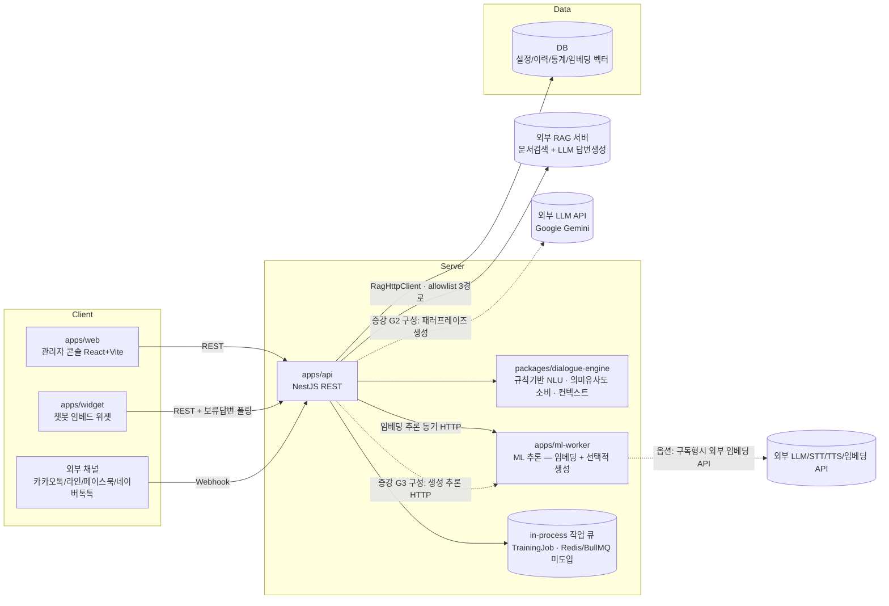

# 개발명세서 (아키텍처 / 데이터모델 / API)

> 기반 문서: `docs/01-requirements/기능요구사항.md`, `docs/03-design/UIUX_준수기준.md`
> 참고 컨벤션: 형제 프로젝트 `Auto QA`(pnpm 모노레포, NestJS+React, `.claude/agents` 하네스) 구조를 재사용하여 팀 내 기술스택 일관성을 유지한다.
> 세부 설계서/ADR 목록은 **§7**을 참고한다. 기능그룹 단위 상세 설계는 별도 문서로 두고 이 문서는 전체 골격과 결정사항을 유지한다.

## 1. 전체 아키텍처



**설계 원칙**
- **기본기능(GPU 불필요)은 `apps/api` + `packages/dialogue-engine`에서 동기 처리**한다. 규칙/경량 매칭 기반이라 별도 GPU 인프라 없이 즉시 응답한다 (`01-requirements` GPU 1~2 항목 전부).
- **확장기능/옵션 중 GPU가 필요한 항목(DLE 증강학습, 임베딩, 군집분석, RAG, 음성/멀티모달 등)은 `apps/ml-worker`로 분리**한다. 구축형은 자체 GPU 서버에서, 구독형은 동일 인터페이스로 외부 API를 호출하도록 **Provider 추상화**를 둔다(Auto QA의 `LlmEvaluationProvider` 패턴 재사용).
  - **1차 도입 형태(No.18 부분, 2026-09-22)**: ml-worker는 **학습 없는 추론 전용 임베딩 서비스**(`POST /embed`, `GET /health`)로 시작하며 **Job Queue를 쓰지 않는다**. 질의 임베딩은 대화 턴 안에서 **동기 HTTP 1회**(타임아웃 300ms·회로차단·저하 모드)로 처리하고, 재색인만 `apps/api` 내부의 단일 인스턴스 in-process 큐로 배치 처리한다. Redis/BullMQ·`TrainingJob`은 **계속 유보**한다(**ADR-0024**).
  - **2차 도입 형태(No.16/23 학습 고도화, 2026-09-22)**: ml-worker의 역할 정의를 **"임베딩 추론" → "ML 추론"** 으로 넓혀 **선택적 생성 엔드포인트(`POST /augment`)** 를 수용한다. **"추론 전용"의 의미는 "모델 파인튜닝을 하지 않는다"로 정밀화**되며(생성도 순전파다), `/embed`·`/health` 계약은 **바이트 단위로 변경하지 않는다**. 임베딩·생성 모델의 GPU 경합을 막기 위해 **실행 프로파일**(`ML_WORKER_ROLE=embed｜augment｜both`, 기본 `embed`)을 두고 **운영 기본 구성은 프로세스 분리**다. **경량 의도 분류기의 학습은 ml-worker가 아니라 `apps/api` 안에서 CPU로 수행**한다(학습 입력인 float32 벡터가 이미 그 프로세스의 DB에 있어 HTTP 왕복이 손해다). **`TrainingJob`은 이번에 도입**하되(쓰기 주체가 생겼다 — `FAILED`·`PARTIAL`이 실제로 발생한다) **Redis/BullMQ는 여전히 도입하지 않는다**(단일 인스턴스 in-process 큐 — **ADR-0024 갱신 · ADR-0027**).
- **LLM 연동은 Provider 추상화를 통해서만 한다(No.16, 2026-09-22)**: 증강 생성기는 **`AugmentationProvider` 포트 1개 + 구현 3종**(`rule` 규칙·사전 기반 기본값 / `gemini` 외부 LLM API / `local` ml-worker 생성모델) + Mock이며 교체 지점은 **팩토리 1곳**이다. **기본값 `rule`은 GPU 0·외부 호출 0**이라 구축형·CI·데모가 외부 자원에 묶이지 않고, 외부 Provider의 실패·타임아웃·키 미설정은 **전부 `rule`로 저하**된다(기동 실패가 아니다). `packages/llm-provider`는 **소비자가 `apps/api` 1곳**이라 이번에도 만들지 않으며, 승격 트리거는 **LLM 소비자 2곳**이다(`packages/pii-mask` 승격과 동일 규약 — **ADR-0026**).
- **생성형 AI/RAG(No.30 부분)는 자체 엔진을 만들지 않고 외부 RAG 서버에 위임**한다. 접촉면은 `apps/api` 안의 **`RagHttpClient` 단일 게이트 + 경로 allowlist 3개**(`POST /api/rag/query`, `GET /api/status`, `GET /api/documents/metadata`)뿐이며, 파괴적 무인증 엔드포인트(문서 초기화·삭제·전역 설정·프롬프트 관리)는 **코드에 문자열로도 존재하지 않는다**(정적 검사로 강제). 우리 API에 RAG 프록시 엔드포인트를 만들지 않는다(**ADR-0022**).
- 채널 연동(카카오톡 등)은 API의 **채널 어댑터 계층**에서 흡수하고, 내부적으로는 채널 무관한 단일 대화 처리 파이프라인을 태운다. 어댑터 계약(`normalizeInbound`/`renderOutbound`/`supportedOutputTypes`)은 No.11에서 확정됐으며, **채널 타입 분기는 팩토리 1곳에만 존재한다**(ADR-0011). Webhook 수신 경로(`POST /webhooks/:channel`)는 외부 채널 Phase에 신설한다.

## 2. 모노레포 구조

```
Chat Bot/
├── apps/
│   ├── web/           # 관리자 콘솔 — React + Vite + TS
│   ├── widget/        # 챗봇 임베드 위젯 — 경량 번들(gzip <100KB), 런타임 의존성 0(ADR-0012)
│   ├── api/           # NestJS — 챗봇관리/대화설계/대화처리/채널/보안/이력/통계/답변설정·임베딩·RAG
│   └── ml-worker/     # [신설] ML 추론 서비스(Python FastAPI) — 임베딩 + 선택적 생성(`ML_WORKER_ROLE`).
│                      #   모델 파인튜닝·DB 접근 없음(ADR-0024 + 2026-09-22 갱신)
├── packages/
│   ├── shared-types/  # FE/BE 공유 DTO (zod) + zod 무의존 서브패스(`/output-view`, `/contrast`)
│   ├── dialogue-engine/ # 의도·키워드 매칭, 컨텍스트(슬롯필링), 대화그래프 실행기, 턴 오케스트레이터
│   ├── pii-mask/      # [신설] PII 마스킹 순수 함수 1벌(저장 경로 + 외부 송신 경로 공용 — ADR-0013)
│   └── llm-provider/  # LLM/STT/TTS Provider 추상화 (mock | on-prem | cloud) — 여전히 미생성.
│                      #   추상화 자체는 `apps/api/src/augmentation/providers/`의 포트로 제공한다
│                      #   (소비자 1곳). 승격 트리거 = LLM 소비자 2곳(ADR-0026 §6)
├── infra/             # docker-compose, Dockerfile(api/web/widget/ml-worker) — 배포 Phase
├── docs/              # 00-source ~ 05-ops (현재 구조 유지)
└── .claude/           # agents, commands
```

| 워크스페이스 | 상태 |
|---|---|
| `apps/api`, `apps/web`, `packages/shared-types`, `packages/dialogue-engine` | 구현 중(No.1~15 완료, **FAQ/의도 매칭 고도화 설계 완료**) |
| **`apps/widget`** | **No.10~11 Phase에 신규 스캐폴딩**(ADR-0012) — Vite 라이브러리 모드(IIFE) `widget.js` + `/c/:slug` 전체화면. No.12~15에서는 수정하지 않았으나 **매칭 고도화 그룹에서는 수정한다**(보류 답변 폴링·대기 UI·되묻기 버튼·출처 표기) |
| **`apps/ml-worker`** | **매칭 고도화 Phase에 신규 스캐폴딩**(ADR-0024) — Python 3.11 + FastAPI, 추론 전용. `EMBEDDING_BASE_URL` 미설정 시 API는 정상 기동하고 의미 매칭만 비활성. **학습 고도화 Phase에 역할 확대** — `ML_WORKER_ROLE`(기본 `embed`)로 **선택적 생성 프로파일**(`POST /augment`)을 수용하며 `/embed`·`/health` 계약은 무변경이다. 기본값 그대로 두면 **현행과 100% 동일**하게 동작한다 |
| **`apps/api/src/augmentation｜classifier｜training-jobs`** | **학습 고도화 Phase에 신설** — 증강 제안 파이프라인 / 경량 의도 분류기 / 비동기 작업 상태. 환경변수를 하나도 설정하지 않으면 **G1 규칙 증강 + 분류기 비활성**으로 정상 기동한다 |
| **`apps/api/src/validation`** | **검증/품질 고도화 Phase에 신설**(No.19·20) — TC 세트·대량 업로드·비동기 대량 실행·판정·실행 간/적용 전 비교. **`packages/dialogue-engine` 변경 0건 · ml-worker 변경 0건 · 신규 외부 접촉면 0건**이며, 실행 경로는 `ConversationLogService`·`QueryEmbeddingService`를 **주입하지 않는다**(ADR-0029·0030) |
| **`apps/api/src/versions`** | **챗봇 복원/버전 이력관리 Phase에 신설**(No.25) — 대화 자산 시점 스냅샷(수동 + 대량 변경 직전 자동)·이력·차이·ID 보존 원자적 복원. **캡처 모듈(`version-capture`)과 복원 모듈을 분리**해 자산 모듈 5곳은 캡처만 import한다. **`packages/dialogue-engine`·ml-worker·widget 변경 0건 · 신규 외부 접촉면 0건 · 신규 권한 0종**(ADR-0031) |
| **`apps/api/src/deploy-schedules`** · **`apps/api/src/common/polling`** | **운영 예약 배포 Phase에 신설**(No.28) — 1회성 예약 3종(버전 복원 · 공개 시작 · WEB 채널 열기/닫기) + 인프로세스 폴링 실행 엔진(DB CAS 선점 · 임대). 반영은 기존 `VersionRestoreService.restore()`와 신규 `channels/publication.service.ts`(상태+채널 원자 전환)를 **호출만** 한다. **`packages/dialogue-engine`·ml-worker·widget 변경 0건 · 신규 외부 접촉면 0건 · `@Public()` 추가 0건 · 신규 권한 0종**(ADR-0032) |
| **`apps/api/src/stats/integrated`** · **`apps/api/src/stats/intents`** | **통합 통계 Phase에 신설**(No.29) — 그룹·전역 스코프 통계(누적 KPI·기간 시계열·분포·기여 표·질문 순위)와 챗봇 스코프 의도별 매칭. 원천 `ConversationLog` **직접 집계**(롤업 테이블 0) · `stats` 모듈 확장(신규 NestJS 모듈 0) · No.14 순수 함수 재사용. **`packages/dialogue-engine`·ml-worker·widget 변경 0건 · `@Public()` 추가 0건 · 신규 권한 0종 · 신규 환경변수 0개**(ADR-0033) |
| **`apps/api/src/api-connections`**(+ `catalog/`) · **`apps/api/src/legacy-api`** | **레거시 API 연동 Phase에 신설**(No.26) — 전역 연결 레지스트리(ADMIN)·읽기 전용 카탈로그·레거시 호출 유일 출구(`LegacyApiHttpClient` — SSRF 다층 방어·DNS 후 주소 고정)·메타데이터 전용 `ApiCallLog`. **`packages/dialogue-engine`을 닫힌 목록으로 수정**(v2 `API_CONDITION` 정지점 · 순수 재진입 `resumeAfterApiCall` · 참조 편입 — 엔진 I/O 0건 정적 검사) · **ml-worker·widget 변경 0건 · `@Public()` 추가 0건 · 신규 권한 0종 · 시크릿 DB 미저장**(ADR-0034) |
| **`apps/api/src/surveys`** · **`apps/api/src/survey-responses`** · `apps/api/src/stats/surveys` | **설문관리 Phase에 신설**(No.27) — 챗봇별 설문 정의 CRUD(구조 잠금·복제·마감)·★응답 쓰기 유일 모듈(`SurveyResponseService` — export 1개, import처 = 공개 대화 1곳)·읽기 전용 참여 통계/응답 목록/CSV(`StatsModule` 확장). **`packages/dialogue-engine`을 닫힌 목록으로 수정**(순수 설문 세션 · S0 단계 · `resumeAfterApiCall` 설문 필드 이월 · `surveyTargets` · `mergeOverlay` 설문 이월 — 정지점 미사용, 엔진 I/O 0건 정적 검사) · **ml-worker·widget 변경 0건 · `@Public()` 추가 0건 · 신규 권한 0종 · 신규 환경변수 0개 · 봉투 버전 1 유지**(ADR-0035) |
| **`apps/api/src/handoff`** · **`apps/api/src/canned-responses`** | **하이브리드 CS Phase에 신설**(No.24) — 개입 세션 상담 스레드(★쓰기 유일 파일 `handoff-thread.service.ts`)·공개 게이트/상담 폴링(export 2개, import처 = 공개 대화 1곳)·진행 중 목록·대화 보기(★원문 출구 1곳)·응답힌트·이력/요약·60초 정리 루프(`PollingLoop` 두 번째 소비자)·챗봇별 자주 쓰는 문장. **`packages/dialogue-engine`·`packages/pii-mask`·ml-worker 변경 0건 · `@Public()` 6 → 7 · 역할 3 → 4(`AGENT`)·권한 15 → 17(`cs:read`·`cs:write`) · 선택 환경변수 5개 · 봉투 스키마·버전 불변 · widget 변경(상담 모드 — vanilla 유지)**(ADR-0036) |
| **`apps/api/src/topics`** · **`apps/api/src/asset-transfer`** | **토픽 시스템 Phase에 신설**(No.22) — 챗봇 안 평면 토픽 CRUD·활성/비활성·★자산 소속 일괄 쓰기 유일 파일(`topic-assignment.service.ts`)·교차 참조 점검·영향 미리보기·토픽 → 새 챗봇 분리(export 1개) + **챗봇 간 자산 이관 부품**(캡처 → 선택·계획(순수) → 생성 전용 적재기 — No.40·병합이 재사용, export 2개). **`packages/dialogue-engine`·ml-worker·widget 변경 0건 · `@Public()` 7 유지 · 신규 권한·역할·환경변수 0 · 스냅샷 스키마 버전 1 유지(선택 필드)**(ADR-0037) |
| **`packages/pii-mask`** | **매칭 고도화 Phase에 승격** — 기존 `apps/api/src/conversation/lib/pii-mask.ts`를 이동(동작 변경 0). 소비자가 저장·외부 송신 2곳이 되어 §5의 승격 조건 충족 |
| `packages/llm-provider`, `infra/` | 미생성. LLM 직접 호출이 필요한 기능(No.16/No.24 등) 착수 시점에 도입(§6-4) |

기술스택은 `Auto QA`(NestJS+React+pnpm)와 일치시켜 팀 내 재사용성을 높인다. **예외 3건**: ① `apps/widget`은 번들 예산(gzip 100KB)과 호스트 페이지 침투 최소화를 위해 React를 쓰지 않고 순수 TS로 구현한다(ADR-0012). ② **`apps/ml-worker`는 Python**이다 — 한국어 문장 임베딩 모델의 1차 배포 형태가 사실상 전부 PyTorch/HF이고, "최고 성능 모델을 고를 자유"가 런타임 선택을 지배하기 때문이다. 두 예외 모두 **빌드 도구·스크립트 이름·테스트 명령은 동일하게 유지**하며, ml-worker의 접촉면은 HTTP 2개(+생성 프로파일 시 2개)로 한정해 `apps/api`가 언어를 알지 못하게 한다(ADR-0024). ③ **한국어 형태소 분석기는 이 프로젝트 최초의 (선택적) 네이티브/WASM 의존성**이다(No.23 요소분해 — **ADR-0028**). `bcrypt`/`argon2`를 기각한 원칙은 폐기가 아니라 **정밀화**된다: **API 기동의 전제가 되는 네이티브 의존성은 여전히 도입하지 않으며**, 미설치·로드 실패가 **해당 기능의 품질 저하로만 귀결되고 폴백 경로가 코드에 실재할 때만** 허용한다. 분석기는 `MorphAnalyzerPort` + **휴리스틱 폴백(M0, 의존성 0)** 을 항상 가지며 1순위 후보는 **네이티브 빌드가 없는 WASM 배포본**이다. 구축형에서는 **선택 구성요소**로 분리해 기본 설치 패키지 크기를 늘리지 않는다.

### 2.1 `apps/api` 내부 계층 규약 (전 기능그룹 공통)

도메인 모듈은 다음 4계층으로 고정한다. 기능그룹이 늘어도 구조를 복제해 일관성을 유지한다.

| 계층 | 파일 | 책임 | 금지 |
|---|---|---|---|
| `*.controller.ts` | 컨트롤러 | 경로·HTTP 상태코드·zod 파이프·권한 데코레이터 | Prisma 타입 노출, 비즈니스 분기 |
| `*.service.ts` | 서비스 | 비즈니스 규칙의 **단일 진입점**이며 **`AuditLog` 기록 지점이다**(No.12부터 실제 동작 — `AuditLogService.record()` 명시 호출, ADR-0016). Prisma 직접 의존 허용 | HTTP 개념(Request/Response) 의존 |
| `*.mapper.ts` | 매퍼 | Prisma row ↔ zod DTO 변환(`null ↔ undefined`, JSON 문자열 ↔ 객체, enum 파싱 폴백) | 비즈니스 분기 |
| `lib/*.ts` | 순수 함수 | DB·Nest 무의존 로직(파생 규칙, 전이 판정, 집계, 기간 계산, 마스킹, 차이 판정, **비밀번호 정책·권한 판정·금지어 매칭·감사 스냅샷**, **시계열 버킷·응답출처 판정·추천 유사도**, **코사인·벡터 인코딩·점수 합성·RAG 성패 판정·출처 정제·외부 metadata 파싱**, **증강 후보 검증 5종·변형 규칙·요소분해·조사/어미 절단·로지스틱 회귀·softmax·분류기 stale 판정·모델 코덱**) | 외부 I/O |

- **감사 기록 규약**: 컨트롤러·매퍼·`lib/`는 `AuditLog`를 알지 못한다(FR-0-27). **명시적 예외 1건** — 인증·인가 이력(`LOGIN`/`LOGIN_FAILED`/`LOGOUT`/`PERMISSION_DENIED`)은 서비스 계층이 아니라 `auth` 서비스와 `common/auth`의 `PermissionGuard`가 기록한다. 권한 거부는 가드 외에 관측 지점이 없기 때문이다(ADR-0016).
- **`actor` 전달 규약**: 서비스는 `Request`에 의존하지 않는다. 감사 기록용 주체는 `common/request-context`(AsyncLocalStorage)가 운반하며, **`RequestContextService.get()`을 호출해도 되는 곳은 `AuditLogService` 1곳뿐**이다. actor가 비즈니스 인자인 경우(본인 비밀번호 변경 등)에만 컨트롤러의 `@CurrentUser()`로 받아 서비스 시그니처에 명시적으로 넘긴다(ADR-0016). **[No.28] 요청 컨텍스트가 없는 예약 실행 경로**는 ALS를 읽지 않고 주체를 인자(`ScheduledInvocation.actor` → `AuditRecordInput.actorOverride`)로 넘긴다 — 감사 주체는 실행 직전 재검증을 통과한 **예약자**다(ADR-0032 §5).
- **외부 HTTP 출구 규약**: 외부 RAG 호스트로 나가는 HTTP는 **`rag/rag-http.client.ts` 1곳**, 임베딩 서비스로 나가는 HTTP는 **`embedding/providers/http-embedding.provider.ts` 1곳**, **외부 LLM(Gemini)으로 나가는 HTTP는 `augmentation/providers/gemini-augmentation.provider.ts` 1곳**, **레거시 시스템(No.26 — 관리자가 등록한 연결)으로 나가는 HTTP는 `legacy-api/legacy-api-http.client.ts` 1곳**뿐이다(총 **4곳**). **[No.26] 레거시 출구는 임의 URL 문자열을 받지 않고 `build-request.ts`만 만들 수 있는 브랜드 타입 요청(`ValidatedLegacyRequest`)만 받으며, `node:http(s)` import는 전송 구현 1파일로, `LEGACY_API_SECRET__` 참조는 시크릿 리졸버 1파일로 봉인한다(ADR-0034 §4).** 다른 어떤 서비스도 `fetch`/`axios`로 이 호스트들을 직접 부르지 않는다(ADR-0022, **ADR-0026**). **외부 LLM은 공식 SDK를 쓰지 않고 `fetch` + zod로 직접 호출한다** — SDK는 전송·재시도·로깅을 자체 정책으로 수행해 마스킹·타임아웃·회로차단 불변식을 조용히 우회한다. `AUGMENTATION_PROVIDER=rule` 구성에서는 **Gemini 구현체가 인스턴스화조차 되지 않아** 아웃바운드 HTTP가 0건임이 검증 가능하다.

공통 횡단 관심사는 `apps/api/src/common/`에 둔다 — `zod-validation.pipe.ts`, `zod-query.pipe.ts`, `zod-param.pipe.ts`, `api.exception.ts`, `all-exceptions.filter.ts`, `pagination.ts`, `auth/`(`permission.guard.ts`·`require-permission.decorator.ts`·`public.decorator.ts`·`current-user.decorator.ts`·`lib/cookie.ts`·`lib/password-hash.ts`), `request-context/`(AsyncLocalStorage), `rate-limit/`(토큰버킷 store·순수함수 — No.12에 `conversation/`에서 승격). 환경변수 검증은 `apps/api/src/config/env.validation.ts`에서 부팅 시 수행한다.

### 2.2 기능그룹별 모듈 배치

| 기능그룹 | NestJS 모듈 | 상태 |
|---|---|---|
| 챗봇 운영관리 (No.1~4) | `chatbot-groups`, `chatbots`, `stats` | 설계 완료 → `chatbot-operations-설계.md` §6에 파일 단위 구조 명시 |
| 대화 설계 (No.5~9) | `intents`, `keywords`, `homonyms`, `contexts`, `dialog-nodes`, `faqs` + 횡단 모듈 `dialogue-common`(엔진 번들 조립 / 참조 사전검사 / 대량 업로드) | 설계 완료 → `dialogue-design-설계.md` §6에 파일 단위 구조 명시 |
| 품질/채널 (No.10~11) | `simulation`(시뮬레이션·비교), `channels`(채널 CRUD), `conversation`(공개 대화 파이프라인·채널 어댑터·로그 적재·PII 마스킹) + `dialogue-common`(번들 캐시 확장) | 설계 완료 → `quality-channel-설계.md` §6 |
| 보안/이력 (No.12~13) | `auth`(로그인·세션·비밀번호), `users`(+`roles` 상수 조회), `banned-words`(사전·필터), `audit-logs`(기록·조회) + 횡단 `common/auth`(가드 실구현·전역 등록·`@Public()`·`@CurrentUser()`) · `common/request-context`(신규) · `common/rate-limit`(`conversation/`에서 승격) | 설계 완료 → `security-audit-설계.md` §6 |
| 통계/분석 (No.14~15) | `stats`(확장 — 기간 시계열·분포·순위, 읽기 전용) + `learning`(신규 — 미응답 검토 큐·의도 예문 반영) + `conversation`(수집 훅 1줄) | 설계 완료 → `stats-learning-설계.md` §6 |
| **FAQ/의도 매칭 고도화 (No.6·9·18·30 부분)** | **`answer-settings`(신규 — 임계값·RAG 스코프 설정·미리보기·연결 점검) + `embedding`(신규 — Provider 포트·질의 캐시·유사도 점수·색인/재색인) + `rag`(신규 — `RagHttpClient` 봉인·응답 판정·유량 제어·보류 답변 저장소·`RagCallLog`)** + `conversation`(점수 주입·2단계 분기·`PENDING`·폴링) · `dialogue-common`(번들 캐시에 벡터 동거·무효화 시 색인 예약) · `simulation`(근거 패널·`useRag` 플래그) | **설계 완료 → `nlu-rag-answering-설계.md` §7** |
| **학습 고도화 (No.16·23)** | **`augmentation`(신규 — `AugmentationProvider` 포트 3구현·검증 5종·제안 저장소·★승격 유일 지점) + `classifier`(신규 — 선형 의도 분류기 학습/추론·stale 판정) + `training-jobs`(신규 — 비동기 작업 상태·in-process 큐·기동 시 고아 Job 정리)** + `learning`(확장 — 요소분해·통합 반영·추천 출처 분기) · `embedding`(포트·코덱·벡터 캐시 **소비만**) · `intents`/`keywords`(공용 반영 메서드 **재사용만**) | **설계 완료 → `learning-augmentation-설계.md` §9** |
| **검증/품질 고도화 (No.19·20)** | **`validation`(신규 — TC 세트/TC CRUD · 엑셀 임포트(`SheetReader` 3번째 소비자) · 대량 실행기 · 실행 로컬 배치 임베딩 · 오버레이 합성 · 실행 간 비교)** + `training-jobs`(큐 **재사용** + 상태 싱크 포트 분리) · `embedding`(점수 조립 순수함수 추출·**소비만**) · `rag`(`RagHttpClient`/`RagGateService` **재사용만**) · `simulation`(`serializeOutputsForDiff` 공용 승격) | **설계 완료 → `validation-regression-설계.md`** |
| **챗봇 복원/버전 이력관리 (No.25)** | **`versions`(신규 — 목록·상세·라벨/고정/삭제·차이·내용 조회·복원 미리보기/확정 · ★대화 자산 쓰기 유일 파일 `version-restore.applier.ts`) + `version-capture`(신규 — 일관 읽기 캡처·보존 정리, 자산 모듈 5곳이 import)** + `dialogue-common`(`build(chatbotId, tx?)` 선택 인자) · `intents`/`keywords`/`faqs`/`augmentation`/`learning`(자동 스냅샷 훅 1줄씩 — 총 8지점) · `embedding`(`ReindexQueueService` 재실행 예약 플래그) · `common/auth`(`@RequirePermission` 복수 인자 AND) · `audit-logs`(`RESTORE` 요약 액션) · `chatbots`(영구삭제 동반 삭제 3테이블) | **설계 완료 → `version-history-설계.md`** |
| **운영 예약 배포 (No.28)** | **`deploy-schedules`(신규 — 예약 CRUD·미리보기·충돌 배너·요약/메타 · 실행 엔진·CAS/임대 저장소 · 동작별 실행기 레지스트리 · ★`restore()`의 두 번째 호출부 `restore-version.executor.ts`) + `common/polling`(신규 — 도메인 무관 `PollingLoop`·`Clock`·임대 순수 함수)** + `channels`(`ChatbotPublicationService` — 공개 전환 원자 경로) · `versions`(`restore()` 선택 인자·`RESTORE_BUSY`·보존 보호·삭제 409 · `VersionRestoreService`/`VersionDiffService` export — applier 미export) · `validation`(`TestRunService` export — 실행 직후 TC 옵션) · `chatbots`(영구삭제 동반 삭제 14테이블) | **설계 완료 → `scheduled-deploy-설계.md`** |
| **통합 통계 (No.29)** | **`stats`(확장 — `integrated/`(6핸들러 · ★세션 distinct 원시 SQL 격리 파일 `integrated-session.query.ts`) · `intents/`(의도별 매칭) · `lib/` 순수 함수 5종 신설 + 챗봇 스코프 조립 코드 추출 · KST 헬퍼 중복 제거)** + `conversation`/`rag`(`record()`·`ConversationLogPort`·`RagAnswerRunInput`에 `groupId` 필수 — 대화 당시 그룹 스냅샷) · `chatbot-groups`(이력 있는 그룹 삭제 = 보관 · 보관 그룹 제외) · `chatbots`(보관 그룹 대상 404 · `archivedAt` 동기화 — **영구삭제 사전검사 무변경**) | **설계 완료 → `integrated-stats-설계.md`** |
| **레거시 API 연동 (No.26)** | **`api-connections`(신규 — 연결 CRUD·연결 테스트·참조 409·감사) + `api-connections/catalog`(신규 — ★읽기 전용 카탈로그: 호출 시 연결 조회·목 원천·설계 점검 정보, 외부 출구 없음) + `legacy-api`(신규 — `LegacyApiService`(턴 완결·연결 테스트)·★유일 출구 `LegacyApiHttpClient`·시크릿 리졸버(★`LEGACY_API_SECRET__` 1파일)·연결 단위 게이트·`node:http(s)` 전송 1파일·`ApiCallLog` 적재/조회, export 2개뿐)** + `packages/dialogue-engine`(닫힌 목록 수정 — 정지점·재진입·참조 편입) · `conversation`(④.5 턴 완결·RAG 제외·미응답 제외) · `simulation`(MOCK/LIVE·비교 목) · `validation`(TC 목 — 카탈로그만) · `dialog-nodes`(v1 쓰기 거부·응답 가림·API 참조 검증) · `dialogue-common`(삭제 409 규칙 1벌) · `versions`(가림·무결성·복원 경고 3종) · `chatbots`(영구삭제 동반 삭제 15테이블) | **설계 완료 → `legacy-api-integration-설계.md`** |
| **설문관리 (No.27)** | **`surveys`(신규 — 설문 정의 CRUD·구조 잠금 409·상태 전이·복제·삭제 409 2종·감사·번들 무효화) + `survey-responses`(신규 — ★`SurveyResponse`/`SurveyAnswer` 쓰기 유일 파일 `SurveyResponseService`: 쓰기 키·순서 증가 가드·값 재검증·자유 텍스트 금지어→PII 마스킹·중복 표시, export 1개) + `stats/surveys`(신규 — 요약·문항별·응답 목록·자유 텍스트·CSV 2종, 읽기 전용)** + `packages/dialogue-engine`(닫힌 목록 수정 — 설문 세션·S0·재진입 이월·참조 편입·설계 점검·오버레이) · `conversation`(④.6 응답 적재·의미 점수 생략·RAG/미응답 제외·`surveyTurn`) · `simulation`(미리보기 토글·설문 단계·비교 미리보기) · `validation`(TC 미리보기 판정·`surveyPreviewA/B`) · `dialog-nodes`(v1 쓰기 거부·v2 참조 검증·복사 제외) · `dialogue-common`(번들에 설문·삭제 409 규칙) · `stats`(질문 순위 `surveyTurn` 제외 1벌) · `versions`(복원 경고 3종·무결성 경고) · `chatbots`(영구삭제 사전검사 11종) | **설계 완료 → `survey-management-설계.md`** |
| **하이브리드 CS (No.24)** | **`handoff`(신규 — ★`HandoffSession`/`HandoffMessage` 쓰기 유일 파일 `HandoffThreadService`: 개입 CAS·토큰 1회 발급·메시지 적재(금지어→PII)·종료(원문 소거 동일 트랜잭션)·강제 인수 · 공개 게이트(엔진 호출 전 분기)·상담 폴링 · 진행 중 목록·경고 판정·대화 보기(원문 열람 감사)·응답힌트·이력/요약 · 상담 설정 1:1 + 전용 캐시 · 60초 정리 루프, export 2개) + `canned-responses`(신규 — 챗봇별 공용 문장 CRUD·위/아래 이동·감사)** + `conversation`(②.7 게이트·관찰 창·`record()`의 `handoffTurn`/`apiNotice`·상담 폴링 핸들러(`@Public()` 7번째)) · `common/rate-limit`(폴링 전용 버킷 데코레이터 — 보류 답변 폴링 포함) · `learning`(`HANDOFF_TURN`) · `stats`(질문 순위 필터 1벌에 `handoffTurn`) · `dialogue-common`(노드 삭제 409에 종료 후 버튼 참조) · `chatbots`(영구삭제 사전검사 13종·상담 설정 동반 삭제) · `audit-logs`(대상 2종·`RAW_VIEW`) · `apps/widget`(상담 모드) | **설계 완료 → `hybrid-cs-설계.md`** |
| **토픽 시스템 (No.22)** | **`topics`(신규 — ★`Topic` 쓰기 유일 파일 `TopicsService` · ★자산 6종 `topicId` 일괄 쓰기 유일 파일 `TopicAssignmentService`(data 키 ⊆ `topicId`·`updatedAt`) · 목록(자산 수·교차 참조 수)·영향 미리보기·분리 오케스트레이션, export `TopicLookupService` 1개) + `asset-transfer`(신규 — `captureTransferSource`·`selectTransferSubset`/`planTransfer`/`verifyTransferPlan`(순수)·★생성 전용 `AssetTransferLoader`, 복원 적재기와 코드 비공유)** + `dialogue-common`(`build()` 선택 인자 `excludeInactiveTopics` · `getCached` 필터 · `getCachedUnfiltered`(시뮬레이터 전용) · 참조 열거 1벌 `asset-ref-graph.ts` · K-1 결정적 `orderBy`) · 자산 6모듈(`topicId` 생성·수정·목록 필터·감사) · `dialog-nodes`(시스템 노드 잠금·점검 규칙 합성·K-2 추출) · `simulation`(비활성 포함 토글) · `conversation`(`record()`의 `topicId`) · `versions`(복원 정규화·경고 2종) · `chatbots`(사전검사 14종·복사 대상 결정 추출) · `audit-logs`(`Topic`) | **설계 완료 → `topic-system-설계.md`** |

> **`packages/dialogue-engine` 사용 개시(No.5~9)**: 매칭·컨텍스트 세션 전이·설계 점검·FAQ 유사 후보 산출은 `apps/api`의 `lib/`가 아니라 **엔진 패키지의 순수 함수**에 둔다. 런타임 진입점은 `resolveResponse()`이며 DB·NestJS에 의존하지 않는다(ADR-0008). 챗봇 스코프 검증(`/chatbots/:chatbotId/...` 404·`CHATBOT_ARCHIVED` 409)은 `ChatbotsModule`이 내보내는 `ChatbotScopeService` 한 곳에서 수행한다.
>
> **엔진 진입점 3층화(No.10~11)**: 텍스트 해석 `resolveResponse()`, 버튼 노드 실행 `resolveByNodeId()`, 턴 오케스트레이터 **`resolveTurn()`** 으로 나눈다. **API 소비자(시뮬레이션·비교·공개 대화)는 `resolveTurn()`만 호출**하며, 대화 상태 봉투 검증·버튼 라우팅·다음 상태 조립은 전부 엔진이 책임진다(ADR-0010). 대화 상태는 서버에 저장하지 않고 클라이언트가 보관해 왕복한다(ADR-0009).
>
> **엔진 불가침(No.12~13)**: 인증·권한·금지어는 **`apps/api` 경계에만 존재**한다. `packages/dialogue-engine`은 이들을 알지 못하며 이번 그룹에서 수정 0줄이다(ADR-0008 규약 유지). 금지어 필터는 `conversation` 모듈의 파이프라인 2지점(입력 수신 직후 / 응답 반환 직전)에만 적용된다.
>
> **엔진 불가침(No.14~15)**: 통계 집계·시계열 버킷·미응답 수집·추천 유사도(문자 bigram 자카드)는 전부 `apps/api` 경계에 있고 엔진은 **수정 0줄**이다. 추천은 매칭(`matchIntent`)과 다른 문제이므로 엔진 함수를 재사용하지 않는다(ADR-0019 §4). **`learning` 모듈의 의존은 `learning → intents / dialogue-common / chatbots` 단방향**이며, `conversation → learning`(수집기 주입)의 역방향 참조는 만들지 않는다.
>
> **엔진 확장(FAQ/의도 매칭 고도화)**: 이 그룹은 엔진을 **처음으로 수정**하지만 **순수성·동기성·결정론은 유지**한다. 확장은 **`ResolveOptions.semantic` 선택 필드 1개 + 점수 합성 규칙 변경(부분 문자열 포함 제거) + `semantic.ts`(구간 판정 순수 함수) 신설 3건**뿐이다. **`apps/api`가 질의 임베딩 1회와 코사인 계산을 끝낸 뒤 사전 계산된 점수 맵을 주입**하며, 엔진은 그 맵을 동기적으로 읽기만 한다 — 엔진에 HTTP·Prisma·환경변수가 들어가지 않는다(**ADR-0020**). `semantic` 미주입 시 동작은 현행과 완전히 동일하므로(저하 모드 = 현행 동작) 기존 엔진 테스트가 회귀 감시 장치로 계속 작동한다. 구간 판정(`judgeBand`)은 **엔진·설정 미리보기·시뮬레이터가 공유하는 1곳**이다.
>
> **모듈 의존 방향(FAQ/의도 매칭 고도화)**: `conversation → embedding / rag / answer-settings`, `dialogue-common → embedding`, `simulation → embedding / rag / answer-settings` 단방향이다. **`rag`는 `conversation`을 import하지 않으며**, 완료 시 로그 적재는 인터페이스(`ConversationLogPort`) 주입으로 처리해 상호 참조를 만들지 않는다. `embedding`은 `dialogue-common`을 의존하지 않고 색인 대상을 Prisma에서 직접 읽는다.
>
> **엔진 불가침(학습 고도화 No.16~23)**: 이 그룹은 **`packages/dialogue-engine`을 한 줄도 바꾸지 않는다** — `ResolveOptions`에 필드를 추가하지도 않는다(FR-0-49). 증강의 결과는 **기존 예문 경로**로, 분류기의 결과는 **대화 밖 관리자 화면**으로만 흐른다. 엔진 패키지에 `classifier`·`augmentation`·`suggestion` 심볼이 **0건**임을 정적 검사가 단언한다. 공개 대화 API의 성능 예산·응답 바이트도 변하지 않는다.
>
> **모듈 의존 방향(학습 고도화)**: `augmentation → embedding / training-jobs / banned-words / chatbots`, **`augmentation → intents`(★ 승격 서비스 1개 파일에서만)**, `classifier → embedding / training-jobs`(intents·keywords **서비스를 주입하지 않는다** — Prisma 읽기만), `learning → classifier / embedding`(읽기 전용 단방향) 이다. **`training-jobs`와 Job 실행기는 `IntentsModule`·`KeywordsModule`을 import하지 않는다** — DI 그래프에 없으므로 "Job 완료 시 자동 승인" 코드는 **작성해도 컴파일되지 않는다**(ADR-0025 §5의 봉인 L1). 역방향 참조(`classifier → learning`, `intents → augmentation`)는 만들지 않는다.
>
> **제안과 자산의 분리(학습 고도화)**: 증강 제안(`AugmentationSuggestion`)·요소분해 결과는 **대화 자산이 아니다.** `Intent.examples`/`Keyword.synonyms`로 넘어가는 경로는 **관리자의 명시적 승인 액션을 처리하는 핸들러 1곳**뿐이며, 스케줄러·백그라운드 작업·Job 완료 콜백이 자산을 직접 쓰는 코드 경로는 **0건**이다(정적 검사로 강제 — ADR-0025). **[갱신 2026-09-23 No.28]** 운영 예약 배포의 실행기도 자산을 **직접 쓰지 않는다** — 관리자가 미리보기로 승인해 해시에 묶은 예약에 한해 `VersionRestoreService.restore()`를 호출할 뿐이며, `restore()`의 호출부는 관리자 요청 핸들러와 예약 실행기 **2곳**, applier는 여전히 `restore()` 안에서만 호출된다(ADR-0032 §6, ADR-0025 갱신 각주).
>
> **엔진 불가침(검증/품질 고도화 No.19~20)**: 이 그룹도 **`packages/dialogue-engine`을 한 줄도 바꾸지 않는다** — `resolveTurn`/`mergeOverlay`/`buildDialogueIndex`/`judgeBand`/`normalizeText`를 **호출만** 한다. 엔티티(키워드) 검증은 `expectedKind: 'NODE'`를 통한 **간접 검증**으로 확정됐으므로(PM 확정) `DialogueTurnResult`에 `matchedKeywordIds?`를 추가하는 확장은 **만들지 않는다**. 엔진 패키지에 `testCase`·`testRun` 심볼이 **0건**임을 정적 검사가 단언한다(ADR-0029 §3).
>
> **모듈 의존 방향(검증/품질 고도화)**: `validation → chatbots / dialogue-common / embedding / answer-settings / rag / training-jobs / audit-logs` 단방향이다. **`validation`은 `ConversationModule`·`IntentsModule`·`KeywordsModule`·`FaqModule`·`DialogNodesModule`·`AugmentationModule`을 import하지 않는다** — 로그 적재·자산 변경·제안 승격 코드가 **작성돼도 컴파일되지 않는다**(ADR-0025의 봉인 L1과 같은 방식). M2가 필요한 제안 문장과 임포트의 이름→ID 해석은 **서비스 주입이 아니라 Prisma 읽기**로 얻는다(`classifier`가 `IntentsService`를 주입하지 않는 선례). 또한 실행 경로는 **`QueryEmbeddingService`를 주입하지 않아** 운영 질의 임베딩 LRU 캐시를 오염시킬 수단 자체가 DI 그래프에 없다(**ADR-0030 §2**). 역방향 참조(`learning → validation`, `augmentation → validation`)는 만들지 않는다.
>
> **엔진 불가침(챗봇 복원/버전 이력관리 No.25)**: 이 그룹은 엔진을 **실행하지 않고 한 줄도 바꾸지 않는다**(FR-0-68). 노드 아웃풋의 노드 참조 추출에 `getOutgoingNodeRefs()`를 **호출만** 한다(참조 규칙 복제 금지). 엔진 패키지에 `chatbotVersion` 심볼이 **0건**임을 정적 검사가 단언한다.
>
> **모듈 의존 방향(No.25)**: `intents｜keywords｜faqs｜augmentation｜learning → version-capture → dialogue-common` · `versions → version-capture / chatbots / dialogue-common / answer-settings / embedding(ReindexQueueService 읽기만) / banned-words(경고 산출 읽기만) / audit-logs` 단방향이다. **`versions`·`version-capture`는 대화 자산 6모듈·`AugmentationModule`·`ValidationModule`·`TrainingJobsModule`·`ClassifierModule`·`LearningModule`·`ConversationModule`을 import하지 않는다** — 진행 중 작업·제안·TC는 **Prisma 읽기**로만 보고, 분류기 삭제는 복원 트랜잭션 안 `deleteMany` 1건이다(`permanentDelete()` 선례). **`QueryEmbeddingService`를 주입하지 않는다**(질의 캐시는 자산 무관 — 건드릴 수단 자체가 없어야 한다). **캡처 모듈에는 복원 쓰기 경로가 없으므로 자산 모듈의 DI 그래프에 복원 applier가 들어가지 않는다**(ADR-0025 봉인 L1과 같은 방식 — ADR-0031).
>
> **엔진 불가침(운영 예약 배포 No.28)**: 이 그룹은 엔진을 **호출하지도, 한 줄도 바꾸지도 않는다**(FR-0-78). 엔진 패키지에 `deploySchedule` 심볼 **0건**을 정적 검사가 단언한다.
>
> **모듈 의존 방향(No.28)**: `deploy-schedules → versions(VersionRestoreService·VersionDiffService) / version-capture(현재 해시 계산 — 읽기) / channels(ChatbotPublicationService) / chatbots / validation(TestRunService — 실행 직후 TC 1파일) / audit-logs` 단방향이다. **예약 모듈은 대화 자산 6모듈·`AnswerSettingsModule`·`AugmentationModule`·`LearningModule`·`ClassifierModule`·`TrainingJobsModule`·`ConversationModule`을 import하지 않고**, `VersionsModule`은 **`VersionRestoreApplier`를 export하지 않는다** — 예약이 자산을 바꾸는 경로는 `restore()` 호출 1곳뿐이며 applier 직접 호출은 **주입 자체가 불가능**하다. 관리자 즉시 경로인 `ChatbotsService.updateStatus()`·`ChannelsService.upsert()`도 호출하지 않는다 — 공개 전환은 판정 함수(`evaluateStatusTransition`·채널 `IMPLEMENTED` 규칙)를 **호출만** 하는 `ChatbotPublicationService`가 한 트랜잭션으로 처리한다(ADR-0032).
>
> **엔진 불가침(통합 통계 No.29)**: 이 그룹은 엔진을 **호출하지도, 바꾸지도 않는다**(FR-0-88).
>
> **모듈 의존 방향(No.29)**: `stats → chatbots(existsById) / prisma / config` 그대로다. **`StatsModule`은 `ChatbotGroupsModule`·`ConversationModule`·`LearningModule`을 import하지 않는다** — 그룹 행은 보관 포함으로 Prisma에서 직접 읽고(그룹 서비스는 보관 그룹을 숨긴다), 통계의 Prisma 쓰기 대상은 **0개**다(`stats-retention-sealing.spec.ts` R-8). 그룹 보관 판정의 "귀속 로그 존재"는 `ChatbotGroupsService`가 Prisma 1건 조회로 한다(`chatbot-groups → stats` 참조 없음). 대화 로그 적재의 `groupId`는 `PublicAccessService.resolve()`가 이미 읽은 챗봇 행에서 오며 **추가 조회 0건**이다(ADR-0033 §4).
>
> **엔진 확장(레거시 API 연동 No.26)**: 이 그룹은 FR-0-78·88 "엔진 불가침"의 **의도된 예외**로 엔진을 수정하되 **닫힌 목록**으로 한정한다 — ① `executeOutputs`의 v2 `API_CONDITION` 정지점(뒤 아웃풋 미실행 · 턴당 호출 1회) ② 순수 재진입 `resumeAfterApiCall()`(매핑·조건 판정·분기 노드 실행·`{api.*}` 텍스트 치환) ③ 경로 추출·조건 판정·치환 순수 함수(웹 미리보기와 공유하기 위해 `shared-types/api-mapping.ts`에 두고 엔진은 import) ④ `getOutgoingNodeRefs()`의 `apiTargets` 편입(참조 무결성 4곳) ⑤ `resolveTurn` 결과의 선택 필드 `apiCall?`(정지 시 **실패 가정 폴백 결과 동봉**). 엔진은 여전히 **I/O·타이머·`fetch`·`process.env`·Nest·Prisma 심볼 0건**이며 `legacy-api-sealing.spec.ts` L-5가 단언한다. API 노드가 없는 번들의 모든 소비자 결과는 바이트 단위로 불변이다(ADR-0034 §1).
>
> **모듈 의존 방향(No.26)**: `api-connections → catalog / legacy-api / audit-logs` · `legacy-api → catalog / prisma / config` · `conversation｜simulation → legacy-api` · `simulation｜validation｜dialog-nodes → catalog` 단방향이다. **`LegacyApiModule`은 `LegacyApiService`·`ApiCallLogService`만 export**하며 HTTP 클라이언트·전송·시크릿 리졸버·게이트는 주입 자체가 불가능하다. **`validation`·`versions`·`deploy-schedules`는 `legacy-api`를 import하지 않는다** — TC·비교는 읽기 전용 카탈로그의 샘플 응답으로 **목 판정만** 하고, 버전 복원 경고는 Prisma 읽기로 연결 존재만 확인한다(FR-0-102, ADR-0030 형식).
>
> **엔진 확장(설문관리 No.27)**: FR-0-78·88 "엔진 불가침"의 **두 번째 의도된 예외**이며 **닫힌 목록**으로 한정한다 — ① `executeOutputs`의 v2 `SURVEY` 분기(참여 가능 → 시작·종결 / 불가 → 건너뜀·계속) ② 순수 설문 세션 `survey-session.ts`(컨텍스트 세션의 형제) ③ 파이프라인 **S0 설문 세션 단계**(S1과 상호 배타)·버튼 전환 `SWITCHED`·완료 후 이동 ④ `sanitizeConversationState`의 설문 필드 **분리 파싱** ⑤ **`resumeAfterApiCall`의 다음 상태 조립에 설문 필드 이월** ⑥ `getOutgoingNodeRefs().surveyTargets` ⑦ 결과 선택 필드 `surveyEvents`·`surveyTurn` ⑧ 설계 점검 미지원 판정을 공용 함수 기반으로 교체 + 설문 점검 6종 ⑨ **`mergeOverlay`의 설문 이월**. **정지점(ADR-0034)은 쓰지 않는다** — 설문의 다음 출력은 입력과 정의만으로 결정되고 DB는 기록만 한다. 응답 판정·문항 출력 순수 함수는 웹 미리보기와 공유하기 위해 `shared-types/survey-logic.ts`에 둔다. 엔진은 여전히 **I/O·타이머·`Date.now()`·난수·Nest·Prisma 심볼 0건**이다. 설문이 없는 번들·봉투의 모든 소비자 결과는 바이트 단위로 불변이다(ADR-0035 §3).
>
> **모듈 의존 방향(No.27)**: `surveys → chatbots / dialogue-common / audit-logs` · `survey-responses → banned-words / prisma` · `conversation → survey-responses` · `stats(surveys/) → chatbots / prisma` 단방향이다. **`SurveyResponsesModule`은 `SurveyResponseService` 1개만 export하고 import처는 `ConversationModule` 1곳뿐**이다 — `simulation`·`validation`·`versions`·`deploy-schedules`·`stats`는 응답을 **저장할 수단이 DI 그래프에 없다**(FR-0-112, ADR-0030 형식). 설문 결과 조회는 `StatsModule` 안에 있어 통계 모듈 Prisma 쓰기 0건 봉인(R-8)이 그대로 적용된다.
>
> **엔진 불가침(하이브리드 CS No.24)**: 이 그룹은 `packages/dialogue-engine`을 **한 줄도 바꾸지 않는다**(FR-0-118). 개입 중 분기는 공개 대화 파이프라인의 **입구 금지어 판정 직후·번들·엔진 이전(②.7)**에서 끝나며 기존 BLOCK 경로와 같은 모양이다(엔진 미호출·봉투 반환). 개입 시 진행 폼·설문·되묻기를 비우는 일은 API 계층 순수 함수가 **봉투 값을 줄이는 방향으로만** 한다 — 봉투 스키마·키 집합·`CONVERSATION_STATE_VERSION` 불변. 엔진 패키지에 `handoff` 심볼 0건을 정적 검사가 단언한다(ADR-0036 §1).
>
> **모듈 의존 방향(No.24)**: `handoff → banned-words / answer-settings(읽기) / embedding(SemanticMatchService) / dialogue-common / chatbots / audit-logs / prisma` · `canned-responses → chatbots / audit-logs / prisma` · `conversation → handoff` 단방향이다. **`HandoffModule`은 `HandoffGateService`·`HandoffPublicPollService` 2개만 export하고 import처는 `ConversationModule` 1곳뿐**이며, 상담 스레드 쓰기는 `handoff-thread.service.ts` 1파일이다. `simulation`·`validation`·`versions`·`deploy-schedules`·`stats`·`learning`은 `handoff`·`canned-responses`를 import하지 않는다 — 상담 기록을 읽거나 쓸 수단이 DI 그래프에 없다(FR-0-123, ADR-0030 형식).
>
> **엔진 불가침(토픽 시스템 No.22)**: 이 그룹은 `packages/dialogue-engine`을 **한 줄도 바꾸지 않는다**(FR-0-129). 비활성 토픽의 효과는 **`getCached()` 번들 조립에서 노드·의도·FAQ가 빠진 것**으로만 나타나며(엔진은 없는 노드·의도를 이미 예외 없이 처리한다), 번들 형태는 자산 항목의 선택 필드 `topicId?`(엔진 미사용) 추가뿐이다. 설계 점검의 토픽 규칙은 엔진 결과 **뒤에** API 계층 순수 함수가 합친다. 엔진 패키지에 `topic` 심볼 0건을 정적 검사가 단언한다(ADR-0037 §2·§3).
>
> **모듈 의존 방향(No.22)**: `topics → chatbots / dialogue-common / asset-transfer / audit-logs / prisma` · `asset-transfer → dialogue-common(build — tx 경로) / prisma` · 자산 6모듈·`simulation → topics(TopicLookupService 읽기 1개)` 단방향이다. **`TopicsModule`은 `TopicLookupService` 1개만 export**하며 토픽 쓰기·소속 일괄 쓰기·분리는 모듈 밖에서 주입할 수 없다. **`asset-transfer`는 `versions/restore/**`를 import하지 않고 `versions`는 `asset-transfer`를 import하지 않는다** — ID 재매핑 적재기(생성 전용)와 ID 보존 복원 적재기는 코드를 공유하지 않는다(공유 = 캡처 `build(chatbotId, tx)`·`normalizeText`뿐). 공개 대화 서비스는 번들의 `topicId`만 읽는다(생성자 인자 추가 0).

## 3. 핵심 데이터 모델 (엔터티 개요)

| 엔터티 | 설명 | 관련 기능 |
|---|---|---|
| `ChatbotGroup` | 챗봇 그룹(폴더). 1단계 평면 구조(계층 폴더 미지원). **[No.29] `archivedAt`** — 대화로그가 귀속된 빈 그룹을 "삭제"하면 물리 삭제 대신 보관한다(없으면 현행 물리 삭제). 보관 그룹은 그룹 목록·수정·복사·삭제와 챗봇 생성·이동·복사 대상에서 제외(`404`)되고 **통합 통계에만 "보관된 그룹"으로 남는다**. 소속 챗봇은 항상 0개. 되살리기 경로 없음(1차) — ADR-0033 §5 | 1, 29 |
| `Chatbot` | 챗봇 인스턴스(이름/아바타/URL/스킨/상태). `skin`은 JSON 직렬화 문자열, API 경계에서는 객체. **[No.29] `archivedAt`**(가장 최근 보관 시각 — `status='ARCHIVED'` ⇔ 값 있음. 쓰기 주체 `archive()`·`updateStatus()` 2곳, 통합 통계 기여 표의 "보관일" 표시 전용 · DTO 미노출. 기존 보관 챗봇은 `updatedAt` 근사 백필) | 1, 3, 4, 29 |
| `Intent` | 의도 — 예문 목록(JSON) 포함. `nameNormalized`로 정규화 유일성 강제(ADR-0006) | 6 |
| `Keyword` | 키워드/엔티티 사전 — 동의어 목록(JSON). API 경로는 `/keywords`(구 `/entities` 표기 정정) | 6 |
| `HomonymDictionary` | 동음이의어/다의어 사전 — 의미별 문맥힌트·연결의도(JSON) + 모호성 해소 정책 | 7 |
| `DialogNode` | 대화그래프 노드. 인풋조건은 조인 테이블 `DialogNodeIntent`/`DialogNodeKeyword` + `contextVariableId` FK, 아웃풋 12종은 JSON(ADR-0005). **[No.26] `API_CONDITION` payload는 읽기 = v2(`version: 2` — `connectionId` + 상대 경로 + 구조적 바인딩 + 응답 매핑 + 기본/실패 분기, 헤더·URL 필드 없음) ∪ v1(No.5 인라인 URL/헤더 — 실행 안 함), 쓰기 = v2만(`400 API_OUTPUT_LEGACY_FORMAT`). v1은 자동 변환·삭제하지 않고 조회 응답에서 헤더 값·본문 템플릿을 가린다(ADR-0034 §7)** **[No.27] `SURVEY` payload도 읽기 = v2(`version: 2` — 같은 챗봇 `surveyId` + 선택 `onCompleteNodeId`) ∪ v1(No.5 자유 문자열 키 — 실행 안 함), 쓰기 = v2만(`400 SURVEY_OUTPUT_LEGACY_FORMAT`). v1 키로 설문을 자동 연결·변환하지 않는다(ADR-0035 §9)** | 5, 26, 27 |
| `DialogNodeIntent` | 노드↔의도 다대다 조인. 역참조 조회(`linkedNodeCount`)·삭제 사전검사의 근거(ADR-0005). **No.15의 "노드 미연결 경고"도 이 조인을 읽는다** | 5, 6, 15 |
| `DialogNodeKeyword` | 노드↔키워드 다대다 조인(동일) | 5, 6 |
| `ContextVariable` | 세션 컨텍스트(슬롯필링) 폼 정의 — 슬롯·취소어·타임아웃 | 8 |
| `FaqEntry` | FAQ/스몰톡/셀프서비스/오류응답 응답셋 — 대체질문(JSON)·활성여부 | 9 |
| `Channel` | 채널 배포 설정. `(chatbotId, type)` 유일, 타입별 `config` 판별 유니온(WEB / 준비 중). 자격증명은 저장하지 않으며(NFR-S7) `enabled` 기본값은 `false`다(ADR-0011) | 11 |
| `User` | 회원. 인증 수단(`passwordHash` — scrypt)·`status`(ACTIVE/DISABLED)·`mustChangePassword`·로그인 실패 카운터/잠금·`lastLoginAt` 보유. 물리 삭제는 제공하지 않고 비활성으로 대체한다. `role`은 String + zod enum 단일 소스이며 **`Role`/`Permission` 테이블은 만들지 않는다**(역할 **4종** 고정 — **[No.24] `AGENT`(상담원) 추가**, 역할→권한 매핑은 `shared-types` 코드 상수 — ADR-0015, ADR-0036 §7) | 12, 24 |
| `Session` | 서버 보관 불투명 세션. 토큰 원문은 저장하지 않고 `tokenHash`(sha256)만 둔다. 유휴 만료 + 절대 만료 2중이며 로그아웃·비밀번호 변경·계정 비활성 시 즉시 무효화된다(ADR-0014) | 12 |
| `BannedWord` | 금지어/비속어 사전. 챗봇 스코프가 아닌 전역 1벌이며 `wordNormalized` 유일. 정규식은 받지 않는다(리터럴 매칭) | 12 |
| `AuditLog` | **변경 이력(감사추적) 전용**. 전 도메인 쓰기 동작의 단일 기록 대상이며 **append-only**(수정·삭제 API 없음). 기록 시점 스냅샷(`actorEmail`/`actorRole`/`targetName`)과 `chatbotId`를 함께 보관하고 `actorId`/`chatbotId`/`targetId`에 FK를 걸지 않는다. **API 연동 상세로그는 이 테이블이 아니라 No.26에서 `ApiCallLog`로 분리했다 — 메타데이터 전용, 원문·헤더·치환 URL 컬럼 없음**(ADR-0016, ADR-0034 §6) | 13, 26 |
| `ConversationLog` | 대화 원문 로그(통계/학습현황 소스). **세션 식별자 `sessionId` 보유** — No.2 접속수 산정 근거(ADR-0001). **공개 대화 API(No.11)가 유일한 쓰기 주체이며 저장 전 금지어 마스킹 → PII 마스킹 순서가 필수다(ADR-0013). `matchedNodeId`/`matchedFaqId`로 응답 출처를, `blockedByFilter`로 금지어 차단 턴을 추적한다. `dayBucket`(KST 일 버킷 `YYYY-MM-DD`)·`hourBucket`(KST 0~23)은 적재 시점에 확정되는 파생 컬럼이며 No.14 시계열·시간대 집계의 근거다(ADR-0017) — 조회 시점에 재계산하지 않는다.** **`answeredByRag`는 2단계(외부 RAG)가 답한 턴을 표시하며 No.14 응답출처 `RAG` 조각의 유일한 근거다 — 세 매칭 컬럼이 전부 `null`인 채 `isAnswered=true`인 턴을 기존 "기타"와 구분한다(파생 불가이므로 ADR-0004 기준 통과). 2단계를 탄 턴도 로그는 최종 결과로 1건만 남으며 `PENDING` 시점에는 적재하지 않는다(ADR-0023)** **[No.29] `groupId`는 대화 **당시** 챗봇 소속 그룹의 스냅샷이다(FK 없음 · `""` = 백필 미완 센티넬). `record()` 1곳에서 기록하고 **적재 후 변경하지 않는다** — 그룹 이동이 과거 누적을 소급 변경하지 않는다. 이 테이블은 **누적 통계의 유일한 원천**이며 운영 코드의 삭제·변경 경로가 **0건**임을 정적 검사가 단언한다(ADR-0033)** **[No.27] `surveyTurn`은 이번 턴 입력을 설문 세션이 소비했는지(응답·건너뛰기·재질문·취소·완료)를 표시한다 — 노출 턴·타임아웃 후 일반 처리 턴은 false. 질문 순위(모든 스코프)·미응답 수집에서 제외하는 근거이며 파생 불가 컬럼이다(ADR-0004 통과). 기존 행 = false가 사실이라 백필 없음, 인덱스 없음(ADR-0035 §7)** **[No.24] `handoffTurn`은 상담 구간(개입 중·검증된 발신) 사용자 턴을 표시한다 — 질문 순위(모든 스코프)·미응답 수집에서 제외, 턴·세션·응답률 포함, 응답출처 `OTHER` 불변. `apiNotice`는 외부 API 고정 문구로 끝난 턴(No.26 — 지금까지 `record()` 파라미터로만 존재)을 컬럼으로도 남겨 진행 중 목록의 미응답 사유 "연동 실패"의 유일한 근거가 된다(파생 불가 — ADR-0004 통과). 둘 다 `record()` 1곳에서 기록 · 인덱스 없음 · 백필 없음. 세션 전문 조회용 인덱스 `(chatbotId, sessionId, createdAt)`을 추가한다(ADR-0036)** **[No.22] `topicId`는 답한 자산(노드 → FAQ → 의도 순 첫 매칭)의 **대화 당시** 토픽 스냅샷이다(공통·미응답·RAG·상담 턴 = null) — FK·인덱스 없음 · `record()` 1곳 · 적재 후 불변 · 백필 없음(기존 행 = "기록 없음"). 토픽 이동이 과거 귀속을 소급 변경하지 않게 하는 유일한 방법이며(`groupId` 선례 — ADR-0033 §4) 1차는 적재만 한다(화면 0 — ADR-0037 §7)** | 14, 15, 22, 24, 27, 29, 30 |
| `UnansweredQuestion` | 미응답 질문 검토 큐(정규화 병합 `questionNormalized` 유일 · 발생 횟수 · 검토 상태 3종 `PENDING`/`RESOLVED`/`IGNORED` · 반영 후 재발생 카운트). **No.11 대화 파이프라인이 유일한 쓰기 주체**이며(`ConversationLogService.record()` 내부에서 수집) 저장값은 **마스킹 후 문자열**이다. **물리 삭제 API가 없고 `IGNORED`로 대체**하며, 큐 상태 변경은 감사 대상이 아니다(ADR-0019). **RAG가 답한 턴은 `isAnswered=true`라 자동으로 수집되지 않는다 — 수집 조건에 `answeredByRag` 분기를 추가하지 않는다** **[No.29] 물리 삭제 코드 0건을 정적 검사로 단언한다(`ConversationLog`와 같은 봉인 — ADR-0033 §2). 향후 큐 정리 배치(No.45)도 "단일 서비스 + 롤업 선적재" 규약을 따른다** | 15 |
| **`TrainingJob`** | **비동기 작업 상태(생성·학습). 학습 고도화 그룹(No.16/23)이 첫 쓰기 주체다** — 2회 연속 보류(ADR-0018·ADR-0024)의 사유였던 "쓰기 주체 없음"이 해소됐다. `kind`(AUGMENT/CLASSIFIER_TRAIN)·`targetId?`(intentId, FK 없음)·`status`(QUEUED/RUNNING/SUCCEEDED/**PARTIAL**/**FAILED**)·`progress`·`resultSummary`(JSON, **문장 원문 미포함**)·`failureReason`. **`FAILED`·`PARTIAL`이 실제로 발생한다**(외부 LLM 타임아웃 · 생성 0건 · 학습 데이터 부족 · **기동 시 고아 Job 정리 `SERVER_RESTART`**)는 점이 ADR-0004 기준 통과의 근거다. **Redis/BullMQ는 여전히 도입하지 않는다**(단일 인스턴스 in-process `TrainingJobQueue` — 교체 지점 1곳). **⚠ 이 테이블은 `LearningApplyService.applyLearning()`과 무관하다** — 대화 자산 반영은 여전히 승인 요청 핸들러 안에서 **동기·즉시**로 일어나며 `appliedImmediately`는 계속 `true`다(ADR-0018 보론). **⚠ No.15·매칭 고도화는 여전히 이 테이블을 쓰지 않는다.** 보존기간 정책·정리 배치는 범위 밖(스케줄러 부재 — No.45) | **16, 23**(, 21 예정) |
| **`AugmentationSuggestion`** | **증강 제안의 격리 저장소(No.16). "제안 ≠ 자산" 분리를 물리적으로 강제한다 — 이 테이블의 어떤 행도 대화 동작에 영향을 주지 않는다.** `intentId`(**FK 없음** — 걸면 제안이 있는 의도를 영원히 삭제할 수 없다) · `text`/`textNormalized` · `similarityToSeed` · `conflictIntentId?`/`conflictScore?`(타 의도 충돌 **경고**, 차단 아님) · `providerId` · `modelId`(검증에 쓴 임베딩) · `status`(PENDING/ACCEPTED/REJECTED) · `jobId?`. **`@@unique([intentId, textNormalized])`** 가 재제안을 흡수하며(거절 이력이 있으면 다시 제안되지 않는다) **물리 삭제 API가 없다**(`REJECTED`로 대체). 챗봇당 `PENDING` 상한 기본 500. **승격 경로는 관리자 승인 핸들러 1곳뿐**이다(ADR-0025) | 16 |
| **`IntentClassifierModel`** | **챗봇당 1개(PK=`chatbotId`)의 경량 의도 분류기(No.23). 대화 경로는 이 테이블을 조회하지 않는다** — 소비자는 미응답 큐의 "추천 의도" 1곳뿐이다(ADR-0027). `modelId`(학습에 쓴 임베딩)·`dimension`·`classIds`(JSON, 클래스 순서 = 가중치 행 순서)·`weights`/`bias`(**base64 Float32Array — `EmbeddingVector.vector`와 같은 코덱 1벌 재사용**)·`classCount`/`sampleCount`/`accuracy?`·`trainedAt`·`intentCountAtTrain`/`exampleCountAtTrain`(stale 기준선). **원자적 1회 upsert**라 학습 중 서버가 죽어도 반쯤 쓰인 모델이 남지 않는다. 버전 이력·A/B·롤백은 만들지 않는다(대화 무관 + 재학습 수 초). 가중치는 임베딩의 선형 결합이라 **대화 원문을 복원할 수 없다** | 23 |
| **`EmbeddingVector`** | **FAQ/의도의 질문 측 문장 임베딩. `ownerType`(FAQ_QUESTION/FAQ_ALT/INTENT_NAME/INTENT_EXAMPLE)·`ownerId`·`slotIndex`·`textHash`(재임베딩 회피 키)·`modelId`·`dimension`으로 항목별 색인하며, 벡터는 L2 정규화 후 base64(Float32Array) 직렬화로 저장한다. 유사도는 메모리 내 코사인 완전 탐색이며 벡터 인덱스(HNSW/pgvector)는 도입하지 않는다 — 재검토 트리거는 챗봇당 2만 벡터 초과. `modelId`가 바뀌면 기존 벡터는 매칭에서 제외된다. 원문 텍스트는 저장하지 않으며 `ownerId`에 FK를 걸지 않는다(`chatbotId`에만 FK)** | 18 |
| **`ChatbotAnswerSetting`** | **챗봇별 답변 선택 설정(1:1). 의미 매칭 사용 여부와 3임계값(`accept`/`low`/`margin`), RAG 사용 여부와 테넌트 스코프(`company`/`category`/`subcategory`), 폴백 정책, 출처 표시, 타임아웃. **행이 없으면 전부 기본값이며 두 단계 모두 비활성**이라 기존 챗봇에 백필이 필요 없다. `provider` 필드는 스키마·DTO·환경변수 어디에도 존재하지 않는다(ADR-0021/0022)** | 6, 9, 18, 30 |
| **`RagCallLog`** | **외부 RAG 호출 관측 로그(건수·성패·지연·재시도·실패 사유·근거 건수·스코프 회사명). **질문·답변 원문을 저장하지 않는다** — 원문은 `ConversationLog`에 마스킹된 채 이미 1벌 있고 두 곳에 두면 마스킹 정책 변경 시 누락이 생긴다. 보존기간·마스킹 요건이 달라 `AuditLog`와 섞지 않는다(ADR-0016과 같은 판단)** | 30 |
| **`TestCaseSet`** | **회귀 검증 TC의 묶음(No.19). 챗봇당 최대 20개이며 `nameNormalized`로 챗봇 내 정규화 유일성을 강제한다(ADR-0006 재사용). **이 그룹에서 유일한 감사 대상**이며 `AuditTargetType`에 `TestCaseSet` 1종을 추가한다 — 실행·비교는 감사 대상이 아니다(읽기 연산이며 실행 1회당 감사 1건이 쌓인다, ADR-0029 §5)** | **19, 20** |
| **`TestCase`** | **기대값을 가진 검증 입력.** `messages`(JSON string[] 1~5턴, **마지막 턴으로 판정**) · `messagesNormalized`(세트 내 중복 판정 키) · `expectedKind`(INTENT/FAQ/NODE/FALLBACK/ANY) · `expectedTargetId?` · `expectedAnswerNote?`(**참고 메모 — 판정에 쓰지 않는다**) · `enabled`. **`expectedTargetId`에 FK를 걸지 않는다** — 걸면 TC가 있는 의도를 영원히 삭제할 수 없고 삭제는 정당한 동작이다(`AugmentationSuggestion.intentId`와 동일한 의도적 예외). 대상이 사라지면 실행 시 `UNRESOLVED`로 드러난다. **기대 대상을 이름이 아니라 ID로 저장**하므로 이름 변경이 거짓 실패를 만들지 않는다(표시 이름은 조회 시점 해석) | **19, 20** |
| **`TestRun`** | **실행 스냅샷 = 이 그룹의 "버전 축"(ADR-0029).** `mode`(SINGLE/OVERLAY_COMPARE)·`overlaySource`(NONE/INLINE/AUGMENTATION_SUGGESTIONS)·`status`(QUEUED/RUNNING/SUCCEEDED/FAILED/CANCELLED)·`progress`·`total|processedCount`·`summary`(JSON)·**`envFingerprint`(JSON — 자산 건수·`embeddingModelId`·임계값 3종·저하 여부)**·`degradedMode`·`useRag`/`ragCallCount`·`pinned`. **⚠ `TrainingJob`에 `TC_RUN` kind를 추가하지 않는다** — `TestRun`은 영속 **비교 자산**이고 `TrainingJob`은 로그성 **작업 상태**라 보존 정책이 다르며, `resultSummary`의 "문장 원문 미포함" 규약(NFR-LS4)과도 충돌한다. **큐(`TrainingJobQueue`)는 재사용하되 상태 기록을 포트로 분리**해 `TestRun`이 자기 상태를 소유한다(ADR-0029 §4). 보존은 **세트당 최근 20건 + 고정(pin) 5건**이며 초과분은 새 실행 완료 직후 정리한다(스케줄러 부재) | **19, 20** |
| **`TestRunResult`** | **TC 1건의 실행 결과(비교의 원자 단위).** `resultA`(PASS/FAIL/NOT_JUDGED/UNRESOLVED)·매칭 ID 3종·`bandA`·`top1ScoreA`·**`outputsHashA`(`serializeOutputsForDiff()` 해시 — 판정이 아니라 변화 감지 전용)**·`outputsPreviewA`(120자)·B 계열 동일 필드(`OVERLAY_COMPARE`일 때만)·`diffStatus`·`wouldUseRag`. **`trace` 전문은 담지 않는다**(2,000건 × 수십 스텝 — 단건 재현은 시뮬레이터로 넘긴다). `caseId`에 **FK를 걸지 않는다**(TC가 지워져도 과거 결과는 사실 기록으로 남는다). **⚠ 질문 문장 원문을 담는다** — TC 문장은 관리자가 작성한 검증 입력이지 수집된 사용자 발화가 아니다(NFR-S8과 무충돌) | **19, 20** |
| **`ChatbotVersion`** | **챗봇 대화 자산 시점 스냅샷의 메타(No.25, ADR-0031).** 스냅샷 범위 = 대화 자산 6종 + 노드 조인 2종 + `ChatbotAnswerSetting` + `Chatbot` 표시 설정 4필드(`name`/`avatarUrl`/`description`/`skin`) — **`slug`·`status`·`groupId`·`Channel`·`BannedWord`·파생/운영/검증 데이터는 제외**. `versionNo`(챗봇별 단조 증가·**재사용 안 함**)·`trigger`(MANUAL + 자동 `BEFORE_IMPORT`/`BEFORE_BULK_DELETE`/`BEFORE_AUGMENT_ACCEPT`/`BEFORE_LEARNING_BULK_APPLY`/`BEFORE_RESTORE`)·`triggerContext`(JSON, **원문 없음**)·`schemaVersion`(업캐스터 체인 입력)·**`contentHash`**(타임스탬프 제외 정규 직렬화 sha256 — 직전과 같으면 생성 생략·미리보기 이후 변경 감지·복원 검증에 공용)·`counts`·`sizeBytes`·`payloadEncoding`·`integrityWarnings`·`label`/`memo`(자유 메모 — **의미·유일성 없음, No.40 태그가 아니다**)·`pinned`·`restoredFromVersionId`/`No`(FK 없음)·`createdById`/`Email`(FK 없음). 보존은 **자동 30 · 수동 30 · 고정 10 · 챗봇당 300MB**이며 새 스냅샷 생성 직후 정리한다(스케줄러 부재). **복원은 ID 보존 차이 적용**이고 복원 직전 백업과 **같은 트랜잭션**이다 | 25 |
| **`ChatbotVersionPayload`** | **스냅샷 본문(1:1, PK=`versionId`).** 정규 JSON(무압축 TEXT, 1건 상한 20MB). **목록·상세·보존 정리는 이 테이블을 읽지 않는다** — 본문 분리로 목록의 본문 미조회를 규율이 아니라 **구조로** 보장한다(참조 파일 4곳 고정, 정적 검사) | 25 |
| **`ChatbotVersionSequence`** | **챗봇별 `versionNo` 발급기(PK=`chatbotId`).** `max(versionNo)+1`은 최신 버전 삭제 시 번호를 재사용하고, `Chatbot`에 카운터를 두면 `@updatedAt`이 스냅샷 생성마다 챗봇 목록 정렬을 뒤섞는다 | 25 |
| **`Survey`** | **챗봇별 설문 정의(No.27, ADR-0035 §1).** 이름(`nameNormalized` 챗봇 내 유일)·설명·상태(`DRAFT`/`OPEN`/`CLOSED` — `DRAFT→OPEN`·`OPEN↔CLOSED`)·선택 기간(`activeFrom`/`activeTo` — 대화 시점 판정)·소개/완료 문구·취소어·타임아웃·문항 JSON(단일/다중 선택·척도 `STAR_5`/`NPS_11`·자유 텍스트, 1~20개, **문항·선택지 key는 생성 후 불변**)·`structureVersion`. 챗봇당 50개. 쓰기 주체 = `SurveysService` 1파일. **답 행이 생긴 뒤 구조 변경은 `409 SURVEY_STRUCTURE_LOCKED`**(문구 수정 허용 · 구조는 복제). 대화 번들에 포함(선택 필드). **스냅샷 대상이 아니다**(응답에 묶인 자산 — 노드의 참조만 스냅샷) | 27 |
| **`SurveyResponse`** | **설문 응답 시도 1건(노출~완료/이탈, No.27).** 쓰기 키 `(chatbotId, sessionId, surveyId, startedAt)` 유일 · 상태(`EXPOSED`/`IN_PROGRESS`/`COMPLETED`/`ABANDONED`)·이탈 사유·`started`·`lastQuestionIndex`(순서 증가 가드·도달 퍼널)·`lastInteractedAt`·`missingRequiredCount`·**`isDuplicate`**(같은 세션의 앞선 완료 — 통계 기본 제외)·**노출 당시 `groupId` 스냅샷**·`dayBucket`(KST 노출일, 불변). **무응답 이탈은 행을 바꾸지 않고 조회 시점에 판정**한다. IP·User-Agent·쿠키 컬럼이 없다. 쓰기 주체 = `SurveyResponseService` 1파일 · **삭제 코드 0건**(ADR-0033 봉인 확장) | 27 |
| **`SurveyAnswer`** | **문항 응답(No.27).** 선택 유형은 **선택지 1개당 1행**(문항당 대표 행 `isHead` 1개 — DB `groupBy`로 분포) · 척도 정수 · 자유 텍스트 **금지어→PII 마스킹본만**(원문 컬럼 없음) · 건너뜀. **라벨이 아니라 key만 저장**(라벨 수정이 과거 응답을 흔들지 않는다). `dayBucket`·`channelType`·`isDuplicate` 비정규화(조인 없는 집계). `(responseId, questionKey, choiceKey)` 유일(멱등). 쓰기 주체·삭제 봉인은 `SurveyResponse`와 같다 | 27 |
| **`DeploySchedule`** | **1회성 운영 예약 배포(No.28, ADR-0032). 1행 = 동작 1개 = 실행 최대 1회(재시도는 카운터).** `action`(`RESTORE_VERSION`/`PUBLISH`/`SET_WEB_CHANNEL` — 판별값)·`params`(JSON, 식별자·불리언만 — 동작 추가 시 마이그레이션 불필요)·`targetVersionId`(복원 전용 비정규화 — 보존 보호·삭제 409의 조회 키, **FK 없음**)/`targetVersionNo`/`targetContentHash`·**`expectedContentHash`**(생성 시 미리보기 기준 해시 — 실행 시 불일치면 **미실행**)·`predecessorScheduleId`(체인 기준)·`acknowledgeActive`·`scheduledAt`(UTC 순간, 분 단위)·`status`(`PENDING`/`RUNNING`/`SUCCEEDED`/`FAILED`/`MISSED`/`HELD`/`CANCELLED`)·`claimToken`/`claimedAt`(CAS 선점·임대)·`attemptCount`/`lastTransientReason`·`delaySeconds`·`outcome`(`APPLIED`/`NOOP`/`RECOVERED`)/`failureReason`·`resultSummary`(JSON, **원문 없음**)·`heldReason`/`heldByScheduleId`·`postRunTestSetId`/`testRunId`(실행 직후 TC 옵션)·`memo`·`createdBy*`(예약자 스냅샷 — 실행 시 재검증 키)·`cancelled*`·`acknowledged*`. **부분 유니크 2개**(같은 챗봇 활성 예약의 같은 분 금지 · 챗봇당 RUNNING 1건)는 마이그레이션 원시 DDL에만 존재한다(`test_runs` 선례). 결과 테이블을 나누지 않는다 | 28 |
| **`ApiConnection`** | **레거시 API 연결 레지스트리(No.26, 전역 — 챗봇 스코프 아님, ADR-0034 §2).** 이름(`nameNormalized` 전역 유일)·기준 URL(사용자정보·쿼리·프래그먼트 금지)·허용 메서드(GET/POST)·인증 방식(`NONE`/`API_KEY_HEADER`/`BEARER`/`BASIC`)·`secretRef`·타임아웃(1~10초)·분당 레이트리밋·`allowRawPersonalData`·`personalDataLookup`·목 전용 샘플 응답(≤5개·각 16KB)·사용 여부. **★ 시크릿 값 컬럼이 없다** — 값은 환경변수 `LEGACY_API_SECRET__<secretRef>`에만 있고 리졸버 1파일만 읽는다. 쓰기 주체 = `ApiConnectionsService` 1파일(ADMIN, `security:write`). 노드 → 연결 참조는 `outputs` JSON 안(FK 없음 — 참조 중 삭제 `409 API_CONNECTION_IN_USE`, 스냅샷 참조는 막지 않음). **스냅샷 대상이 아니다**(금지어·채널과 같은 전역 설정) | 26 |
| **`ApiCallLog`** | **레거시 API 호출 관측 로그(No.26 — ADR-0016 §5 예고의 실체화, ADR-0034 §6).** 연결 id·이름 스냅샷·챗봇·노드·대화로그 id·출처(`PUBLIC`/`SIMULATION_LIVE`/`CONNECTION_TEST`)·메서드·**치환 전 경로 템플릿**·결과 코드(18종)·HTTP 상태·지연·응답 바이트·분기·마스킹 여부·`dayBucket`. **치환된 URL·쿼리·헤더·요청/응답 본문·바인딩 값·응답 값 컬럼이 존재하지 않는다**(정적 검사). 쓰기 주체 = `ApiCallLogService.record()` 1곳(fire-and-forget). 시뮬레이터 목·TC·비교는 기록하지 않는다. FK 없음 · 자동 보존 정리 없음(No.45) | 26 |
| **`ChatbotHandoffSetting`** | **챗봇별 상담 연계 설정(1:1, No.24).** 사용 여부(기본 꺼짐)·`draining`(끈 시점에 활성 상담이 있으면 끝날 때까지 조회 유지)·주의/경고 임계값(기본 2/3)·활성 창·사용자 무응답·상담원 무응답(분)·연결/종료/실패 안내 문구·종료 후 버튼(라벨 + 같은 챗봇 노드 — FK 없음, 노드 삭제 `409 NODE_IN_USE`). **`ChatbotAnswerSetting`에 동거시키지 않는다** — 답변 설정 행은 스냅샷 대상이고 복원이 `DELETE`/`UPSERT`하므로 동거하면 복원이 상담 설정을 지우거나 되돌린다. 스냅샷 밖 · 쓰기 주체 1파일 · 전용 메모리 캐시(TTL 30초 + 즉시 무효화)(ADR-0036 §8) | 24 |
| **`HandoffSession`** | **세션 1개의 상담 1건(개입~종료, No.24, ADR-0036 §1).** 상태 `CONNECTING`/`CONNECTED`/`ENDED`·종료 사유 5종·`clientMode`(`MODERN` 토큰｜`LEGACY` 편승 격하)·담당자 id/이름 스냅샷(FK 없음)·개입 당시 경고 스냅샷·**`tokenHash`**(sha256 — 토큰 원문 컬럼 없음, 1회 발급)·미확인 시도 수·seq 발급기·편승 전달 커서·메시지 수·시각들·`sessionRef`(챗봇별 해시 16자 — 관리자 경로 식별자)·**개입 당시 `groupId` 스냅샷**·`dayBucket`. `sessionId`를 갖지만 **관리자 API·콘솔·감사·로그에 싣지 않는다**(DTO에 필드 없음). **부분 유니크 `(chatbotId, sessionId) WHERE status IN (CONNECTING, CONNECTED)`**(마이그레이션 원시 DDL — 세션당 활성 상담 1건). 쓰기 주체 = `HandoffThreadService` 1파일 · **삭제 코드 0건** | 24 |
| **`HandoffMessage`** | **상담 구간 메시지(append-only, No.24).** `(handoffSessionId, seq)` 유일 · 발신 `USER`/`AGENT`/`SYSTEM`(+`systemKind` — `TAKEOVER`는 내부용) · `text` = **금지어→PII 마스킹본(영구)** · **`rawText`/`rawExpiresAt` = [P-9] 사용자 원문 임시 보관** — 사용자 메시지·활성 상담 중·마스킹본과 다를 때만, 메시지당 최대 60분, **상담 종료 트랜잭션·60초 정리 루프에서 `NULL`로 소거(행 삭제 아님)** · 종료 후 버튼 `action`(JSON 스냅샷). 행 생성 후 유일한 갱신 = 원문 소거(정적 검사). 삭제 코드 0건 | 24 |
| **`CannedResponse`** | **챗봇별 공용 자주 쓰는 문장(No.24).** 제목(`titleNormalized` 유일)·본문(≤1,000)·분류·단축어(유일)·순서·사용 여부, 챗봇당 200개. 관리 = `dialogue:*`, 사용(검색·힌트·복사·입력창 삽입) = `cs:read`. 대화 번들·스냅샷·엔진 밖. 챗봇 복사 시 복사하지 않는다(기존 복사 = 프로필만). 쓰기 주체 1파일 · 감사 `CannedResponse`(본문 제외) | 24 |
| **`Topic`** | **챗봇 안의 평면 토픽(No.22, ADR-0037 §1).** 이름(`nameNormalized` 챗봇 내 유일 · 1~40자)·설명(≤200)·정렬 순서(위/아래 이동)·**`enabled`**(false면 소속 **노드·의도·FAQ**가 `getCached()` 번들에서 빠진다 — 키워드·컨텍스트·동음이의어는 빠지지 않는다) · 챗봇당 50개. **자산 6종(`Intent`·`Keyword`·`HomonymDictionary`·`DialogNode`·`ContextVariable`·`FaqEntry`)에 nullable `topicId`**(FK `Restrict` · `@@index([topicId])` · null = **공통**(가상 토픽 — 항상 활성·삭제 불가) · 자산당 0~1개 · START/FALLBACK 노드는 항상 null · 같은 챗봇 토픽만(서비스 검사) · 자산 이름 유일성은 **챗봇 단위 그대로**). 설문·자주 쓰는 문장·채널은 토픽 비소속. 쓰기 주체 = `TopicsService`(토픽) · `TopicAssignmentService`(소속 일괄 — `updatedAt` 보존) · 분리 적재기(생성). **토픽 정의·활성 상태는 스냅샷 밖**, 자산 `topicId`는 스냅샷 **선택 필드**(값 없으면 생략 → 기존 해시 불변). 비어 있지 않은 토픽 삭제 `409 TOPIC_NOT_EMPTY`(공통으로 옮기고 삭제 제공) | 22 |

> **미도입 결정 14건**
> ① 대화그래프의 **명시적 엣지 테이블(`DialogNodeEdge`)·캔버스 좌표(`canvasX`/`canvasY`)** — 근거와 재검토 시점은 `dialogue-design-설계.md` §2.1·§12.
> ② **컨텍스트 세션 영속화 테이블** — 대화 상태는 클라이언트 보관 봉투로 왕복하고 서버가 매 턴 재검증한다. 재검토 트리거는 No.24(상담원 인계)·No.42(옴니채널)·대화 이력 복원(**ADR-0009**). **[보론 2026-09-25 No.24] 트리거 ① 발동 → 컨텍스트 세션 영속화가 아니라 개입 세션의 상담 스레드(`HandoffSession`/`HandoffMessage`)를 도입했다. 봇 대화 상태는 여전히 봉투이며 ②(No.42)·③(이력 복원)은 유지된다(ADR-0009 부분 갱신, ADR-0036 §1).**
> ③ **`ConversationLog`의 `turnIndex`·`responseTimeMs`·`normalizedMessage`·`inputKind`** — 소비하는 수용기준이 없다(ADR-0004 기준). No.14~15는 파생 컬럼을 **`dayBucket`·`hourBucket` 2개로 제한**했다(한 번에 여러 파생 컬럼을 넣으면 백필 위험이 커진다 — **ADR-0017**). 버튼 턴 판별은 컬럼이 아니라 **수집기 파라미터**로 전달한다(ADR-0019 §3). **매칭 고도화 그룹도 `answeredByRag` 1개만 추가했다**(RAG 지연·근거 건수는 `RagCallLog`로 분리 — 대화 로그에 관측 필드를 섞지 않는다). **[No.27] 설문관리 그룹도 `surveyTurn` 1개만 추가했다** — 파생 불가(어떤 턴을 설문이 소비했는지는 로그 행만으로 알 수 없다)이며 질문 순위·미응답 수집이 실제로 소비한다. 설문 문항 번호·응답 값은 로그에 섞지 않는다(응답은 `SurveyAnswer`). **[No.24] 하이브리드 CS는 `handoffTurn`·`apiNotice` 2개를 추가했다** — 둘 다 파생 불가(개입 중 턴인지·외부 API 고정 문구인지는 로그 행만으로 알 수 없다)이고 질문 순위·미응답 수집·진행 중 경고 사유가 실제로 소비한다. 상담원 메시지·원문은 로그에 섞지 않는다(`HandoffMessage`). **[No.22] 토픽 시스템은 `topicId` 1개만 추가했다** — 파생 불가(현재 소속으로 역산하면 자산 이동이 과거를 바꾼다)이며, 소비자(토픽 통계)는 아직 없지만 **나중에 추가하면 과거를 복원할 수 없어** PM 결정(P-12)으로 지금 적재한다(ADR-0004의 "소비자 없는 컬럼 금지"에 대한 명시적 예외 — 재검토 트리거는 토픽 통계 요구 확정).
> ④ **`Role`/`Permission` 테이블·사용자 그룹(조직) 테이블** — 역할 3종 고정 + 코드 상수 매핑으로 대체한다. 커스텀 역할·멀티테넌시가 실제로 필요해지는 시점(No.22/No.45)에 재검토(**ADR-0015**). **[보론 2026-09-25 No.24] 역할은 코드 상수 그대로 3 → 4종(`AGENT`)으로 늘었다 — 테이블은 여전히 만들지 않는다. 챗봇별 상담원 배정은 후속(ADR-0036 §7).** **[보론 2026-09-25 No.22] 토픽 시스템은 트리거 대상이었으나 권한 경계를 만들지 않았다 — 토픽은 대화 자산의 분류이고 모든 EDITOR가 모든 토픽을 편집한다. 부서(토픽) 단위 권한·멀티테넌시는 No.45와 함께(ADR-0037 §7).**
> ⑤ **`ApiCallLog`(레거시 API 연동 상세 로그)** — ~~기록 대상인 No.26이 미구현이라 쓰기 주체가 없다.~~ **[해소 2026-09-24 No.26] 쓰기 주체가 생겨 도입했다 — 단 요청·응답 원문·헤더·치환된 URL 컬럼은 계속 만들지 않는다(메타데이터 전용, ADR-0034 §6). 시크릿 저장 테이블·원문 디버그 로그·호출 결과 캐시·챗봇↔연결 허용 조인·재시도 큐·대화 세션 변수 저장소는 미도입.** 감사로그와 보존기간·용량·마스킹 요건이 달라 같은 테이블에 섞지 않는다(**ADR-0016**). **외부 RAG 호출 관측은 이와 별개로 `RagCallLog`를 둔다** — 그쪽은 쓰기 주체가 생겼기 때문이다.
> ⑥ **MFA 관련 컬럼** — 시크릿 암호화 저장 방식이 미결정이다. 확장 지점은 로그인 응답의 `status` 판별 필드 1개뿐이며 스키마는 건드리지 않는다(**ADR-0014**).
> ⑦ **통계 집계 테이블(사전 집계/Materialized)** — 채울 스케줄러 인프라가 없다(기간 상한 + 인덱스 + 5초 타임아웃으로 대체). 재검토 트리거는 로그 1,000만 행 도달이다(**ADR-0017**). **[보론 2026-09-24 No.29] 통합 통계도 롤업을 만들지 않는다(ADR-0033)** — No.28 `PollingLoop`으로 "채울 주체 없음" 사유는 해소됐지만 재계산 경로·주/월 세션 재현 불가(DD-61)·질문 순위 원천 의존 사유는 그대로이고, 원천은 영구삭제 사전검사·FK `Restrict`·삭제 코드 0건 정적 검사로 구조적으로 보존된다. **재검토 트리거는 3종으로 갱신한다**: ① 로그 1,000만 행 ② 그룹 스코프 누적 KPI P95 2초 · 기간 조회 P95 1초/2초 실측 미달(커버링 인덱스 1차 완화 후에도) → 상시 일 롤업(`PollingLoop` 재사용) ③ **로그 삭제 경로 도입**(No.45 보존기간·파기 · ADR-0002 "함께 삭제") → **같은 트랜잭션의 롤업 선적재가 필수**. **`TrainingJob`은 2026-09-22 학습 고도화 그룹에서 도입 완료**(쓰기 주체 확보 — **ADR-0027**)이며 이 목록에서 제외된다. **Redis/BullMQ·분류기 버전 이력 테이블·요소분해 결과 저장 테이블·증강 전용 벡터 테이블은 계속 만들지 않는다**(각각 단일 인스턴스 in-process 큐 / 대화 무관 + 재학습 수 초 / 사전이 바뀌면 즉시 낡음 / 기존 `EmbeddingVector` 재사용).
> ⑧ **벡터 인덱스(pgvector/HNSW)·별도 벡터 DB·보류 답변 영속 저장소** — 챗봇당 수천 벡터에 인덱스는 과설계이며(재검토 트리거 2만 벡터), 보류 답변은 TTL 5분의 프로세스 로컬 상태로 충분하다. 둘 다 **인터페이스 추상화만 남겨** 교체 지점을 1곳으로 만든다(**ADR-0023**, **ADR-0024**).
> ⑨ **챗봇 자산 스냅샷 테이블·TC 세트 버전 이력 테이블·비교 결과 저장 테이블** — 검증/품질 고도화의 "버전 비교"는 **`TestRun`(실행 결과) 간 비교**로 한정된다. 자산 스냅샷을 여기서 만들면 **No.25(챗봇 복원/버전 이력관리)의 본체**(복원·정리 배치·용량 정책)가 통째로 끌려 들어오며, **회귀 탐지에 자산 스냅샷은 필요하지 않다**(결과의 차이만으로 충분하다). TC 세트는 결과가 아니라 **입력**이고 그 변경 추적은 감사로그(No.13)가 이미 한다. 비교 결과는 두 실행이 모두 남아 있는 한 **파생 데이터**이므로 조회 시점에 계산한다(저장하면 낡는다 — ADR-0019의 "추천을 저장하지 않는다"와 같은 판단). **`TrainingJob`의 `TC_RUN` kind·새 큐 클래스·Redis/BullMQ도 계속 만들지 않는다**(**ADR-0029**). **[보론 2026-09-23] No.25에서 `ChatbotVersion`(+본문·시퀀스)으로 자산 스냅샷을 도입했다(ADR-0031)** — ⑨가 비워 둔 자리를 No.25가 채운 것이며, TC 세트 버전 이력·비교 결과 저장 테이블은 여전히 미도입이다.
> ⑩ **스냅샷 증분(델타) 테이블·항목별 버전 이력 테이블(`IntentVersion` 류)·버전 차이 저장 테이블·복원 Job 테이블·복원 잠금 테이블·환경/태그/승격 테이블·예약 복원 테이블·스냅샷 내보내기/가져오기** — 증분은 체인 1개 손상이 이후 전부를 복원 불가로 만들고, 항목별 이력은 "한 시점의 전체"를 N개 테이블 시점 조인으로 재구성하게 만든다. 차이는 조회 시점 계산(저장하면 낡는다), 복원은 동기(카탈로그 "즉시 롤백")이며 동시성은 **SQLite 직렬화 트랜잭션 안의 재확인**으로 보장한다. 환경·승격·트래픽 전환은 **No.40**, 예약은 **No.28**, 내보내기는 **No.45**의 본체이고 가져오기는 검증되지 않은 자산 주입 경로다(**ADR-0031**). **[보론 2026-09-23] No.28에서 `DeploySchedule`로 예약을 도입했다(ADR-0032)** — ⑩의 "예약 복원 테이블"이 비워 둔 자리이며, 복원 자체는 여전히 동기 `restore()`이고 예약은 그 호출 시각만 정한다.
> ⑪ **반복 예약(cron 표현식) 컬럼·예약 실행 이력(1:N) 테이블·예약 잠금 테이블·알림 발송 테이블·엔진 heartbeat 테이블·draft/published 이중 자산** — 예약 1건 = 실행 최대 1회라 재시도는 카운터로 충분하고, 중복 실행 방지는 DB CAS 선점 + 부분 유니크 인덱스로, 엔진 가동 여부는 "기한 넘긴 `PENDING` 건수"로 판정한다. 반복 예약은 misfire·체인 의미가 달라 별도 ADR, 외부 알림은 No.41/45, **운영에 보이지 않는 준비 편집(draft/published)은 No.40의 본체**다(**ADR-0032**).
> ⑫ **설문 진행 세션 테이블·설문 리비전(버전별 통계) 테이블·응답자 식별(IP·쿠키·핑거프린트) 테이블·설문 롤업(사전 집계) 테이블·응답 원문 테이블·설문↔노드 조인 테이블·응답 알림 테이블** — 진행 상태는 봉투의 **포인터**로 충분하고 응답 값은 매 턴 서버에 적재되므로 세션 테이블의 이득(포인터 위변조 방지)은 서버 쓰기 가드가 대부분 얻는다(ADR-0009 결정 1 유지). 리비전은 통계·CSV·집계 전부에 버전 축을 만든다 — **구조 잠금 + 복제**로 대체. 식별자 추가 수집은 개인정보 범위를 넓힌다(No.45). 이탈은 조회 시점 판정이라 배치·롤업이 필요 없다. 노드 → 설문 참조는 `outputs` JSON 안(`ApiConnection` 선례 — 삭제 409는 앱 레벨)(**ADR-0035**).
> ⑬ **전 세션 서버 세션 테이블·원문 영구 테이블·원문 메모리 캐시·상담원 온라인 상태 테이블·개인 자주 쓰는 문장·상담 롤업·읽음 확인·입력 중 표시·원문 열람 권한 부여 테이블** — 서버 상태는 **개입이 일어난 세션의 상담 스레드**뿐이고(모니터링은 `ConversationLog` 최근 창 읽기로 충분), 원문은 스레드 메시지의 **임시 컬럼**(상담 중·최대 60분·종료 시 소거)으로만 존재한다. 메모리 캐시는 다중 인스턴스·재시작에서 깨진다. 원문 열람 자격은 순수 판정 함수(담당자·ADMIN·상담 중) + `RAW_VIEW` 감사로 충분하다(**ADR-0036**).
> ⑭ **토픽 계층(상위 토픽)·자산↔토픽 다대다 조인·토픽 단위 권한/담당자 테이블·챗봇 밖 공유 토픽·토픽 우선순위·토픽별 임베딩 색인·토픽 활성화 예약·토픽 스냅샷·토픽 통계 롤업·분리 작업(Job) 테이블·재매핑 이력 테이블** — 토픽은 챗봇 안 **평면 분류**이고 자산당 0~1개라 비활성 판정이 모호하지 않다. 공유 토픽은 "챗봇 = 버전·배포·검증 단위" 전제를 깨고, 우선순위는 엔진 매칭 규칙을 바꾼다. 비활성 효과는 번들 조립 필터로 충분해 색인을 나누지 않는다(의미 매칭은 번들 기준으로 후보를 거른다). 분리는 동기 상한 이하에서 수 초이며 결과는 새 챗봇과 감사 `COPY`로 남는다(**ADR-0037**).

### 3.1 데이터 모델 공통 규약

- **enum**: SQLite에 네이티브 enum이 없으므로 DB는 `String`으로 두고, 값 제약은 `packages/shared-types`의 zod enum이 단일 소스다. 매퍼에서 파싱 실패 시 안전값 폴백 + 경고 로그.
- **배열/객체 필드**: `String`에 JSON 직렬화(`skin`, `examples`, `synonyms`, `outputs`, `slots`, `meanings`, `altQuestions`, `config`, `beforeValue`/`afterValue`, `variants` 등). **API 경계에서는 항상 객체/배열**로 송수신한다. 파싱 실패 시 기본값 폴백 + 경고 로그. **예외: `EmbeddingVector.vector`는 JSON이 아니라 base64(Float32Array little-endian)다** — 1024차원 기준 JSON은 크기가 2배 이상이고 파싱 비용이 재색인·캐시 워밍에 그대로 붙는다. 디코딩은 `embedding/lib/vector-codec.ts` 순수 함수 1곳이며, 파싱 실패 벡터는 **그 벡터만 제외 + 경고 로그**(예외를 던지지 않는다 — 엔진 가용성 규약과 대칭). **`IntentClassifierModel.weights`/`bias`도 같은 예외이며 같은 코덱 1벌을 재사용한다**(별도 직렬화 규약을 만들지 않는다 — DD-111). 반면 `IntentClassifierModel.classIds`·`TrainingJob.resultSummary`는 일반 JSON 문자열 규약을 따르며, **`resultSummary`에는 문장 원문을 담지 않는다**(건수·사유 분포·소요시간만 — NFR-LS4).
- **참조 무결성**: 전 관계에 `onDelete: Restrict, onUpdate: Cascade`를 **명시**한다. 암묵적 cascade는 **조인 테이블에서도 금지**하며(ADR-0005 DD-15), 삭제는 서비스 계층 사전 검사 → `409`로 거부한다(ADR-0002). 사전 검사는 UX용, DB 제약은 최종 방어선이다. **[No.22] 대화 자산 사이에 새 참조 종류가 생기면 다섯 곳을 함께 갱신한다 — ① 저장 검증(`dialog-nodes/lib/node-target-refs.ts` 등) ② `getOutgoingNodeRefs()`(노드→노드일 때) ③ 삭제 사전검사(`reference-check.service.ts`) ④ 스냅샷 무결성(`snapshot-integrity.ts`) ⑤ 토픽 간선 라벨(`dialogue-common/lib/asset-ref-graph.ts`). 분리·병합의 재작성은 "원본 자산 UUID와 같은 문자열 잎" 규칙이라 갱신이 필요 없다. ①과 ②의 노드 참조 목록 일치는 동등성 시험이 단언한다(K-2 — ADR-0005 갱신 각주).**
  - **예외(의도적)**: `ConversationLog`의 `matchedIntentId`/`matchedNodeId`/`matchedFaqId`, **`AuditLog`의 `actorId`/`chatbotId`/`targetId`**, **`UnansweredQuestion`의 `resolvedIntentId`/`resolvedById`**, **`EmbeddingVector.ownerId`**, **`RagCallLog`의 `chatbotId`/`conversationLogId`**, **`AugmentationSuggestion`의 `intentId`/`conflictIntentId`/`jobId`**, **`TrainingJob.targetId`**, **`TestCase.expectedTargetId`**, **`TestRunResult.caseId`**, **`ChatbotVersion`의 `restoredFromVersionId`/`createdById`**, **`DeploySchedule`의 `targetVersionId`/`predecessorScheduleId`/`heldByScheduleId`/`postRunTestSetId`/`testRunId`/`createdById`/`cancelledById`/`acknowledgedById`**, **`ApiCallLog`의 `chatbotId`/`connectionId`/`nodeId`/`conversationLogId`**(No.26 — 연결·노드가 삭제돼도 호출 기록은 사실 기록으로 남는다), **`SurveyResponse`의 `groupId`/`exposedNodeId`/`conversationLogId`**·**`SurveyAnswer.surveyId`**(No.27 — 노출 당시 그룹 스냅샷·노출 노드·노출 턴 로그는 사실 기록이고, 답 행의 `surveyId`는 조인 없는 집계용 비정규화 사본이다 — 응답 행이 `Survey`에 `Restrict` FK를 가진다), **`HandoffSession`의 `groupId`/`assignedUserId`/`startedById`/`endedById`**·**`HandoffMessage`의 `chatbotId`/`senderUserId`/`conversationLogId`**·**`ChatbotHandoffSetting.endButtonNodeId`**(No.24 — 개입 당시 그룹·담당자·발신자는 사실 기록(이름 스냅샷 동반)이고 메시지의 `chatbotId`는 비정규화 사본이다. 상담 행이 `Chatbot`에, 메시지가 상담 행에 `Restrict` FK를 가진다. 종료 후 버튼 노드는 앱 레벨 `409 NODE_IN_USE`), **`ConversationLog.topicId`**(No.22 — 대화 당시 답한 자산의 토픽 스냅샷. 토픽이 삭제돼도 기록은 사실로 남는다), **`ConversationLog.groupId`**(No.29 — 대화 당시 그룹 스냅샷. `Restrict`면 로그가 있는 그룹을 영원히 지울 수 없고 `SetNull`이면 귀속이 사라진다 — 대신 그룹은 보관한다, ADR-0033 §5) 는 **FK를 걸지 않는다**. 로그는 "그 시점의 사실 기록"이며, FK를 걸면 `Restrict` 규약 때문에 로그가 쌓인 노드/의도/FAQ/챗봇/사용자를 영원히 삭제할 수 없게 된다. `channelType`이 문자열인 것과 같은 판단이다. 대신 표시용 스냅샷(`targetName`/`actorEmail`/`actorRole`)을 함께 보관해 목록이 UUID 나열이 되지 않게 한다.
  - **파생 데이터의 동반 삭제**: `EmbeddingVector`·`ChatbotAnswerSetting`은 `chatbotId`에 **FK를 걸되**(챗봇과 생사를 같이하는 파생·설정 데이터), 영구삭제 시 **차단(409) 대상이 아니라 동반 삭제 대상**이다. `RagCallLog`도 보존 요건이 없으므로 함께 지운다(ADR-0002의 "하위 데이터 제거" 분류). **`AugmentationSuggestion`·`IntentClassifierModel`·`TrainingJob`도 같은 분류**다 — 전부 파생 데이터이며 챗봇 영구삭제 시 동반 삭제된다(AC-L2-18). **`TestCaseSet`·`TestCase`·`TestRun`·`TestRunResult` 4종도 같은 분류**다 — 검증 자산은 대화 자산이 아니라 챗봇 종속 파생 자산이므로 **영구삭제 사전 검사(409) 대상이 아니라 동반 삭제 대상**이며, 삭제 순서는 `TestRunResult → TestRun → TestCase → TestCaseSet`이다(기존 트랜잭션에 deleteMany 4건 추가 — 6 → 10 테이블). **`ChatbotVersionPayload`·`ChatbotVersion`·`ChatbotVersionSequence` 3종도 같은 분류**다(No.25 — 10 → 13 테이블, 삭제 순서 `ChatbotVersionPayload → ChatbotVersion → ChatbotVersionSequence`). **`DeploySchedule`도 같은 분류**다(No.28 — 13 → 14 테이블). **`ApiCallLog`도 같은 분류**다(No.26 — 14 → 15 테이블, `RagCallLog`와 같은 처리 — ADR-0033의 로그 삭제 봉인은 `ConversationLog`·`UnansweredQuestion` 대상이라 저촉되지 않는다). **`ApiConnection`은 전역 설정이라 챗봇 영구삭제와 무관하다.** **[No.27] `Survey`·`SurveyResponse`·`SurveyAnswer`는 이 분류가 아니다** — 설문 정의는 대화 자산, 응답은 참여 통계의 유일한 원천이므로 **영구삭제 사전검사(409) 대상**(`설문`·`설문 응답` — 9 → 11종)이며 동반 삭제 목록(15테이블)에 넣지 않는다. 응답이 있는 설문은 설문 단위로도 삭제할 수 없다(`409 SURVEY_HAS_RESPONSES` → 마감). 응답 삭제 코드 0건을 `survey-sealing.spec.ts`가 단언한다(ADR-0033 봉인 확장, ADR-0035 §8). **[No.24] `HandoffSession`·`HandoffMessage`(상담 기록)와 `CannedResponse`(대화 자산 성격)도 이 분류가 아니다** — **영구삭제 사전검사(409) 대상**(`상담`·`자주 쓰는 문장` — 11 → 13종)이며 동반 삭제 목록에 넣지 않는다. 상담 기록 삭제 코드 0건을 `handoff-sealing.spec.ts`가 단언한다(원문은 행 삭제가 아니라 필드 소거로 파기 — ADR-0036 §6). **`ChatbotHandoffSetting`은 `ChatbotAnswerSetting`과 같은 설정 데이터라 동반 삭제 대상**이다(트랜잭션에 `deleteMany` 1건 추가). **[No.22] `Topic`은 대화 자산 성격이라 동반 삭제가 아니라 영구삭제 사전검사(409) 대상**이다(`토픽` — 13 → 14종). 자산 6종의 `topicId` FK가 `Restrict`라 비어 있지 않은 토픽은 단건으로도 지울 수 없다(`409 TOPIC_NOT_EMPTY` → 공통으로 옮기고 삭제). 예약이 영구삭제를 막지 않는다(AC-D5-3). 반대로 **활성 예약이 참조하는 `ChatbotVersion`은 보존 정리에서 제외되고 수동 삭제가 `409`**다(ADR-0032). 영구삭제는 여전히 **불가역**이며 스냅샷도 함께 사라진다. **`ARCHIVED`(보관) 상태에서는 스냅샷을 보존**한다(ADR-0002 갱신 각주). **[No.29] 반대로 `ConversationLog`·`UnansweredQuestion`은 파생 데이터가 아니라 누적 통계의 원천이므로 동반 삭제 대상이 될 수 없다** — 계속 영구삭제 **사전검사(409) 대상**이며, 이 409는 누적 통계 보존 장치다(ADR-0002 갱신 각주, ADR-0033 §2). 이 분류를 바꾸려면 롤업 선적재 규약(ADR-0033 §3)을 먼저 구현해야 한다.
- **정규화 유일성**: 이름류 유일성은 원문이 아니라 `normalizeText()` 결과 컬럼(`nameNormalized`/`wordNormalized`/`questionNormalized`) + `@@unique([chatbotId, *Normalized])`로 강제한다(ADR-0006). **`UnansweredQuestion.questionNormalized`도 같은 규약을 따르며, 이 경우 유일성은 "이름 중복 방지"가 아니라 "표기 변형 병합 키"로 쓰인다**(ADR-0019). 정규화 구현은 `packages/shared-types/src/common.ts` 한 곳뿐이다. **[No.22] `Topic.nameNormalized`도 같은 규약(`(chatbotId, nameNormalized)` 유일)이다. 자산의 유일성은 토픽이 달라도 챗봇 단위 그대로다** — `(chatbotId, topicId, nameNormalized)`로 바꾸면 엔진·편집기·가져오기·동음이의어의 이름 해석이 전부 바뀐다(ADR-0037 §1). **`EmbeddingVector.textHash`도 같은 `normalizeText()` 결과의 sha256이며, 유일성이 아니라 "재임베딩 회피 키"로 쓰인다.** **예외: `User.email`은 정규화 결과(trim + 소문자)를 `email` 컬럼에 그대로 저장하고 기존 `@unique`를 쓴다** — 이메일의 정규화는 손실이 아니며 별도 컬럼을 둘 이유가 없다(`security-audit-설계.md` §3.3).
- **KST 파생 컬럼**: "하루"의 경계가 필요한 집계는 UTC 타임스탬프를 조회 시점에 환산하지 않고 **적재 시점에 확정한 파생 컬럼**(`dayBucket`/`hourBucket`)으로 처리한다. DB 날짜 함수(`strftime` vs `date_trunc`)를 쓰지 않아 이식성이 유지되고, 서버 TZ 변경이 과거 집계를 흔들지 못한다. 계산 함수는 `packages/shared-types/src/common.ts` 1곳이다(**ADR-0017**). **`RagCallLog.dayBucket`도 같은 규약을 재사용한다.**
- **부분 수정 시맨틱**: 키 없음/`undefined` = 미변경, `null` = 값 삭제, 값 = 교체. `null` 허용 필드는 스키마에 `.nullable()`로 명시한다. **단 `Channel.config`는 전체 교체**다(배열 필드에서 "삭제"를 표현할 수 없게 되는 것을 막는다). **`ChatbotAnswerSetting`도 `PUT` 전체 교체**다 — 필드 간 상호 제약이 5종(`low<accept`, `subcategory⇒category`, `ragEnabled⇒company`, 임계값 범위, 타임아웃 하한)이라 부분 수정은 불완전 조합을 만들 수 있다. **[No.24] `ChatbotHandoffSetting`도 `PUT` 전체 교체**다(경고 > 주의 · 버튼 라벨·노드 둘 다 또는 둘 다 없음). **[No.22] 자산 6종의 `topicId`는 일반 규약(키 없음 = 미변경 · `null` = 공통으로 · 값 = 그 토픽)을 따르되, 수정에서 바뀌는 필드가 `topicId`뿐이면 `updatedAt`을 보존한다** — 엔진의 노드 순위가 `updatedAt`으로 동점을 가르므로 분류가 답을 바꾸면 안 된다(ADR-0037 §6).
- **인덱스**: 목록 필터/정렬 컬럼과 기간 집계 컬럼에 복합 인덱스를 둔다. 현재 적용분 — `conversation_logs(chatbotId, createdAt)`, `conversation_logs(chatbotId, dayBucket)`, `chatbots(groupId, status)`, `chatbots(updatedAt)`, `intents|keywords|homonym_dictionaries|context_variables|faq_entries(chatbotId, updatedAt)`, `dialog_nodes(chatbotId, priority)`, `dialog_nodes(chatbotId, nodeType)`, `faq_entries(chatbotId, category)`, `dialog_node_intents(intentId)`, `dialog_node_keywords(keywordId)`, `channels(chatbotId, type) UNIQUE`, `users(role)`, `users(status, createdAt)`, `sessions(tokenHash) UNIQUE`, `sessions(userId)`, `sessions(expiresAt)`, `banned_words(wordNormalized) UNIQUE`, `audit_logs(createdAt)`, `audit_logs(actorId, createdAt)`, `audit_logs(chatbotId, createdAt)`, `unanswered_questions(chatbotId, questionNormalized) UNIQUE`, `unanswered_questions(chatbotId, status, occurredCount)`, `unanswered_questions(chatbotId, lastOccurredAt)`, **`embedding_vectors(chatbotId, ownerType, ownerId, slotIndex, modelId) UNIQUE`, `embedding_vectors(chatbotId, modelId, status)`, `embedding_vectors(chatbotId, ownerType, ownerId)`, `rag_call_logs(chatbotId, dayBucket)`, `rag_call_logs(chatbotId, createdAt)`**, **`augmentation_suggestions(intentId, textNormalized) UNIQUE`, `augmentation_suggestions(chatbotId, intentId, status, createdAt)`, `augmentation_suggestions(chatbotId, status)`, `training_jobs(chatbotId, kind, status)`, `training_jobs(chatbotId, createdAt)`**, **`test_case_sets(chatbotId, nameNormalized) UNIQUE`, `test_case_sets(chatbotId, updatedAt)`, `test_cases(setId, messagesNormalized) UNIQUE`, `test_cases(setId, seq)`, `test_cases(chatbotId)`, `test_runs(chatbotId, setId, createdAt)`, `test_runs(chatbotId, status)`, `test_run_results(runId, resultA)`, `test_run_results(runId, caseId)`**, **`chatbot_versions(chatbotId, versionNo) UNIQUE`, `chatbot_versions(chatbotId, createdAt)`, `chatbot_versions(chatbotId, trigger, createdAt)`**, **`deploy_schedules(status, scheduledAt)`, `deploy_schedules(chatbotId, scheduledAt)`, `deploy_schedules(chatbotId, status)`, `deploy_schedules(targetVersionId, status)` + 부분 유니크 2개(`(chatbotId, scheduledAt) WHERE status IN (PENDING,HELD,RUNNING)` · `(chatbotId) WHERE status = RUNNING` — 마이그레이션 원시 DDL에만 존재, `test_runs` 선례)**(`intent_classifier_models`는 PK가 `chatbotId`라 별도 인덱스를 두지 않는다. **`chatbot_version_payloads`·`chatbot_version_sequences`도 PK 조회만 하므로 별도 인덱스가 없다.** `chatbot_versions.pinned`는 선택도가 낮아 인덱스를 두지 않는다). **[No.29] `conversation_logs(groupId, dayBucket)`(그룹 스코프 기간 필터·백필 잔여·그룹 보관 판정), `conversation_logs(dayBucket)`(전역 스코프 기간 필터 — 기존 인덱스가 전부 `chatbotId` 선행이라 전량 스캔이 되며, Postgres에 skip-scan이 없어 이식성 있는 인덱스 1개를 택했다 — ADR-0033).** **[No.26] `api_connections(nameNormalized) UNIQUE`, `api_connections(updatedAt)`, `api_call_logs(chatbotId, dayBucket)`(호출 로그 기간 필터), `api_call_logs(chatbotId, createdAt)`, `api_call_logs(connectionId, createdAt)`(연결 목록 24시간 통계).** **[No.27] `surveys(chatbotId, nameNormalized) UNIQUE`, `surveys(chatbotId, updatedAt)`, `survey_responses(chatbotId, sessionId, surveyId, startedAt) UNIQUE`(쓰기 키 — 선두 3열 접두가 같은 세션 중복 판정·챗봇 사전검사 count를 겸한다), `survey_responses(surveyId, dayBucket)`(노출일 코호트 집계·목록), `survey_answers(responseId, questionKey, choiceKey) UNIQUE`(멱등), `survey_answers(surveyId, questionKey, dayBucket)`(문항별 분포·자유 텍스트 목록·잠금 판정). `conversation_logs.surveyTurn`에는 인덱스를 두지 않는다(불리언 — `answeredByRag`와 같은 판단).** **[No.24] `conversation_logs(chatbotId, sessionId, createdAt)`(세션 1개 전문 조회 — 대형 테이블 인덱스 생성은 API 중지 상태의 마이그레이션에서 수행하고 소요 시간을 배포 문서에 기록), `handoff_sessions(chatbotId, sessionId, startedAt)`(게이트·폴링의 최신 상담), `(chatbotId, sessionRef)`, `(chatbotId, status)`, `(chatbotId, dayBucket)`, `(status, startedAt)`(정리 루프), `(assignedUserId, status)`, `tokenHash UNIQUE` + 부분 유니크 `(chatbotId, sessionId) WHERE status IN (CONNECTING, CONNECTED)`(마이그레이션 원시 DDL에만 존재 — `test_runs` 선례), `handoff_messages(handoffSessionId, seq) UNIQUE`, `handoff_messages(rawExpiresAt)`(원문 만료 소거), `canned_responses(chatbotId, titleNormalized) UNIQUE`, `(chatbotId, shortcut) UNIQUE`, `(chatbotId, sortOrder)`. `handoffTurn`·`apiNotice`·`rawText`에는 인덱스를 두지 않는다.** **[No.22] `topics(chatbotId, nameNormalized) UNIQUE`, `topics(chatbotId, sortOrder)`, `intents｜keywords｜homonym_dictionaries｜dialog_nodes｜context_variables｜faq_entries(topicId)`(FK 검사·토픽별 조회 — `chatbotId` 선두 인덱스로는 SQLite FK 검사를 돕지 못한다). `conversation_logs.topicId`에는 인덱스를 두지 않는다(적재만 — 통계 화면 없음). 자산 6테이블의 FK 컬럼 추가는 SQLite 테이블 재정의 마이그레이션이다(API 중지 상태 · 소요 실측 기록).** **`conversation_logs.answeredByRag`에는 인덱스를 두지 않는다** — 불리언은 선택도가 낮고, 응답출처 분포는 이미 `dayBucket` 인덱스로 범위를 좁힌 뒤 앱에서 집계한다(ADR-0017 §4).

## 4. API 설계 개요 (REST, `/api/v1/`)

경로는 `setGlobalPrefix('api')` + URI 버저닝 기본값 `1`로 구성한다(ADR-0003). `health`만 `VERSION_NEUTRAL`로 `/api/health`를 유지한다.

| 그룹 | 대표 엔드포인트 | 대응 기능 |
|---|---|---|
| 챗봇 운영관리 | `/chatbot-groups`(+`/:id/copy`), `/chatbots`(+`/:id/settings｜skin｜status｜group｜copy｜permanent-delete｜embed-code`, `/slug-available`) | 1, 3, 4 |
| 대화 설계 | **`/chatbots/:chatbotId/`** 하위 중첩 — `intents`(+`/:id/examples`, `/bulk-delete`, `/import/validate｜commit｜template`, `/export`), `keywords`(+동일 import 계열), `homonyms`(+`/test`), `contexts`, `dialog-nodes`(+`/:id/copy`, `/validate`, `/flow`), `faqs`(+`/suggest`, `/bulk-delete`, import 계열) | 5~9 |
| 품질/시뮬레이션 | `POST /chatbots/:chatbotId/simulate`(**요청에 선택 필드 `useRag`, 응답에 선택 필드 `matchTrace` 추가 — 관리자 전용**), `POST /chatbots/:chatbotId/simulate/compare`(**2단계 미실행**). **[No.26] `simulate` 요청에 `apiMode`(`MOCK` 기본｜`LIVE`)·`mockResponse`, 응답에 `apiStep`(변수는 마스킹) — LIVE는 `simulation:write`·GET·저장본과 동일한 노드일 때만(불충족은 MOCK 격하). `compare`는 A/B 같은 목** **[No.27] `simulate` 요청에 `surveyPreview`(기본 false — 작성 중·마감·기간 밖 설문도 진행), 응답에 `surveyStep`(설문명·n/N·결과·사유·`saved: false` — 판정 값 미포함). 응답을 저장하지 않는다. `compare`·TC는 항상 설문 미리보기 판정(상태·기간 무시 — 결정론)** **[No.22] `simulate`·`compare` 요청에 `includeInactiveTopics`(기본 false — 켜면 비활성 토픽 자산 포함 번들, 운영 캐시와 분리된 캐시), 응답에 `answeredTopic?`(답한 자산의 토픽 이름·활성 여부 — 관리자 전용). TC 실행에는 없다** | 10, 22, 26, 27 |
| 채널 | `GET /chatbots/:chatbotId/channels`, `PATCH｜DELETE /chatbots/:chatbotId/channels/:type`. **`POST /webhooks/:channel`은 미구현(외부 채널 Phase)** | 11 |
| **공개 대화(인증 없음)** | **`GET /public/chatbots/:slug/config`, `POST /public/chatbots/:slug/messages`, `GET /public/chatbots/:slug/messages/:messageId`(보류 답변 폴링)**, **`GET /public/chatbots/:slug/handoff`(상담 폴링 — `@Public()` 7번째, 세션·토큰은 헤더)** · `POST …/messages` 요청 `features?`·헤더 `x-cb-handoff-token`, 응답 `handoff?`(상담 켜진 챗봇의 미응답·보류·상담 턴에만) | 11, 24, 30 |
| **인증** | **`POST /auth/login｜logout`, `GET /auth/me`, `POST /auth/password`** | 12 |
| **회원·권한** | **`/users`(+`/:id/status`, `/:id/password-reset`), `/roles`(역할·권한 **상수 조회 API** — 테이블 기반 CRUD가 아니다 · **[No.24] 4행 — `AGENT` 상담원**)** | 12, 24 |
| **보안(금지어)** | **`/banned-words`(+`/test`)** | 12 |
| **이력** | **`GET /audit-logs`(+`/:id`, `/export`). 쓰기·수정·삭제 경로가 존재하지 않는다(append-only)** | 13 |
| 통계 | `GET /stats/dashboard`(No.2 요약 카드 — **변경 없음**), **`/stats/summary`**(기간 시계열), **`/stats/distribution`**(응답출처·채널·시간대·요일 — **응답출처에 `RAG` 조각 추가**), **`/stats/questions`**(인기·미응답 순위). 전부 `chatbot:read` · 읽기 전용. `/stats/export`(CSV)는 규격만 정의(후속 Phase). **[No.29] 챗봇 스코프 `GET /stats/intents`(의도별 매칭 — 삭제된 의도 표시) + 그룹·전역 스코프 `GET /stats/integrated/overview｜summary｜distribution｜questions｜breakdown｜groups`(6개 — `scope=ALL｜GROUP`, 보관 챗봇·보관 그룹 포함, `groups`는 스코프 선택기). 기존 4개의 요청·응답·오류 문구 불변 · 전부 `chatbot:read` · `@Public()` 추가 0건** | 2, 14, 29 |
| **학습현황** | **`GET /chatbots/:chatbotId/unanswered-questions`(+`/summary`, `/:id`), `POST .../:id/resolve｜ignore｜reopen`, `POST .../bulk-resolve｜bulk-ignore`. 조회 `dialogue:read` / 반영·무시 `dialogue:write`. **물리 삭제 경로가 존재하지 않는다**(`IGNORED`로 대체). **학습 고도화에서 2개 추가** — `GET .../:id/decomposition`(요소분해, 조회 시 계산·저장 없음·`analyzerId` 포함), `POST .../:id/resolve-decomposed`(의도 + 엔티티 동시 반영, 엔티티 ≤10건). **기존 `/resolve`는 무회귀로 유지**되며 요소분해는 선택 경로다. 목록·상세 응답의 `suggestedIntents[]`에 **`source: 'CLASSIFIER'｜'LEXICAL'` 선택 필드가 추가**된다(하위호환)** | 15, 23 |
| **학습 고도화(증강·분류기)** | **`POST｜GET /chatbots/:chatbotId/intents/:intentId/augmentations`(생성은 **`202 { jobId }`**, 목록은 제안 + 검증 요약), `POST .../augmentations/accept｜reject`(★ accept가 **자산 승격 유일 경로**, ≤50건·부분 성공), `GET /chatbots/:chatbotId/augmentations/capability`(Provider 가용성·저하 사유), `POST /chatbots/:chatbotId/intent-classifier/train`(**`202 { jobId }`**), `GET .../intent-classifier/status`(5상태·`staleReasons[]`), `GET /chatbots/:chatbotId/training-jobs/:id`(폴링). 조회 `dialogue:read` / 생성·승인·거절·재학습 `dialogue:write`(**신규 권한 0종**). **"전체 승인" 전용 경로를 만들지 않는다**(화면의 전체선택은 id 배열을 채워 보낸다). **`@Public()` 추가 0건**** | 16, 23 |
| **AI 답변 설정** | **`GET｜PUT /chatbots/:chatbotId/answer-settings`(임계값·RAG 스코프), `POST .../answer-settings/preview`(임계값 미리보기 — 저장·외부호출 없음), `POST .../answer-settings/test`(연결 점검 — **질의를 보내지 않는다**), `GET /chatbots/:chatbotId/embeddings/status`, `POST .../embeddings/reindex`. 조회 `chatbot:read` / 저장·점검·재색인 `chatbot:write`(신규 권한 0종)** | 6, 9, 18, 30 |
| AI 엔진(ml-worker) | **우리 API에 전역 `POST /training-jobs` 경로를 만들지 않는다** — 작업은 도메인 경로에서 생성하고(`.../augmentations`, `.../intent-classifier/train`) **상태 조회만 챗봇 스코프의 `GET /chatbots/:chatbotId/training-jobs/:id`로 제공**한다(교차 챗봇 조회는 `404`). **임베딩 색인도 이 경로를 쓰지 않는다**(`/chatbots/:chatbotId/embeddings/*` — ADR-0024). ml-worker 자체의 HTTP는 `POST /embed`·`GET /health`(+ 생성 프로파일 시 `POST /augment`·`GET /augment/health`)이며 **관리자 콘솔에 직접 노출되지 않는다**. No.21(군집분석)은 여전히 미구현 | 16, 21, 23 |
| **검증/품질(TC·회귀)** | **`/chatbots/:chatbotId/test-sets`(+`/:setId`, `/template?format=csv｜xlsx`), `.../test-sets/:setId/cases`(+`/:caseId`, `/bulk-disable`, `/import/validate｜commit`, `/export`), **`POST .../test-sets/:setId/runs`(**`202 { runId }`**, 챗봇당 동시 1건)**, `GET /chatbots/:chatbotId/test-runs`(+`/:runId`, `/:runId/results`, `/:runId/export`), `POST .../test-runs/:runId/cancel｜pin`, **`GET /chatbots/:chatbotId/test-runs/compare?baseRunId=&targetRunId=`(계산 시점 산출 — 저장하지 않는다)**. 총 21개 핸들러이며 **조회 `simulation:read` / 생성·수정·업로드·실행·취소 `simulation:write`(신규 1종)**. ⚠ `/test-sets/template`·`/test-runs/compare`는 **`:setId`/`:runId` 라우트보다 먼저 선언**한다. **`@Public()` 추가 0건**. `ARCHIVED` 챗봇은 **조회만 허용**(쓰기·실행은 `409 CHATBOT_ARCHIVED`)** | **19, 20** |
| **하이브리드 CS** | **`GET /chatbots/:chatbotId/live-sessions`(진행 중 목록 — 쿼리 3회 고정) · `GET …/live-sessions/:sessionRef/transcript`(대화 보기 — `includeRaw`는 담당자·ADMIN·상담 중에만 원문, 최초 열람 `RAW_VIEW` 감사) · `GET …/live-sessions/:sessionRef/hints` · `POST …/live-sessions/:sessionRef/handoff`(개입 — 부분 유니크 CAS) · `POST /chatbots/:chatbotId/handoffs/:handoffId/messages｜end｜takeover`(전송 = 담당자 · 종료 = 담당자·ADMIN · 인수 = ADMIN) · `POST …/handoffs/mask-preview` · `GET …/handoffs`(이력) · `GET …/handoffs/summary` · `GET …/handoffs/canned-responses`(콘솔 검색) · `GET …/handoffs/:handoffId`(상세 — 마스킹본) — 이상 `cs:read`/`cs:write` · `/chatbots/:chatbotId/canned-responses`(GET `dialogue:read` / POST·PATCH·DELETE·`/:id/move` `dialogue:write`) · `GET｜PUT /chatbots/:chatbotId/handoff-settings`(`chatbot:read｜write`) · `GET /handoff-console/chatbots`(`cs:read`)**. 관리자 20 + 공개 1 핸들러 · ⚠ `handoffs/summary｜canned-responses｜mask-preview`는 `:handoffId`보다 **먼저 선언** · 관리자 경로·응답에 전체 `sessionId` 없음(`sessionRef`·별칭) | 24 |
| **버전 이력·복원** | **`/chatbots/:chatbotId/versions`(GET 목록 — `versionNo desc` 고정·본문 미조회 / POST 수동 저장 — 해시 동일 시 `200 { unchanged:true }`), `GET .../versions/current`(현재 해시·저장되지 않은 변경 여부 — ⚠ `:versionId`보다 **먼저 선언**), `GET｜PATCH｜DELETE .../versions/:versionId`(라벨·메모·고정 / 고정 버전 삭제 409), `GET .../versions/:versionId/content?kind=`(읽기 전용 내용 — 과거 값 복사 경로), `GET .../versions/:versionId/diff?against=current｜<versionId>`(+`/diff/items/:kind/:itemId` — 조회 시점 계산·저장 안 함), `GET .../versions/:versionId/audit-count`(**`audit:read`** — 다음 버전까지 감사 건수 + 필터 링크), `POST .../versions/:versionId/restore/preview`(DB 변경 0), `POST .../versions/:versionId/restore`(`{ expectedCurrentHash, acknowledgeActive? }` → 동기 원자적 복원)**. 총 12개 핸들러. 조회 `dialogue:read` / 저장·라벨·고정·삭제 `dialogue:write` / **복원 미리보기·확정 `dialogue:write` AND `chatbot:write`**(신규 권한 0종). **`ARCHIVED` 챗봇은 조회만 허용**(쓰기·복원 `409 CHATBOT_ARCHIVED`). **`@Public()` 추가 0건** | **25** |
| **운영 예약 배포** | **`/chatbots/:chatbotId/deploy-schedules`(GET 목록 — `scheduledAt` 정렬 고정·해시 계산 없음 / POST 생성 — 동작 판별 유니온 `RESTORE_VERSION`｜`PUBLISH`｜`SET_WEB_CHANNEL`, `scheduledAt`은 오프셋 포함 ISO 8601 필수), `GET .../deploy-schedules/notice`(자산 편집 화면 충돌 배너 — ⚠ `:scheduleId`보다 **먼저 선언**), `POST .../deploy-schedules/preview`(체인 기준·blockers·준비도 — DB 변경 0), `GET｜PATCH .../deploy-schedules/:scheduleId`(수정은 시각·메모만), `POST .../:scheduleId/state-check｜cancel｜resume｜acknowledge`, 전역 `GET /deploy-schedules`(+`/summary` 확인 필요·24시간 요약, `/meta` 시간대·엔진 상태·한도)**. 총 13개 핸들러. 가드는 `chatbot:read` 기준선이며 **변경 권한은 서비스가 동작별로 판정**한다(복원 = `dialogue:write`+`chatbot:write` · 공개 = `chatbot:write`(+채널 동시 활성화 시 `channel:write`) · 채널 = `channel:write` · 실행 직후 TC 지정 시 + `simulation:write` — 신규 권한 0종). **외부 cron용 내부 트리거 경로를 만들지 않는다 · `@Public()` 추가 0건** | 28 |
| **레거시 API 연동** | **`/api-connections`(GET 목록·POST 생성 — `security:read｜write`), `GET /api-connections/picker`(편집기 선택 목록 — `dialogue:read`, URL·시크릿 참조 미포함 · ⚠ `:id`보다 먼저 선언), `GET｜PATCH｜DELETE /api-connections/:id`(삭제는 참조 중 `409 API_CONNECTION_IN_USE`), `GET /api-connections/:id/samples`(목 샘플 — `dialogue:read`), `POST /api-connections/:id/test`(실제 GET 1회 · 본문 미반환 — `security:write`), `GET /chatbots/:chatbotId/api-call-logs`(+`/summary` — `chatbot:read`)**. 총 10개 핸들러 · 신규 권한 0종 · **`@Public()` 추가 0건 · 레거시 프록시 경로 0건** | 26 |
| **설문관리** | **`/chatbots/:chatbotId/surveys`(GET 목록 — 노드 편집기 선택기 겸용·최근 30일 노출/완료 포함 / POST 생성 — DRAFT), `GET｜PATCH｜DELETE .../surveys/:surveyId`(수정 = 상태 전이 포함·답 행 존재 후 구조 변경 `409 SURVEY_STRUCTURE_LOCKED` / 삭제 = 참조 노드 `409 SURVEY_IN_USE`·응답 있음 `409 SURVEY_HAS_RESPONSES`), `POST .../:surveyId/copy` — 이상 조회 `dialogue:read` / 쓰기 `dialogue:write`. `GET .../:surveyId/stats/summary｜stats/questions`(노출일 코호트·조회 시점 이탈 판정), `GET .../:surveyId/responses`(페이지네이션 필수·`sessionId` 미반환), `GET .../:surveyId/responses/export?kind=RESPONSES｜SUMMARY`(CSV — 기간 필수·최신 10,000행·`X-Export-Truncated`), `GET .../:surveyId/text-answers`(자유 텍스트 마스킹본 목록) — 이상 `chatbot:read`(`ARCHIVED` 조회 허용)**. 총 11개 핸들러 · 신규 권한 0종 · **`@Public()` 추가 0건 — 응답은 기존 공개 대화 경로로만 들어온다** | 27 |
| **토픽 시스템** | **`/chatbots/:chatbotId/topics`(GET 목록 — 자산 수·교차 참조 수 / POST 생성), `POST …/topics/split/preview`(DB 변경 0)·`POST …/topics/split`(새 `DRAFT` 챗봇 — ⚠ 두 경로는 `:topicId`보다 **먼저 선언**), `PATCH｜DELETE …/topics/:topicId`(`?moveToCommon=true` — 공통으로 옮기고 삭제), `POST …/topics/:topicId/move｜enable｜disable`, `GET …/topics/:topicId/impact?action=ENABLE｜DISABLE`(영향 미리보기), `POST /chatbots/:chatbotId/topic-assignments`(일괄 소속 지정 ≤1,000건·한 종류)**. 조회 `dialogue:read` / 쓰기 `dialogue:write` / 분리 `dialogue:read` AND `chatbot:write`(신규 권한 0종). 기존 경로 확장: 자산 6종 목록 `topicIds`(`common` 예약어)·행 `topicId` · 생성/수정 `topicId` · 내보내기 `topicIds` · 가져오기 커밋 `newItemTopicId` · 설계 점검 토픽 규칙 4종 · 시뮬레이터 `includeInactiveTopics`·`answeredTopic?` · 복원 미리보기 경고 2종 · 영구삭제 사전검사 14종. 총 11개 핸들러 · **`@Public()` 추가 0건** | 22 |
| 옵션(RAG 등) | **우리 API에 RAG 프록시 엔드포인트를 만들지 않는다** — 외부 RAG 호출은 `apps/api` 내부 `RagHttpClient` 전용이며 공개 표면이 없다(ADR-0022). `/agentic/tasks`, `/voice/stt`, `/voice/tts`는 해당 기능 Phase 예고 | 30~39 |

> **정정 이력(2026-09-19)**: 대화 설계 행의 `/entities`는 Prisma 모델·모듈명(`Keyword`/`keywords`)과 불일치하여 **`/keywords`로 정정**했고, 이 그룹 전체를 `/chatbots/:chatbotId/...` 중첩 경로로 통일했다(`dialogue-design-설계.md` §5.3, 요구사항 FR-0-9).
> **정정 이력(2026-09-20)**: 품질/채널 행의 `:id`를 **`:chatbotId`로 통일**하고, `/compare`를 **`/simulate/compare`**(시뮬레이션 하위 자원)로, 채널을 챗봇 스코프 중첩 경로로 정정했다. `/webhooks/:channel`은 이번 Phase에 **만들지 않으므로** 미구현으로 표기하고, **공개 대화 API 행을 신설**했다(`quality-channel-설계.md` §5.4).
> **정정 이력(2026-09-21)**: 기존 "보안/이력 행(`/users`, `/roles`, `/audit-logs`)"을 **인증 / 회원·권한 / 보안(금지어) / 이력 4행으로 분리**하고 `/auth/*` 4개와 `/banned-words/*` 5개를 추가했다. `/roles`가 **상수 조회 API**임과 이력에 쓰기 경로가 없음을 명시했다(`security-audit-설계.md` §5.1·§5.2).
> **정정 이력(2026-09-22a)**: 통계 행의 `/stats/usage`를 **`/stats/summary`+`/stats/distribution`+`/stats/questions`로 구체화**하고 **`/stats/training-status`를 삭제**했다 — 현행 매칭에는 학습 연산이 없어 "조회할 학습 상태"가 존재하지 않는다(ADR-0018). 학습현황은 상태 조회가 아니라 챗봇 스코프의 검토 큐 처리이므로 **학습현황 행을 신설**해 `/chatbots/:chatbotId/unanswered-questions/*`로 두었다(`stats-learning-설계.md` §5.1·§5.2).
> **정정 이력(2026-09-22b — FAQ/의도 매칭 고도화)**: ① **옵션(RAG) 행의 `POST /rag/query`를 삭제**했다 — 자체 RAG 엔진을 전제한 예고였으나 2단계는 외부 서버 위임으로 확정됐고, 프록시를 공개하면 allowlist 봉인이 무의미해진다(ADR-0022). ② **`AI 답변 설정` 행을 신설**해 6개 엔드포인트를 추가했다. ③ **공개 대화 행에 보류 답변 폴링 1개를 추가**했다(`@Public()` 6번째 — ADR-0023). ④ **AI 엔진 행**에 임베딩이 `/training-jobs`를 쓰지 않음을 명시했다. ⑤ 시뮬레이션 행에 `useRag`/`matchTrace` 확장을 명시했다(`nlu-rag-answering-설계.md` §10).
> **정정 이력(2026-09-22c — 학습 고도화)**: ① **`AI 엔진(ml-worker)` 행의 전역 `POST /training-jobs` 예고를 삭제**하고 **챗봇 스코프의 상태 조회 1개로 구체화**했다 — 작업 생성은 도메인 경로에서 일어나며, 전역 경로를 두면 챗봇 스코프 규약(교차 접근 404)이 깨진다. ② **`학습 고도화(증강·분류기)` 행을 신설**해 7개 엔드포인트를 추가했다. ③ 학습현황 행에 **요소분해 2개**를 추가하고 `suggestedIntents[].source` 확장을 명시했다. ④ **`@Public()`은 여전히 6개**이며 이 그룹은 공개 경로를 하나도 추가하지 않았다(`learning-augmentation-설계.md` §15).
> **정정 이력(2026-09-23 — 검증/품질 고도화)**: ① **기존 "검증" 행의 예고(`/test-cases`, `POST /test-runs`)를 챗봇 스코프 중첩 경로 21개로 구체화**했다 — 전역 경로를 두면 챗봇 스코프 규약(교차 접근 404)이 깨진다(학습 고도화의 `/training-jobs` 정정과 같은 판단). ② 실행은 **동기 응답 경로를 만들지 않는다**(`202 { runId }` + 폴링 단일 경로 — 응답 형태가 규모에 따라 갈리면 프런트가 두 경로를 유지해야 한다). ③ **비교는 저장하지 않고 조회 시점에 계산**한다. ④ **`@Public()`은 여전히 6개**이며 이 그룹도 공개 경로를 하나도 추가하지 않았다(`validation-regression-설계.md` §9).
> **정정 이력(2026-09-23b — 챗봇 복원/버전 이력관리)**: ① 기존 "버전/배포" 예고 행을 **"버전 이력·복원"(No.25, 12개 핸들러)** 과 **"배포"(No.28)** 로 분리했다 — 한 행에 두면 복원이 배포·예약과 같은 개념으로 읽히며, 복원은 `Chatbot.status`를 바꾸지 않는다(No.40/No.28과의 경계, ADR-0031 §8). ② 경로 파라미터를 **`:chatbotId`로 통일**했다. ③ 복원은 **2단계(미리보기 → 확정)** 이고 확정은 **동기 응답**이다(카탈로그 "즉시 롤백" — Job·폴링 경로를 만들지 않는다). ④ 감사 건수는 목록에 합치지 않고 **`audit:read` 전용 경로로 분리**했다(목록 성능 · 권한 판정을 가드로). ⑤ **`@Public()`은 여전히 6개**(`version-history-설계.md` §10).
> **정정 이력(2026-09-23c — 운영 예약 배포)**: ① 예고 행 `POST /chatbots/:id/deploy-schedule`(단수·`:id`)을 **`/chatbots/:chatbotId/deploy-schedules` 복수 리소스 10개 + 전역 3개**로 구체화했다 — 예약은 목록·상세·수정·취소·재개가 있는 **리소스**다. ② 생성 전 **미리보기 경로를 예약 쪽에 둔다** — 복원 체인(선행 예약 반영 후 상태 기준)의 기준 결정을 서버가 해야 프런트가 체인 규칙을 복제하지 않는다. ③ 동작별 권한은 경로 분리가 아니라 **서비스 판정 1방식**으로 통일했다(수정·취소·재개는 행을 읽어야 동작을 안다). ④ 공개 경로 수는 변하지 않으며 외부 cron 트리거 경로를 만들지 않는다(`scheduled-deploy-설계.md` §13).
> **정정 이력(2026-09-24 — 통합 통계)**: ① 통계 행에 **`/stats/integrated/*` 6개 + `/stats/intents` 1개**를 추가했다(요구사항 초안 6개 → **7개**: 스코프 선택기 `groups`는 보관 그룹 포함 전체 그룹이 필요한데 `GET /chatbot-groups`는 보관 그룹을 숨기게 되므로 분리 — 페이지네이션 대신 상한 1,000 + `truncated`). ② 통합 통계는 **챗봇 스코프 중첩 경로가 아니다** — 스코프가 챗봇보다 크며 그룹 존재 판정(보관 허용)은 서비스가 한다. ③ 신규 `ApiErrorCode` 0종 · 공개 경로 6곳 불변(`integrated-stats-설계.md` §8).
> **정정 이력(2026-09-24b — 레거시 API 연동)**: ① 예고 행 `/legacy-apis`를 **`/api-connections` 8개 + 챗봇 스코프 `/api-call-logs` 2개**로 구체화했다 — 자원은 "API"가 아니라 관리자가 등록한 **연결**이며, 호출 로그는 챗봇 스코프 규약(교차 접근 404)을 따른다. ② `/surveys`(No.27)는 별도 행으로 분리했다. ③ 레거시 호출은 공개 표면이 없다 — **프록시 경로를 만들지 않는다**(ADR-0022 §8과 같은 이유, FR-0-100). ④ 신규 `ApiErrorCode` 2종 · 공개 경로 6곳 불변(`legacy-api-integration-설계.md` §12).
> **정정 이력(2026-09-24c — 설문관리)**: ① 예고 행 `연동(설문) /surveys`(전역)를 **`/chatbots/:chatbotId/surveys/*` 11개 핸들러**로 정정했다 — 설문은 챗봇별 자산이며 전역 경로는 교차 챗봇 404 규약과 충돌한다(학습 고도화 `/training-jobs`·검증 `/test-cases` 정정과 같은 판단). ② 요구사항 초안 10개 → **11개**: 자유 텍스트 목록(`/text-answers`)을 문항별 통계 응답에서 분리했다(페이지네이션 — 응답 크기 무한 증가 방지). ③ 설문 응답 제출용 **공개 경로를 만들지 않는다** — 응답은 기존 `POST /public/chatbots/:slug/messages`의 대화 턴으로만 들어온다. ④ 신규 `ApiErrorCode` 4종 · 공개 경로 6곳 불변(`survey-management-설계.md` §13).
> **정정 이력(2026-09-25 — 하이브리드 CS)**: ① 예고 행 `상담연계 /monitoring/live｜hints`(전역)를 **챗봇 스코프 `live-sessions`·`handoffs`·`canned-responses`·`handoff-settings` + 전역 `handoff-console/chatbots`**로 정정했다 — 교차 챗봇 404 규약. ② 세션 식별자는 전체 `sessionId`가 아니라 **`sessionRef`(챗봇별 해시 16자)**이고, 개입 이후 동작은 **상담 id(`handoffId`)** 경로다(재개입 시 같은 세션에 상담이 여러 건). ③ **공개 경로 6 → 7**(상담 폴링 — ADR-0036 §2). ④ 신규 `ApiErrorCode` 7종(`hybrid-cs-설계.md` §17).
> **정정 이력(2026-09-25b — 토픽 시스템)**: ① **토픽 시스템 행을 신설**했다 — 토픽은 챗봇 스코프 자원이라 `/chatbots/:chatbotId/topics/*`이며, ROCHA식 최상위 `/topics`는 만들지 않는다(해석 b 기각). ② 요구사항 초안의 `POST …/topics/reorder`는 **`POST …/topics/:topicId/move`**(위/아래 버튼 — 자주 쓰는 문장 선례), `POST …/impact-preview`는 **`GET …/impact?action=`**(읽기 연산)로 바꿨다. ③ 분리는 **동기 응답**이다(상한 이하 수 초 — Job 경로 없음). ④ 신규 `ApiErrorCode` 4종 · 공개 경로 7곳 불변(`topic-system-설계.md` §16).

모든 응답은 `packages/shared-types`의 zod 스키마로 검증한다(Auto QA `eval-schema` 패턴 재사용).

### 4.1 API 공통 규약 (전 기능그룹 공통, ADR-0003)

| 항목 | 규칙 |
|---|---|
| 검증 | 요청/응답 모두 zod 단일 소스. `ZodValidationPipe`(body) / `ZodQueryPipe`(query), strip 모드. **외부 API 응답도 zod로 파싱하며 실패는 예외가 아니라 "호출 실패"로 처리한다**(ADR-0022) |
| 목록 응답 | `{ items, total, page, pageSize }`. `page`는 1부터, `pageSize` 기본 20 · 최대 100. **항목 수가 enum 크기로 고정된 목록(채널 8종, 역할 4종)은 예외로 `{ items }`만 반환한다** |
| 목록 쿼리 | `q`(부분 일치), `sort`/`order`(기본 `updatedAt desc`)를 공통 제공. **예외 5건** — `/users`는 기본 `createdAt desc`, `/audit-logs`는 **`createdAt desc` 고정**(정렬 파라미터를 받지 않는다), **`/unanswered-questions`는 기본 `occurredCount desc` → 동률 시 `lastOccurredAt desc`**(검토 우선순위 = 막힌 사용자 수), **`/versions`는 `versionNo desc` 고정**(정렬 파라미터를 받지 않는다 — 버전 번호가 곧 시간축이다), **`/deploy-schedules`는 정렬 키 `scheduledAt` 고정 · 방향만 `order`(기본 `asc`)**(예약은 시각이 곧 의미다) |
| 복수 선택 쿼리 | 콤마 구분 단일 파라미터(`?status=DRAFT,ACTIVE`). **[No.22] 토픽 필터 `?topicIds=common,<uuid>,…`의 `common`은 `topicId = null`(공통) 예약어다. 존재하지 않는 토픽 id는 오류가 아니라 매칭 0이다(삭제된 토픽이 남은 공유 링크)** |
| 날짜 | ISO-8601 UTC 송수신, 화면 표시는 `Asia/Seoul`. **기간 집계의 "하루" 경계도 `Asia/Seoul` 자정이며, 통계 응답은 `timezone` 필드로 그 기준을 명시한다**(ADR-0017). **[No.28] 예약 시각 입력은 오프셋 포함 ISO 8601만 받는다**(`…Z` 또는 `…+09:00` — 오프셋 없는 로컬 시각은 `400`, 서버 OS 시간대와 무관). 분 단위로 정규화해 UTC 순간으로 저장하며, 표시·입력 기준 시간대는 `STATS_TIMEZONE`(`GET /deploy-schedules/meta`로 전달)이다(ADR-0032 §7) |
| 오류 봉투 | `{ statusCode, code, message, details?: [{ field, message }] }`. `code`는 `ApiErrorCode` enum(프런트는 메시지 문자열이 아니라 `code`로 분기). **매칭 고도화 그룹이 7종 추가** — `RAG_NOT_CONFIGURED`, `RAG_UPSTREAM_UNAVAILABLE`, `RAG_DISABLED`, `EMBEDDING_UNAVAILABLE`, `REINDEX_IN_PROGRESS`, `PENDING_ANSWER_NOT_FOUND`, `INVALID_THRESHOLD`. **학습 고도화 그룹이 6종 추가** — `AUGMENTATION_UNAVAILABLE`(503, 임베딩 미가용·`modelId` stale → **검증 없는 증강을 하지 않는다**), `AUGMENTATION_IN_PROGRESS`(409), `SUGGESTION_EXPIRED`(409), `CLASSIFIER_INSUFFICIENT_DATA`(422), `CLASSIFIER_NOT_TRAINED`(422), `CLASSIFIER_STALE_MODEL`(422). **이 6종도 대화 경로에서는 쓰이지 않는다**(전부 관리자 콘솔 기능). **검증/품질 고도화 그룹이 5종 추가** — `TEST_RUN_IN_PROGRESS`(409, 챗봇당 동시 실행 1건), `TEST_RUN_NOT_COMPARABLE`(400, 세트 불일치·취소/실패 실행을 기준선으로 선택), `TEST_SET_EMPTY`(400, 실행 가능한 TC 0건), `TEST_CASE_LIMIT_EXCEEDED`(409, 세트 2,000/챗봇 5,000 초과), `TEST_RUN_CANCELLED`(409). **이 5종도 대화 경로에서는 쓰이지 않는다**. **챗봇 복원/버전 이력관리 그룹이 9종 추가** — `VERSION_SNAPSHOT_TOO_LARGE`(422, 수동 저장·복원 직전 백업 20MB 초과 — 자동 트리거는 오류가 아니라 응답의 `autoSnapshot.status='FAILED'`), `VERSION_SCHEMA_UNSUPPORTED`(422, 업캐스트 경로 없음 — 메타·원형 내용 조회는 가능), `VERSION_INTEGRITY_FAILED`(422, 복원 무결성 위반·본문 손상·저장 해시 불일치 + `details[]`), `VERSION_PINNED_LIMIT_EXCEEDED`(409), `VERSION_PINNED`(409, 고정 버전 삭제), `RESTORE_PREVIEW_STALE`(409, 미리보기 이후 변경 — **동시 쓰기 경합은 No.28부터 `RESTORE_BUSY`로 분리**), `RESTORE_BLOCKED_BY_ACTIVE_JOB`(409, 진행 중 `TrainingJob`/`TestRun`), `RESTORE_IN_PROGRESS`(409), `RESTORE_NO_CHANGES`(409, 대상 = 현재). **보관 챗봇 복원 거부는 기존 `CHATBOT_ARCHIVED`(409)를 재사용**한다. 이 9종도 대화 경로에서는 쓰이지 않는다. **운영 예약 배포 그룹이 6종 추가** — `DEPLOY_SCHEDULE_INVALID_TIME`(400, 리드타임 5분·최대 90일·같은 챗봇 같은 분 위반), `DEPLOY_SCHEDULE_LIMIT_EXCEEDED`(409, 챗봇당 활성 5건), `DEPLOY_SCHEDULE_NOT_MODIFIABLE`(409, 허용 상태가 아닌 수정·취소·재개), `DEPLOY_SCHEDULE_PRECONDITION_FAILED`(409, 복원 blockers·체인 순서·이미 공개·중복 공개 등 + `details[].message` 사유 코드), `VERSION_REFERENCED_BY_SCHEDULE`(409, 활성 예약이 참조하는 버전 삭제), **`RESTORE_BUSY`(409, 복원·예약 생성 트랜잭션의 동시 쓰기 경합 — 재시도 가능. 해시 불일치는 계속 `RESTORE_PREVIEW_STALE`)**. 이 6종도 대화 경로에서는 쓰이지 않는다. **단 대화 경로는 이 코드들을 쓰지 않는다** — 2단계 실패는 전부 폴백으로 수렴해 공개 API가 오류를 반환하지 않는다. **레거시 API 연동 그룹이 2종 추가** — `API_OUTPUT_LEGACY_FORMAT`(400, v1 인라인 URL/헤더 형식 `API_CONDITION` 저장 시도), `API_CONNECTION_IN_USE`(409, 노드가 참조 중인 연결 삭제). 존재하지 않는 연결·분기 노드·폼 슬롯은 기존 `INVALID_REFERENCE`(404), 원문 송신 확인값 불일치는 `CONFIRM_NAME_MISMATCH`(400)를 재사용한다. **외부(레거시) 호출 실패도 공개 API 오류가 아니다** — 실패 분기 노드 또는 고정 안내 문구로 수렴한다. **설문관리 그룹이 4종 추가** — `SURVEY_OUTPUT_LEGACY_FORMAT`(400, v1 자유 키 형식 `SURVEY` 저장 시도), `SURVEY_IN_USE`(409, 노드가 참조 중인 설문 삭제), `SURVEY_HAS_RESPONSES`(409, 응답(노출 포함)이 있는 설문 삭제 — 마감으로 대체), `SURVEY_STRUCTURE_LOCKED`(409, 답 행 존재 후 구조 변경 — 복제 안내). 없는 설문·완료 후 이동 노드·타 챗봇 설문은 `INVALID_REFERENCE`(404), 이름 중복 `DUPLICATE_NAME`, 챗봇당 50 초과 `LIMIT_EXCEEDED`, 불허 상태 전이 `INVALID_STATUS_TRANSITION`, 오픈 검증 실패 `VALIDATION_FAILED`를 재사용한다. **설문 불가도 공개 API 오류가 아니다** — 건너뜀·고정 안내 문구로 수렴한다. **하이브리드 CS 그룹이 7종 추가** — `HANDOFF_ALREADY_ASSIGNED`(409, 같은 세션에 활성 상담 존재), `HANDOFF_NOT_ACTIVE`(409, 종료된 상담에 전송·종료·인수), `HANDOFF_SESSION_NOT_LIVE`(409, 활성 창 밖·WEB 외 채널·비공개/보관/채널 닫힘), `HANDOFF_NOT_FOUND`(404, 공개 폴링의 토큰 무효·교차·유예 경과), `HANDOFF_DISABLED`(409, 상담 꺼진 챗봇에 개입), `HANDOFF_NOT_ASSIGNEE`(403, 담당자가 아닌 전송·종료·인수), `HANDOFF_UNAVAILABLE`(503, 상담 구간 메시지 적재 실패 — 재시도 가능). **대화 경로가 쓰는 것은 `HANDOFF_UNAVAILABLE` 1종뿐**이며 나머지 상담 사정(토큰 없음·선점 의심 등)은 중립 안내·봇 경로로 수렴한다. **토픽 시스템 그룹이 4종 추가** — `TOPIC_NOT_EMPTY`(409, 소속 자산이 있는 토픽 삭제 · `details` = 종류별 건수 · FK 경합 `P2003` 매핑), `TOPIC_SYSTEM_NODE_LOCKED`(400, START/FALLBACK 노드에 토픽 지정), `TOPIC_SPLIT_TOO_LARGE`(422, 분리 동기 상한 초과), `TOPIC_SPLIT_BUSY`(409, 분리 트랜잭션 쓰기 경합 — 재시도 가능). 토픽 이름 중복은 `DUPLICATE_NAME`, 챗봇당 50 초과는 `LIMIT_EXCEEDED`, 없는·다른 챗봇 토픽은 `INVALID_REFERENCE`(404), 일괄 1,001건은 `VALIDATION_FAILED`, slug 경합은 `DUPLICATE_SLUG`를 재사용한다. **이 4종도 대화 경로에서는 쓰이지 않는다** — 비활성 토픽은 최종 사용자에게 존재하지 않는다(기존 폴백으로 응답) |
| 상태코드 | **401(미인증·세션만료·자격증명 오류)** / **403(권한 부족·비밀번호 변경 강제)** / 404(미존재) / 409(고유 제약·상태 충돌·참조 무결성) / 400(형식·불허 전이·기간 오류) / 429(공개 API 레이트리밋·**로그인 폭주**) / **503(집계 타임아웃 — 오래된 캐시를 대신 반환하지 않는다, 외부 임베딩·RAG 서비스 불가)** |
| 챗봇 스코프 | 챗봇 하위 리소스는 `/chatbots/:chatbotId/...` 중첩. **교차 챗봇 접근은 `403`이 아니라 `404`**(존재 노출 금지), `ARCHIVED` 챗봇의 쓰기는 `409 CHATBOT_ARCHIVED`. **단 이 규칙은 권한 판정을 통과한 뒤에만 적용된다**(권한 없음 + 미존재 ID = `403`). **통계·학습현황 조회는 `ARCHIVED`에서도 허용**한다(보관된 챗봇의 과거 실적을 볼 수 없으면 보관의 의미가 없다). **AI 답변 설정은 조회만 `ARCHIVED` 허용, 저장·점검·재색인은 `409`다**(일반 쓰기 규약). **버전 이력도 조회(목록·상세·내용·차이·감사 건수)만 `ARCHIVED` 허용, 저장·라벨·고정·삭제·복원은 `409`다** — 보관 중 스냅샷은 보존되며 보관 해제 후 복원할 수 있다. 교차 챗봇 `versionId`는 `404`다. **운영 예약 배포는 조회(목록·상세·notice·상태 점검)와 취소·확인을 `ARCHIVED`에서도 허용**하고(남은 예약을 정리할 수 있어야 한다) 생성·수정·재개는 `409`다. 교차 챗봇 `scheduleId`는 `404`다. **[No.27] 설문관리는 설문 정의 조회와 결과 조회(요약·문항별·응답 목록·자유 텍스트·CSV)를 `ARCHIVED`에서도 허용**하고(보관된 챗봇의 참여 실적을 볼 수 있어야 한다) 생성·수정·상태 변경·복제·삭제는 `409`다. 교차 챗봇 `surveyId`는 `404`다(노드 저장의 설문 참조는 `404 INVALID_REFERENCE`). **[No.24] 하이브리드 CS는 이력·요약·상세·설정·자주 쓰는 문장 조회를 `ARCHIVED`에서도 허용**하고 진행 중 목록은 빈 목록 + 안내, 개입은 `409 HANDOFF_SESSION_NOT_LIVE`, 설정·문장 쓰기는 `409 CHATBOT_ARCHIVED`다. 교차 챗봇 `handoffId`·`cannedId`·`sessionRef`는 `404`다. **[No.22] 토픽은 조회·영향 미리보기와 분리(원본 읽기 연산)를 `ARCHIVED`에서도 허용**하고, 토픽 쓰기·소속 지정은 `409 CHATBOT_ARCHIVED`다. 교차 챗봇 `topicId`는 경로에서 `404`, 자산의 `topicId`로 지정하면 `404 INVALID_REFERENCE`다 |
| 집계 조회 | 기간 필터는 **단위별 상한**(일 92 / 주 53 / 월 24)을 가지며 초과 시 `400 STATS_RANGE_TOO_WIDE` + **더 큰 단위 조회 대안**을 메시지에 담는다. 상한은 DoS 방어 수단이기도 하다. 근사가 적용된 응답은 **서버가 `approximated` 플래그로 알린다**(프런트가 상한값을 하드코딩하지 않는다). **[No.29] 그룹·전역 스코프 응답은 `scope`·`groupId`·`backfillPending`(대화 당시 그룹 백필 미완 — 조용한 과소 집계 금지)·`generatedAt`·`timezone`을 공통 메타로 싣는다. 합계에서 보관 챗봇을 빼는 파라미터는 두지 않는다(질문 순위의 `includeArchivedChatbots`만 예외 — ADR-0033 §2). `scope=GROUP`에 `groupId` 누락·`scope=ALL`에 `groupId` 지정은 `400 VALIDATION_FAILED`, 미존재 그룹은 `404`(보관 그룹은 조회 허용)** |
| **공개 API 계열** | **`/api/v1/public/...` 프리픽스. 관리자 계열과 컨트롤러·DTO·오류 메시지를 공유하지 않으며, 응답에 내부 식별자·`trace`·유사도 점수를 포함하지 않는다. 존재 노출 규약의 유일한 예외로 미존재는 `404`, 비활성은 `403`을 쓴다(ADR-0011 §4). 인증 대상이 아니며 CORS·레이트리밋·Origin 가드 동작이 No.12 도입 후에도 변하지 않는다. **보류 답변 폴링도 이 규약을 전부 상속한다** — 추가로 UUID v4 추측 불가·슬러그 교차 조회 차단·TTL 5분·`READY` 단발 조회(+30초 유예)의 보상 통제를 갖는다(ADR-0023)**. **[No.24] 상담 폴링도 이 규약을 전부 상속한다** — 추가로 서버 발급 1회 상담 토큰(해시만 저장·헤더 전송·봉투 밖)·슬러그 교차 `404`·토큰 없는 요청에 활성 상담 존재 은닉·상담원 신원·내부 id·원문 미노출·폴링 전용 레이트리밋 버킷의 보상 통제를 갖는다. 세션·토큰은 URL이 아니라 헤더로 받으며 이 때문에 공개 표면 CORS에 프리플라이트 캐시(`maxAge: 600`)를 둔다(공개 경로 판정·`*`·무자격증명은 불변 — ADR-0036 §2·§3) |
| **인증** | **관리자 API는 세션 쿠키(`cb_session`, `HttpOnly`·`SameSite=Lax`·`Path=/api`) 인증이 기본이다. 세션은 서버 보관 불투명 토큰이며 DB에는 해시만 둔다. CSRF는 `SameSite=Lax` + 상태 변경 API 전부 비-GET 구조로 방어한다(ADR-0014)** |
| 권한 | **No.12에서 구현 완료. `PermissionGuard`는 `APP_GUARD` 전역 가드(fail-closed)이며, 공개 경로는 `@Public()`으로 명시 opt-out 한다(**정확히 7곳**: `/api/health`, 공개 대화 2, **보류 답변 폴링 1**, **상담 폴링 1(No.24 — 6 → 7 의도적 갱신, ADR-0036 §2)**, `/auth/login`, `/auth/logout`). **5곳 → 6곳 갱신은 FAQ/의도 매칭 고도화 그룹의 의도적 변경**이며 개수 고정 테스트(AC-C-4/AC-X-3)는 무력화하지 않고 6으로 갱신한다 — 폴링은 "방금 자신이 보낸 질문의 답을 받는" 동작이라 공개 대화 API와 같은 신뢰 경계에 있고, 인증을 요구하면 위젯이 답을 받을 수 없다(ADR-0023 §2). 권한 문자열의 단일 소스는 `shared-types`의 `Permission` 유니온 **17종**(**2026-09-23 검증/품질 고도화에서 `simulation:write` 1종 신설 — 14 → 15 · 2026-09-25 하이브리드 CS에서 `cs:read`·`cs:write` 2종 신설 — 15 → 17**)이며 `@RequirePermission` 인자 타입이 이를 강제한다(오타는 빌드 실패). 데코레이터가 없는 핸들러는 "인증만 요구"로 통과한다. `403` 응답 본문에 요구 권한 문자열을 담지 않는다(ADR-0015). No.14~15와 매칭 고도화 그룹은 신규 권한을 만들지 않고 `chatbot:read｜write`/`dialogue:read｜write`를 재사용한다 — 동작이 바꾸는 자원을 기준으로 권한을 정한다. **⚠ 검증/품질 고도화(No.19~20)는 이 원칙의 첫 예외로 `simulation:write`를 신설했다**(PM 확정) — 검증 자산(TC 세트·실행 결과)은 대화 자산이 아니므로 `dialogue:write`로 쓰기 권한을 빌려 오면 **한 화면의 읽기·쓰기가 두 도메인으로 갈라진다**. 이 그룹의 21개 핸들러는 `simulation:read`/`simulation:write` **2종만** 쓰며, VIEWER는 `simulation:read`만 가져 조회만 가능하다. **실행(run)은 DB를 바꾸지 않지만 ml-worker 자원을 대량 소비하므로 쓰기로 분류한다**(ADR-0029 §5, ADR-0015 갱신 각주)**. **[2026-09-23 No.25] `@RequirePermission`은 복수 인자(AND)를 받는다** — `RequirePermission(...permissions: [Permission, ...Permission[]])`, 가드는 **전부 보유**해야 통과시킨다. 첫 사용처는 복원 미리보기·확정(`dialogue:write` + `chatbot:write` — 복원은 대화 자산과 답변설정·표시설정을 **함께** 바꾼다). 기존 호출(인자 1개)은 무변경이며 **`Permission` 유니온은 15종 그대로**다(신규 권한 0종, PM 확정 — ADR-0015 갱신 각주). **[2026-09-23 No.28] 예약의 생성·수정·취소·재개·확인 권한 = 그 동작을 즉시 실행할 때의 권한**(단일 순수 함수 `requiredPermissions`)이며, 가드는 `chatbot:read` 기준선만 두고 서비스가 동작별로 판정한다(관리 권한이 전혀 없으면 행 조회 전 `403`). **실행 직전 예약자의 계정 상태(`ACTIVE`)와 현재 역할의 권한을 재검증**하고 불충족이면 실행하지 않는다 — 예약은 권한 우회 수단이 아니다(신규 권한 0종 — ADR-0032 §5). **[2026-09-25 No.24] 역할 `AGENT`(상담원) = `chatbot:read`+`cs:read`+`cs:write` · EDITOR += `cs:read` · ADMIN += 둘 다 · VIEWER 불변(역할 3 → 4, 권한 15 → 17 — PM 확정 P-7).** 상담 동작은 가드 위에 서비스 재검증을 둔다 — 전송 = 담당자 본인, 종료 = 담당자·ADMIN, 강제 인수 = 역할 ADMIN, **원문 열람 = `cs:write` ∧ (담당자 ∨ ADMIN) ∧ 상담 중 ∧ 명시 요청**. 가드는 AND만 지원하므로 자주 쓰는 문장 목록은 경로를 둘로 나눈다(관리 `dialogue:read` · 콘솔 검색 `cs:read`) — OR 가드 신설 0(ADR-0015 갱신 각주, ADR-0036 §7). **[2026-09-25 No.22] 토픽은 신규 권한 0종이다** — 조회 `dialogue:read` · 토픽 편집·소속 지정·활성 전환 `dialogue:write`(노드 `enabled` 토글과 같은 권한 — 바꾸는 자원 기준) · 분리 `dialogue:read` AND `chatbot:write`(`@RequirePermission` 복수 인자 — 원본 읽기 + 챗봇 생성). 토픽 단위 담당자 권한은 만들지 않는다(No.45 — ADR-0037 §7) |
| 파괴적 동작 | GET으로 노출 금지. 영구 삭제류는 별도 POST 경로 + 확인값 서버 재검증. **이 규약은 CSRF 방어의 전제다**(NFR-S9) — 위반 시 `SameSite=Lax` 보호가 무력화되므로 코드리뷰 상시 점검 항목이다. **외부 시스템의 파괴적 동작(문서 초기화·삭제·전역 설정·프롬프트 관리)은 우리 API에 경로를 만들지 않을 뿐 아니라 내부 호출 코드도 존재하지 않는다**(ADR-0022) |
| 파일 업로드 | `memoryStorage()` + 크기/행수 상한. 디스크에 남기지 않고 파싱 후 즉시 폐기(ADR-0007). **외부 RAG 서버로의 문서 업로드는 제공하지 않는다**(범위 밖 — ADR-0022 §5) |

## 5. 비기능 요구사항

- **성능**: 규칙기반 매칭 응답 200ms 이내(P95), 목록 조회 300ms(P95). **챗봇 대시보드 집계 500ms(P95), 기간 시계열 통계는 `ConversationLog` 10만 행/90일 기준 1초(P95)이며 5초 초과 시 `503 AGGREGATION_TIMEOUT`(캐시 대체 반환 금지), 학습현황 목록(추천 계산 포함) 500ms(P95), 일괄 반영 50건 5초(P95), 버킷 백필 스크립트는 100만 행 10분 이내.** 대량 업로드는 5,000행 기준 검증 10초 / 커밋 20초 이내. 공개 대화 API는 번들 캐시 적중 시 500ms(P95) / 콜드 1.5초(P95), 비교 실행(20문장×2번들) 3초(P95), 위젯 `widget.js`는 gzip 100KB 이내. **미응답 질문 수집은 응답 반환 이후 fire-and-forget이며 대화 응답 예산을 잠식하지 않는다.** **권한 가드 오버헤드는 요청당 20ms(P95) 이내(세션+사용자 1쿼리), 비밀번호 해시 검증은 로그인 경로에서만 수행하며 300ms(P95) 이내, 감사로그 기록이 기존 API 응답시간을 20% 이상 늘리지 않는다, 이력 목록 조회는 100만 행 기준 1초(P95) 이내.**
  - **[갱신 2026-09-22] RAG 경유 답변은 "5초(P95)"가 목표다.** 기존 문구 "LLM/RAG 경유 응답은 3초 이내(P95, 옵션기능)"는 **폐기**한다 — 외부 RAG API의 실측이 "수 초~수십 초"(`API_RAG.md` §6-6)여서 동기 3초 전제 자체가 성립하지 않는다. **5초는 목표(SLO)이고 HTTP 클라이언트 타임아웃 120초(하한 강제)는 안전장치다 — 둘을 혼동하지 않는다.** 5초 초과가 상시화되면 스코프 축소·`similarity_threshold` 조정·외부 서버 증설을 검토한다.
  - **공개 위젯 대화 API는 이 5초를 기다리지 않는다.** 1단계 실패 시 즉시 **`PENDING` 응답을 200ms(P95)** 안에 반환하고, 위젯이 **`GET /public/chatbots/:slug/messages/:messageId`로 폴링**(최초 1.2초 대기 → 1.5초 간격 → 최대 90초)해 최종 답변을 받는다. 폴링 엔드포인트는 **50ms(P95)**. 5초 목표 달성 시 대개 3회 이내 폴링에서 답변이 도착한다(ADR-0023).
  - **1단계(의미 유사도)가 붙어도 공개 대화 API 500ms(P95)는 불변**이다. 내역: 질의 임베딩 ≤300ms(타임아웃, 초과 시 저하 모드) + 유사도 계산 ≤20ms(5,000벡터) + 기존 예산. **예산을 못 지킨다고 임베딩 타임아웃을 조용히 올리지 않는다** — 모델 최적화(단문 절단·양자화·GPU)를 먼저 하고, 그래도 안 되면 설계 문서 갱신을 거쳐 예산을 재협상한다(ADR-0024). 전체 재색인은 5,000건 10분 이내(CPU)이며 재색인 중 대화 응답 지연이 20% 이상 늘지 않는다. **턴당 임베딩 1회·RAG 1회**(재시도 제외, N+1 금지).
  - **[신규 2026-09-22c — 학습 고도화] 이 그룹은 공개 대화 API의 성능 예산에 어떤 영향도 주지 않는다.** 대화 경로에 신규 조회·계산이 0건이며(엔진 수정 0줄) 도입 전/후 P95 차이가 측정 오차 범위 안임을 회귀 측정으로 증명한다. 관리자 경로 예산은 다음과 같다 — **G1 규칙 증강 제안 생성 1초(P95)** / 외부 생성기 **30초 타임아웃** 후 G1 폴백 / **증강 검증 임베딩은 요청당 배치 1회**(후보 전체, 기존 예문 벡터는 캐시·DB 조회 1회로 N+1 금지) / **요소분해 50ms(P95)**(사전은 요청당 1회 로드해 전 스팬이 공유) / **분류기 학습 5,000샘플 30초(CPU)** 이며 학습 중 다른 API P95 지연 증가가 **20% 미만**(배치 간 양보 — 재색인 큐와 같은 규약) / **분류기 추론 목록 20행 100ms**(질의 임베딩도 **목록 요청당 배치 1회**, 행당 호출 금지) / **미응답 목록 전체 P95는 기존 500ms 예산을 유지**한다 — 분류기 도입이 예산을 늘리는 근거가 되지 않는다. **ml-worker의 생성 프로파일이 임베딩 300ms 예산을 잠식하지 않도록 운영 기본 구성은 프로세스 분리**다(`ML_WORKER_ROLE`).
  - **[신규 2026-09-23 — 검증/품질 고도화] 이 그룹도 공개 대화 API의 성능 예산에 영향이 0건**이다(대화 경로 신규 조회·계산 0건, 엔진 수정 0줄). 관리자 경로 예산 — **대량 실행 처리량 500 TC/분 이상**(의미 매칭 활성·챗봇 자산 1,000건 규모), **저하 모드 2,000 TC/분 이상** / 실행 요청은 **500ms 이내에 `202`** 반환 / **번들·인덱스·벡터 맵은 실행당 각 1회 로드**(N+1 금지) / **질문 임베딩은 배치 64건/회이며 TC당 개별 호출을 금지**한다(같은 정규화 문자열은 실행 내 1회) / 진행률 DB 쓰기는 **1초 또는 20건 중 늦은 쪽** / 결과·비교 조회는 **페이지네이션 필수**(기본 50행, 2,000행 일괄 반환 금지) / 엑셀 5,000행 검증 10초·커밋 20초(기존 예산 그대로). **실행 중 다른 API의 P95 지연 증가는 20% 미만**이다(배치 경계마다 이벤트 루프 양보 — 재색인·분류기 학습과 같은 규약). **★ 가장 중요한 성능 불변식: 대량 실행 전후로 전역 질의 임베딩 LRU 캐시의 적중률이 떨어지지 않아야 한다** — TC 실행은 그 캐시를 **공유하지 않으며**(실행 로컬 벡터 맵) 이는 검증 가능한 수용기준이다(**ADR-0030 §2**).
  - **[신규 2026-09-23 — 챗봇 복원/버전 이력관리] 이 그룹도 공개 대화 API의 성능 예산에 영향이 0건**이다(대화 경로 신규 조회·계산 0건 — 복원 직후 첫 턴의 번들 재구축 1회는 기존 편집과 동일). 관리자 경로 예산 — **스냅샷 캡처(자동 포함) 원본 2MB 이하 P95 1초**(자동 스냅샷이 임포트 커밋 20초 예산을 초과시키지 않는다) / **복원 확정(백업 포함) 통상 P95 5초 · 스냅샷 범위 1만 행 15초** / **버전 목록 P95 300ms(본문 테이블 미조회)** / 차이 요약 P95 2초, 항목 목록·내용 조회 **페이지네이션 필수**(기본 50) / **복원 후 재임베딩 = 내용이 바뀐 색인 대상 문장 수**(ID 보존 + `textHash` 재사용 — 전체 재임베딩 금지) / **복원 중 다른 챗봇 API P95 증가 20% 미만**. ⚠ SQLite는 DB 전체 단일 작성자라 복원 트랜잭션 동안 전 챗봇의 쓰기가 대기한다 — 준비(파싱·업캐스트·무결성·쓰기 모델)를 트랜잭션 밖에서 끝내고 차이 적용으로 쓰기량을 줄이며, **대화 로그 유실 0건을 실측으로 확인**한다(미달 시 비동기 복원 재검토 — ADR-0031).
  - **[신규 2026-09-23 — 운영 예약 배포] 이 그룹도 공개 대화 API의 성능 예산에 영향이 0건**이다(대화 경로 신규 조회·계산 0건). 실행 엔진 — **유휴 tick = `(status, scheduledAt)` 인덱스 쿼리 1건(5ms 이내)** · 막힘이 없을 때 **실행 시작 지연 ≤ 폴링 주기 + 30초(P95 60초)** · 복원 실행 = No.25 복원 예산 + 선점·재검증·종결 오버헤드 **100ms 이내** · 동시 도래 예약은 **챗봇 단위 순차 + tick 예산 20초**로 다른 API P95 증가 **20% 미만**. 관리자 경로 — **예약 목록 P95 300ms(해시·캡처 계산 없음)** · 상태 점검은 캡처 1회(P95 1초).
  - **[신규 2026-09-24 — 통합 통계] 공개 대화 경로 영향은 측정 불가 수준**이다(`record()`에 문자열 1개 추가 · 추가 조회 0). 관리자 경로 — 기준 데이터 **그룹 1개 = 챗봇 20개·로그 100만 행 / 전역 = 300만 행**에서 **누적 KPI P95 2초 · 요약·분포·기여 표 일 30일 P95 1초 · 월 24개월 P95 2초 · 질문 순위 P95 2초**, 챗봇 스코프 의도별 통계는 기존 시계열 예산(10만 행 1초). 그룹·전역 스코프의 세션 distinct는 **반환 행 수가 세션 수와 무관**해야 한다(버킷 수 × 채널 수 이하). 5초 초과는 기존과 같이 `503 AGGREGATION_TIMEOUT`(캐시 반환 금지). 그룹 귀속 백필은 **100만 행 10분 이내 · 배치당 쓰기 잠금 1초 미만**. 미달 시 커버링 인덱스 1차 완화 → 롤업 재검토(ADR-0033 §7).
  - **[신규 2026-09-24 — 레거시 API 연동] API 노드가 없는 턴의 공개 대화 예산(P95 500ms)은 불변**이다(추가 조회·계산 0 — 엔진 결과의 `apiCall` 유무 분기 1개). **API 턴은 별도 예산** — P95 ≤ 기존 예산 + 외부 응답 시간 + 우리 오버헤드 **50ms**(연결 PK 조회·DNS 해석·IP 판정·파싱·매핑·재진입), **최악 = 연결 타임아웃(기본 3초·최대 10초) + 500ms**. **턴당 외부 호출 1회 · 재시도 0**(N+1 금지 — RAG 1회 규약과 같다). 회로 개방·레이트 초과·사용 중지·시크릿 미설정·바인딩 누락은 **외부 대기 없이 10ms 이내** 실패 분기. 경로 추출·조건·치환 5ms(256KB·매핑 20·조건 10). 연결당 동시 10·전체 50 상한으로 외부 지연이 다른 API P95를 **20% 이상** 늘리지 않는다. TC 처리량 500 TC/분 불변(목 = 순수 함수). 호출 로그 목록 P95 300ms · 요약(30일) 1초. **예산 미달을 이유로 타임아웃 상한을 조용히 올리지 않는다**(ADR-0034 §5).
  - **[신규 2026-09-24 — 설문관리] 설문이 개입하지 않은 턴의 공개 대화 예산(P95 500ms)은 불변**이다(추가 조회 0 — 설문 정의는 번들 캐시, 봉투 키 유무·이벤트 유무 분기 2개). **설문 턴(노출·응답·완료)은 기존 예산 + 30ms**(읽기 1~3·쓰기 1~2 — 응답 적재만 await, 로그는 기존대로 fire-and-forget). **설문이 입력을 소비할 턴은 의미 점수(임베딩) 계산을 생략**해 오히려 임베딩 1회를 절약하고 질의 LRU 캐시를 설문 답으로 오염시키지 않는다. 응답 판정 문항당 1ms. 통계 기준 데이터 **설문 1개 = 노출 10만·답 50만 행**에서 요약(일 30일) P95 1초 · 월 24개월 2초 · 문항별 1초 · 응답 목록 300ms · CSV 10,000행 5초(초과 `503 AGGREGATION_TIMEOUT`) — 모든 집계가 `groupBy` + 순수 조립이며 반환 행 수가 응답 수와 무관하다. 설문 목록은 설문 수와 무관한 쿼리 수(N+1 금지). TC 처리량 500 TC/분 불변(ADR-0035).
  - **[신규 2026-09-25 — 하이브리드 CS] 상담 꺼진 챗봇의 공개 대화 예산(P95 500ms)·응답 바이트는 불변**이다(설정 전용 캐시 적중 시 추가 조회 0 — 미스 시 PK 1회/30초/인스턴스). **상담 켜진 챗봇의 상담 없는 턴 = 기존 + 5ms**(세션 최신 상담 1건 인덱스 조회) · **상담 구간 턴 P95 100ms**(엔진 미호출 · 마스킹 · 쓰기 트랜잭션 1 await). **공개 상담 폴링 P95 50ms**(쿼리 6 · 일반적으로 쓰기 0) · 동시 상담 50 + 관찰 창 200세션에서 다른 공개 API P95 증가 20% 미만. 콘솔 — 진행 중 목록 P95 300ms(창 10분·로그 5,000행·**쿼리 수 3 고정**) · 대화 전문 증분 150ms · 힌트 1초(임베딩 포함, 저하 100ms, 발화당 1회 계산) · 이력 300ms · 요약 1초(92일, 5초 초과 `503`). **정리 루프 tick은 활성 상담 500건 기준 50ms 이내**(유휴 = 쿼리 2). 전달 지연 — 상담원 전송 → 위젯 표시 P95 4초 · 개입 → 관찰 창 위젯 표시 P95 6초. 위젯 gzip 100KB 유지 · 폴링 분당 20(상담)/12(관찰)/4(숨김)회 상한(ADR-0036).
  - **[신규 2026-09-25 — 토픽 시스템] 토픽 없는 챗봇의 공개 대화 예산(P95 500ms)·응답 바이트는 불변**이다(캐시 적중 시 추가 조회 0 — 미스 시 비활성 토픽 id 조회 1회를 기존 7개와 **병렬**로). **토픽 있는 챗봇은 캐시 미스 시 필터 O(n) 5ms 이내**(의도 1,000·노드 500·FAQ 2,000) · 적중 시 0 · 해석 P95 200ms 유지. 관리자 경로 — 토픽 목록 P95 300ms(쿼리 8 고정 — 토픽 수와 무관) · 영향 미리보기 P95 1초(쿼리 10 고정) · 설계 점검 토픽 규칙 추가분 P95 +300ms · 일괄 지정 1,000건 P95 2초(한 트랜잭션) · 분리 미리보기 P95 3초 · **분리 실행 P95 15초**(동기 상한 = 의도 1,000·예문 20,000·노드 500·FAQ 2,000·키워드 2,000·동음이의어 1,000·컨텍스트 200·설문 50 — 초과 `422`) · 목록 6화면 쿼리 수 불변. ⚠ 분리 트랜잭션 동안 SQLite 전체 쓰기가 대기한다 — 쓰기는 `createMany` 500행 청크이며 잠금 시간을 실측·기록한다(ADR-0037). **K-1(번들 결정적 정렬)은 `ORDER BY` 7개 추가로 캐시 미스 비용만 소폭 늘린다**(챗봇당 수천 행 정렬).
- **보안**: 금지어/비속어 필터(사전 매칭, No.12 — 적용 지점은 *입력 수신 직후*와 *응답 반환 직전* 2곳이며 **관리자 콘솔 입력과 관리자 시뮬레이션에는 적용하지 않는다**. **외부 RAG가 생성한 답변도 출구 필터를 그대로 통과한다** — 외부 답변이라고 예외를 두지 않는다), 로그인 정책(**MFA는 1차 범위 제외** — 시크릿 관리 방식 미결정, `security-audit-설계.md` §15), RBAC(**역할 4종 고정(No.24 `AGENT` 추가), 역할→권한 매핑은 `shared-types` 코드 상수 — ADR-0015**). **관리자 API는 전역 fail-closed 가드로 보호되며 공개 경로 7곳만 `@Public()`으로 opt-out 한다. 세션은 서버 보관 불투명 토큰 + httpOnly 쿠키이고 비밀번호는 신규 의존성 없이 Node 내장 `scrypt`로 해시하며, 평문·해시·세션 토큰은 응답·로그·이력 어디에도 나타나지 않는다(ADR-0014). 전 도메인의 쓰기 동작은 `AuditLogService` 단일 진입점을 통해 `AuditLog`에 기록되고, 이력은 불변이다(ADR-0016).** **PII(주민번호/카드/계좌/전화/이메일)는 마스킹이 필수이며, 적용 지점은 ① 대화로그 저장(`ConversationLogService.record()` 내부) ② **외부 RAG 서버 송신 직전** 2곳이다(ADR-0013 — 저장 경로는 금지어 마스킹 → PII 마스킹 순서). **구현은 2곳이 같은 함수 1벌을 쓰며 복제하지 않는다 — 소비자가 2곳이 되어 `packages/pii-mask`로 승격했다.** 미응답 질문 큐는 마스킹된 값의 2차 저장소이며(같은 함수 안에서 수집한다), 마스킹 해제 경로를 제공하지 않고 감사로그에 질문 문자열을 담지 않는다(ADR-0019).** 사용자 입력 URL은 `http`/`https` 스킴만 허용한다(zod `.url()`은 `javascript:`를 통과시키므로 별도 refine 필수). 업로드 파서는 취약점 이력이 없는 유지보수 버전만 사용한다(ADR-0007). **인증 없는 공개 API는 레이트리밋(세션 30/분·IP 120/분 — **[No.24] 보류 답변·상담 폴링은 기존 두 버킷을 소비하지 않고 폴링 전용 `poll-ip` 600/분 + 경로 키(보류 답변 60/분·상담 세션 40/분)만 소비한다** — 같은 NAT 뒤 폴링이 일반 전송을 429로 만들던 K-1 결함 해소)과 Origin 인가 가드로 보호하며, CORS는 인가 수단으로 쓰지 않는다(ADR-0011 §5). No.12의 CORS 변경은 경로 분기 delegate로 공개 경로의 현행 동작을 100% 보존한다(ADR-0014 §4).** **채널 자격증명은 저장하지 않는다** — config 스키마에 해당 필드를 두지 않으며, 연동 착수 시점에 암호화·시크릿 관리 방식을 먼저 결정한다. **[결정 2026-09-24 No.26] 레거시 연동 시크릿은 DB에 저장하지 않고 환경변수 참조(`secretRef` → `LEGACY_API_SECRET__<REF>`)로만 주입한다** — 읽는 곳은 리졸버 1파일, 값은 응답·로그·감사·스냅샷·`ApiCallLog` 어디에도 없다. DB 암호화 저장은 No.45 필드 암호화와 함께 재검토한다(ADR-0034 §3).
  - **[신규 2026-09-22] 외부 RAG 서버 접촉면 봉인(ADR-0022)**: ① 외부로 나가는 HTTP는 **`RagHttpClient` 1곳**이며 경로 allowlist는 **3개**뿐이다. ② 클라이언트는 **경로를 인자로 받지 않는다**(`private send(key: RagPathKey)`). ③ 파괴적 엔드포인트(문서 초기화·문서 삭제·전역 설정·프롬프트 관리) 문자열이 **저장소 전체에서 0건**임을 정적 검사 테스트가 강제한다. ④ `provider`는 **받는 필드 자체를 만들지 않고** 클라이언트가 상수 `'pdf'`를 주입한다(`gpdf`/`opdf`는 요청 본문을 외부로 내보낸다). ⑤ 테넌트 스코프(`company`/`category`/`subcategory`)는 **서버 설정에서만** 읽으며 공개 요청 본문에서 받지 않는다. ⑥ 외부 응답의 **내부 경로(`file_path`)·오류 원문·타 회사명**을 사용자·관리자 어디에도 노출하지 않는다. ⑦ 인증 헤더 주입 지점은 이 클라이언트 1곳이며 현재 자격증명을 저장하지 않는다.
  - **[리스크 수용 2026-09-22] R-1**: 현재 외부 RAG 서버는 **무인증·공인 IP·평문 HTTP**이며 우리 통제 밖이다. 사내 문서 질의가 제3자에게 관측될 수 있다. **개발 단계 리스크로 수용**하되, **실제 고객 배포 전 ① 내부망 이전 ② 인증 도입 ③ 전송 구간 TLS 중 최소 1개 충족을 전제 조건**으로 건다. 미충족 시 2단계는 구축형 고객사에 제공하지 않는다.
  - **[신규 2026-09-22c] 증강 생성기의 데이터 거버넌스(ADR-0026)**: ① 외부 LLM으로 나가는 문장은 **PII 마스킹 → 금지어 검사 → 30초 타임아웃 → 회로차단(5회/60초) → zod 파싱** 5단계를 **예외 없이** 통과한다. **PII 마스킹 적용 지점이 3곳(저장 · RAG 송신 · 증강 송신)이 되지만 함수는 여전히 1벌**이다(`packages/pii-mask` — 복제 0건). ② **생성 결과도 금지어 필터를 통과해야 제안된다** — 외부 모델이 만든 문장이 예문으로 들어가 **봇의 매칭 사전에 금지어를 심는 일**을 막는다. ③ **외부 응답을 신뢰하지 않는다**(zod → 길이·제어문자 → 한국어 판별 → 의미 검증). 프롬프트 인젝션으로 유도된 이상 출력은 의미 검증에서 대부분 탈락한다. ④ **Provider 선택은 챗봇별이 아니라 인스턴스 설정**이며 `AUGMENTATION_PROVIDER=rule｜local` 구성에서 **아웃바운드 HTTP가 0건**임이 검증 가능하다(구축형 요건). ⑤ **자격증명은 코드·DB에 저장하지 않고 환경변수로만 주입**하며 로그·응답·감사 어디에도 나타나지 않는다(채널 자격증명 미저장 원칙과 동일). ⑥ **생성·학습 로그와 `TrainingJob.resultSummary`에 문장 원문을 남기지 않는다**(건수·사유 분포·소요시간만). ⑦ 분류기 가중치는 임베딩의 선형 결합이라 **대화 원문을 복원할 수 없으며** `chatbotId` 스코프를 넘어 공유하지 않는다.
  - **[신규 2026-09-22c] 승인 없는 자산 변경 금지의 구조적 강제(ADR-0025)**: 증강 제안·요소분해 결과는 **대화 자산이 아니다.** `Intent.examples`/`Keyword.synonyms`를 바꾸는 경로는 **관리자 승인 핸들러 1곳**뿐이며, 스케줄러·백그라운드 작업·Job 완료 콜백이 자산을 직접 쓰는 코드가 **0건**임을 정적 검사가 매 실행 단언한다(`asset-write-sealing.spec.ts` — `rag-allowlist.spec.ts`와 같은 형식). **"자동으로 하지 않기로 한다"는 약속 대신 할 수 없게 만든다.** **[갱신 2026-09-23 No.28 — ADR-0032 §6]** 운영 예약 배포의 실행기도 자산을 **직접** 쓰지 않는다 — 관리자가 미리보기로 확인하고 해시에 묶어 생성한 예약에 한해 `VersionRestoreService.restore()`를 호출할 뿐이며(`restore()` 호출부는 관리자 요청 핸들러와 예약 실행기 **정확히 2곳**), 예약 모듈의 Prisma 쓰기 대상은 `DeploySchedule` 하나뿐임을 `deploy-schedule-sealing.spec.ts`가 단언한다. `asset-write-sealing.spec.ts` S-1 허용 파일은 **3개 그대로**다.
  - **[신규 2026-09-23] 대량 TC 실행의 운영 자원 격리(ADR-0030)**: ① **`ConversationLog`·`UnansweredQuestion`·`RagCallLog`를 생성하지 않는다** — 실행 서비스가 `ConversationLogService`를 **주입하지 않으며**, 미응답 큐 적재 지점이 `record()` 내부이므로(ADR-0019) 로그를 안 남기면 큐·응답률·접속수·시간대 분포가 자동으로 안전하다. ② **대화 자산을 변경하지 않는다** — 실행 모듈이 `IntentsModule`/`KeywordsModule`/`FaqModule`/`DialogNodesModule`을 import하지 않아 자산 변경 코드가 **컴파일되지 않는다**. ③ **`AugmentationSuggestion`을 변경하지 않는다** — `AugmentationModule`을 import하지 않고 Prisma로 읽기만 하므로 승격 유일 지점(ADR-0025)이 DI 그래프에 들어오지 않는다. ④ **전역 질의 임베딩 캐시를 오염시키지 않는다** — `QueryEmbeddingService`를 주입하지 않고 Provider를 직접 배치 호출해 **실행 로컬 벡터 맵**에만 보관한다(`ClassifierPredictService.predictBatch()` 선례). ⑤ **외부 RAG는 옵션(기본 `useRag=false`)이며 기존 `RagHttpClient`/`RagGateService`를 재사용**한다 — 외부 HTTP 출구는 **여전히 3곳**이고 allowlist 3경로도 불변이다(ADR-0022 봉인 유지). 활성 시 **실행당 호출 상한 50건 · 직렬 호출 1건 · 게이트 획득 실패 시 대기 없이 건너뜀**이며, RAG를 탄 TC는 **판정에서 제외**한다(비결정론). ⑥ **TC 문장에는 PII 마스킹을 적용하지 않는다**(관리자가 작성한 검증 입력이며 수집된 발화가 아니다) — **단 외부 RAG 송신 직전에는 예외 없이 마스킹**하며 ADR-0013의 적용 지점은 **여전히 3곳**이다. ⑦ 위 전부를 **약속이 아니라 import 그래프 + 정적 검사 7단언**으로 보장한다(`validation-sealing.spec.ts` — `rag-allowlist.spec.ts`·`asset-write-sealing.spec.ts`와 같은 형식).
  - **[신규 2026-09-23] 버전 스냅샷·복원의 봉인(ADR-0031)**: ① **대화 자산 9테이블 + `Chatbot` 표시 설정 4필드를 쓰는 경로는 `version-restore.applier.ts` 1파일**이며 캡처·목록·차이·조회는 쓰기 0건이다(FR-0-69). 이 때문에 `asset-write-sealing.spec.ts` S-1의 허용 파일이 **2 → 3**이 된다(ADR-0025 갱신 각주) — 복원은 관리자 요청 핸들러(**No.28부터 관리자가 미리보기로 승인한 예약의 실행기 포함 — 둘 다 `restore()` 경유, ADR-0032 §6**)의 **과거 상태 재현**이고, 스냅샷 본문을 만드는 경로가 **실제 DB 자산의 캡처뿐**(내보내기·가져오기 없음)이라 미승인 문장의 주입 경로가 아니다. ② 복원은 `AugmentationSuggestion`·TC·실행·로그·채널·금지어·임베딩 벡터에 **쓰기 0건**이며 `slug`·`status`·`groupId`를 쓰지 않는다. ③ **복원 직전 백업은 교체와 같은 트랜잭션**이라 "백업 없는 복원"이 구조적으로 불가능하다. ④ 스냅샷에는 **사용자 발화·PII·자격증명이 들어갈 필드가 없다**(관리자 작성 자산뿐 — 학습현황 반영 예문은 이미 마스킹된 값). ⑤ 서버 로그에 자산 원문을 남기지 않는다(건수·크기·소요시간·해시 앞 8자리만). API 응답(차이·내용)에는 원문이 포함된다. ⑥ 위 전부를 `version-sealing.spec.ts` **9단언**으로 강제한다.
  - **[신규 2026-09-23] 운영 예약 배포의 봉인(ADR-0032)**: ① 예약 모듈은 대화 자산·표시설정·답변설정·챗봇 상태·채널을 **직접 쓰지 않는다** — Prisma 쓰기 대상은 `DeploySchedule`뿐이고(서비스·저장소 2파일), 반영은 `VersionRestoreService.restore()`와 `ChatbotPublicationService`를 **호출만** 한다. `VersionsModule`은 applier를 **export하지 않는다**(주입 불가). ② **예약은 권한 우회 수단이 아니다** — 생성 권한 = 즉시 실행 권한, 실행 직전 예약자 계정·권한 재검증. ③ **예약 시점에 확인한 상태가 아니면 자산을 바꾸지 않는다**(기준 해시 불일치 → 미실행 + 확인 필요, 후속 예약 보류). ④ **정확히 한 번(at-most-once)** — DB CAS 선점 + 부분 유니크 인덱스, 임대 만료 시 재실행이 아니라 실제 상태로 판정. ⑤ **아웃바운드 HTTP 0건 · 공개 경로 추가 0건 · 외부 cron 트리거 경로 0건 · 예약별 타이머 0건**. ⑥ 예약 `params`·`resultSummary`에 원문 필드가 없고 서버 로그에 메모·원문을 남기지 않는다. ⑦ 위 전부를 `deploy-schedule-sealing.spec.ts` **16단언**으로 강제한다.
  - **[신규 2026-09-24] 누적 통계 원천의 봉인(ADR-0033)**: ① `apps/api/src`에서 `ConversationLog`·`UnansweredQuestion`의 `delete`/`deleteMany`/원시 `DELETE` **0건**, 허용 목록 상수는 **빈 배열** ② 두 모델에 `onDelete: Cascade｜SetNull` 없음 · 영구삭제 사전검사에 두 키 존재 ③ 로그 `create`는 `record()` 1파일, 로그 `update*`는 **0건**(대화 당시 그룹 스냅샷의 소급 변경 금지) ④ 통계 모듈 Prisma 쓰기 0건(새 원문 저장소·캐시 금지) ⑤ 원시 SQL 보유 파일 3개 고정 · `$queryRawUnsafe` 0건 — `stats-retention-sealing.spec.ts` **R-1~R-10**. 향후 로그 삭제 기능은 **단일 서비스 + 같은 트랜잭션의 수치 롤업 선적재**로만 추가한다(롤업에 텍스트·세션 ID·의도 ID 없음).
  - **[알려진 리스크 2026-09-24 — NFR-IS4] 대화로그(`userMessage`/`botResponse` 마스킹본)의 보존기간이 무기한이다.** 통합 통계는 이 상태를 **바꾸지 않는다**(악화도 개선도 아님 — 새 원문 저장소 0). 규칙 기반 마스킹은 이름·주소를 탐지하지 못하므로(ADR-0013 §6) 보존기간·자동 정리·정보주체 파기는 **No.45**에서 결정하며, 그때 ADR-0033 §3의 롤업 선적재 규약을 따른다.
  - **[신규 2026-09-24] 레거시 API 연동의 봉인(ADR-0034)**: ① **SSRF 다층 방어**(NFR-S4 재정의) — 등록된 연결만 · `http`/`https` · WHATWG `URL` 정규화 후 조립·재파싱 동일성 검증(경로 이탈·호스트 변경·CRLF 차단) · **DNS 해석 1회 후 해석된 모든 주소를 검사하고 검증된 주소로만 소켓 연결**(재바인딩 방지) · **루프백·링크로컬·메타데이터·`0/8`·멀티캐스트·예약 대역은 절대 차단**(IPv4 매핑·NAT64·6to4 내장 주소 포함 — 설정으로 열 수 없다) · **사설 대역은 운영자 환경변수 allowlist로만**(기본 빈 목록) · 리다이렉트 불추종 · 응답 256KB 스트림 상한 · JSON만. ② **외부 HTTP 출구 4번째** — `LegacyApiHttpClient` 1클래스이며 `build-request.ts`만 만들 수 있는 브랜드 타입 요청만 받는다(임의 URL 불가). ③ **PII 적용 지점 4번째**(레거시 송신 — 폼 슬롯 값 기본 마스킹, 연결 단위 `allowRawPersonalData`는 ADMIN·확인값·감사로만). ④ **사용자 입력 URL 규약 보강** — 레거시 호출의 호스트는 관리자가 등록한 연결만 가능하고, 외부 응답값은 URL 필드에 치환하지 않는다(텍스트 필드만). ⑤ `ApiCallLog`에 원문 컬럼 0 · 서버 로그에 해석된 URL·바인딩 값·헤더·본문·예외 메시지 원문 0. ⑥ v1 `API_CONDITION`의 평문 헤더는 노드·버전 조회 응답에서 가린다(VIEWER 열람 해소). ⑦ 위 전부를 `legacy-api-sealing.spec.ts` **L-1~L-14**로 강제한다.
  - **[신규 2026-09-24] 설문 응답의 개인정보·봉인(ADR-0035)**: ① **PII "저장" 지점의 두 번째 테이블** — 자유 텍스트 응답은 `ConversationLogService.record()`와 **같은 함수·같은 순서**(금지어 → PII)로 마스킹한 값만 `SurveyAnswer.textValue`에 저장한다(원문 컬럼 0 · 함수 1벌). 이름·주소 미탐 한계는 편집기·결과 화면에 고지한다. ② **대화 상태 봉투에는 설문 진행 포인터만** 둔다(설문 id·구조 버전·시작 노드 위치·문항 순번·재시도 수·시각) — 응답 값·완료 판정·서버 발급 id 없음, `CONVERSATION_STATE_VERSION` 1 유지. 응답 데이터의 신뢰 근거는 서버 **쓰기 가드**(쓰기 키 `(chatbotId, sessionId, surveyId, startedAt)` · 상태 · 구조 버전 · 문항 키 · 순서 증가 · 값 재검증)다. ③ **응답 삭제 경로 0건** — `SurveyResponse`·`SurveyAnswer`의 `delete*`·원시 `DELETE` 0, 쓰기 1파일, FK `Restrict`(ADR-0033 봉인 확장). ④ 응답자 식별은 `sessionId`뿐 — **IP·User-Agent·쿠키를 수집하지 않으며** 여러 세션을 이용한 표 부풀리기는 **근본 차단 불가로 수용**한다(공개 레이트리밋이 상한). ⑤ 응답 목록·CSV에 `sessionId`를 싣지 않고, CSV는 수식 인젝션 방어(`escapeCsvCell`)를 거친다. ⑥ 서버 로그·trace·감사·오류 응답·시뮬레이터 응답에 응답 값 0. ⑦ 위 전부를 `survey-sealing.spec.ts` **S-1~S-14**로 강제한다. **[알려진 리스크]** 설문 응답(자유 텍스트 마스킹본)의 보존기간도 대화로그와 같이 **무기한**이다 — 악화도 개선도 아니며 No.45에서 결정한다.
  - **[신규 2026-09-25] 하이브리드 CS의 개인정보·봉인(ADR-0036)**: ① **PII "저장" 지점의 세 번째 테이블** — 상담 메시지(사용자·상담원)는 `record()`와 **같은 함수·같은 순서**(금지어 → PII)의 마스킹본만 `HandoffMessage.text`에 영구 저장한다(함수 1벌). ② **★ 상담 중 한정 원문(PM 결정 P-9)** — 사용자 메시지 원문은 **활성 상담 동안** `HandoffMessage.rawText`에만(마스킹본과 다를 때만 · 메시지당 최대 60분) 존재하고, **종료 CAS와 같은 트랜잭션 · 60초 정리 루프 · 절대 상한**의 3겹으로 **행 삭제가 아닌 필드 소거**로 파기된다. 소거 트랜잭션은 `PRAGMA secure_delete = ON`으로 SQLite 페이지 잔존을 덮는다(원시 SQL 1줄 격리 파일). 열람은 **담당 상담원·ADMIN · 상담 중 · 명시 요청**뿐이며 출구는 실시간 대화 보기 1개, **(상담, 열람자)당 1건 `RAW_VIEW` 감사**(최초의 열람 감사). 이력·목록·힌트·폴링·통계·스냅샷·CSV·감사 본문·로그는 마스킹본만이다. 저널·백업·파일시스템 수준 잔존은 운영(디스크 암호화·백업 보존)과 No.45. ③ **상담원 발신도 출구 금지어 → PII 마스킹 후 저장·전달**(전달 원천 = 저장본) + 전송 전 미리보기. ④ **`sessionId`는 인증 수단이 아니다** — 상담 메시지 송수신은 서버 발급 **1회 상담 토큰**(256비트·sha256만 저장·봉투 밖·헤더·상수 시간 비교·종료 5분 뒤 무효)이 있어야 하고, 토큰 없는 요청은 활성 상담 존재도 알 수 없다. 관리자 API·콘솔·감사·로그에 전체 `sessionId`가 없다(`sessionRef`·별칭). ⑤ **상담 기록 삭제 경로 0건**(ADR-0033 확장) · 쓰기 1파일 · 메시지의 유일한 갱신 = 원문 소거. ⑥ 위 전부를 `handoff-sealing.spec.ts` **H-1~H-17**로 강제한다. **[알려진 리스크]** 상담 메시지(마스킹본)의 보존기간도 무기한이다 — No.45.
  - **[신규 2026-09-25] 토픽 시스템의 봉인(ADR-0037)**: ① 공개 응답·위젯 스키마에 토픽 id·이름·활성 여부가 **타입상 없다**(런타임 키 검사) — 비활성 토픽은 최종 사용자에게 존재하지 않는다. ② 비활성 필터는 `getCached()` 1곳, 비필터 번들은 시뮬레이터 1곳이며 캡처·점검·분리는 필터를 쓰지 않는다. ③ **분리는 원본을 한 글자도 바꾸지 않고**(적재기 = `create｜createMany`만), 대화로그·미응답 질문·상담 기록·설문 응답·TC를 복사하지 않는다 — 개인정보가 새 챗봇으로 퍼지지 않는다. ④ 교차 챗봇 토픽은 경로 `404` · 자산 지정 `404 INVALID_REFERENCE` · 분리는 원본 읽기와 챗봇 생성 권한을 모두 재검증한다. ⑤ 감사·오류·로그에 예문·답변 원문 0(건수·id·이름만). ⑥ 위 전부를 `topic-sealing.spec.ts` **T-1~T-16**으로 강제한다.
- **접근성/UI 품질**: `docs/03-design/UIUX_준수기준.md` 전 항목 준수(색상대비 4.5:1, 키보드 접근성 등). 신규 화면은 레이블 있는 폼 + 키보드 접근 가능 컴포넌트 구조를 전제로 설계한다. **순서 변경은 위/아래 버튼으로 제공하고 드래그앤드롭을 유일한 수단으로 두지 않는다.** **`apps/widget`은 이 기준의 (a) 대상 그 자체이므로 §1~§8 전 항목을 충족하며, axe 자동 스캔에서 대비 위반 0건이어야 한다.** **로그인·403 안내·세션 만료 모달도 동일 기준을 만족하며, 역할·상태·감사 동작 배지는 색상만이 아니라 텍스트를 병기한다.** **차트는 색상만으로 정보를 전달하지 않는다 — 계열 텍스트 라벨·값 병기 + 동일 데이터의 표 보기 토글 + 요약 문장(대체 텍스트)을 제공한다(No.14).** **비동기 답변 대기는 진행 표시 + `aria-live="polite"` 안내로 시각·보조기술 양쪽에 알리고, 애니메이션만으로 상태를 전달하지 않는다. 포기(90초 초과) 시 정리 문구로 마감하고 입력을 다시 활성화한다. 사용자 화면에 "RAG"·"LLM"·"벡터" 같은 내부 용어를 쓰지 않는다. 임계값 슬라이더는 수치 입력 대체 수단을 병행하고, 색인·연결 상태 배지는 텍스트를 병기하며, 출처 표기는 링크가 아닌 텍스트다(외부 경로를 열 수 없으므로 링크처럼 보이면 안 된다).** **[No.27] 대화형 설문 문항은 진행 표시(`n/N`) + 문항 문구를 버튼보다 먼저 제공하고, 척도 버튼은 텍스트 라벨(`1점 매우 불만족`)로 표시하며 별 기호 단독으로 의미를 전달하지 않는다. 모든 문항에 `그만하기`를 상시 제공하고 텍스트 입력 응답을 항상 허용한다(버튼 5개 단위 분할 — 위젯 변경 0). 설문 편집기의 문항·선택지 순서 변경은 위/아래 버튼이며 잠긴 필드는 비활성 + 사유 텍스트, 결과 차트는 같은 값의 표를 함께 제공한다.** **[No.24] 경고 단계는 색 + 텍스트("경고"·"주의"·"정상") + 아이콘 3중 표시이며, 실시간 목록·대화 갱신(5초·2초 폴링)은 포커스·스크롤을 빼앗지 않고 새 경고는 `aria-live="polite"`로 1회만 알린다. 위젯의 상담원 말풍선은 보이는 텍스트 라벨 "상담원"을 가지며 연결·종료는 상태 영역에 1회 안내한다. 원문 표시 항목은 `원문` 텍스트 배지로 구분하고, 비활성 버튼(담당 아님·종료됨)은 사유 텍스트를 병기한다.** **[No.22] 토픽 구분은 텍스트 이름이 원천이고 색 점은 보조이며, 비활성 토픽은 "비활성" 텍스트 배지로 구분한다. 토픽 순서는 위/아래 버튼, 필터는 기존 다중 선택 드롭다운 규약(방향키·Esc)이다. 비활성화·삭제·분리 확인 대화상자는 포커스 트랩·복귀를 갖고, 영향 미리보기의 "끊기는 참조"는 건수 문장 + 표로 제공하며 확인 버튼은 미리보기 수신 뒤에만 활성화한다. 일괄 지정·분리 결과는 `aria-live="polite"`로 1회 안내하고, 시작·폴백 노드의 토픽 선택은 비활성 + 사유 텍스트다.**
- **확장성**: ml-worker는 수평 확장 가능하며(현재는 추론 전용 단일 프로세스), 구독형 배포 시 외부 임베딩/LLM API로 즉시 대체 가능하다(Provider 추상화 — 교체 지점은 `EmbeddingProviderFactory` 1곳). **단일 인스턴스 전제의 서버 상태(업로드 스테이징·번들 캐시·레이트리밋 카운터·금지어 사전 캐시·**임베딩 벡터 캐시·질의 임베딩 LRU·재색인 큐·보류 답변 저장소·RAG 유량 제어 카운터**)는 전부 인터페이스로 추상화해 두어, 다중 인스턴스 전환 시 교체 지점이 각각 1곳이다**(ADR-0007 / `quality-channel-설계.md` §8.1·§8.6 / `security-audit-설계.md` §11 / **ADR-0023·ADR-0024**). **세션은 처음부터 DB 테이블이라 프로세스 로컬 상태가 아니다.** **⚠ [정정 2026-09-22c] "딥러닝/경량 재학습 전환(No.16/No.23)의 교체 지점은 `applyLearning()` 1곳"이라는 예고는 실제 착수 결과 발동하지 않았다** — 증강 예문은 **기존 즉시 반영 경로를 그대로** 타고 분류기는 **대화 밖**에 있으므로 이 메서드는 **교체되지 않으며 `appliedImmediately`는 계속 `true`**다. 교체 조건은 "학습 착수"가 아니라 **"대화 반영이 즉시가 아니게 되는 시점"**(= 파인튜닝의 대화 경로 편입)으로 정정한다(**ADR-0018 보론**). **구조(반환값으로 모드 전달)는 옳았고 예고만 틀렸으므로 코드는 그대로 두고 주석만 정정한다.** 한편 **학습 고도화가 추가한 단일 인스턴스 상태(`TrainingJobQueue` 작업 큐 · 증강 Provider 회로차단 카운터 · 형태소 분석기 인스턴스)도 전부 인터페이스/팩토리 1곳으로 추상화**해 다중 인스턴스 전환 시 교체 지점이 각각 1곳이다(`ReindexQueueService` 선례 — **ADR-0026·0027·0028**). **검증/품질 고도화가 추가한 단일 인스턴스 상태는 ① TC 임포트 스테이징(기존 `ImportStagingStore` 재사용 — 신규 0) ② 실행 취소 레지스트리 1개뿐**이며, 취소는 **DB의 `TestRun.status`와 프로세스 로컬 플래그 이중**으로 판정해 다중 인스턴스 전환 시에도 DB 상태가 최종 근거로 남는다. **작업 큐는 `TrainingJobQueue`를 재사용하되 상태 기록만 포트(`AsyncJobStatusSink`)로 분리**했으므로 **교체 지점은 여전히 1곳**이다(**ADR-0029 §4**). **챗봇 복원/버전 이력관리가 추가한 단일 인스턴스 상태는 복원 잠금 레지스트리 1개뿐**이며(동기 `Set`), 이는 UX용 빠른 실패일 뿐 정합성의 근거가 아니다 — 동시 복원·미리보기 이후 변경·진행 중 작업과의 충돌은 **쓰기 트랜잭션 안의 재확인**(SQLite 직렬화)이 최종 방어선이다(ADR-0031 §6). **같은 그룹에서 `ReindexQueueService`에 재실행 예약 플래그를 추가**했다 — 실행 중 `schedule()` 호출을 버리던 기존 동작은 "색인 실행 중의 자산 쓰기가 다음 쓰기까지 색인되지 않는" 잠재 결함이었다. 동시 실행 1건·수동 재색인 409 계약은 불변이다. **운영 예약 배포가 추가한 실행 엔진은 단일 인스턴스를 가정하지 않는다** — 예약의 원천은 DB이고, 실행 선점은 DB 조건부 갱신(CAS)과 챗봇당 RUNNING 1건 부분 유니크 인덱스로, 죽은 인스턴스의 실행은 **임대(lease) 만료 후 실제 상태 판정**으로 처리한다(`TrainingJob`처럼 "기동 시 잔존 = 전부 고아"로 보지 않는다). 새 프로세스 로컬 상태는 없으며 폴링 루프는 도메인 무관 부품(`common/polling/PollingLoop`)이라 **교체 지점 1곳**이고 No.45 정리 배치가 재사용할 수 있다. `DEPLOY_SCHEDULE_ENABLED`로 실행 전담 인스턴스를 지정할 수 있다(ADR-0032). **벡터 인덱스(pgvector/HNSW) 도입의 재검토 트리거는 챗봇당 2만 벡터 초과다.** **[No.26] 레거시 API 연동이 추가한 단일 인스턴스 상태는 연결 단위 회로·레이트·동시성 카운터 1종(`LegacyApiGateService` — 인터페이스 1곳)** 이며 다중 인스턴스에서는 인스턴스별 한도다(RAG 게이트와 같은 수용). 연결 정보는 캐시하지 않는다(API 턴마다 PK 1회 조회 — 사용 중지 즉시 반영). **[No.27] 설문관리는 새 프로세스 로컬 상태를 추가하지 않는다** — 설문 정의는 기존 번들 캐시(무효화 = 설문 쓰기 직후)에 동거하고, 응답 중복·순서 판정은 DB 유일 제약·조건부 갱신이 최종 근거라 다중 인스턴스에서도 조정이 필요 없다. **[No.24] 하이브리드 CS의 정합성 근거는 전부 DB다** — 상담 스레드·배정(부분 유니크 + CAS)·토큰 1회 발급(CAS)·시간 종료(CAS)·원문 소거(조건부 갱신). 프로세스 로컬 상태는 파생값 캐시뿐이다(상담 설정 캐시 30초 · `sessionRef` 역해석 LRU · 힌트 메모 LRU · `RAW_VIEW` 중복 방지 메모). 60초 정리 루프는 **모든 인스턴스에서 실행**되며 연산이 멱등이라 선점이 필요 없다(`PollingLoop` 두 번째 소비자 — ADR-0032). **[No.22] 토픽 시스템의 정합성 근거는 DB(토픽 행·자산 `topicId`)다.** 추가된 프로세스 로컬 상태는 **비필터 번들 캐시 인스턴스 1개**(시뮬레이터 전용 · LRU 10 · 기존 `DialogueBundleCache` 인터페이스 재사용)뿐이며 `invalidate()` 1지점이 두 캐시를 함께 비운다 — 다중 인스턴스 수렴은 기존과 같은 60초다. 분리는 DB 트랜잭션 하나로 끝나 인스턴스 간 조정이 없다.
- **가용성**: 대화처리(API)와 임베딩 추론(ml-worker)을 프로세스 분리하여, 재색인·학습 부하가 실시간 대화 응답에 영향 주지 않도록 격리. **대화 엔진은 손상된 데이터에 예외를 던지지 않는다**(무시 + trace 경고, 가용성 우선 — ADR-0008). **대화로그 적재 실패가 대화 응답을 실패시키지 않으며, 미응답 질문 수집 실패도 같은 안전망 안에 있다**(응답 반환 후 best-effort — ADR-0019). **감사로그 기록 실패가 본 동작을 실패시키지 않는다**(커밋 후 별도 쓰기 + 예외 흡수 — ADR-0016). **단 반영(재학습) 적용 실패는 삼키지 않고 `503`으로 알린다** — 반영되지 않았는데 "반영 완료"라고 말하면 안 된다(ADR-0018 K-5). **[신규 2026-09-22c] 증강 생성기의 실패(타임아웃·4xx/5xx·스키마 불일치·회로 open·API 키 미설정)는 전부 G1(규칙 기반)으로 저하**하며 오류 화면을 보이지 않는다. **형태소 분석기의 미설치·로드 실패도 휴리스틱 폴백으로 저하**하고 API 기동을 막지 않는다. **⚠ 단 증강의 의미 검증만은 저하 모드를 두지 않는다** — 임베딩이 없거나 `modelId`가 stale이면 **증강을 거부**(`503 AUGMENTATION_UNAVAILABLE`)한다. 대화는 멈추면 안 되지만 **증강은 안 해도 되는 일**이고, 검증 없는 증강은 오학습을 **즉시** 대화에 주입하기 때문이다(ADR-0025 §4). 학습 중 서버가 재시작되면 고아 `TrainingJob`을 기동 시 `FAILED`로 정리하고, 분류기 모델은 **원자적 1회 쓰기**라 반쯤 쓰인 상태가 남지 않는다. **부트스트랩 관리자 계정이 없어도 API는 기동하며 경고 로그만 남긴다.** **[신규] 1단계 실패(임베딩 서비스 장애·타임아웃·회로 open)는 대화 실패가 아니다 — 저하 모드(규칙 매칭)로 자동 전환하고 관리자 화면 배지·경고 로그만 남긴다. 2단계 실패(타임아웃·4xx·5xx·스키마 불일치·회로차단·동시성/레이트리밋 초과)도 전부 기존 폴백 경로로 수렴하며 사용자에게 오류 화면을 보이지 않는다. 색인 실패는 저장 트랜잭션을 롤백하지 않는다(best-effort). 외부 서버 장애 시 회로차단기(연속 5회 → 60초 open)가 체감 지연을 흡수한다.** **[신규 2026-09-23] 예약 실행 엔진의 실패는 API를 멈추지 않는다** — tick 예외는 흡수하고 다음 tick이 계속되며(타이머 생존), 한 예약의 실패가 다른 챗봇 예약을 막지 않는다. 일시적 원인(DB 경합·진행 중 작업·복원 잠금)만 15분 창 안에서 재시도하고 영구적 원인은 즉시 실패로 종결해 **같은 챗봇 후속 예약을 보류**한다(fail-stop — 어긋난 반영보다 멈춤이 싸다). 서버가 예정 시각에 내려가 있었으면 **유예(기본 10분) + 폴링 1주기** 안의 기동만 지연 실행하고 그 밖은 `MISSED`로 남긴다(운영 시간대 한가운데서의 뒤늦은 반영 방지 — ADR-0032 §4). **[신규 2026-09-24] 레거시(외부) 시스템 장애는 대화 실패가 아니다** — 타임아웃·5xx·네트워크 오류·회로 개방·설정 문제는 전부 관리자가 지정한 실패 분기 노드 또는 고정 안내 문구로 수렴하며, 연속 인프라 실패 5회 → 60초 회로 개방으로 외부 장애가 우리 서버로 번지지 않는다(4xx는 실패로 세지 않는다 — 익명 입력으로 회로를 여는 것 방지). 레거시 서비스의 예외는 응답 경로 밖으로 새지 않는다(ADR-0034 §5). **[신규 2026-09-24] 설문 응답 적재 실패는 대화 실패가 아니다** — `SurveyResponseService.apply()`는 예외를 삼키고 값 없는 경고 로그만 남기며, 이후 문항은 순서 증가 가드로 계속 적재된다(공백 허용 — 완료 시 `missingRequiredCount`로 드러난다). 설문이 마감·변경·타임아웃되면 종료 안내 1줄 뒤 이번 입력을 일반 대화로 처리한다(ADR-0035 §3). **[신규 2026-09-25] 상담 구간 사용자 메시지 적재 실패는 삼키지 않는다** — `record()`의 실패 흡수와 달리 상담 메시지는 상담원에게 도달해야 하므로 `503 HANDOFF_UNAVAILABLE`(재시도 가능)로 알린다. 정리 루프의 tick 예외는 코드만 로그로 남기고 흡수하며(원문·메시지 인자 미기록), 서버 정지 중 지연된 원문 파기는 기동 즉시 1회 실행으로 처리한다(ADR-0036 §5·§6). **[신규 2026-09-25] 토픽 분리의 실패는 부분 결과를 남기지 않는다** — 캡처·계획·검증·챗봇 생성·적재가 한 트랜잭션이며, 재매핑 검증 위반(원본 id 잔존)이 1건이라도 있으면 쓰기 전에 거부한다. 분리 직후 새 챗봇의 설계 점검 요약 계산이 실패해도 분리는 성공으로 응답한다. **복원은 없는 토픽을 공통으로 적재하되 대상 스냅샷을 트랜잭션 안에서 먼저 정규화해 사후 해시 검증과 양립시킨다**(ADR-0037 §4).
- **배포형태 중립**: 구축형/구독형이 **동일 코드**로 동작해야 하며, 외부 URL(API/위젯/임베딩/RAG base 등)은 환경변수로만 주입한다(하드코딩 금지). 필수 환경변수는 부팅 시 검증해 기동 단계에서 실패시킨다. **선택 환경변수는 기본값을 두어 기동 실패 조건을 늘리지 않는다.** **보안/이력 그룹이 추가한 9종, 통계/분석 그룹이 추가한 8종, FAQ/의도 매칭 고도화 그룹이 추가한 12종은 전부 선택이며, 부트스트랩 계정 변수 2종은 seed 전용이라 API 기동 조건이 아니다. 매칭 고도화 그룹의 변수를 하나도 설정하지 않으면 두 단계가 모두 비활성이고 시스템은 현행 규칙 매칭으로 정상 기동한다.** **⚠ [정밀화 2026-09-22c] API 기동의 전제가 되는 네이티브 의존성(bcrypt/argon2 등)은 온프레미스 설치 실패 위험 때문에 도입하지 않는다.** 설치 실패·미설치가 **해당 기능의 품질 저하로만 귀결되고 기동·대화·기존 기능에 영향이 없는** 선택적 의존성은, **폴백 경로가 코드에 실재하고 테스트로 검증될 때** 도입할 수 있다. 이 예외의 첫 적용이 **한국어 형태소 분석기**(No.23 요소분해)이며, `MorphAnalyzerPort` + **휴리스틱 폴백(의존성 0)** 을 항상 갖고 1순위 후보는 **네이티브 빌드가 없는 WASM 배포본**이다. 구축형에서는 **선택 구성요소**로 분리해 기본 설치 패키지 크기를 늘리지 않으며, 폐쇄망을 위해 사전·바이너리 동봉 + 로컬 경로 주입(`MORPH_DICT_PATH`)을 지원한다. **전 테스트는 분석기 없이(폴백으로) 통과해야 한다**(CI에 네이티브 툴체인을 요구하지 않는다 — **ADR-0028**). 같은 이유로 **외부 LLM 공식 SDK도 도입하지 않고** `fetch` + zod로 직접 호출한다. **`apps/ml-worker`의 Python 런타임은 이 원칙의 예외가 아니다** — 미설치 시 API는 정상 기동하고 의미 매칭만 꺼진다(기동 조건이 아니다).
- **DB 이식성**: 원시 SQL은 불가피한 경우에만 사용하고 해당 서비스 파일 1곳으로 격리한다. SQLite/Postgres 공통 문법만 사용해 §6-4의 Postgres 전환 시 영향 범위를 서비스 계층으로 한정한다. **현재 원시 SQL은 `stats.service.ts`의 세션 카운트 1건뿐이며, No.14~15와 매칭 고도화 그룹은 그 수를 늘리지 않았다**(시계열·세션 distinct는 Prisma `groupBy` + 앱 순수 함수, 유사도는 메모리 내적 — ADR-0017 §4, ADR-0024). **[No.29] 통합 통계(그룹·전역 스코프)의 세션 distinct가 원시 SQL을 `stats/integrated/integrated-session.query.ts` 1파일에 추가한다**(ADR-0017 §4가 예고한 탈출구 — 반환 행 수를 세션 수와 무관하게). 버킷 키는 DB 날짜 함수가 아니라 **TS가 만든 `dayBucket` 범위 목록의 `CASE` 바인딩**이며(주차 규칙 1벌 유지), 서브쿼리·`CASE`·`COUNT(DISTINCT)`·`||`·`SUM`만 쓰고 전 입력을 바인딩한다. 챗봇 스코프(No.14)의 세션 계산은 바꾸지 않는다. 원시 SQL 보유 파일은 `stats.service.ts`(대시보드 — 무변경)·이 파일·헬스체크 **3개로 고정**된다(`stats-retention-sealing.spec.ts` R-7, ADR-0033 §6). 그룹 보관·챗봇 이동의 경합 방어도 SQLite 쓰기 직렬화에 기대므로 Postgres 전환 시 두 트랜잭션을 `Serializable` 지정 대상에 추가한다. **DB 날짜/시간 함수는 사용하지 않는다**(KST 파생 컬럼으로 대체). **벡터 연산을 DB에 내리지 않는다**(pgvector 미도입의 이식성 측면 근거). **트랜잭션 내부에서 실패한 쿼리를 삼키지 않는다**(Postgres의 aborted transaction 동작 — 감사 기록을 커밋 후로 뺀 이유, ADR-0016 §4). **[No.25] 스냅샷 캡처의 일관 읽기와 복원의 TOCTOU 방어는 SQLite의 "모든 트랜잭션 = 직렬화 격리"에 기대고 있다.** Postgres 전환 시 캡처 읽기 트랜잭션은 `RepeatableRead`, 스냅샷 생성·복원 쓰기 트랜잭션은 `Serializable`로 지정하고 직렬화 실패(`P2034`)를 **`409 RESTORE_BUSY`**(재시도 가능한 경합 — 2026-09-23 No.28에서 해시 불일치 `RESTORE_PREVIEW_STALE`과 분리)로 매핑한다(지정 지점 2곳의 상수). **[No.28] 예약 선점·종결·임대 회수는 Prisma `updateMany` + 영향 행 수(CAS)로 표현해 런타임 원시 SQL 0건을 유지**하며, 부분 유니크 인덱스 2개는 `test_runs` 선례처럼 **마이그레이션 DDL에만** 존재한다(SQLite·Postgres 공통 문법 — `CREATE UNIQUE INDEX … WHERE`). 이름 교환은 임시 키로 해결해 **신규 원시 SQL 0건**을 유지한다(ADR-0031). **[No.27] 설문 통계는 원시 SQL을 추가하지 않는다** — 조회 시점 이탈 판정(`lastInteractedAt ≥ cutoff`)까지 Prisma `groupBy`의 `where`로 표현하고 나머지는 순수 조립이다(원시 SQL 보유 파일 3개 불변 — R-7). 설문 응답의 쓰기 가드는 **조건부 `updateMany` + 영향 행 수**로 순서 증가를 원자적으로 재확인한다(No.28 CAS와 같은 방식). 같은 세션 두 탭의 동시 완료 판정은 SQLite 쓰기 직렬화에 기대므로 Postgres 전환 시 완료 트랜잭션을 `Serializable` 지정 대상에 추가한다(ADR-0035 재검토 트리거). **[No.24] 원시 SQL 보유 파일이 3 → 4개가 된다** — `handoff/handoff-secure-delete.query.ts`의 `$queryRaw\`PRAGMA secure_delete = ON\`` 1줄(원문 소거 트랜잭션의 SQLite 페이지 잔존 제거 — Postgres에서는 호출하지 않고 VACUUM 정책으로 대체). `$executeRaw` 계열은 여전히 0건이다(R-7 갱신). 부분 유니크 인덱스(활성 상담)는 마이그레이션 DDL에만 있고 배정·발급·종료는 `updateMany` + 영향 행 수(CAS)다. Postgres 전환 시 `conversation_logs` 인덱스는 `CREATE INDEX CONCURRENTLY`로 분리 실행한다. **[No.22] 토픽 시스템은 원시 SQL을 추가하지 않는다**(원시 SQL 보유 파일 4개 불변 — R-7). 자산 6테이블의 FK 컬럼 추가는 SQLite에서 **테이블 재정의** 마이그레이션이 되므로 생성 SQL이 기존 인덱스·조인 FK를 재생성하고 다른 테이블의 원시 부분 유니크 인덱스를 지우지 않는지 확인한다. 소속 일괄 지정의 `updatedAt` 보존은 값별로 묶은 `updateMany`로 표현한다(원시 SQL 없음). 분리 트랜잭션의 경합은 SQLite 쓰기 직렬화에 기대므로 Postgres 전환 시 `Serializable` 지정 대상에 추가하고 직렬화 실패를 `409 TOPIC_SPLIT_BUSY`로 매핑한다.

### 5.1 환경변수 목록 (현행)

| 변수 | 위치 | 필수 | dev 예시 | 용도 |
|---|---|---|---|---|
| `DATABASE_URL` | `apps/api/.env` | ✅ | `file:./dev.db` | Prisma 접속 |
| `API_PORT` | `apps/api/.env` | — | `3000` | API 포트 |
| `WIDGET_BASE_URL` | `apps/api/.env` | ✅ | `http://localhost:5174` | 임베드 스크립트/공개 URL 베이스(No.4). **No.11부터 실제 `apps/widget` 서빙 주소** |
| `PUBLIC_API_BASE_URL` | `apps/api/.env` | ✅ | `http://localhost:3000/api/v1` | 임베드 스니펫이 위젯에 주입하는 API 베이스 |
| `VITE_API_BASE_URL` | `apps/web/.env` | ✅ | **`/api/v1`** | 관리자 콘솔 API 베이스. **No.12부터 Vite `/api` 프록시를 타는 동일 출처 값으로 바꾼다**(쿠키 인증 — ADR-0014 §4) |
| `PUBLIC_RATE_LIMIT_SESSION_PER_MIN` | `apps/api/.env` | — | `30` | 공개 대화 API 세션 기준 분당 상한(No.11) |
| `PUBLIC_RATE_LIMIT_IP_PER_MIN` | `apps/api/.env` | — | `120` | 공개 대화 API IP 기준 분당 상한(No.11) |
| `TRUST_PROXY` | `apps/api/.env` | — | `false` | `true`일 때만 `X-Forwarded-For`를 신뢰(레이트리밋 IP 산출) |
| `DIALOGUE_BUNDLE_CACHE_TTL_MS` | `apps/api/.env` | — | `60000` | 대화 자산 번들 캐시 TTL(No.11). **벡터 캐시도 같은 수명주기를 따른다** |
| `VITE_PUBLIC_API_BASE_URL` | `apps/widget/.env` | ✅(전체화면 빌드) | `http://localhost:3000/api/v1` | `/c/:slug` 모드의 API 베이스. 임베드 모드는 `data-api-base`에서 주입. **위젯은 크로스오리진이 본질이므로 이 값을 동일 출처로 바꾸지 않는다** |
| `SESSION_IDLE_TIMEOUT_MIN` | `apps/api/.env` | — | `120` | 세션 유휴 만료(분, 슬라이딩 갱신) |
| `SESSION_ABSOLUTE_TIMEOUT_HOURS` | `apps/api/.env` | — | `12` | 세션 절대 만료(시간, 갱신 불가) |
| `LOGIN_MAX_FAILURES` | `apps/api/.env` | — | `5` | 계정 잠금 임계 |
| `LOGIN_LOCKOUT_MIN` | `apps/api/.env` | — | `15` | 잠금 지속(분) |
| `LOGIN_RATE_LIMIT_IP_PER_MIN` | `apps/api/.env` | — | `20` | 로그인 IP 분당 상한 |
| `AUDIT_QUERY_MAX_RANGE_DAYS` | `apps/api/.env` | — | `90` | 이력 조회 기간 상한 |
| `BANNED_WORD_CACHE_TTL_MS` | `apps/api/.env` | — | `60000` | 금지어 사전 캐시 TTL |
| `AUTH_COOKIE_SECURE` | `apps/api/.env` | — | `false` | 운영은 `true`(HTTPS 전제) |
| `ADMIN_WEB_ORIGIN` | `apps/api/.env` | — | 미설정 | 쿠키 인증 CORS allowlist(콤마 구분). **미설정 = 동일 출처 전용**(권장 구성) |
| `STATS_MAX_RANGE_DAYS` | `apps/api/.env` | — | `92` | 일 단위 통계 조회 상한(No.14) |
| `STATS_MAX_RANGE_WEEKS` | `apps/api/.env` | — | `53` | 주 단위 통계 조회 상한 |
| `STATS_MAX_RANGE_MONTHS` | `apps/api/.env` | — | `24` | 월 단위 통계 조회 상한 |
| `STATS_TIMEZONE` | `apps/api/.env` | — | `Asia/Seoul` | 버킷·표기 기준의 **확인·표기용**. 변경은 비권장 — 과거 `dayBucket`은 재계산되지 않는다(ADR-0017) |
| `UNANSWERED_MAX_PENDING` | `apps/api/.env` | — | `5000` | 챗봇당 미응답 `PENDING` 상한(No.15) |
| `UNANSWERED_MAX_QUESTION_LENGTH` | `apps/api/.env` | — | `200` | 수집 대상 질문 길이 상한 |
| `INTENT_SUGGEST_MIN_SCORE` | `apps/api/.env` | — | `0.25` | 추천 의도 최소 유사도 임계값 |
| `LEARNING_BULK_MAX_ITEMS` | `apps/api/.env` | — | `50` | 학습현황 일괄 처리 상한 |
| **`EMBEDDING_BASE_URL`** | `apps/api/.env` | — | 미설정 | ml-worker 주소. **미설정 = 1단계(의미 매칭) 비활성** |
| **`EMBEDDING_TIMEOUT_MS`** | `apps/api/.env` | — | `300` | **단건** 질의 임베딩(공개 대화 경로)·헬스체크 타임아웃. 초과 시 저하 모드 |
| **`EMBEDDING_BATCH_TIMEOUT_MS`** | `apps/api/.env` | — | `30000` | **2건 이상 배치** 임베딩(재색인·TC 실행·증강·분류기 학습 등 관리자 경로) 타임아웃. 대화 예산과 분리 — CPU 전용 배포에서 배치 추론이 300ms를 넘겨 재색인이 전부 `FAILED`가 되던 문제 대응 |
| **`EMBEDDING_CACHE_SIZE`** | `apps/api/.env` | — | `1000` | 질의 임베딩 LRU 건수 |
| **`EMBEDDING_CACHE_TTL_MS`** | `apps/api/.env` | — | `600000` | 질의 임베딩 LRU TTL |
| **`VECTOR_CACHE_MAX_BYTES`** | `apps/api/.env` | — | `268435456` | 챗봇 벡터 메모리 캐시 상한(256MB). 항목 수가 아니라 바이트 기준 |
| **`RAG_BASE_URL`** | `apps/api/.env` | — | 미설정 | 외부 RAG 서버 주소. **미설정 = 2단계 비활성.** 코드·DB·API 응답에 하드코딩하지 않는다 |
| **`RAG_TIMEOUT_MS`** | `apps/api/.env` | — | `120000` | 외부 호출 타임아웃. **하한 120000을 코드가 강제**(미달 시 보정 + 경고 로그), 상한 300000 |
| **`RAG_MAX_CONCURRENCY`** | `apps/api/.env` | — | `5` | 동시 호출 상한. 초과 시 대기 없이 즉시 폴백 |
| **`RAG_RATE_LIMIT_PER_MIN`** | `apps/api/.env` | — | `60` | 자체 레이트리밋(외부 IP 한도 200/분 중 여유 확보) |
| **`RAG_CIRCUIT_FAILURE_THRESHOLD`** | `apps/api/.env` | — | `5` | 회로차단 연속 실패 임계 |
| **`RAG_CIRCUIT_OPEN_MS`** | `apps/api/.env` | — | `60000` | 회로 open 지속 |
| **`RAG_STATUS_CACHE_MS`** | `apps/api/.env` | — | `60000` | `GET /api/status` 캐시 주기 |
| **`PENDING_ANSWER_TTL_MS`** | `apps/api/.env` | — | `300000` | 보류 답변 TTL(5분) |
| **`ML_WORKER_PORT`** | `apps/ml-worker/.env` | — | `8100` | ml-worker 포트 |
| **`EMBEDDING_MODEL_ID`** | `apps/ml-worker/.env` | — | (모델 확정 후) | 로드할 임베딩 모델 식별자 |
| **`EMBEDDING_DEVICE`** | `apps/ml-worker/.env` | — | `cpu` | `cpu` \| `cuda` |
| **`AUGMENTATION_PROVIDER`** | `apps/api/.env` | — | `rule` | 증강 생성기. `rule` \| `gemini` \| `local`. **미설정·저하 시 항상 `rule`** |
| **`AUGMENTATION_GEMINI_API_KEY`** | `apps/api/.env` | — | 미설정 | **미설정 = `rule`로 저하**(기동 실패가 아니다). 코드·DB에 저장하지 않는다 |
| **`AUGMENTATION_GEMINI_MODEL`** | `apps/api/.env` | — | (코드 상수) | Gemini 모델 식별자 |
| **`AUGMENTATION_GEMINI_BASE_URL`** | `apps/api/.env` | — | (공식 엔드포인트) | 사내 프록시·게이트웨이 주입용(하드코딩 금지 원칙) |
| **`AUGMENTATION_LOCAL_BASE_URL`** | `apps/api/.env` | — | 미설정 | ml-worker 생성 프로파일 주소. 미설정 시 `local` 선택은 `rule`로 저하 |
| **`AUGMENTATION_TIMEOUT_MS`** | `apps/api/.env` | — | `30000` | 외부 생성기 타임아웃. 초과 시 `rule` 폴백 |
| **`AUGMENTATION_MAX_SUGGESTIONS`** | `apps/api/.env` | — | `20` | 요청당 제안 상한(생성 시도는 최대 3배) |
| **`AUGMENTATION_MAX_PENDING`** | `apps/api/.env` | — | `500` | 챗봇당 `PENDING` 제안 상한 |
| **`AUGMENTATION_SUFFICIENT_EXAMPLES`** | `apps/api/.env` | — | `10` | "증강 이득이 작습니다" 안내 기준(요청을 막지는 않는다) |
| **`AUGMENTATION_KEEP_MIN`** / **`_KEEP_MAX`** / **`_NOVELTY_MAX`** | `apps/api/.env` | — | `0.75` / `0.97` / `0.95` | 의미 검증 밴드. **`modelId` 종속 잠정값**이며 골든셋 실측으로 보정한다 |
| **`AUGMENTATION_SUGGESTION_TTL_DAYS`** | `apps/api/.env` | — | `7` | 제안 stale 판정 |
| **`CLASSIFIER_ENABLED`** | `apps/api/.env` | — | `false` | **기본 비활성.** 켜야 학습·분류기 추천 경로가 열린다 |
| **`CLASSIFIER_MIN_SAMPLES`** / **`_MIN_PER_CLASS`** / **`_MIN_CLASSES`** | `apps/api/.env` | — | `20` / `3` / `2` | 학습 최소 조건. 미달 시 `422` + 추천은 bigram 유지 |
| **`CLASSIFIER_MAX_MODEL_BYTES`** | `apps/api/.env` | — | `8388608` | 분류기 산출물 상한(8MB) |
| **`CLASSIFIER_MIN_PROBABILITY`** | `apps/api/.env` | — | `0.15` | 추천 후보 최소 확률 |
| **`MORPH_ANALYZER`** | `apps/api/.env` | — | `auto` | `auto`(로드 성공한 최상위) \| `heuristic`(폴백 고정) \| 분석기 id |
| **`MORPH_DICT_PATH`** | `apps/api/.env` | — | 미설정 | 폐쇄망 오프라인 설치용 사전 경로 |
| **`ML_WORKER_ROLE`** | `apps/ml-worker/.env` | — | `embed` | `embed`(현행과 동일) \| `augment` \| `both`(개발 편의용, **대화 성능 예산 미보장**) |
| **`GENERATION_MODEL_ID`** / **`GENERATION_DEVICE`** | `apps/ml-worker/.env` | — | 미설정 / `cuda` | 생성 프로파일 모델·디바이스. 미설정이면 `/augment`가 존재하지 않는다 |
| **`TEST_SET_MAX_CASES`** | `apps/api/.env` | — | `2000` | 세트당 TC 상한(No.19) |
| **`TEST_CASE_MAX_PER_CHATBOT`** | `apps/api/.env` | — | `5000` | 챗봇당 총 TC 상한(`IMPORT_LIMITS.maxRows`와 정합) |
| **`TEST_RUN_MAX_CASES`** | `apps/api/.env` | — | `2000` | 실행 1회 TC 상한 |
| **`TEST_RUN_EMBED_BATCH_SIZE`** | `apps/api/.env` | — | `64` | 질문 임베딩 배치 크기(색인기·provider 상한과 동일) |
| **`TEST_RUN_RAG_MAX_CALLS`** | `apps/api/.env` | — | `50` | **실행당 외부 RAG 호출 상한**(`useRag=true`일 때만). 초과분은 호출하지 않고 표시만 |
| **`TEST_RUN_RETENTION_PER_SET`** | `apps/api/.env` | — | `20` | 세트당 보존 실행 수(초과분은 새 실행 완료 직후 정리) |
| **`TEST_RUN_PINNED_MAX`** | `apps/api/.env` | — | `5` | 세트당 고정(pin) 실행 수 — 고정된 실행은 정리되지 않는다 |
| **`TEST_RUN_PROGRESS_MIN_INTERVAL_MS`** | `apps/api/.env` | — | `1000` | 진행률 DB 쓰기 최소 주기 |
| **`VERSION_AUTO_SNAPSHOT_ENABLED`** | `apps/api/.env` | — | `true` | 대량 변경 직전 자동 스냅샷(4종) 전역 스위치(No.25). **복원 직전 백업은 끌 수 없다** |
| **`VERSION_RETENTION_AUTO`** | `apps/api/.env` | — | `30` | 챗봇당 자동 스냅샷 보존 수(`BEFORE_RESTORE` 포함 — 최신 1건은 정리 제외) |
| **`VERSION_RETENTION_MANUAL`** | `apps/api/.env` | — | `30` | 챗봇당 수동 스냅샷 보존 수 |
| **`VERSION_PINNED_MAX`** | `apps/api/.env` | — | `10` | 챗봇당 고정 상한(고정 버전은 정리되지 않는다) |
| **`VERSION_SNAPSHOT_MAX_BYTES`** | `apps/api/.env` | — | `20971520` | 스냅샷 1건 원본(UTF-8) 상한 20MB |
| **`VERSION_TOTAL_MAX_BYTES_PER_CHATBOT`** | `apps/api/.env` | — | `314572800` | 챗봇당 스냅샷 총량 300MB. 초과 시 비고정 자동 → 비고정 수동 순으로 오래된 것부터 정리 |
| **`VERSION_TX_TIMEOUT_MS`** | `apps/api/.env` | — | `30000` | 캡처 읽기·복원 쓰기 인터랙티브 트랜잭션 timeout(Prisma 기본 5초 대체) |
| **`DEPLOY_SCHEDULE_ENABLED`** | `apps/api/.env` | — | `true` | 이 인스턴스의 예약 실행 엔진 스위치(No.28). **CRUD는 항상 동작**하며 꺼져 있으면 콘솔이 경고한다. `true｜false｜1｜0`만 받는 명시 파서 |
| **`DEPLOY_SCHEDULE_POLL_INTERVAL_MS`** | `apps/api/.env` | — | `30000` | 폴링 주기(5000~300000). 재시도 간격도 이 값이다 |
| **`DEPLOY_SCHEDULE_MISFIRE_GRACE_MINUTES`** | `apps/api/.env` | — | `10` | 지연 실행 유예(0~1440). 실제 판정은 **유예 + 폴링 1주기 + 5초**(0이어도 정상 가동 중 폴링 지연은 놓침이 아니다) |
| **`DEPLOY_SCHEDULE_RETRY_WINDOW_MINUTES`** | `apps/api/.env` | — | `15` | 일시적 원인(DB 경합·진행 중 작업·복원 잠금) 재시도 창(1~1440) |
| **`DEPLOY_SCHEDULE_LEASE_MINUTES`** | `apps/api/.env` | — | `5` | `RUNNING` 임대. `2 × VERSION_TX_TIMEOUT_MS + 60초` 미만이면 기동 시 경고 + 하한으로 보정 |
| **`LEGACY_API_ENABLED`** | `apps/api/.env` | — | `true` | 레거시 API 연동 스위치(No.26). `false`면 대화·연결 테스트·시뮬레이터 LIVE 전부 `FEATURE_DISABLED`(**아웃바운드 0** — 구축형 폐쇄망 증명). `true｜false｜1｜0` 명시 파서 |
| **`LEGACY_API_PRIVATE_ALLOWLIST`** | `apps/api/.env` | — | (빈 값) | 사설·내부 대역 허용 목록(쉼표 구분 CIDR·정확한 호스트명). **절대 차단 대역(루프백·링크로컬·메타데이터)은 기재해도 무시** + 기동 경고. 잘못된 항목도 무시 + 경고(기동 실패 아님) |
| **`LEGACY_API_DEFAULT_TIMEOUT_MS`** | `apps/api/.env` | — | `3000` | 연결 생성 시 기본 타임아웃(1000~10000) |
| **`LEGACY_API_MAX_TIMEOUT_MS`** | `apps/api/.env` | — | `10000` | 연결 타임아웃 상한(1000~10000) — 저장값이 더 크면 호출 시 `min()` |
| **`LEGACY_API_MAX_RESPONSE_BYTES`** | `apps/api/.env` | — | `262144` | 응답 본문 상한(1024~1048576) |
| **`LEGACY_API_CIRCUIT_FAILURE_THRESHOLD`** | `apps/api/.env` | — | `5` | 연결 단위 연속 인프라 실패 수(4xx 미산입) |
| **`LEGACY_API_CIRCUIT_OPEN_MS`** | `apps/api/.env` | — | `60000` | 회로 개방 유지 |
| **`PUBLIC_POLL_RATE_LIMIT_IP_PER_MIN`** | `apps/api/.env` | — | `600` | 공개 폴링(보류 답변·상담) 공용 IP 버킷 — 기존 `ip`·`session` 버킷과 분리(No.24 · K-1) |
| **`PUBLIC_HANDOFF_POLL_RATE_LIMIT_SESSION_PER_MIN`** | `apps/api/.env` | — | `40` | 상담 폴링 세션 키 버킷(3초 간격 × 탭 복제 2) |
| **`HANDOFF_POLL_INTERVAL_MS`** | `apps/api/.env` | — | `3000` | 상담 중 위젯 폴링 간격(응답 `pollAfterMs`) |
| **`HANDOFF_WATCH_WINDOW_MS`** | `apps/api/.env` | — | `180000` | 미응답 턴 뒤 관찰 창 길이 |
| **`HANDOFF_WATCH_INTERVAL_MS`** | `apps/api/.env` | — | `5000` | 관찰 창 폴링 간격 |
| `LEGACY_API_SECRET__<REF>` | `apps/api/.env` | — | — | 연결 시크릿(연결의 `secretRef`별). **`EnvSchema`에 등록하지 않고** 리졸버 1파일이 접두사 규약으로 직접 읽는다. 값을 로그·오류·응답에 출력 금지 |
| `BOOTSTRAP_ADMIN_EMAIL` | seed 전용 | — | `admin@chat-bot.local` | 초기 ADMIN 계정. **`EnvSchema` 대상이 아니다**(API 기동 조건이 되어서는 안 된다) |
| `BOOTSTRAP_ADMIN_PASSWORD` | seed 전용 | — | `ChangeMe!2026` | 초기 비밀번호(`mustChangePassword=true`로 생성) |

> 대화 설계 그룹(No.5~9)은 신규 환경변수를 추가하지 않았다. 업로드 상한·토큰 TTL 등은 `shared-types`의 `IMPORT_LIMITS` 상수로 고정한다.
> 품질/채널 그룹(No.10~11)이 추가한 5개는 **`VITE_PUBLIC_API_BASE_URL`을 제외하고 전부 선택(기본값 있음)** 이므로 기동 실패 조건이 늘지 않는다.
> 보안/이력 그룹(No.12~13)이 추가한 9개는 **전부 선택(기본값 있음)** 이며, 부트스트랩 2종은 seed 전용이라 **환경변수를 하나도 설정하지 않아도 API가 기동한다**.
> 통계/분석 그룹(No.14~15)이 추가한 8개도 **전부 선택(기본값 있음)** 이다. 학습현황·통계의 상한 값은 코드 상수가 아니라 이 변수로 조정한다.
> **학습 고도화 그룹(No.16/23)이 추가한 22개(API 19 + ml-worker 3)도 전부 선택이다. 하나도 설정하지 않으면 G1 규칙 증강 사용 가능 · 분류기 비활성(추천은 기존 bigram) · 형태소 분석기 휴리스틱 폴백 · ml-worker는 현행 임베딩 전용으로 정상 기동한다. `AUGMENTATION_PROVIDER`는 데이터 거버넌스 스위치이며(구축형은 `rule`/`local` 고정), `CLASSIFIER_ENABLED`가 분류기 경로의 on/off다. 신규 seed는 없다 — 제안·모델·Job은 0행에서 시작하는 것이 정상 상태이며 더미 제안을 만들지 않는다.**
> **검증/품질 고도화 그룹(No.19/20)이 추가한 8개도 전부 선택이며 API 전용이다(ml-worker 변수 추가 0건). 하나도 설정하지 않으면 세트 2,000 TC · 챗봇 5,000 TC · 배치 64 · 외부 RAG 비활성 · 보존 20+pin 5로 정상 동작한다. `TEST_RUN_RAG_MAX_CALLS`는 켰을 때의 안전장치이지 on/off 스위치가 아니다 — on/off는 실행 요청의 `useRag`(기본 `false`)다. 신규 seed는 없다 — TC 세트·TC·실행·결과 4테이블이 0행인 것이 정상 상태이며 더미 세트를 만들지 않는다.**
> **챗봇 복원/버전 이력관리 그룹(No.25)이 추가한 7개도 전부 선택이며 API 전용이다(ml-worker 변수 추가 0건). 하나도 설정하지 않으면 자동 스냅샷 활성 · 자동 30 · 수동 30 · 고정 10 · 1건 20MB · 챗봇당 300MB · 트랜잭션 30초로 정상 동작한다. `VERSION_TOTAL_MAX_BYTES_PER_CHATBOT < VERSION_SNAPSHOT_MAX_BYTES`면 기동 시 경고 로그만 남긴다(기동 실패 아님). 신규 seed는 없다 — 버전 3테이블이 0행인 것이 정상 상태이며, 도입 시점에 초기 스냅샷을 일괄 생성하지 않는다(첫 수동 저장 또는 첫 대량 작업이 v1이 된다).**
> **운영 예약 배포 그룹(No.28)이 추가한 5개도 전부 선택이며 API 전용이다(ml-worker 변수 추가 0건). 하나도 설정하지 않으면 엔진 활성 · 폴링 30초 · 유예 10분 · 재시도 창 15분 · 임대 5분으로 정상 동작한다. `DEPLOY_SCHEDULE_LEASE_MINUTES`가 `2 × VERSION_TX_TIMEOUT_MS + 60초`보다 짧으면 기동 시 경고 로그 + 하한으로 보정한다(기동 실패 아님). `DEPLOY_SCHEDULE_ENABLED`는 `true｜false｜1｜0`만 받는 명시 파서로 검증한다 — 2026-09-24부터 모든 boolean 환경변수(`TRUST_PROXY`·`AUTH_COOKIE_SECURE`·`CLASSIFIER_ENABLED`·`VERSION_AUTO_SNAPSHOT_ENABLED` 포함)가 같은 명시 파서를 쓴다(`scheduled-deploy-설계.md` §15). 리드타임·최대 기간·간격·챗봇당 상한은 환경변수가 아니라 FE/BE 공용 코드 상수(`DEPLOY_SCHEDULE_LIMITS`)다. 신규 seed는 없다 — `DeploySchedule` 0행이 정상 상태다.**
> **통합 통계 그룹(No.29)은 신규 환경변수를 추가하지 않는다.** 기간 상한은 기존 `STATS_MAX_RANGE_DAYS|WEEKS|MONTHS`를 그대로 쓰고, 기여 표 상한(200)·선택기 상한(1,000)·질문 후보(500)는 코드 상수(`INTEGRATED_STATS_LIMITS`·`TOP_QUESTION_CANDIDATE_LIMIT`)다. **seed는 `ConversationLog.groupId`를 채운다**(dev DB가 백필 대기 상태로 시작하지 않게). 운영 배포는 마이그레이션 → API 배포 → `prisma/scripts/backfill-conversation-group.ts`(검증 0건 게이트)를 **연속 실행**한다.
> **레거시 API 연동 그룹(No.26)이 추가한 7개도 전부 선택이며 API 전용이다(ml-worker 변수 추가 0건).** 하나도 설정하지 않으면 연동 활성 · 사설 대역 전부 거부 · 타임아웃 3초/상한 10초 · 응답 256KB · 회로 5회/60초로 정상 기동하고, **시크릿이 필요한 연결은 `SECRET_MISSING` 실패 분기**가 된다(기동 실패 아님). 시크릿은 `LEGACY_API_SECRET__<REF>` 접두사 규약이며 변수 목록에 값을 적지 않는다. **seed는 데모 연결 1건(`https://legacy.example.invalid/api` — 해석되지 않는 예약 도메인이라 실호출 0)과 v2 데모 노드를 만든다.** 배포 직후 `prisma/scripts/report-legacy-api-conditions.ts`(읽기 전용)로 v1 `API_CONDITION` 잔존 건수를 계측한다.
> **하이브리드 CS 그룹(No.24)이 추가한 5개도 전부 선택이며 API 전용이다(ml-worker 변수 추가 0건).** 하나도 설정하지 않으면 폴링 IP 600/분 · 상담 세션 40/분 · 상담 중 3초 · 관찰 창 3분/5초로 동작한다. **기능 스위치는 환경변수가 아니라 챗봇별 설정(기본 꺼짐)**이다. 정리 루프 60초·원문 절대 상한 60분·토큰 종료 유예 5분·보류 답변 폴링 키 버킷 60/분·자주 쓰는 문장 200개는 코드 상수다. `PUBLIC_POLL_RATE_LIMIT_IP_PER_MIN`은 보류 답변 폴링 버킷 분리(K-1)와 함께 **먼저 배포될 수 있다**. seed는 데모 챗봇 상담 설정(꺼짐)·자주 쓰는 문장 3건·데모 `AGENT` 계정 1개를 만들며 상담 스레드 시드는 없다.
> **FAQ/의도 매칭 고도화 그룹이 추가한 12개(API 9 + ml-worker 3)도 전부 선택이다. `EMBEDDING_BASE_URL`·`RAG_BASE_URL`이 각각 두 단계의 on/off 스위치이며, 둘 다 미설정이면 시스템은 현행 규칙 매칭으로 정상 기동한다. `RAG_TIMEOUT_MS`의 하한 보정은 기동 시 경고 로그로 드러낸다(조용히 고치지 않는다).**

## 6. 결정 사항

1. **기술스택 확정(2026-09-19)**: NestJS+React+pnpm 모노레포(Auto QA와 동일 컨벤션)로 진행.
2. **구축형/구독형 우선순위**: 1차 범위(기본기능 15개)는 전부 GPU 필요도 1~2, 구축형/구독형 모두 ○(적합)이라 이 결정이 구현을 막지 않음. **확장기능 착수 시점의 결정은 2026-09-22에 이루어졌다 — 아래 25~29 참고**(ml-worker 신설·Provider 포트 도입 확정, Redis/Job Queue는 계속 유보).
3. **1차 개발 범위 확정(2026-09-19)**: 기본기능 15개(No.1~15) 전체. `docs/01-requirements/기능요구사항.md` §2 참고.
4. **dev DB는 SQLite(2026-09-19, Phase 0 스캐폴딩 시 확정)**: `Auto QA`의 실제 설정을 조사한 결과 Postgres가 아니라 Prisma+SQLite(`file:./dev.db`)로 가볍게 운영 중임을 확인, 동일 컨벤션을 그대로 따른다. 본 §1 다이어그램의 Postgres+pgvector/Redis/docker-compose는 여전히 미도입이다 — **ml-worker만 2026-09-22에 도입했고**(추론 전용, 큐 없음) `infra/`는 배포 Phase까지 존재하지 않는다.
5. **API 버저닝·검증·오류 형식 확정(2026-09-19)**: 경로는 `/api/v1/*`(URI 버저닝, `health`만 버전 중립), 검증은 zod 단일 체계(전역 `class-validator` 파이프 제거), 오류는 `{ statusCode, code, message, details }` 봉투로 통일. → **ADR-0003**
6. **접속수(visitCount) 산정 기준 확정(2026-09-19)**: `ConversationLog.sessionId`(nullable) 추가, `visitCount = distinct sessionId + sessionId가 null인 행 수`. 세션 값이 없으면 자동으로 "로그 건수"와 동일해져 대화 엔진 도입 시 API 변경 없이 정확한 정의로 승격된다. 응답의 `visitCountBasis`로 UI 캡션을 서버가 결정한다. → **ADR-0001**
7. **삭제 정책 확정(2026-09-19)**: 암묵적 cascade 금지. 삭제는 2단계(보관 → 영구삭제)이며 영구삭제는 하위 레코드 사전 검사 후 `409`로 거부한다. 영구삭제는 `POST /:id/permanent-delete` + `confirmName` 서버 재검증. → **ADR-0002**
8. **통계 집계 전략 확정(2026-09-19)**: DB `groupBy`로 카디널리티를 줄인 뒤 애플리케이션 순수 함수가 정규화·병합·정렬한다. 집계 로직은 DB 무의존 순수 함수로 분리해 단위 테스트 대상으로 삼는다. → **ADR-0004**
9. **`packages/shared-types` 파일 배치 규칙(2026-09-19)**: 도메인 스키마는 해당 도메인 파일에 append(`chatbot.ts`, `stats.ts` 등), 여러 도메인이 공유하는 횡단 관심사(페이지네이션·오류 봉투·정렬·안전 URL·**텍스트 정규화·KST 버킷 계산**)만 `common.ts`에 둔다. 파생 스키마(`.pick()/.partial()`)를 원본과 다른 파일에 두지 않는다(순환 import·탐색 비용 방지). 관심사가 명확히 다르고 도메인 파일이 비대해질 때만 **단방향 의존의 새 도메인 파일**을 만든다(예: `dialogue-engine.ts`, `bulk-import.ts`, `conversation.ts`, `audit.ts`, `learning.ts`, **`answering.ts`**).
10. **대화 노드 인풋 조건은 조인 테이블(2026-09-19)**: `DialogNode.intentIds`/`keywordIds` JSON 컬럼을 폐지하고 `DialogNodeIntent`/`DialogNodeKeyword`로 대체, `contextVariableId`는 FK로 승격한다. API 계약(`intentIds: string[]`)은 불변이며 mapper가 변환한다. → **ADR-0005**
11. **정규화 기준 유일성은 컬럼 + 유니크 인덱스(2026-09-19)**: SQLite/Prisma가 함수 기반 인덱스를 지원하지 않아 정규화 비교를 DB에 내릴 수 없으므로, `normalizeText()` 결과를 컬럼(`*Normalized`)으로 저장하고 `@@unique([chatbotId, *Normalized])`를 건다. 정규화는 `NFKC → trim → 소문자 → 연속 공백 축약`이며 구현은 전 프로젝트에 하나뿐이다. → **ADR-0006**
12. **대량 업로드 파서·스테이징 확정(2026-09-19)**: `.xlsx` 지원은 유지하되 파서는 **`exceljs`**(서버 전용 의존성)를 쓴다. SheetJS `xlsx`(npm 0.18.5)는 알려진 취약점의 수정 버전을 npm에서 받을 수 없어 **서버 업로드 경로에 부적합**하므로 기각. dry-run 결과(`importToken`)는 **서버 메모리 스테이징**(TTL 10분, 인터페이스 추상화)에 두고 `ImportBatch` 테이블은 만들지 않는다. → **ADR-0007**
13. **대화 해석 파이프라인 확정(2026-09-19)**: `packages/dialogue-engine`에 `resolveResponse()`를 추가하고 우선순위를 `세션 → 동음이의어 → 노드 → FAQ → 의도단독 → 폴백`으로 고정한다. 기존 `simulate`는 시그니처를 유지한 채 내부 위임으로 리팩터링한다(노드가 0건인 번들에서 기존 동작이 그대로 재현되어 기존 테스트가 통과). `SCENARIO`/`SURVEY`/`API_CONDITION` 3종은 실행하지 않고 `unsupportedOutputs`로 보고한다. → **ADR-0008**
    - **갱신(2026-09-24 — No.26)**: `API_CONDITION`의 실행 가능 여부는 **타입이 아니라 형태로** 판정한다 — v2(`version: 2`, 연결 참조)는 실행하고 v1(인라인 URL/헤더)은 기존과 바이트 단위로 같은 미지원 처리를 유지한다. `UNSUPPORTED_OUTPUT_TYPES`는 `['SCENARIO','SURVEY']`로 줄고 판정은 공용 함수 `isUnsupportedOutput()`(엔진·설계 점검·웹 배지 공용)가 한다. ADR-0008 §4의 "상수에서 값을 빼는 것만으로 열린다"는 예고는 **성립하지 않았다**(호출 자리 없음 · v1 인라인 시크릿 · 웹 배지 하드코딩) — ADR-0008 갱신 각주, ADR-0034 §1·§7.
    - **갱신(2026-09-24 — No.27)**: **`SURVEY`도 형태로 판정**한다 — v2(`version: 2`, 같은 챗봇 설문 참조)는 대화 내 멀티턴으로 실행하고 v1(자유 문자열 키)은 기존과 바이트 단위로 같은 미지원 처리를 유지한다. `UNSUPPORTED_OUTPUT_TYPES`는 **`['SCENARIO']`** 로 줄고 `isUnsupportedOutput()`에 v1 `SURVEY` 분기가 추가된다. 설계 점검은 미지원 판정을 상수가 아니라 공용 함수로 하도록 교체한다(상수에서 빼면 v1 `SURVEY`의 INFO가 조용히 사라지는 결함 — 단 v1 `API_CONDITION`은 전용 코드로 보고하므로 INFO에서 계속 제외). 엔진 수정은 닫힌 목록 9항목이며 **정지점을 쓰지 않는다**(ADR-0008 갱신 각주, ADR-0035 §3·§9).
14. **대화 상태는 서버에 저장하지 않는다(2026-09-20)**: 컨텍스트 세션·되묻기 대기를 담은 **`ConversationState` 봉투**를 클라이언트(시뮬레이터·위젯)가 보관해 매 요청에 실어 보내고, 서버는 이를 신뢰하지 않고 매 턴 재검증한다(스키마·`version`·크기 상한·챗봇 스코프·최대 수명 24시간). 세션 테이블·Redis를 도입하지 않으며, 재검토 트리거는 No.24(상담원 인계)·No.42(옴니채널)·대화 이력 복원이다. → **ADR-0009**
    - **주의(2026-09-21)**: No.12에서 도입한 `Session` 테이블은 **관리자 인증 세션**이며, 이 결정이 말하는 "대화 세션"과 무관하다. 둘은 다른 도메인이다.
    - **주의(2026-09-22)**: 매칭 고도화의 **되묻기(모호 구간)** 도 봉투 스키마를 바꾸지 않는다 — 후보를 `MESSAGE` 버튼으로 제시하고 클릭 시 정확일치로 확정하므로 새 pending 상태가 필요 없다(ADR-0020 §5).
    - **갱신(2026-09-24 — No.27)**: 설문 진행을 위해 봉투에 **선택 필드 2개**(`surveySession` — 설문 id·구조 버전·시작 노드 위치·문항 순번·재시도 수·시각 / `completedSurveyIds` ≤20)를 더한다. **`version`은 1 그대로**이고(`pendingClarify` 선례 — 필드가 없으면 키를 생략해 기존 봉투와 바이트 동일), **응답 값·완료 판정·서버 발급 id는 담지 않는다** — §3 불변식("사용자가 직접 입력해도 같은 결과")이 유지되며 응답은 매 턴 서버가 재검증해 적재한다. sanitize는 설문 필드를 **분리 파싱**해 설문 필드가 불량해도 컨텍스트 세션을 버리지 않는다. 세션 테이블은 여전히 만들지 않는다(ADR-0009 갱신 각주, ADR-0035 §2).
    - **갱신(2026-09-25 — No.24)**: 재검토 트리거 ①(No.24)이 발동했고 결론은 **부분 갱신**이다 — 봇 대화 상태는 계속 봉투(결정 불변·스키마 불변)이고, **개입이 일어난 세션에만** 서버 상담 스레드(`HandoffSession`/`HandoffMessage` — ADR-0009 근거 61행의 "대화 스레드")를 둔다. "상담 중"은 상태전이·권한 값이라 봉투에 두지 않으며, 상담 토큰도 봉투 밖 별도 저장소에 둔다(§3 준수). 개입 시 진행 폼·설문·되묻기는 API 계층이 봉투 값을 줄이는 방향으로만 비운다. 트리거 ②(No.42)·③(이력 복원)은 유지(ADR-0009 갱신 각주, ADR-0036 §1).
15. **엔진 진입점 3층화와 되묻기 종결(2026-09-20)**: 버튼 `action:'NODE'`를 실행할 `resolveByNodeId()`와, 상태 봉투·버튼 라우팅을 담당하는 턴 오케스트레이터 **`resolveTurn()`** 을 추가한다. API 소비자는 `resolveTurn()`만 호출한다. 동음이의어 되묻기는 봉투의 `pendingClarify`와 파이프라인 S1.5 단계로 종결하며, 해소 시 의도를 **부스트가 아니라 확정**한다(부스트는 예문 매칭 실패 시 효과가 없다). 기존 시그니처·테스트는 수정 0건으로 유지한다. → **ADR-0010**
16. **채널 구현 등급과 공개 API 표면 확정(2026-09-20)**: 채널 8종을 모두 노출하되 `ChannelImplementation`(`IMPLEMENTED`/`CONFIG_ONLY`)으로 등급을 나눠 **WEB만 활성화 가능**하게 하고, 나머지는 설정(메모) 저장만 허용한다(`409 CHANNEL_NOT_IMPLEMENTED`). 자격증명 필드는 스키마에 두지 않는다. 채널 어댑터 계약을 확정하되 구현체는 WEB 1종만 만들고 타입 분기는 팩토리 1곳에 둔다. 공개 API는 존재 노출 규약의 예외로 **미존재 404 / 비활성 403**을 쓰며, Origin 인가는 CORS가 아니라 서버 가드로 판정한다. → **ADR-0011**
    - **갱신(2026-09-25 — No.24)**: 공개 경로에 **상담 폴링 `GET /public/chatbots/:slug/handoff`**가 추가되어 `@Public()`이 7곳이 된다. 공개 규약(404/403·Origin 가드·내부 필드 미노출)을 전부 상속하고, 세션·토큰을 헤더로 받기 위해 공개 표면 CORS에 프리플라이트 캐시(`maxAge: 600`)만 더한다. 폴링은 기존 `ip`·`session` 버킷이 아니라 폴링 전용 버킷을 소비한다(ADR-0011 갱신 각주, ADR-0036 §2).
17. **`apps/widget` 스택과 표시 로직 공유 방식 확정(2026-09-20)**: 위젯은 **런타임 의존성 0의 순수 TS + Vite 라이브러리 모드(IIFE)** 로 만들고 React를 쓰지 않는다(번들 예산 gzip 100KB + Shadow DOM 격리 + 화면 1개). 관리자 콘솔과는 마크업이 아니라 **표시 모델 변환·버튼 액션 판정·대비 계산**만 공유하며, zod 반입을 막기 위해 `@chat-bot/shared-types/output-view`·`/contrast` **서브패스 export**로 제공한다. 빌드 스크립트가 gzip 100KB를 초과하면 실패한다. → **ADR-0012**
    - **갱신(2026-09-25 — No.24)**: 위젯에 상담 모드(상담 전용 폴링·관찰 창·상담원 말풍선·새로고침 복구)가 들어가지만 `core/`(순수 폴링 로직·별도 저장 키) + `ui/` 수정으로 흡수되어 **Preact 재검토 트리거는 발동하지 않는다** — vanilla TS·런타임 의존성 0·gzip 100KB 게이트 유지(ADR-0012 갱신 각주, ADR-0036 §2).
18. **대화로그 PII 마스킹 정책 확정(2026-09-20)**: 마스킹은 `ConversationLogService.record()` **내부 단 1곳**에서 수행하며, 주민등록번호·카드·계좌는 **전량 placeholder**, 전화번호·이메일은 **부분 마스킹**으로 차등 적용한다. `completionMessage`의 `{슬롯}` 치환으로 사용자 입력이 봇 응답에 섞이므로 **`botResponse`도 반드시 마스킹**한다. 구현은 `apps/api`의 순수 함수로 시작하고 소비자가 2곳 이상이 되면 `packages/pii-mask`로 승격한다. → **ADR-0013**
    - **갱신(2026-09-22)**: 외부 RAG 송신 경로가 두 번째 소비자가 되어 **승격 조건이 충족됐다.** 정책은 그대로 두고 구현만 `packages/pii-mask`로 이동한다(동작 변경 0). 적용 지점은 **저장 1곳 + 외부 송신 1곳**이며 **함수는 여전히 1벌**이다.
    - **갱신(2026-09-22c)**: 학습 고도화의 **외부 LLM 증강 송신이 세 번째 적용 지점**이 됐다. 정책·구현 모두 불변이며 **적용 지점만 2곳 → 3곳**(저장 · RAG 송신 · 증강 송신)이다. **함수는 여전히 1벌**이며 복제 0건임을 코드리뷰·테스트가 확인한다(ADR-0026 §3).
    - **갱신(2026-09-24 — No.26)**: **레거시 API 송신이 네 번째 적용 지점**이 된다(저장 · RAG 송신 · 증강 송신 · 레거시 송신). 레거시 송신만 **연결 단위 예외**(`allowRawPersonalData` — ADMIN·연결 이름 재입력 확인·감사)를 가진다 — 전화번호·주문번호로 조회하는 연동은 원문이 없으면 동작하지 않기 때문이다. 관리자 작성 상수 바인딩은 비적용(TC 문장 비적용 선례). 로그·trace·`ApiCallLog`에는 예외 없이 원문 0이며 시뮬레이터의 응답 변수 표시도 마스킹한다. **함수는 여전히 1벌**(ADR-0013 갱신 각주, ADR-0034 §9).
    - **갱신(2026-09-24 — No.27)**: 설문 자유 텍스트 응답이 **"저장" 지점의 두 번째 테이블**(`SurveyAnswer.textValue`)이 된다 — 적용 지점 수(저장 · RAG 송신 · 증강 송신 · 레거시 송신)는 그대로 4곳이며, 저장은 `record()`와 **같은 함수·같은 순서**(금지어 → PII)로 `SurveyResponseService` 1파일에서 수행한다. 원문 컬럼 0. 이름·주소 미탐(§6)은 편집기·결과 화면에 고지한다(ADR-0013 갱신 각주, ADR-0035 §4).
    - **갱신(2026-09-25 — No.24)**: 상담 메시지(사용자·상담원)가 **"저장" 지점의 세 번째 테이블**(`HandoffMessage.text`)이 된다 — 적용 지점 종류는 4곳 그대로, 함수 1벌·순서 동일. **PM 결정 P-9에 따른 이 ADR 최초의 원문 예외**: 사용자 메시지 원문을 **활성 상담 동안만** `HandoffMessage.rawText`에 두고(마스킹본과 다를 때만·최대 60분) 종료·정리 루프·절대 상한에서 **필드 소거**한다. 열람은 담당자·ADMIN·상담 중·명시 요청·`RAW_VIEW` 감사. `ConversationLog`·설문·미응답 큐·이력·통계는 계속 원문 0이며 상담원 발신은 마스킹 유지(ADR-0013 갱신 각주, ADR-0036 §6).
19. **세션 기반 인증과 자격증명 보관 방식 확정(2026-09-21)**: 서버 보관 **불투명 세션 토큰**(`Session` 테이블, DB에는 sha256 해시만) + **httpOnly·SameSite=Lax 쿠키**로 확정하고 JWT를 기각한다(권한 변경·로그아웃의 즉시 반영이 수용기준이며, 무상태 JWT는 블랙리스트를 붙이는 순간 장점이 사라진다). 비밀번호는 **신규 의존성 없이 Node 내장 `crypto.scrypt`**(N=2^15, r=8, p=1, **maxmem 64MiB 명시 필수**)로 해시하고 파라미터를 해시 문자열에 포함해 재해싱 경로를 남긴다. CORS는 **경로 분기 delegate**로 공개 API의 현행 동작(`*`·무자격증명)을 100% 보존한 채 관리자 경로만 `ADMIN_WEB_ORIGIN` allowlist + `credentials`를 연다. dev는 이미 존재하는 Vite `/api` 프록시로 동일 출처를 구성한다. MFA는 범위 밖이며 확장 지점은 로그인 응답의 `status` 판별 필드 1개뿐이다. → **ADR-0014**
20. **권한 모델의 코드 상수화와 fail-closed 전역 가드 확정(2026-09-21)**: `Role`/`Permission` 테이블과 사용자 그룹(조직) 테이블을 **만들지 않고**, 역할 3종(ADMIN/EDITOR/VIEWER) 고정 + 역할→권한 매핑을 `packages/shared-types`의 `ROLE_PERMISSIONS` 상수로 둔다(권한 문자열이 이미 코드 데코레이터에 하드코딩돼 있어 DB화는 유연성의 착시다). 권한은 `Permission` 유니온 **14종**이 단일 소스이며 `@RequirePermission` 인자 타입이 이를 강제해 오타가 빌드 실패로 드러난다. `PermissionGuard`를 **`APP_GUARD` 전역 등록**해 기본 보호 상태로 만들고(기존 11개 컨트롤러의 `@UseGuards` 제거), 공개 경로 **5곳만 `@Public()`** 으로 명시 opt-out 한다. 권한 판정은 리소스 조회보다 먼저 수행된다. → **ADR-0015**
    - **갱신(2026-09-22)**: 보류 답변 폴링 엔드포인트가 추가되어 **`@Public()`은 6곳**이 된다. 개수 고정 테스트는 무력화하지 않고 **6으로 갱신**하며, 근거는 ADR-0023 §2에 남긴다. 신규 권한은 만들지 않는다.
    - **갱신(2026-09-23 — No.25)**: **`@RequirePermission`이 복수 인자(AND)를 받는다.** 복원이 `dialogue:write`와 `chatbot:write`를 **함께** 요구하기 때문이며(PM 확정 — 신규 권한 0종), 기존 호출(인자 1개)·`Permission` 유니온(15종)·`@Public()`(6곳)·fail-closed 판정 순서는 전부 불변이다. OR 조합은 지원하지 않는다.
    - **갱신(2026-09-23 — No.28)**: 운영 예약 배포는 **신규 권한 0종**이다. 예약의 생성·관리 권한 = 그 동작의 즉시 실행 권한이며, 동작이 행에 저장돼 있어 **가드가 아니라 서비스가 동작별로 판정**한다(가드는 `chatbot:read` 기준선 — fail-closed 유지, 관리 권한이 전혀 없으면 행 조회 전 `403`). **실행 직전 예약자의 `status=ACTIVE`와 현재 역할의 권한을 재검증**하며 `mustChangePassword`는 보지 않는다(권한 박탈이 아니다). `Permission` 유니온 15종 · 공개 경로 6곳 불변(ADR-0032 §5, ADR-0015 갱신 각주).
    - **갱신(2026-09-24 — No.29)**: 통합 통계·의도별 통계 7개 핸들러는 전부 **`chatbot:read`** 다. ADR-0015 감수 비용 2가 예고한 **`stats:read` 신설은 검토 결과 하지 않는다** — 세 역할 모두 `chatbot:read`를 가지고 그룹별 챗봇 접근 제한이 없어(ADR-0015 48행) 합산 화면이 새 정보를 노출하지 않으며, 신설해도 판정 차이가 0이다. 재검토 트리거는 그룹별 접근 제한/멀티테넌시 도입(No.45)이며 교체 지점은 스코프 판정 함수 1곳이다(PM 확정 P-7, ADR-0033 §8). `Permission` 15종 · 공개 경로 6곳 불변.
    - **갱신(2026-09-24 — No.26)**: 레거시 API 연동은 **신규 권한 0종**이다(PM 확정 P-12). 연결 CRUD·연결 테스트 = **`security:write`**(ADMIN — "어디로 나갈 수 있는가"는 외부 송신 경계라 금지어·로그인 정책과 같은 보안 설정 도메인), 연결 목록·상세 = `security:read`, 노드 편집기 선택 목록·목 샘플 = `dialogue:read`(URL·시크릿 참조 미포함), 호출 로그 = `chatbot:read`, 시뮬레이터 실제 호출 = 가드 `simulation:read` + 서비스의 `simulation:write` 재확인(불충족은 목 격하). `@Public()` 6곳 불변 · 레거시 프록시 경로 0(ADR-0015 갱신 각주, ADR-0034 §10).
    - **갱신(2026-09-24 — No.27)**: 설문관리는 **신규 권한 0종**이다(PM 확정 P-12). 설문 정의 조회 = `dialogue:read`, 생성·수정·상태·복제·삭제 = `dialogue:write`(대화 자산), 참여 통계·응답 목록·자유 텍스트·CSV = `chatbot:read`(VIEWER 포함 — 마스킹본만, VIEWER가 이미 마스킹 질문 원문을 질문 순위로 보는 것과 같은 등급), 시뮬레이터(미리보기 포함) = 기존 `simulation:read`(저장 0). `@Public()` 6곳 불변(ADR-0015 갱신 각주, ADR-0035 §12).
    - **갱신(2026-09-25 — No.24)**: **역할 3 → 4종(`AGENT` 상담원) · 권한 15 → 17종(`cs:read`·`cs:write`)** — "역할 고정" 원칙의 의도적 갱신(PM 확정 P-7). `AGENT` = `chatbot:read`+`cs:read`+`cs:write`, EDITOR += `cs:read`(보기만), ADMIN += 둘 다, VIEWER 불변. 기존 역할의 기존 권한은 불변(추가만). 상담 동작은 서비스 재검증(담당자·ADMIN 역할) · 원문 열람은 `cs:write` ∧ (담당자 ∨ ADMIN). 공개 경로 6 → 7(상담 폴링). 역할은 여전히 전역이며 챗봇별 상담원 배정은 후속(ADR-0015 갱신 각주, ADR-0036 §7).
21. **감사로그 소급 범위·기록 단위·기록 위치 확정(2026-09-21)**: 기존 9개 도메인 모듈 **40개 쓰기 지점에 전면 소급**한다(감사로그는 백필이 불가능해 미루면 그 기간이 영구 결손된다). 기록은 각 서비스가 **`AuditLogService.record()`를 명시 호출**하며 인터셉터·Prisma 미들웨어를 기각한다(`beforeValue` 확보 불가·`targetType` 추론 취약·대량 요약 불가). `actor`는 **`AsyncLocalStorage` 요청 컨텍스트**로 전달해 9개 모듈의 서비스 시그니처를 바꾸지 않는다(요청 스코프 provider는 싱글턴 캐시·레이트리밋 카운터를 파괴하므로 기각). 기록은 **본 동작 커밋 직후 별도 쓰기**로 수행해 FR-13-12/13의 모순을 해소하고, 기록 실패는 흡수한다. 대량 작업은 **배치 1건 + 요약**, `before`/`after`는 **필드 화이트리스트 스냅샷**(8KB 상한, 대량 필드는 건수로 대체)이다. 이력은 **append-only**이며 수정·삭제 API가 존재하지 않는다. API 연동 상세 로그는 `AuditLog`에서 분리해 **No.26의 `ApiCallLog`로 이관**한다. → **ADR-0016**
    - **갱신(2026-09-23 — No.25)**: `AuditAction`에 **`RESTORE`**(12 → 13종, 파괴적 동작 목록 포함)를 **요약 액션**으로 추가하고(`BULK_DELETE`/`IMPORT`와 같은 분기 — 복원이 바꾼 개별 항목 수백 건을 풀어 쓰지 않는다), `AuditTargetType`에 **`ChatbotVersion`**(수동 저장·라벨/메모·고정·삭제)을 추가한다. **자동 스냅샷 생성·보존 정리는 기록하지 않는다.** 감사로그는 여전히 복원 원천이 아니며 버전 이력은 "두 버전 사이의 감사 레코드"를 **건수 + 링크**로만 잇는다. 스냅샷의 생성자 기록을 위해 `AuditLogService.currentActorSnapshot()`을 추가하되 **`RequestContextService.get()` 호출 지점은 여전히 `AuditLogService` 1곳**이다. §6의 `(targetType, targetId, createdAt)` 인덱스 재검토 트리거는 **발동하지 않는다**(ADR-0031).
    - **갱신(2026-09-23 — No.28)**: `AuditTargetType`에 **`DeploySchedule`**(14 → 15종 — 예약 생성 `CREATE` · 시각/메모 수정 `UPDATE` · 취소·보류 해제 `STATUS_CHANGE`)을 추가하고 **`AuditAction`은 추가하지 않는다**. 예약 **실행**은 기존 액션(`RESTORE`·`STATUS_CHANGE`·`UPDATE`)으로 기록하되 **주체 = 예약자**(`actorOverride` — 요청 컨텍스트가 없는 경로의 명시 주체 전달, auth 경로에 이은 두 번째 사용처)이고 summary에 `[예약 실행 #<id 앞 8자>]` 접두를 붙인다. **NOOP·실패·누락·보류·확인 표시는 기록하지 않는다**(쓰기 없음 — 자동 스냅샷 비감사와 같은 판단). `RequestContextService.get()` 호출 지점은 여전히 `AuditLogService` 1곳이다(ADR-0032 §5, ADR-0016 갱신 각주).
    - **갱신(2026-09-24 — No.29)**: **`AuditAction`·`AuditTargetType` 추가 0종.** 이력 있는 그룹의 "삭제"가 보관으로 처리돼도 사용자 의도는 삭제이므로 기존 `DELETE`/`ChatbotGroup`으로 기록하고 `after`(보관 시각 포함)와 summary `그룹 보관(통계 보존)`으로 구분한다. 통계 조회·그룹 귀속 백필 스크립트는 감사 대상이 아니다(읽기 / 운영 스크립트 — `backfill-conversation-buckets.ts` 선례).
    - **갱신(2026-09-24 — No.26)**: `AuditTargetType`에 **`ApiConnection`**(15 → 16종 — 생성 `CREATE` · 수정 `UPDATE`(원문 송신 허용/해제·사용 중지는 summary로 구분) · 삭제 `DELETE`)을 추가하고 **`AuditAction`은 추가하지 않는다**. 화이트리스트는 `secretRef`를 **이름으로만**, `baseUrl`을 **호스트로만**, 샘플 응답을 **개수로만** 담는다. **호출 1건 1건과 연결 테스트는 감사 대상이 아니다** — 호출 관측은 ADR-0016 §5 예고대로 분리된 `ApiCallLog`(메타데이터 전용)가 맡는다(ADR-0016 갱신 각주, ADR-0034 §6).
    - **갱신(2026-09-24 — No.27)**: `AuditTargetType`에 **`Survey`**(16 → 17종 — 생성 `CREATE` · 수정 `UPDATE`(summary: 문구만/구성 변경) · 상태만 변경 `STATUS_CHANGE` · 복제 `COPY` · 삭제 `DELETE`)를 추가하고 **`AuditAction`은 추가하지 않는다**. 화이트리스트는 이름·상태·기간·**문항 수**·구조 버전·타임아웃뿐 — 문항 문구·선택지·안내 문구 본문은 담지 않는다. **응답 1건 1건·CSV 내보내기·통계 조회는 감사 대상이 아니다**(ADR-0016 갱신 각주, ADR-0035 §12).
    - **갱신(2026-09-25 — No.24)**: `AuditTargetType`에 **`HandoffSession`**(개입 `CREATE` · 상담원/관리자 종료 `STATUS_CHANGE` · 강제 인수 `UPDATE`+사유)·**`CannedResponse`**(CRUD·순서 변경 — 본문 제외)를 추가하고(17 → 19종), **`AuditAction`에 `RAW_VIEW`(원문 열람)를 추가한다(13 → 14종 — 이 프로젝트 최초의 열람 감사)**: 원문이 실제로 응답에 실린 **(상담, 열람자)당 1건**. 메시지 1건·마스킹본 열람·이력 조회·시간 기반 종료·토큰 발급은 감사 대상이 아니다. 화이트리스트에 `sessionId`·토큰·텍스트가 없다(ADR-0016 갱신 각주, ADR-0036 §6).
22. **시계열 집계 버킷 전략 확정(2026-09-22)**: 일/주/월 시계열과 시간대 분포를 위해 `ConversationLog`에 **KST 파생 컬럼 2개**(`dayBucket` `YYYY-MM-DD` · `hourBucket` 0~23)를 두고 **적재 시점에 확정**한다. DB 날짜 함수(`strftime`/`date_trunc`)는 이식성을 깨뜨리고 전량 `findMany`는 성능 예산을 넘기므로 둘 다 기각했다. 주/월 버킷은 일 버킷에서 **앱 순수 함수가 폴딩**하고(월요일 시작 ISO 주·KST 달력월), 요일은 `dayBucket` 문자열에서 파생하므로 컬럼을 두지 않는다. 세션 distinct는 `groupBy(['dayBucket','channelType','sessionId'])` 1회로 얻어 **신규 원시 SQL 0건**을 달성했다(세션 수는 합계 보존 지표가 아니라 버킷 단위 재계산이다). 집계 캐시·사전 집계 테이블은 두지 않고 **기간 상한 + 인덱스 + 5초 타임아웃**으로 예산을 지킨다. 마이그레이션은 **기본값 있는 컬럼 추가 → 백필 → 검증 쿼리**의 2+1단계이며, 검증 통과 전에는 통계 API를 노출하지 않는다. → **ADR-0017**
23. **No.15 "재학습"의 범위 경계와 인계 지점 확정(2026-09-22)**: 이번 범위의 재학습은 **① 의도 예문 추가 → ② 큐 상태 전이 → ③ 번들 캐시 무효화**까지다. 현행 매칭이 규칙 기반이라(ADR-0008) 별도 학습 연산이 존재하지 않으므로 **`TrainingJob` 테이블·ml-worker 연동·Job 큐·경량 분류기 재학습·수동 트리거 API(`POST /retrain`)·"학습 중" 상태 표시를 만들지 않는다**(GPU 등급 2가 이를 못 박으며, 경량 분류기는 No.23·딥러닝 증강학습은 No.16·군집분석은 No.21의 본체다). 대신 반영의 마지막 단계를 **`LearningApplyService.applyLearning()` 단일 메서드**로 모아 No.16/23 착수 시 **그 1곳만 Job 큐 적재로 교체**되게 하고, 화면 문구의 근거인 `appliedImmediately`를 **반환값으로 전달**해 하드코딩을 금지했다. 예문 추가는 `IntentsService.applyLearningExample()` 공용 메서드를 **재사용**하며(상한·충돌·감사가 두 벌이 되지 않게), 반영 순서는 **예문 → 상태 전이(CAS) → applyLearning**이고 트랜잭션으로 묶지 않는다(예문 추가의 멱등성이 경합과 부분 반영을 동시에 해결한다). 개발명세서 §4의 `/stats/training-status`는 삭제한다. → **ADR-0018**
    - **주의(2026-09-22)**: 매칭 고도화가 도입한 임베딩 색인은 이 "재학습"이 아니다 — 색인은 **번들 캐시 무효화와 같은 지점에서 예약되는 파생 데이터 갱신**이며 `applyLearning()`의 교체 조건을 바꾸지 않는다.
    - **⚠ 정정(2026-09-22c — No.16/23 실제 착수 결과)**: 위 본문의 "**No.16/23 착수 시 그 1곳만 Job 큐 적재로 교체**" 예고는 **성립하지 않았다.** 교체 조건은 "학습 착수"가 아니라 **"대화 반영이 즉시가 아니게 되는 시점"**이다. 학습 고도화 그룹은 ① 증강 예문을 **기존 즉시 반영 경로**로 편입하고(비동기인 것은 *후보 생성*이며 그 산출물은 **제안**이라 대화에 영향이 없다) ② 분류기를 **대화 밖**에 두므로, **이 지점을 교체하지 않는다.** `appliedImmediately`는 계속 **`true`** 이고 `QUEUED` 분기는 **파인튜닝을 대화 경로에 넣을 때** 비로소 켜진다. 화면에 "학습 대기열에 추가되었습니다"를 띄우면 **거짓말이 된다** — 예문은 저장 즉시 매칭에 반영되기 때문이다. **K-1~K-5는 전부 유지**되고 **K-6만 부분 변경**된다(`POST .../intent-classifier/train`은 대화 반영 트리거가 아니라 추천 품질 도구라 금지 취지에 저촉되지 않는다. 대화 반영용 `POST /retrain`은 여전히 만들지 않는다). `LearningApplyReason`에 값 2종(`AUGMENTATION_ACCEPT`·`UNANSWERED_DECOMPOSED_RESOLVE`)을 더하는 **타입 확장 외에 메서드 본문·반환값은 바뀌지 않는다**. **구조는 옳았고 예고만 틀렸으므로 코드는 그대로 두고 주석만 정정한다**(K-4를 반환값으로 둔 결정이 이번에 실효를 증명했다 — 판단 지점이 메서드 1곳이었다). → **ADR-0018 보론**
24. **미응답 질문 큐의 수집 모델 확정(2026-09-22)**: `UnansweredQuestion` 테이블에 **실시간 upsert**로 수집하고(조회 시점 파생 집계는 검토 상태를 담을 곳이 없어 기각), 적재 지점은 **`ConversationLogService.record()` 내부**다 — 마스킹이 끝난 값에 접근할 수 있는 유일한 지점이며(ADR-0013) 실패 정책과 시뮬레이션 제외가 자동으로 상속된다. 병합 키는 `(chatbotId, questionNormalized)` 유니크이고, 수집 조건 5종(미응답·차단 아님·NODE 버튼 아님·정규화 비어있지 않음·길이 상한)은 순수 함수가 판정하며 **버튼 턴 판별은 컬럼이 아니라 파라미터로 전달**한다. 추천 의도는 **저장하지 않고**(즉시 낡는다) 조회 시점에 문자 bigram 자카드로 계산하며 `suggestedIntentName` 컬럼을 제거했다. 반영·무시 항목의 재유입은 **상태를 되돌리지 않고 `recurredCount`로 드러내며**, 큐 상한(기본 5,000)에서 신규 추가를 멈추고 알린다. **물리 삭제 API를 제공하지 않고**(`IGNORED`로 대체) **큐 상태 변경은 감사 대상이 아니다**(기록하면 사용자 발화가 감사로그에 유입되어 NFR-S8 위반). → **ADR-0019**
25. **의미 유사도의 엔진 주입 방식 확정(2026-09-22)**: 임베딩 조회는 비동기이고 엔진은 동기·순수여야 하므로(ADR-0008), **`apps/api`가 턴마다 질의 임베딩 1회 + 코사인 계산을 끝낸 뒤 사전 계산된 점수 맵을 `ResolveOptions.semantic` 선택 필드로 주입**한다. 엔진 안에서 `await`하는 안은 진입점 3종을 전부 async로 만들어 호출부·테스트를 깨뜨리므로 기각했고, 동기 콜백 주입은 같은 일을 하면서 인터페이스만 불투명해지므로 기각했다. **정확일치는 유지하고 "부분 문자열 포함" 매칭만 제거**한다(짧은 예문 오탐의 원인). `semantic` 미주입 = **현행 동작과 완전히 동일**(저하 모드 = 현행 동작)이라 기존 엔진 테스트가 회귀 감시 장치로 계속 작동한다. 의미 매칭은 **S3 노드 트리거·S4 FAQ·S5 의도 3곳**에 적용되며 노드 동작이 바뀌는 것은 의도된 변경으로 AC에 명시 고정한다. 구간 판정(`judgeBand`)은 엔진 패키지의 **순수 함수 1곳**이며 엔진·설정 미리보기·시뮬레이터가 공유한다. 되묻기는 **`MESSAGE` 버튼 재입력**으로 표현해 `ConversationState` 스키마를 바꾸지 않는다. → **ADR-0020**
26. **매칭 임계값 3구간 체계와 저장 방식 확정(2026-09-22)**: 단일 임계값은 애매한 구간을 강제로 한쪽에 몰아넣고 1·2위가 붙은 상황을 다루지 못하므로, **확정(`s₁ ≥ accept` 그리고 `s₁−s₂ ≥ margin`) / 모호(되묻기, 최대 3건) / 실패(2단계 이관)** 3구간 + 격차 조건으로 확정한다(기본 0.80 / 0.60 / 0.05). **애매할 때 잘못 확정하는 비용이 되묻는 비용보다 크다**는 것이 판단 근거다. 임계값은 코드 상수가 아니라 **`ChatbotAnswerSetting` 1:1 테이블의 챗봇별 설정값**이며(JSON 컬럼은 필드 간 상호 제약 5종·감사 스냅샷 요구 때문에 기각), 저장 즉시 다음 턴부터 적용되고 감사 대상이다. **절대값은 임베딩 모델에 종속**되므로 `modelId → 기본값` 매핑을 코드 상수 1곳에 두고, 골든셋 100문항 `τ` 스윕 보고서(정밀도·재현율·오탐률 표)로 최종 기본값을 정당화한다. **외부 RAG 서버의 전역 설정(`POST /api/rag/settings`)은 호출하지 않는다** — 그것은 다른 이용자의 답변까지 바꾼다. → **ADR-0021**
27. **외부 RAG 서버 접촉면 봉인과 문서 인입 분리 확정(2026-09-22)**: 2단계는 자체 RAG 엔진을 만들지 않고 **회사가 이미 운영 중인 외부 RAG API를 그대로 호출**한다(PM 확정). 그 서버는 **인증이 전혀 없고** 복구 불가능한 문서 초기화·회사 단위 문서 삭제·**서버 전역** 설정 변경·프롬프트 관리가 그대로 열려 있으므로, 접촉면을 **`RagHttpClient` 1개 클래스 + 경로 allowlist 3개**(`POST /api/rag/query`, `GET /api/status`, `GET /api/documents/metadata`)로 봉인한다. 클라이언트는 **경로를 인자로 받지 않으며**(`private send(key: RagPathKey)`), 파괴적 경로 문자열이 **저장소 전체에서 0건**임을 정적 검사 테스트가 강제한다("호출하지 않기로 한다"는 약속은 회귀에 약하다 — **호출할 수 없게** 만든다). `provider`는 **받는 필드 자체를 만들지 않고** 상수 `'pdf'`를 주입한다(`gpdf`/`opdf`는 요청 본문을 외부로 내보낸다). 성패 판정은 `retrieval_success`가 유일 기준이며(HTTP 200이 성공을 뜻하지 않는다) 내부 오류 문자열·`file_path`·타 회사명을 노출하지 않는다. **문서 인입(업로드)·삭제·비동기 task 관리는 우리 쪽 시스템에 아예 만들지 않는다(2026-09-22 최종 확정)** — 운영자가 외부 RAG 시스템에 직접 접근해 문서 생명주기 전체를 처리하며, No.48은 카탈로그에 신설하지 않고 종결한다. 읽기 전용 `GET /api/documents/metadata`만 연결 점검에 쓰되 **스코프 청크 수 1개 숫자만** 반환한다. 무인증·평문 리스크는 **개발 단계 리스크로 수용**하고 실제 고객 배포 전 전제조건(내부망/인증/TLS 중 1택)으로 명시한다. → **ADR-0022**
28. **느린 RAG 답변의 비동기 전달 확정(2026-09-22)**: 외부 질의가 수 초~수십 초이고 스트리밍을 지원하지 않으므로, **공개 대화 API는 기다리지 않는다** — 1단계 실패 시 즉시 `PENDING`(안내 문구 + `pendingAnswer`)을 **200ms(P95)** 안에 반환하고, 위젯이 **`GET /public/chatbots/:slug/messages/:messageId`로 폴링**(1.2초 후 시작 · 1.5초 간격 · 최대 90초)해 최종 답변을 받는다. 동기 대기는 500ms 예산·레이트리밋·커넥션 예산을 동시에 무너뜨리고, WebSocket/SSE는 위젯의 의존성 0·gzip 100KB 예산을 깨므로 둘 다 기각했다. **2단계를 타지 않는 턴의 응답은 바이트 단위로 현행과 동일**하다(선택 필드 1개 추가). 보류 답변은 **TTL 5분의 `PendingAnswerStore` 인터페이스** 뒤에 두고(단일 인스턴스, 교체 지점 1곳), `@Public()` 핸들러는 **5 → 6개로 의도적으로 갱신**하며 보상 통제 4가지(UUID v4·슬러그 교차 차단·TTL·단발 조회)를 붙인다. **대화 로그는 최종 결과로 1건만** 남기고 `messageId`를 선발급해 유지한다(2건이면 응답률·접속수·미응답 큐가 전부 두 번 센다). **성능 목표는 RAG 5초(P95)이고 타임아웃 120초는 안전장치**다. → **ADR-0023**
    - **갱신(2026-09-25 — No.24)**: 재검토 트리거 "폴링 전용 상한 분리"를 이행한다 — 보류 답변 폴링은 기존 `ip`·`session` 버킷 대신 `poll-ip`(600/분)·`poll-key:msg:{messageId}`(60/분)만 소비한다(K-1 결함 해소 — 별도 커밋). 보류 답변 저장소는 상담 스레드로 **흡수하지 않는다**(TTL·단발·메모리 vs DB 영속·다발 — 성격이 다르다). 보류 턴이 실패하면 위젯이 상담 관찰 창을 여는 신호(`IF_PENDING_FAILS`)는 PENDING 응답에 실리며 폴링 경로·스키마는 무변경이다(ADR-0023 갱신 각주, ADR-0036 §2).
29. **`apps/ml-worker` 신설 범위와 런타임 확정(2026-09-22)**: 결정 2·4가 미뤄 둔 "확장기능 착수 시점"이 도래했다. **ml-worker를 추론 전용 임베딩 서비스로 신설**하되(`POST /embed`, `GET /health` 2개만) **학습·파인튜닝·Job Queue·`TrainingJob`은 도입하지 않는다**(재색인은 단일 인스턴스 in-process 큐). 외부 RAG 서버를 임베딩에 재사용하는 안은 **임베딩 엔드포인트가 아예 없고**, 유일한 텍스트 입력 경로는 LLM 생성을 동반해 수 초~수십 초가 걸리며 유사도 점수를 주지 않고 vLLM 게이트·레이트리밋을 공유하므로 기각했다. 런타임은 **Python 3.11 + FastAPI**다 — 한국어 임베딩 모델의 1차 배포 형태가 사실상 전부 PyTorch/HF이고 **"최고 성능 모델을 고를 자유"가 런타임 선택을 지배**하기 때문이며(PM 확정), 모노레포에 Python이 들어오는 비용은 ① HTTP 2개로 한정된 접촉면 ② `EmbeddingProvider` 포트 + Mock으로 **Python 없이 전 테스트 통과** ③ pnpm 스크립트 래핑으로 격리한다. 모델은 한국어 검색 성능 1순위로 후보 3종을 골든셋 5지표로 실측해 확정하며, `modelId`에 **프리픽스·정규화 규약까지 포함**해 임계값의 유효 조건을 식별한다. 벡터는 **base64(Float32Array) 저장 + 메모리 내 코사인 완전 탐색**이고 벡터 인덱스는 도입하지 않는다(재검토 트리거 챗봇당 2만). No.18 GPU 필요도는 **5 → 4**(추론 전용·CPU 가능, GPU는 권장), No.30의 자체 GPU 필요도는 **8 → 1**(전량 외부 위임)로 재산정된다. → **ADR-0024**
    - **⚠ 갱신(2026-09-22c — 학습 고도화의 항목별 판정)**: ① **"추론 전용"의 의미를 "모델 파인튜닝을 하지 않는다"로 정밀화**한다 — 생성도 순전파(추론)이므로, ml-worker의 역할 정의를 **"임베딩 추론 서비스" → "ML 추론 서비스"** 로 넓혀 **선택적 `POST /augment`**(+`GET /augment/health`)를 수용한다. **`/embed`·`/health` 계약은 바이트 단위로 변경하지 않으며**, 임베딩·생성 모델의 GPU·요청 큐 경합을 막기 위해 **실행 프로파일**(`ML_WORKER_ROLE`, 기본 `embed`)을 두고 **운영 기본 구성은 프로세스 분리**다(재검토 트리거 "역할이 임베딩을 넘어서면 내부 구조를 다시 정한다"의 조기 발동). ② **`TrainingJob`은 도입한다** — 쓰기 주체 2종(`AUGMENT`·`CLASSIFIER_TRAIN`)이 실재하고 `FAILED`·`PARTIAL`이 실제로 발생해 ADR-0004 기준을 통과했다. **Redis/BullMQ는 여전히 도입하지 않으며**(단일 인스턴스 in-process 큐), **분류기 학습은 ml-worker가 아니라 `apps/api` 안 CPU**에서 수행한다(학습 입력 벡터가 이미 그 프로세스의 DB에 있어 HTTP 왕복이 손해다). ③ **재검토 트리거의 "GPU 필요도 5 복귀"는 철회**한다 — 증강 검증은 이미 돌고 있는 추론의 재사용이고 분류기 학습은 CPU 수 초다. 대신 **항목별 재산정**: **No.23은 4 → 3 확정**, **No.16은 카탈로그 6을 유지하되 구성별 값을 각주로 병기**(G1 규칙 `2` / G2 Gemini `3` / G3 로컬 생성모델 `6`) — PM이 G3를 승인하고 24GB+ GPU를 확보해 하향 근거가 사라졌으나, **기본 구성(G1)은 GPU 0이라 "GPU 없이도 기능이 성립한다"도 함께 사실**이다. No.18(4)·No.30(1)은 변동 없다. ④ **`packages/llm-provider`는 계속 미생성**이다 — Gemini 도입에도 **LLM 소비자가 여전히 1곳**이며, 추상화 자체는 `AugmentationProvider` 포트가 제공한다. 승격 트리거는 소비자 2곳이다. **No.21(군집분석)에 대한 트리거 판정은 이번에 하지 않았다** — 착수 시 다시 판정한다. → **ADR-0024 갱신 · ADR-0026 · ADR-0027**

30. **학습 고도화(No.16 예문 증강 · No.23 요소분해 + 경량 분류기)의 범위·산출물·봉인 확정(2026-09-22)**: **No.16의 1차 산출물은 모델이 아니라 데이터**다 — 의미 보존 문장 증강 파이프라인이며 최종 형태는 기존 `Intent.examples` 항목이다(**파인튜닝은 범위 밖**: `modelId` 전역 규약·임계값 매핑을 챗봇별로 갈라놓고 산출물 버전·롤백·배포 설계가 통째로 필요하며 소규모 데이터에서 과적합이 지배적이다). 산출물을 데이터로 두면 **색인·매칭·감사·권한·롤백이 전부 이미 존재**하고 새로 만들 것이 **제안 저장소 1개**뿐이다. 생성 문장은 **이미 운영 중인 임베딩으로 자기 검증**한다(의미보존 `0.75~0.97` · 신규성 `<0.95` · 타 의도 충돌 **경고** · 금지어 · 형식 · 자기중복 6종, 임계값은 **`modelId` 종속 코드 상수 1곳**이며 챗봇별로 노출하지 않는다). **검증할 수 없으면 증강을 거부한다**(`503`) — **저하 모드를 만들지 않는다**: 대화는 멈추면 안 되지만 **증강은 안 해도 되는 일**이고 검증 없는 증강은 오학습을 즉시 주입한다. **"관리자 확인 후"를 구조로 강제**한다 — 제안(`AugmentationSuggestion`)과 자산(`Intent.examples`/`Keyword.synonyms`)을 **다른 저장소**에 두고 승격 경로를 **관리자 요청 핸들러 1곳**으로 봉인하며, **Job 실행 모듈이 `IntentsModule`/`KeywordsModule`을 import하지 않아 자동 승인 코드가 컴파일되지 않게** 하고 이를 정적 검사가 단언한다(ADR-0022의 allowlist 봉인과 같은 방식 — "약속" 대신 "불가능"). 생성기는 **`AugmentationProvider` 포트 1 + 구현 3종**(`rule` 기본값 · `gemini` · `local`) + Mock이며 교체 지점은 팩토리 1곳이고, **모든 실패·키 미설정은 `rule`로 저하**된다. **경량 분류기는 저장된 임베딩 위의 다항 로지스틱 회귀**(재임베딩 0 · 외부 ML 라이브러리 0 · 결정론적)이며 **소비자는 미응답 큐의 추천 의도 1곳뿐**이다 — **대화 경로는 조회하지 않고 엔진 패키지는 한 줄도 바뀌지 않는다**(재검토 조건: 골든셋에서 1단계 매칭 대비 **+5%p**). 학습은 **`apps/api` 안 CPU**에서 수행하고 **`TrainingJob`을 도입**하되 **Redis/BullMQ는 미도입**이며, Job 적재는 **Provider 특성으로 분기하지 않고 항상 적재**한다(응답 형태가 서버 환경변수에 종속되면 프런트가 두 경로를 유지해야 한다). **한국어 형태소 분석기를 선택적 의존성으로 도입**하고(PM 확정, 요구사항 J-10 번복) **휴리스틱 폴백을 항상 갖는다** — 네이티브 의존성 금지 원칙은 폐기가 아니라 **"기동 조건이 되는 것만 금지"로 정밀화**된다. **`applyLearning()`은 교체하지 않으며 `appliedImmediately`는 계속 `true`**다(결정 23 정정 각주). GPU 재산정: **No.23 4 → 3**, **No.16은 6 유지 + 구성별 각주(G1 `2`/G2 `3`/G3 `6`)**. → **ADR-0025 · ADR-0026 · ADR-0027 · ADR-0028**(+ ADR-0018 보론 · ADR-0024 갱신)

31. **검증/품질 고도화(No.19 대화검증시스템·TC테스트 / No.20 학습영향도 TEST)의 범위·버전 정의·판정 기준·실행 인프라·자원 격리 확정(2026-09-23)**: 이 그룹은 새 도구를 만드는 것이 아니라 **결정 30이 만든 회귀 경로의 안전망**이다(증강 승인 한 번이 대화 동작을 즉시 바꾼다 — `appliedImmediately`는 계속 `true`다). **① "버전 비교"는 자산이 아니라 `TestRun`(실행 결과) 간 비교로 확정**한다 — 자산 스냅샷 테이블을 만들지 않는다(만들면 **No.25의 본체**인 복원·정리 배치·용량 정책이 통째로 끌려 들어오며, 회귀 탐지에 스냅샷은 애초에 필요하지 않다. ADR-0018이 분류기를 미룬 것과 같은 논리). 챗봇 인스턴스 복제 비교도 기각한다(`copy()`는 얕은 복사이며 딥 복사는 **No.40 Dev/Staging/Prod**의 동기화·승격 문제를 부른다). 대신 실행마다 **환경 지문**(자산 건수·`embeddingModelId`·임계값 3종·저하 여부)을 남긴다. **② "운영 vs 추가학습"은 M1(실행 간 사후 회귀) + M2(적용 전 사전 회귀) 두 모드로 분해**하며, M2의 오버레이 소스는 **`PENDING` 증강 제안 id 배열**이고 서버가 `Intent.examples`에 합성해 **미리보기만** 한다 — 제안 테이블 쓰기 **0건**(ADR-0025 불변). **③ 판정은 매칭 대상 ID 일치가 유일한 축**이며 4값(`PASS`/`FAIL`/`NOT_JUDGED`/`UNRESOLVED`)이다. 응답 텍스트 일치는 **원리적으로 불가능**하므로(RAG 비결정론 · 미지원 아웃풋 3종 · 슬롯 치환) `serializeOutputsForDiff()` 해시로 **변화 감지에만** 쓴다. **`UNRESOLVED`(기대 대상 삭제됨)는 FAIL로 집계하지 않는다** — 삭제는 의도된 변경이며 FAIL로 세면 회귀 신호가 노이즈에 묻힌다. **엔티티(키워드)는 `expectedKind: 'NODE'` 간접 검증으로 확정**(PM)하고 **엔진은 한 줄도 바꾸지 않는다**. **④ 실행 인프라는 `TrainingJobQueue`를 재사용하되 `TrainingJob`에 `TC_RUN` kind를 추가하지 않는다** — 코드 재확인 결과 큐가 `TrainingJobService`에 결합돼 있어 **상태 기록을 포트(`AsyncJobStatusSink`)로 분리**하고 `TestRun`이 자기 상태를 소유한다(기본 인자로 기존 호출부 2곳 무변경, 교체 지점 여전히 1곳). 큐 클래스는 **개명하지 않는다**(리네임이 모듈 전체로 번지며 의미 불일치는 싱크 분리로 이미 해소됐다). **⑤ 스케줄러·야간 자동 실행을 도입하지 않는다**(PM 확정 — 수동 온디맨드만). **⑥ ⚠ 대량 실행이 운영 자원을 훼손하지 못하게 구조로 막는다** — 실행 경로는 `ConversationLogService`와 **`QueryEmbeddingService`를 주입하지 않는다**(전역 질의 임베딩 LRU 1,000건을 TC 2,000건이 통째로 축출해 **실행 직후** 실사용자 응답이 캐시미스 폭증을 겪는 사고를 원천 차단한다). 임베딩은 Provider 직접 배치 호출 + **실행 로컬 벡터 맵**이며 A/B는 벡터를 공유한다. **⑦ 외부 RAG는 옵션 허용 + 실행당 상한 50건**(PM 확정)이며 **반드시 기존 `RagHttpClient`/`RagGateService`를 재사용**한다 — 두 번째 외부 출구를 만들지 않는다(출구는 여전히 3곳). **⑧ `simulation:write`를 신설**해 `Permission` 유니온이 **14 → 15종**이 되고 `ROLE_PERMISSIONS`의 EDITOR·ADMIN이 갱신된다(PM 확정 — ADR-0015 갱신 각주). **⑨ 감사 대상은 `TestCaseSet` 1종뿐**이며 실행·비교는 기록하지 않는다. GPU 재산정 없음 — **No.19·20 모두 2 유지**이며 새 모델을 적재하지 않는다(자체 GPU 0, 호출량만 늘어난다). → **ADR-0029 · ADR-0030**(+ ADR-0007·0015·0016·0022·0027 갱신 각주)

32. **챗봇 복원/버전 이력관리(No.25)의 스냅샷 범위·저장 형식·ID 보존 복원·원자성·파생 데이터 처리·동시성·권한·No.40 경계 확정(2026-09-23)**: 이 그룹은 ADR-0002·ADR-0016·ADR-0029가 세 번 "No.25의 몫"으로 비워 둔 **복구 수단**이다(No.19/20 = 회귀 **발견**, No.25 = 회귀에서 **복구**). **① 스냅샷 = "관리자가 작성하고, 응답을 결정하며, 이 챗봇에만 속하는 것"** — 대화 자산 6종 + 노드 조인 2종 + `ChatbotAnswerSetting` + `Chatbot` 표시 설정 4필드(PM 확정 P-2). `slug`(외부 계약)·`status`/`Channel`(배포 행위)·`groupId`·`BannedWord`(전역)·파생(임베딩·분류기)·제안·검증 자산(TC는 **자**다)·사실 기록은 제외한다. **② 전체 스냅샷 · 정규 JSON · `contentHash`(타임스탬프 제외, 조인 id 정렬, 값 배열 순서 유지) · `schemaVersion` + 업캐스터 체인 + 영구 픽스처 CI 단언** — 증분 체인은 1개 손상이 이후 전부를 무너뜨린다. 자산부는 `DialogueBundle` 형태를 재사용하고 엄격 검증은 **hydrate 후 기존 DTO 스키마**로 한다(두 번째 자산 규약 없음). **메타/본문 테이블을 분리**해 목록의 본문 미조회를 구조로 보장하고, `versionNo`는 시퀀스 테이블이 발급한다(재사용 금지). **③ 생성 시점 = 수동 + 대량 변경 직전 자동**(임포트 커밋·일괄 삭제·**증강 승인**·학습현황 일괄 반영 = 훅 **8지점**, 단건 CRUD 제외, 직전과 해시 동일 시 생략 — PM 확정 P-1). 증강 승인 직전 스냅샷이 **"승인 후 되돌리기"의 유일한 안전망**이다(`Intent.examples`에 증강 표시가 없다). 자동 스냅샷 실패는 **fail-open**(응답 `autoSnapshot.status`로 알림, P-4). 캡처는 `DialogueBundleService.build(chatbotId, tx?)` 선택 인자로 **한 트랜잭션 안에서 순차 조회**해 일관 읽기를 보장한다(기존 `Promise.all` 6회 독립 조회 문제 해소). **④ ★ 복원은 ID를 예외 없이 보존하는 차이 적용**이며(P-9) 부분 복원은 없다(P-3) — ID가 바뀌면 **No.19 TC 전체 `UNRESOLVED` · 전체 재임베딩 · 통계 단절 · 진행 중 대화 폐기**가 동시에 일어난다. 적용 순서(조인 → 노드 → **임시 키**(이름 교환 대비) → 삭제 → 생성/갱신 → 노드 → 조인 → 설정 → 프로필)로 `Restrict` FK와 정규화 유일성을 **원시 SQL 없이** 만족한다. **⑤ "해시 재확인 → 복원 직전 백업 → 교체 → 사후 해시 검증"을 하나의 쓰기 트랜잭션**으로 묶어 **백업 없는 복원을 구조적으로 불가능**하게 한다(fail-closed, J-6). 백업이 있으므로 복원은 **가역 동작**이다. **⑥ 파생 데이터는 재계산·무효화** — `invalidate()` 1회(번들·벡터 캐시 + **바뀐 문장만** 재색인), 답변설정 캐시 무효화, **`IntentClassifierModel` 삭제**(`EXAMPLES_DRIFTED`가 예문 **감소**를 감지하지 못해 증강 롤백 후에도 옛 모델이 추천에 쓰인다), **질의 임베딩 캐시는 건드리지 않는다**(주입조차 하지 않는다). `ReindexQueueService`에 재실행 예약 플래그를 더해 색인 실행 중 복원의 누락을 막는다. **⑦ 동시성의 최종 방어선은 SQLite 직렬화 트랜잭션 안의 재확인**(챗봇 상태 · 진행 중 `TrainingJob`/`TestRun` · `expectedCurrentHash`)이며, in-process 복원 잠금은 UX용 빠른 실패다. 작업 시작 경로에 복원 잠금을 퍼뜨리지 않는다(작업은 DB 직렬화로 복원 전/후 한쪽에만 속한다). **⑧ 신규 권한 0종**(P-5) — 복원은 `dialogue:write` AND `chatbot:write`이며 이를 위해 `@RequirePermission`을 **복수 인자 AND**로 확장한다(유니온 15종 불변). **⑨ 감사는 `RESTORE` 요약 1건 + `ChatbotVersion`(수동 저장·라벨·고정·삭제)** 이고 자동 스냅샷·정리는 기록하지 않는다. **⑩ ★ No.40 경계** — 이 그룹은 **"한 챗봇 · 한 시간축 · 뒤로 가기"** 뿐이며 환경·태깅·승격·트래픽 전환·쌍둥이·타 챗봇 복원·예약 복원·`status` 변경을 만들지 않는다. 라벨은 **자유 메모**다. `ChatbotsService.copy()`는 수정하지 않는다(깊은 복사는 캡처 + **ID 재매핑**으로 향후 가능 — 적재 규칙이 복원과 정반대). GPU 재산정 없음 — **No.25는 1 유지**(ID 보존이 1 유지의 조건: 재색인이 "바뀐 문장 수"에 비례). → **ADR-0031**(+ ADR-0002·0015·0016·0025·0027·0029 갱신 각주)

33. **운영 예약 배포(No.28)의 반영 대상·실행 엔진·엄격 바인딩·misfire/재시도·체인 보류·권한/주체·봉인 개정 확정(2026-09-23)**: 이 그룹은 선행 7개 그룹이 "스케줄러 인프라 부재"로 미뤄 온 **최초의 시각 트리거 실행 엔진**이며, 새로 만드는 것은 "무엇을"이 아니라 **"언제"** 다. **① 반영 대상 = 이미 검증된 반영 동작 3종의 1회성 예약**(PM 확정 P-1) — `RESTORE_VERSION`(No.25 `restore()`를 한 줄도 바꾸지 않고 호출) · `PUBLISH`(DRAFT→ACTIVE + 선택적 WEB 채널 동시 활성화를 **한 트랜잭션**으로 — 신규 `ChatbotPublicationService`가 기존 판정 함수를 호출만 한다) · `SET_WEB_CHANNEL`(`ACTIVE→DRAFT`가 없으므로 공개 종료의 유일한 가역 수단). **draft/published 분리는 기각**한다 — 그것은 **No.40의 본체**이며 자산 서비스·대화 경로·임베딩 색인(버전 차원 부재)·학습 반영·TC·복원을 동시에 흔든다. No.40 착수 시 "포인터 전환" 동작 1개를 이 엔진에 추가하는 것이 접점이다(동작 유형 = 판별 유니온 + 매핑 타입 레지스트리). 준비 편집이 운영에 잠시 보이는 한계는 수용한다(P-2). **② 엔진 = 인프로세스 폴링(30초) + DB 조건부 갱신 선점(CAS) + 임대** — 예약별 `setTimeout`(재시작 소실 · 2³¹−1ms 초과 지연의 즉시 실행 함정)·`@nestjs/schedule`(폴링 이상을 주지 않으면서 의존성만 증가)·외부 cron(내부 트리거 = 공개 표면 증가)을 기각했다. 부분 유니크 인덱스 2개(같은 챗봇 같은 분 금지 · 챗봇당 RUNNING 1건)가 간격·순서의 DB 차원 최종 방어선이고, 임대 만료 RUNNING은 **재실행하지 않고 실제 상태로 판정**한다(복원 = 이 예약의 `BEFORE_RESTORE` 백업 흔적 — 백업은 복원과 같은 트랜잭션이라 커밋의 증명). 단일 인스턴스 가정(기동 시 잔존 = 고아)을 반복하지 않는다. **③ 엄격 바인딩**(P-4) — 복원 예약은 생성 시 기준 해시를 **쓰기 트랜잭션 안에서** 확정하고 실행 시 불일치면 자산을 바꾸지 않는다(강행 옵션 없음). 같은 챗봇의 복원은 **체인**(기준 = 선행 복원 예약의 대상 해시)이며 **뒤에만 붙고**, 시각 수정은 활성 예약의 상대 순서를 바꾸지 못한다. 실패·누락 시 같은 챗봇 후속 예약은 **같은 트랜잭션에서 보류(HELD)**(fail-stop, P-8). **④ misfire = 유예 10분 + 폴링 1주기 허용오차**(P-5 — 허용오차가 없으면 유예 0에서 정상 가동 중에도 전부 누락), **재시도 = 일시적 원인(DB 경합·진행 중 작업·복원 잠금)만 30초 간격 15분 창**(P-6). 이를 위해 `restore()`의 **BUSY 경합을 `RESTORE_BUSY`로 분리**했다(해시 불일치는 계속 `RESTORE_PREVIEW_STALE`). **⑤ 권한 = 즉시 실행과 동일(신규 0종) + 실행 직전 예약자 계정·권한 재검증 + 감사 주체 = 예약자(`actorOverride`) + `[예약 실행]` 접두**(P-9) — 예약은 권한 우회 수단이 아니다. 복원 직전 백업의 생성자도 예약자다. **⑥ ★ ADR-0025/0031의 봉인 문구를 개정**한다 — "복원은 관리자 요청 핸들러 1곳"에서 **"`restore()`의 호출부는 관리자 요청 핸들러와 관리자가 미리보기로 승인한 예약의 실행기 2곳, applier는 `restore()` 안에서만"** 으로. `VersionsModule`이 applier를 export하지 않아 **주입 자체가 불가능**하고, `asset-write-sealing.spec.ts` S-1 허용 파일은 3개 그대로다(정적 검사 16단언). **⑦ 시간 = UTC 순간 저장 · 오프셋 포함 ISO 8601만 입력 · `STATS_TIMEZONE` 표시**(신규 시간대 변수 0). **⑧ 알림 = 콘솔 + 감사로그만**(P-10) — 아웃바운드 0건 · 공개 경로 추가 0건. 실행 직후 TC는 예약별 옵션(기본 꺼짐, 보고만 — P-3). No.25 연동: 활성 예약 참조 버전은 **보존 정리 제외 + 수동 삭제 409**. GPU 재산정 없음 — **No.28은 1 유지**(P-12). → **ADR-0032**(+ ADR-0002·0011·0015·0016·0025·0027·0031 갱신 각주)

34. **통합 통계(No.29)의 누적 보존 방식·그룹 귀속·그룹 삭제·세션 집계·권한 확정(2026-09-24)**: 선행 문서가 "ADR-0002(영구삭제 시 하위 데이터 제거)와 충돌"이라고 넘긴 전제는 **사실과 반대**였다 — 콘솔의 삭제는 보관(`ARCHIVED`)이고, 영구삭제는 대화로그가 있으면 `409`이며 FK도 `Restrict`라 **원천은 이미 구조적으로 보존된다**. 실제 공백은 그룹·전역 집계 부재, 보관 챗봇의 비가시성, **그룹 이동의 과거 누적 소급 변경**, 미래 삭제 경로에 대한 무방비였다. **① 원천 `ConversationLog` 직접 집계 · 롤업 테이블 미도입**(PM P-1) — No.14 순수 함수를 `where`만 넓혀 재사용하고 인라인 조립 코드를 순수 함수로 추출해 계산식 1벌을 유지한다. **② 보존 = 3층 구조**(FK `Restrict` · 영구삭제 사전검사 409를 "누적 통계 보존 장치"로 명문화(P-2 — 로그 포함 영구삭제 불허) · 삭제·변경 코드 0건 정적 검사 R-1~R-10). 향후 삭제 경로는 **단일 서비스 + 같은 트랜잭션 롤업 선적재**만 허용(허용 목록 빈 배열). **③ 대화 당시 그룹 귀속**(P-3) — `ConversationLog.groupId` 스냅샷(FK 없음 · `record()` 1곳 · 호출부 추가 조회 0 · 세 타입에서 필수 · **적재 후 불변**), 기존 행은 현재 소속으로 1회 백필(멱등), 감사 기반 소급 재귀속 없음, 백필 잔여는 `backfillPending`. **④ 이력 있는 그룹의 삭제 = 보관**(P-4, `ChatbotGroup.archivedAt` — 목록·대상에서 숨김, 통계에는 "보관된 그룹"). **⑤ 보관 챗봇은 합계에 항상 포함**, 질문 순위만 제외 토글(P-5). **⑥ 그룹·전역 세션 distinct = 원시 SQL 1파일**(ADR-0017 §4 탈출구 — 버킷 키는 TS 범위 목록의 `CASE` 바인딩, 세션 키 `chatbotId|sessionId`, 챗봇 스코프 불변). **⑦ 의도별 매칭은 챗봇 스코프만**(P-6, 삭제된 의도 표시). **⑧ `stats:read` 미신설**(P-7). **⑨ 콘솔 홈 `/` = 통합 통계**(P-8). **⑩ KST 헬퍼 통합** — `dashboard-period.ts`의 재정의를 `kst-date.ts` import로(동작 불변), `kst-date` ↔ `shared-types` 동치는 계약 테스트. 롤업 재검토 트리거 = 1,000만 행 · 성능 예산 실측 미달 · **로그 삭제 경로 도입**. 신규 `ApiErrorCode`·권한·환경변수·공개 경로 0. GPU **1 유지**(P-9). → **ADR-0033**(+ ADR-0001·0002·0004·0015·0017 갱신 각주)

35. **레거시 API 연동(No.26)의 엔진 통합·시크릿·연결 레지스트리·SSRF·로그·기존 데이터 처리 확정(2026-09-24)**: ADR-0008 §4의 "상수에서 값을 빼는 것만으로 실행이 열린다"는 **성립하지 않았다** — 엔진은 동기 순수 함수라 호출 자리가 없고, No.5 저장 형태는 URL·평문 헤더를 노드 JSON에 담아 VIEWER(`dialogue:read`)가 토큰을 읽을 수 있었으며, 분기 참조가 무결성 검사 4곳에서 빠져 있었다. **① 엔진 = 정지점 → 엔진 밖 1회 호출 → 순수 재진입**(`resumeAfterApiCall`, 정지 시 실패 가정 폴백 동봉 · 수정은 닫힌 목록 · 엔진 I/O 0건 정적 검사 · PENDING 미재사용 — 분기 후 상태를 미리 확정할 수 없다). **② 전역 `ApiConnection` 레지스트리**(ADMIN · `security:*`) — v2 `API_CONDITION`은 `connectionId` + 상대 경로 + 구조적 바인딩(상수/같은 턴 완료 폼 슬롯)만 갖고 헤더·URL 필드가 없다(P-2). **③ 시크릿 DB 미저장** — `secretRef` → `LEGACY_API_SECRET__<REF>`, 리졸버 1파일(P-3 — §5 "연동 착수 시 결정"의 결정). **④ 유일 출구 `LegacyApiHttpClient` + SSRF 다층 방어**(브랜드 타입 요청 · DNS 후 주소 고정 · 루프백/링크로컬/메타데이터 절대 차단 · 사설 대역 운영자 allowlist · 리다이렉트 불추종 · 256KB · JSON만 — NFR-S4 재정의, P-9). **⑤ 동기 단발 호출**(타임아웃 기본 3초/최대 10초 · 턴당 1회 · 재시도 0 · 연결 단위 회로 5회/60초(4xx 미산입) · API 노드 없는 턴 예산 불변 — P-5·P-6 GET/POST만). **⑥ 실패·불일치 = 선택 분기 노드, 없으면 고정 문구**(고정 문구 턴은 `isAnswered=false`·미응답 큐 미적재·RAG 미전환 — P-7). **⑦ `{api.*}` 같은 턴·텍스트 필드만**(URL 치환 금지 · 상태 봉투 불변 — P-8). **⑧ PII 기본 마스킹 + 연결 단위 원문 예외**(ADR-0013 적용 지점 4번째 — P-10). **⑨ `ApiCallLog` 메타데이터 전용**(원문·헤더·치환 URL 컬럼 없음 · 목/TC 미기록 · 자동 정리 없음 — P-11, ADR-0016 §5 실체화). **⑩ v1 = 읽기 호환·실행 안 함·쓰기 400·응답 가림·자동 변환/삭제 없음**(P-4). **⑪ 권한 신규 0종**(P-12) · **시뮬레이터 목 기본, 실호출은 `simulation:write`+GET+저장본과 같은 노드일 때만(불충족은 격하), 비교·TC 항상 목**(P-13) · **개인정보 조회형 표시·30/분**(P-14). **⑫ 참조 무결성 편입**(`getOutgoingNodeRefs().apiTargets` — 저장 검증·삭제 409·고아/흐름·스냅샷 경고) · **연결은 스냅샷 밖**(참조 끊김 = 복원 경고). 신규 `ApiErrorCode` 2종 · 선택 환경변수 7종 · `@Public()` 추가 0 · 외부 HTTP 출구 4곳. GPU **1 유지**(P-15). → **ADR-0034**(+ ADR-0008·0013·0015·0016·0022·0030·0031 갱신 각주)

36. **설문관리(No.27)의 진행 방식·상태 위치·엔진 통합·응답 적재·잠금·통계·보존 확정(2026-09-24)**: `SURVEY`는 No.5부터 가리킬 실체가 없는 자유 문자열 키로 저장만 됐다. **① 챗봇별 설문 정의**(`Survey` — 챗봇당 50 · `/chatbots/:chatbotId/surveys` · 번들 포함 · 전역 `/surveys` 예고 정정, P-3). **② 대화 내 멀티턴 + 진행 포인터만 봉투**(선택 필드 `surveySession`·`completedSurveyIds` — 버전 1 유지 · 응답 값 없음 · 위젯 변경 0 · `@Public()` 추가 0, P-2·P-4). **③ 엔진 = 순수 설문 세션(S0) + 결과 선택 필드 `surveyEvents` → API 계층 사후 적재 — 정지점(ADR-0034) 미사용**(설문의 다음 출력은 입력과 정의만으로 결정된다 · 닫힌 목록 9항목 · `resumeAfterApiCall` 설문 필드 이월 · `mergeOverlay` 설문 이월 · 설계 점검 미지원 판정 교체). **④ 문항 단위 서버 적재 + 매 턴 재검증**(쓰기 키 `(chatbotId, sessionId, surveyId, startedAt)` · 상태·구조 버전·문항 키·순서 증가·값 재검증 · 선택지 1개당 1행 · key만 저장 · 자유 텍스트 금지어→PII 마스킹 · `isDuplicate` 표시만 · IP·쿠키 미수집, P-7·P-8). **⑤ 첫 답 행 후 구조 잠금 · 문구 수정 허용 · 복제**(P-5). **⑥ 스냅샷 밖**(참조만 · 끊기면 경고, P-6) · **설문 상태·기간은 대화 시점 판정 · No.28 변경 0**(P-16). **⑦ 응답 삭제 경로 0**(ADR-0033 확장 · 응답 있는 설문은 마감만 · 영구삭제 사전검사 11종 · 보존기간 No.45, P-9). **⑧ 참여 통계 = 노출일(KST) 코호트 · 조회 시점 이탈 판정(배치 없음) · 챗봇 스코프만 · `groupId` 스냅샷 적재**(P-10). **⑨ `ConversationLog.surveyTurn` → 질문 순위(모든 스코프 — 대시보드 포함)·미응답 수집·RAG에서 제외**(P-11). **⑩ 권한 신규 0 · 감사 `Survey`**(P-12) · **CSV 2종·10,000행·`sessionId` 제외·비감사**(P-13). **⑪ 시뮬레이터·TC 저장 0 · 시뮬레이터 미리보기 토글 · TC·비교는 상태·기간 무시(결정론)**(P-14). **⑫ v1 = 읽기 호환·실행 안 함·쓰기 400·자동 연결/변환 없음**(P-15 — AC-5-7 기대값 201 → 400 의도된 변경). 신규 `ApiErrorCode` 4종 · 신규 환경변수 0 · 외부 출구 추가 0. GPU **1 유지**(P-17). → **ADR-0035**(+ ADR-0002·0008·0009·0013·0015·0016·0019·0030·0031·0033·0034 갱신 각주)

37. **하이브리드 CS(No.24)의 서버 상태·전달·신뢰·배정·원문·권한·보존 확정(2026-09-25)**: **① 개입이 일어난 세션에만 서버 상담 스레드**(`HandoffSession`+`HandoffMessage`) — 봇 대화 상태는 봉투 유지(ADR-0009 부분 갱신, P-4). **② 개입 분기는 공개 파이프라인의 입구 금지어 직후·엔진 호출 전 API 계층 — 엔진 수정 0**(P-4). **③ 상담 전용 짧은 폴링**(상담 중 3초 · 미응답 턴 뒤 3분 관찰 창 5초 · 보류 실패 시 창 · 구버전 위젯 편승 격하) — SSE·WebSocket·롱폴 기각 · `@Public()` 6 → 7 · 폴링 전용 레이트리밋 버킷(보류 답변 폴링 K-1에도 적용 — 별도 커밋)(P-2·P-18). **④ 서버 발급 1회 상담 토큰**(해시만·봉투 밖·헤더) · 전체 `sessionId` 콘솔 미노출(`sessionRef`·별칭)(P-5). **⑤ 세션당 활성 상담 1건·담당 1명 — 부분 유니크 + CAS · 강제 인수 ADMIN**(P-8). **⑥ 연속 미응답 경고(주의 2·경고 3 · 금지어·설문·상담 중립 · API 고정 문구 산입 · 조회 시점 계산)**(P-6) · 콘솔 폴링(목록 5초·대화 2초 · 진행 중 = 최근 10분)(P-3). **⑦ 시간 종료는 조회 시점 판정 + 같은 판정을 부르는 60초 정리 루프**(`PollingLoop` 재사용 — 원문 파기 보증)(P-14). **⑧ ★ 원문은 상담 중에만**(PM 결정 P-9 — 권고안과 다름): 사용자 원문을 `HandoffMessage.rawText`에 활성 상담 동안만(마스킹본과 다를 때·최대 60분) 두고 종료 트랜잭션·정리 루프·절대 상한의 **필드 소거**(+`secure_delete`)로 파기, 열람은 담당자·ADMIN·명시 요청·**`RAW_VIEW` (상담, 열람자)당 1건 감사**, 영구 저장·이력·통계·스냅샷·로그는 마스킹본, 상담원 발신은 마스킹 유지. **⑨ 역할 `AGENT`·권한 `cs:read`/`cs:write` 신설**(3 → 4 · 15 → 17)(P-7). **⑩ 힌트 = 의미 매칭 FAQ/의도 상위 3(→ 문자 유사도 저하) + 자주 쓰는 문장 상위 3 · RAG·LLM 0**(P-10) · **챗봇별 공용 `CannedResponse`**(P-11). **⑪ `ConversationLog.handoffTurn`(질문 순위·미응답 제외 · 출처 `OTHER`)·`apiNotice` · 상담 스레드 삭제 경로 0 · 영구삭제 사전검사 13종**(P-12). **⑫ 상담 설정은 신규 1:1 `ChatbotHandoffSetting`**(답변 설정 행 동거 기각 — 복원이 지운다) · 설정·문장 스냅샷 밖. **⑬ 이력 목록·상세·요약(건수·평균 첫 응답·평균 상담 시간) · 상담원 비교 제외**(P-15). 신규 `ApiErrorCode` 7종 · 선택 환경변수 5종 · 외부 출구 추가 0. GPU **1 유지**(P-17). → **ADR-0036**(+ ADR-0002·0009·0011·0012·0013·0015·0016·0019·0023·0026·0030·0031·0032·0033 갱신 각주)

38. **토픽 시스템(No.22)의 모델·엔진 영향·경계 참조·스냅샷·분리 확정(2026-09-25)**: **① 토픽 = 챗봇 안 평면 분류**(`Topic` · 챗봇당 50 · 자산 6종 nullable `topicId` · null = 공통(항상 활성) · START/FALLBACK 공통 고정 · 이름 유일성 챗봇 단위 유지 · 설문·자주 쓰는 문장 비소속, P-2). **② 엔진 수정 0 — `getCached()` 번들 조립에서 비활성 토픽의 노드·의도·FAQ만 제외**(키워드·컨텍스트·동음이의어 유지 · 의미 매칭 자동 일관 · 재색인 0 · 캡처·점검·흐름·분리는 필터 없음 · 시뮬레이터 비활성 포함은 별도 캐시, P-4·P-13). **③ 경계 참조 허용 + API 계층 점검 4종**(`INACTIVE_TOPIC_REFERENCE`·`CROSS_TOPIC_REFERENCE`·`CROSS_TOPIC_DUPLICATE_EXAMPLE`·`NO_LIVE_ENTRY_POINT`) + 비활성화 전 영향 미리보기(화면 흐름으로 강제) · 참조 열거 1벌(`asset-ref-graph.ts` — 노드 참조는 `getOutgoingNodeRefs()` 호출, 나머지는 UUID 잎)(P-3·P-5). **④ 스냅샷 자산 `topicId` 선택 필드(값 없으면 생략 → 해시 불변 · 스키마 버전 1) · 토픽 정의·활성 상태는 스냅샷 밖 · 복원은 트랜잭션 안 대상 정규화(없는 토픽 → 공통) 후 기대 해시 재계산 · 경고 `TOPIC_MISSING`·`TOPIC_EXPOSURE_CHANGE`**(P-7). **⑤ 분리 = 복사 — ID 재매핑 적재기 3단계**(캡처 → 선택·계획·검증(순수) → 생성 전용 적재) · 의존 폐포(UUID 잎 — API 슬롯 바인딩 참조 포함) · 시작·폴백 노드 연결 잘라내기(기본)/따라가기 · 순서 보존 ID + 타임스탬프 보존(동점 승자 보존) · 참조 설문 정의 복제 · API 연결 유지 · 전체 선택 = 깊은 복사 · 동기 1트랜잭션 + 상한 · No.40·병합이 재사용(P-8). **⑥ 소속 변경은 `updatedAt` 보존**(동점 노드 순위 보존). **⑦ 병합은 2차 — 충돌 기본값만 확정**(의도·키워드 합치기(동의어 충돌 전체 거부) · 노드·컨텍스트 이름 바꿔 추가 · 동음이의어·FAQ 건너뛰기 · dry-run · `BEFORE_MERGE`, P-9). **⑧ 신규 권한 0 · 감사 `Topic`(일괄 지정 요약 1건 · 분리 `COPY`) · `ConversationLog.topicId` 적재(당시 토픽) · 영구삭제 사전검사 14종**(P-10~P-12). **⑨ K-1 번들 조회 결정적 정렬 `(createdAt, id)` — 별도 선행 커밋 + TC 비교 회귀**(P-16) · **K-2 노드 참조 두 벌은 합치지 않고 동등성 시험으로 고정**. 신규 `ApiErrorCode` 4종 · 환경변수 0 · 공개 경로 0. GPU **1 유지**(P-15). → **ADR-0037**(+ ADR-0002·0005·0008·0016·0025·0031 갱신 각주)

## 7. 세부 설계서 · 결정 기록(ADR) 인덱스

| 문서 | 대상 | 비고 |
|---|---|---|
| `chatbot-operations-설계.md` | 챗봇 운영관리 No.1~4 — 데이터모델 변경, shared-types 배치, 19개 엔드포인트 명세, NestJS 파일 구조, 핵심 로직 규격, seed 전략 | 요구사항: `docs/requirements/chatbot-operations.md` |
| `dialogue-design-설계.md` | 대화 설계(빌더) No.5~9 + 매칭 엔진 실행기 — Prisma 변경안(조인테이블/정규화 컬럼), shared-types 4파일 배치, 50개 엔드포인트 명세, 6+1 모듈 구조, `resolveResponse` 파이프라인, 대량 업로드, 설계 점검, seed | 요구사항: `docs/requirements/dialogue-design.md` |
| `quality-channel-설계.md` | 품질/채널 No.10~11 + 엔진 실행공백 보강 + `apps/widget` 스캐폴딩 — Prisma 변경안(Channel 제약/ConversationLog 컬럼), shared-types 배치(`conversation.ts` 신설·서브패스), 7개 엔드포인트 명세(관리자 5 + 공개 2), 3+1 모듈 구조, `resolveTurn`/`resolveByNodeId`/`pendingClarify` 설계, 번들 캐시·레이트리밋·Origin 인가·PII 마스킹, 위젯 설계, seed | 요구사항: `docs/requirements/quality-channel.md` |
| `security-audit-설계.md` | 보안/이력 No.12~13 — Prisma 변경안(`User` 확장 · `Session`·`BannedWord` 신설 · `AuditLog` 보강), shared-types 배치(`security.ts` 재정비 · `audit.ts` 신설 · `ApiErrorCode` 13종), 19개 엔드포인트 명세, 4+3 모듈 구조, 세션 인증·전역 RBAC 가드·`AsyncLocalStorage` actor 전달·감사 소급 40지점·금지어 2지점 필터·레이트리미터 승격, CORS 경로 분기, 프런트 인증 제약, 통합테스트 인증 헬퍼, seed | 요구사항: `docs/requirements/security-audit.md` |
| `stats-learning-설계.md` | 통계/분석 No.14~15 — Prisma 변경안(`ConversationLog` KST 파생 컬럼 2종 · `UnansweredQuestion` 전면 보강), 마이그레이션 2+1단계·백필·배포 순서, shared-types 배치(`stats.ts` 재정비 · `learning.ts` 신설 · `ApiErrorCode` 4종), 11개 엔드포인트 명세, `stats` 확장 + `learning` 신설 모듈 구조, 원시 SQL 0건 집계 쿼리 계획, 버킷·응답출처·추천 순수함수, 미응답 수집 파이프라인, `LearningApplyService` 인계 계약(DD-55), 권한·감사, `ui-designer` 인계(8탭 정보구조), seed | 요구사항: `docs/requirements/stats-learning.md` |
| **`nlu-rag-answering-설계.md`** | **FAQ/의도 매칭 고도화(No.6·9·18·30 부분) — `apps/ml-worker` 신설(추론 전용 임베딩, Python FastAPI, HTTP 2계약), Prisma 변경안(`EmbeddingVector`·`ChatbotAnswerSetting`·`RagCallLog` 신설 + `ConversationLog.answeredByRag`), 백필 없는 마이그레이션·7단계 배포 순서, shared-types 배치(`answering.ts` 신설 · `ApiErrorCode` 7종 · trace 코드 4종), 7개 엔드포인트 명세(관리자 6 + 공개 1), `answer-settings`/`embedding`/`rag` 3모듈 + 3모듈 확장, 임베딩 모델 선정 절차·CPU 지연 완화 4단계, 벡터 저장·번들 캐시 동거, 엔진 통합(`ResolveOptions.semantic`)·점수 합성·구간 판정, `RagHttpClient` 봉인과 정적 검사, 응답 판정/출처 정제/metadata 파서 순수함수, 유량 제어 6종, `PENDING`+폴링·로그 1건 규약, `packages/pii-mask` 승격, `@Public()` 6개 갱신, 성능 목표(RAG 5초), 리스크 6종, seed** | 요구사항: `docs/requirements/nlu-rag-answering.md` / 외부 계약: `docs/00-source/API_RAG.md` |
| **`learning-augmentation-설계.md`** | **학습 고도화(No.16·23) — Prisma 변경안(`AugmentationSuggestion`·`IntentClassifierModel`·**`TrainingJob`** 3종 신설, **기존 테이블 변경 0건·백필 불필요·DROP만으로 완전 롤백**), shared-types 배치(`learning.ts` append · `ApiErrorCode` 6종 · `IntentSuggestion.source` 하위호환 확장), 10개 엔드포인트 명세(관리자 전용 · **`@Public()` 추가 0건**), `augmentation`/`classifier`/`training-jobs` 3모듈 신설 + `learning` 확장과 단방향 의존 그래프, `AugmentationProvider` 포트 3구현(규칙·Gemini·로컬 생성모델)과 팩토리 1곳, ml-worker 실행 프로파일(`ML_WORKER_ROLE`)과 `POST /augment` 계약, 자기 검증 5종 순수함수와 `modelId` 종속 임계값, **제안/자산 분리의 4계층 봉인과 정적 검사 6단언**, 형태소 분석기 포트·폴백·구축형 설치 영향, 선형 분류기 학습·직렬화·stale 3조건·추천 통합, ADR-0018 인계 지점 무교체 확정과 상위 문서 정정 6건, 성능 7종·환경변수 22종·GPU 재산정 확정, ml-engineer 실측 인계 4종(G1 규칙표·검증 밴드·생성모델 3종 5지표·분석기 3종 5지표)** | 요구사항: `docs/requirements/learning-augmentation.md` |
| **`validation-regression-설계.md`** | **검증/품질 고도화(No.19·20) — Prisma 변경안(`TestCaseSet`·`TestCase`·`TestRun`·`TestRunResult` 4종 신설, **기존 테이블 컬럼 변경 0건·백필 불필요·DROP만으로 완전 롤백**, 챗봇 영구삭제 동반 4테이블), shared-types 배치(`validation.ts` 신설 · `ApiErrorCode` 5종 · `Permission` 15종 · `AuditTargetType` 1종 · `ImportResourceType`/`ImportRowErrorCode` 3종), 21개 엔드포인트 명세(**`@Public()` 추가 0건 · `simulation:read｜write` 2종만**, 표기 정정 2026-09-23: 설계 문서 초안의 "18개"는 표 안 병기 항목을 펼치지 않은 집계 오류였음), `validation` 모듈 신설과 단방향 의존 그래프·**import 금지 6모듈**, 판정 4값 순수함수와 `UNRESOLVED` 분리 집계, M1(조회 시점 계산 5분류)·M2(오버레이 합성·제안 쓰기 0건), 실행 파이프라인(고정 `now`·1회 로드·배치 임베딩·취소·재시작 정리·보존 20+pin 5), **임베딩 캐시 격리와 점수 조립 순수함수 추출**, 외부 RAG 옵션 상한과 기존 출구 재사용, 엑셀 4열 규격·이름→ID 해석, 정적 검사 7단언, ml-engineer 불필요 판정** | 요구사항: `docs/requirements/validation-regression.md` |
| **`version-history-설계.md`** | **챗봇 복원/버전 이력관리(No.25) — Prisma 변경안(`ChatbotVersion`·`ChatbotVersionPayload`·`ChatbotVersionSequence` 3종 신설, **기존 테이블 컬럼 변경 0건·백필 불필요·DROP만으로 완전 롤백**, 챗봇 영구삭제 동반 3테이블), 스냅샷 봉투·정규 직렬화·`contentHash`·`schemaVersion` 업캐스터·영구 픽스처 규약, hydrate 후 기존 DTO 스키마 검증, `build(chatbotId, tx?)` 일관 읽기, 자동 스냅샷 훅 8지점(실제 코드 위치)·fail-open 응답 계약, 보존 정리 알고리즘, 차이 계산(방향·필드 4유형·재생성 힌트), 복원 미리보기(blockers 6 · warnings 11), **단일 쓰기 트랜잭션(해시 재확인·백업·ID 보존 차이 적용 S1~S9·사후 검증)**, 캐시·파생 데이터 전수표, `ReindexQueueService` 재실행 플래그, 동시성(SQLite 직렬화 재확인)·Postgres 전환 메모, 12개 엔드포인트(**`@Public()` 추가 0건 · 신규 권한 0종 · `@RequirePermission` AND 확장**), `ApiErrorCode` 9종, 감사(`RESTORE` 요약·`ChatbotVersion`), 환경변수 7종, 정적 검사 9단언 + `asset-write-sealing` S-1 갱신, 시험 관점, 알려진 제한 9건, 요구사항 대비 해석 10건** | 요구사항: `docs/requirements/version-history.md` |
| **`scheduled-deploy-설계.md`** | **운영 예약 배포(No.28) — Prisma 변경안(`DeploySchedule` 1종 신설 + 부분 유니크 2개, **기존 테이블 컬럼 변경 0건·백필 불필요·DROP만으로 완전 롤백**, 챗봇 영구삭제 동반 삭제 14테이블), 상태 기계 7상태·전이별 CAS 조건, 동작 3종 실행기 전략 패턴·매핑 타입 레지스트리·No.40 확장점, `ChatbotPublicationService`(상태+채널 원자 전환), 미리보기·체인 규칙 R1~R7(기준 해시·append-only·순서 보존), 시각 규칙(FE/BE 공용 순수 함수), 폴링 엔진(`PollingLoop`·tick 계획 순수 함수·CAS 선점·임대 회수·graceful shutdown·시계 주입), misfire(유예 + 1주기 허용오차)·재시도 분류표·HELD 전파, 권한 단일 소스·실행 직전 예약자 재검증·`actorOverride` 감사, No.25 수정 4건(`RESTORE_BUSY`·`restore()` 선택 인자·보존 보호·삭제 409), 실행 직후 TC(G3 옵션), 준비도 경고 9종, 13개 엔드포인트(**공개 경로 추가 0건 · 신규 권한 0종**), `ApiErrorCode` 6종, 시간대(오프셋 필수·DST 안전 변환), 환경변수 5종, 정적 검사 16단언, 시험 관점(가짜 시계·2인스턴스), 알려진 제한 11건, 요구사항 대비 해석 15건** | 요구사항: `docs/requirements/scheduled-deploy.md` |
| **`integrated-stats-설계.md`** | **통합 통계(No.29) — Prisma 변경안(`ConversationLog.groupId` 스냅샷 + 인덱스 2 · `ChatbotGroup.archivedAt` · `Chatbot.archivedAt`, **비파괴 `ADD COLUMN`만·DROP으로 롤백**), 그룹 귀속 백필(멱등·현재 소속·소급 재귀속 없음)·배포 순서, `record()`/포트/RAG 입력 필수 `groupId`(추가 조회 0·적재 후 불변), 그룹 보관 판정·제외 7지점, 스코프 판정 1곳, No.14 조립 코드 순수 함수 추출(계산식 1벌), **세션 distinct 원시 SQL(버킷 범위 `CASE` 바인딩·세션 키 `chatbotId｜sessionId`·격리 1파일)**, 엔드포인트별 쿼리 계획, 기여 표(최대 잔여법 비중 합 1·상한 200·기타/미귀속 행), 질문 최다 챗봇 귀속·보관 토글, 누적 KPI, 챗봇 스코프 의도별 매칭, KST 헬퍼 통합·계약 테스트, 7개 엔드포인트·shared-types 스키마(**신규 오류코드·권한·환경변수·공개 경로 0**), 감사(`DELETE` + summary), **봉인 정적 검사 R-1~R-10**, 성능 예산·측정·트리거, 콘솔 인계, 시험 포인트, 알려진 제한 8건, 요구사항 대비 해석 8건** | 요구사항: `docs/requirements/integrated-stats.md` |
| **`legacy-api-integration-설계.md`** | **레거시 API 연동(No.26) — Prisma 변경안(`ApiConnection`·`ApiCallLog` 신설 + `TestRunResult.apiMockA/B`, **비파괴·백필 0·v1 데이터 무변경**), v1 잔존 계측 스크립트, `API_CONDITION` v1/v2 스키마(판별 `version: 2`·쓰기 가드·업캐스트 없음·응답 가림 3지점), `api-mapping.ts` 순수 함수(경로 문법·연산자·치환), **엔진 닫힌 목록 수정**(정지점·`resumeAfterApiCall`·폴백 동봉·참조 편입·설계 점검 신규 항목), 소비자 4곳 턴 완결(공개 실호출·시뮬레이터 MOCK/LIVE 격하·비교/TC 목), **`LegacyApiService` 13단계·요청 조립(재파싱 동일성)·`LegacyApiHttpClient`(DNS 후 주소 고정)·IP 정책(절대 차단/사설 allowlist/내장 IPv4)**·연결 단위 게이트(4xx 미산입)·시크릿 리졸버·결과 코드 18종, 템플릿 치환, 메타데이터 전용 로그, 권한(신규 0), 감사(`ApiConnection`), 10개 엔드포인트·오류 2종, **봉인 정적 검사 L-1~L-14**, 성능 예산, 버전·예약(복원 경고 3종), 콘솔 인계, 시험 포인트, 알려진 제한 10건, 요구사항 대비 해석 20건** | 요구사항: `docs/requirements/legacy-api-integration.md` |
| **`survey-management-설계.md`** | **설문관리(No.27) — Prisma 변경안(`Survey`·`SurveyResponse`·`SurveyAnswer` 신설 + `ConversationLog.surveyTurn` + `TestRunResult.surveyPreviewA/B`, **비파괴·백필 0·v1 데이터 무변경**), v1 잔존 계측 스크립트, `SURVEY` v1/v2 스키마(판별 `version: 2`·쓰기 가드·복사 제외·자동 연결 없음), `survey.ts`·`survey-logic.ts`(응답 판정·값 재검증·문항 출력 — 엔진·웹 미리보기·쓰기 가드 공용), **엔진 닫힌 목록 9항목**(설문 세션·S0·완료 후 이동·버튼 전환·sanitize 분리 파싱·`resumeAfterApiCall` 이월·`surveyTargets`·설계 점검 교체+6종·`mergeOverlay` 이월 — 정지점 미사용), **봉투 상태 스키마·불변식·위변조 대응표**, 소비자 4곳(공개 적재·의미 점수 생략·시뮬레이터 미리보기·비교/TC 결정론), **`SurveyResponseService` 쓰기 키·가드 ①~⑦·답 행 형태·마스킹·실패 흡수**, 통계 지표 식·쿼리 계획(원시 SQL 0)·질문 순위 제외 1벌, CSV 2종, 권한(신규 0), 감사(`Survey`), 11개 엔드포인트·오류 4종, **봉인 정적 검사 S-1~S-14**, 성능 예산, 버전·예약·통합 통계, 콘솔 인계, 시험 포인트·의도된 기대값 변경 5건, 알려진 제한 13건, 요구사항 대비 해석 25건** | 요구사항: `docs/requirements/survey-management.md` |
| **`hybrid-cs-설계.md`** | **하이브리드 CS(No.24) — 모듈 배치(`handoff`·`canned-responses` · export 2개 · 쓰기 1파일) · 엔진 수정 0 · K-1 분리 커밋 · Prisma 변경안(`ChatbotHandoffSetting`·`HandoffSession`·`HandoffMessage`·`CannedResponse` 신설 + `ConversationLog.handoffTurn`·`apiNotice` + 인덱스 + 부분 유니크, **비파괴·백필 0**) · shared-types 스키마 · **공개 파이프라인 ②.7 분기 판정표 G-0~G-9 · 봉투 정리 · 관찰 창 · 편승 격하** · 상담 토큰 · 공개 상담 폴링·폴링 버킷 · 스레드 쓰기·CAS·시간 종료·정리 루프 · **★원문(P-9) 보관·파기 3겹·열람 권한·열람 감사·누출 봉인** · 경고 판정·`sessionRef` · 대화 보기 · 힌트·문장 · 이력·요약 · 위젯 상담 모드 · 권한 매트릭스(`AGENT`) · 감사(`RAW_VIEW`) · 21개 엔드포인트·오류 7종 · **봉인 H-1~H-17** · 성능 예산 · 경계 · 콘솔 인계 · 시험 포인트·**의도된 기대값 변경 7건(닫힌 목록)**·원문 시험 R-1~R-12 · 알려진 제한 14건 · 요구사항 대비 해석 20건** | 요구사항: `docs/requirements/hybrid-cs.md` |
| **`topic-system-설계.md`** | **토픽 시스템(No.22) — 모듈 배치(`topics` export 1 · `asset-transfer` export 2 · 쓰기 유일 파일 2) · 엔진 수정 0 · K-1 분리 커밋 · Prisma 변경안(`Topic` 신설 + 자산 6종 `topicId` FK·인덱스 + `ConversationLog.topicId`, **비파괴·백필 0 · 자산 6테이블 재정의**) · shared-types(`topic.ts` · 선택 필드 확장) · 토픽 규칙·소속 지정(**`updatedAt` 보존**) · 목록 필터 · **번들 필터 위치·캐시 두 벌·무효화 지점 전수** · 의미 매칭 일관성 · 시뮬레이터 토글 · `ConversationLog.topicId` · **참조 열거 1벌(UUID 잎)·점검 규칙 4종·영향 미리보기** · 토픽 단위 내보내기/가져오기 · **분리 = ID 재매핑 적재기 3단계(폐포·시스템 노드 TRIM·상한·순서 보존 ID·재작성·검증·트랜잭션)** · 병합 충돌 규칙(2차) · **스냅샷 해시 불변 증명·복원 정규화·경고 2종** · K-1 정렬 키·영향 분석 · K-2 판단 · 권한 · 감사 · 11개 엔드포인트·오류 4종 · **봉인 T-1~T-16** · 성능 예산 · 경계 · 콘솔 인계 · 시험 포인트·**의도된 기대값 변경 3건(닫힌 목록)**·K-1 TC 회귀 절차 · 알려진 제한 12건 · 요구사항 대비 해석 18건** | 요구사항: `docs/requirements/topic-system.md` |
| `decisions/ADR-0001-visit-count-session-id.md` | 접속수 산정 기준과 `sessionId` 도입 | 요구사항 D-1, D-2 |
| `decisions/ADR-0002-permanent-delete-referential-integrity.md` | 영구 삭제 참조 무결성(cascade 금지) | 요구사항 D-3 |
| `decisions/ADR-0003-api-versioning-and-error-envelope.md` | `/api/v1` 버저닝 · zod 단일 검증 · 오류 봉투 | 전 기능그룹 공통 규약 |
| `decisions/ADR-0004-dashboard-aggregation-strategy.md` | 대시보드 집계 전략 | 요구사항 FR-2-x, NFR-P2/M3 |
| `decisions/ADR-0005-dialog-node-reference-join-tables.md` | 대화 노드 인풋 조건의 조인 테이블 전환(JSON 폐지) + `contextVariableId` FK 승격 | 요구사항 DD-5, DD-6 |
| `decisions/ADR-0006-normalized-name-uniqueness.md` | 정규화 기준 이름 유일성(`*Normalized` 컬럼 + 유니크 인덱스) | 요구사항 DD-4, FR-0-13 |
| `decisions/ADR-0007-bulk-import-parser-and-staging.md` | 엑셀/CSV 파서 의존성 선택과 `importToken` 스테이징 전략 | 요구사항 DD-7, DD-8 |
| `decisions/ADR-0008-dialogue-resolution-pipeline.md` | `resolveResponse` 해석 우선순위와 `simulate` 하위호환 | 요구사항 FR-E-1~E-11 |
| `decisions/ADR-0009-client-held-conversation-state.md` | 대화 상태 봉투(클라이언트 보관) · 대화 세션 테이블 미도입 재확인 · 매 턴 재검증 | 요구사항 DD-18, FR-10-3/4, NFR-S5 |
| `decisions/ADR-0010-engine-turn-entrypoints-and-pending-clarify.md` | 엔진 진입점 3층화(`resolveTurn`/`resolveByNodeId`) · `pendingClarify` 되묻기 종결 | 요구사항 FR-E2-1~E2-6 |
| `decisions/ADR-0011-channel-implementation-tier-and-public-surface.md` | 채널 구현 등급(`CONFIG_ONLY`) · 어댑터 계약 · 공개 API 403/404 예외 · Origin 인가 | 요구사항 J-2, FR-11-1~19, NFR-S1/S3/S7/S10 |
| `decisions/ADR-0012-widget-stack-and-shared-view-logic.md` | `apps/widget` 스택(의존성 0 순수 TS) · Shadow DOM 격리 · 표시 로직 서브패스 공유 | 요구사항 J-3, DD-24/DD-25, FR-W-* |
| `decisions/ADR-0013-pii-masking-policy-and-placement.md` | PII 마스킹 구현 위치(서비스 내부 1곳)와 종류별 차등 정책 · **2026-09-22 `packages/pii-mask` 승격** | 요구사항 DD-21, FR-11-23, NFR-S4 |
| `decisions/ADR-0014-session-auth.md` | 세션 기반 인증(불투명 토큰·httpOnly 쿠키) · scrypt 비밀번호 해시 · CORS 경로 분기 · MFA 확장 지점 | 요구사항 J-1/J-2, FR-12-1~15, NFR-S1~S4/S9/S10 |
| `decisions/ADR-0015-role-permission-model.md` | 역할/권한 코드 상수화(`Role`·`Permission` 테이블 미생성) · `Permission` 유니온 · fail-closed 전역 가드 · `@Public()` **6곳**(2026-09-22 갱신) | 요구사항 J-6/J-7, FR-0-24/25, FR-12-16~23, NFR-S5~S7 |
| `decisions/ADR-0016-audit-log-backfill-scope.md` | 감사로그 소급 범위(9모듈 40지점) · 기록 단위(배치 1건·화이트리스트 스냅샷) · 기록 위치와 트랜잭션 경계 · `AsyncLocalStorage` actor 전달 · `ApiCallLog` 분리 | 요구사항 J-4/J-5, FR-13-1~24, NFR-M1/M3/M7 |
| `decisions/ADR-0017-timeseries-bucket-strategy.md` | 시계열 버킷 전략(KST `dayBucket`/`hourBucket` 파생 컬럼) · 주·월 앱 폴딩 · 원시 SQL 0건 집계 · 집계 캐시/사전집계 미도입 · 백필 2+1단계 | 요구사항 J-3, FR-14-4~12/28~30, NFR-P1/P2/M5, AC-X-6/X-7 |
| `decisions/ADR-0018-retraining-scope-and-handoff-seam.md` | No.15 재학습 범위 경계(`TrainingJob`·ml-worker·수동 트리거 미생성) · `LearningApplyService.applyLearning()` 인계 계약 6건 · 예문 로직 재사용 · 반영 순서와 경합 방어 | 요구사항 J-1, FR-15-20~34, NFR-M4, AC-15B-* |
| `decisions/ADR-0019-unanswered-queue-collection-model.md` | 미응답 큐 실시간 수집(파생 집계 기각) · 적재 지점(`record()` 내부) · 수집 조건 5종 · 추천 비저장 · 재발생 정책 · 물리 삭제·감사 미대상 | 요구사항 J-2/J-5/J-6, FR-15-1~14/29/35/36, NFR-S1/S2/S8, AC-15A-* |
| **`decisions/ADR-0020-semantic-score-injection.md`** | **의미 유사도의 엔진 주입(`ResolveOptions.semantic`) · 엔진 안 await·콜백 주입·엔진 해체 3안 기각 · 부분 문자열 포함 매칭 제거와 정확일치 유지 · 적용 범위 3곳 · 구간 판정 함수 1곳 · 되묻기의 `MESSAGE` 버튼 표현** | 요구사항 J-2/J-3, FR-0-39/40, FR-N1-8~15, NFR-M2/M4, AC-N1-1~8, AC-N4-4/5 |
| **`decisions/ADR-0021-matching-threshold-bands.md`** | **임계값 3구간 + 격차 조건 · 챗봇별 `ChatbotAnswerSetting` 1:1 테이블(JSON 컬럼 기각) · 모델 종속 기본값과 골든셋 보정 절차 · 외부 전역 설정 미호출** | 요구사항 J-4, FR-N1-12/13/25~30, FR-N3-2/5, AC-N1-4/7/12/18/19 |
| **`decisions/ADR-0022-external-rag-allowlist-sealing.md`** | **`RagHttpClient` 단일 게이트 + 경로 allowlist 3 · 경로 인자 미수용 · 금지 문자열 0건 정적 검사 · `provider` 상수 `'pdf'` · 테넌트 스코프 서버 고정 · metadata 스코프 숫자만 반환 · 문서 인입 분리 · 프록시 엔드포인트 미생성 · 무인증/평문 리스크 수용과 배포 전 전제조건** | 요구사항 J-5/J-6/J-8, FR-0-41/42/47, FR-N2-5~16, NFR-S11~S15/S19 |
| **`decisions/ADR-0023-async-pending-answer-delivery.md`** | **`PENDING` 즉시 반환 + 폴링(동기 대기·WebSocket/SSE 기각) · `@Public()` 5→6 의도적 갱신과 보상 통제 4 · `PendingAnswerStore` 인터페이스 · 대화 로그 1건 규약 · 5초 목표와 120초 타임아웃의 구분 · 위젯 폴링 규격** | 요구사항 J-7, FR-N2-26~40, NFR-P3/P4/P6, NFR-S16/S17, AC-N2-15~20 |
| **`decisions/ADR-0024-ml-worker-scope-and-runtime.md`** | **`apps/ml-worker` 추론 전용 신설(학습·Job Queue·`TrainingJob` 미도입) · 외부 RAG 임베딩 재사용 기각 5근거 · Python FastAPI 런타임과 격리 3장치 · 모델 선정 5지표와 `modelId` 규약 · CPU 지연 완화 4단계 · base64 벡터 + 메모리 내적(벡터 인덱스 미도입) · `packages/llm-provider` 계속 미생성 · GPU 재산정(No.18 5→4, No.30 8→1). **[갱신 2026-09-22c]** "추론 전용" 정밀화·`ML_WORKER_ROLE`·`TrainingJob` 도입·GPU 5 복귀 트리거 철회** | 요구사항 J-1, FR-N1-1~7/31~34, NFR-P1/P2/P5, AC-N1-9~11/15 |
| **`decisions/ADR-0025-augmentation-output-and-suggestion-asset-separation.md`** | **No.16 산출물 = 데이터(파인튜닝 기각) · 증강과 임베딩 매칭의 관계(비교 대상 집합 확대) · 임베딩 자기 검증 6종과 `modelId` 종속 임계값 · **검증 불가 시 거부(저하 모드 미도입)** · 제안/자산 분리와 4계층 봉인(모듈 그래프·서비스 경계·호출부 allowlist·정적 검사) · stale 판정에서 예문 변경 제외 + 승인 시 재검증 · 기존 즉시 반영 경로 재사용** | 요구사항 J-1/J-2/J-4/J-11, FR-L1-*, AC-L1-*, AC-L4-3 |
| **`decisions/ADR-0026-augmentation-provider-three-ports.md`** | **`AugmentationProvider` 포트 1 + 구현 3종(rule 기본값/Gemini/로컬 생성모델) + Mock · 인스턴스 단위 선택(챗봇별 기각) · 모든 실패의 G1 수렴 · 네트워크 Provider 강제 5단계(PII→금지어→타임아웃→회로차단→zod) · **공식 SDK 미사용** · 키 없이 기동 + capability API로 저하 보고 · ml-worker 실행 프로파일과 GPU 경합 통제 · 생성모델 3종 5지표 실측 인계 · `packages/llm-provider` 미생성과 승격 트리거** | 요구사항 J-3, FR-L1-5~9, NFR-LS1/LS5/LS7, AC-L1-14/15 |
| **`decisions/ADR-0027-intent-classifier-and-training-job.md`** | **분류기 = 저장된 임베딩 위 다항 로지스틱 회귀(재임베딩 0·외부 ML 의존성 0·결정론) · **소비자를 미응답 추천 1곳으로 한정**(대화 경로 미편입, 재검토 +5%p) · 학습 위치 `apps/api` CPU(A/C안 기각) · **`TrainingJob` 도입**(ADR-0004 기준 통과)과 Redis 미도입 · Job 항상 적재(Provider 분기 기각) · 모델 산출물 규약(챗봇당 1행·base64 코덱 재사용·원자적 쓰기·stale 3조건) · GPU 항목별 재산정과 "5 복귀" 철회 · K-6 저촉 여부 판정** | 요구사항 J-5/J-6/J-7/J-8, FR-L2-14~37, AC-L2-*, AC-L4-2/5 |
| **`decisions/ADR-0028-korean-morphological-analyzer.md`** | **형태소 분석기 도입(요구사항 J-10 번복, PM 승인) · 네이티브 의존성 금지 원칙의 정밀화("기동 조건이 되는 것만 금지") · `MorphAnalyzerPort` + 휴리스틱 폴백(원안이 폴백이 된다) · WASM 우선 3종 5지표 실측(설치 난이도·라이선스 가중) · 분석 결과 주입형 순수 함수(ADR-0020 패턴) · gazetteer 최우선 · `apps/api` 내 배치(ml-worker 기각) · **구축형 설치 영향 6항목과 완화**** | 요구사항 J-10/P-4, FR-L2-1~13, NFR-LP4, AC-L2-1~4 |
| **`decisions/ADR-0029-test-run-as-version-axis.md`** | **"버전 비교" = `TestRun`(실행 결과) 간 비교 확정(자산 스냅샷·TC 세트 버전·인스턴스 복제 3안 기각 — No.25/No.40 미선점) · M1/M2 두 모드 분해 · **판정은 매칭 ID 일치 4값**(응답 텍스트 판정 불가의 3근거)과 `UNRESOLVED` 분리 집계 · 엔티티 간접 검증 확정(엔진 무수정) · **`TrainingJob` 미확장 + 큐 상태 싱크 포트 분리**(현 구현이 `TrainingJobService`에 결합돼 있다는 재확인) · 큐 개명 기각 · `simulation:write` 신설(14→15)과 실행의 감사 비대상 판정 · FK 미설정 2종·보존 20+pin 5** | 요구사항 J-1~J-6/J-11/J-12, FR-V1-\*, FR-V2-1~19, AC-V1~V3 |
| **`decisions/ADR-0030-test-run-resource-isolation.md`** | **대량 실행의 운영 자원 격리 — **전역 질의 임베딩 LRU 캐시 비공유**(옵션 플래그·두 번째 캐시 인스턴스 기각, Provider 직접 배치 + 실행 로컬 맵 채택, `ClassifierPredictService` 선례) · 점수 조립 순수함수 추출로 복제 0건 · 오버레이 예문의 실행 로컬 임베딩(색인 미저장) · **외부 RAG 옵션 허용 + 실행당 50건 상한 + 직렬 호출 + 게이트 양보**와 기존 출구 재사용(출구 3곳 불변) · 로그/자산/제안 쓰기 봉인을 import 그래프로 강제 · 정적 검사 7단언 · 감수 비용 3종(회로차단 비공유·캐시 미워밍·외부 부하 잔존)** | 요구사항 J-8/J-9/J-10, FR-V1-20/21, FR-V2-13/20~23, NFR-VP4/VS1~3, AC-V2-10, AC-V4-1~3 |
| **`decisions/ADR-0031-chatbot-version-snapshot-and-id-preserving-restore.md`** | **챗봇 버전 = 대화 자산 시점 스냅샷(범위: 자산 6+조인 2+답변설정+표시설정 4필드 · 제외 근거 표) · 전체 스냅샷·정규 JSON·`contentHash`·`schemaVersion` 업캐스터·메타/본문 분리(증분·항목별 이력 기각) · ★ **ID 예외 없는 보존 + 차이 적용**(새 ID 발급·전체 재생성 기각 — TC·색인·통계·진행 중 대화 4근거) · **해시 재확인·백업·교체·사후 검증의 단일 트랜잭션**(백업 없는 복원의 구조적 불가) · 파생 데이터 재계산(분류기 삭제 — `EXAMPLES_DRIFTED` 감소 미감지 · 질의 캐시 미접촉) · SQLite 직렬화 재확인을 동시성 최종 방어선으로(작업 시작측 잠금 기각) · 신규 권한 0종 + `@RequirePermission` AND · ★ **No.40 경계 고정**(환경·태깅·승격·트래픽·타 챗봇 복원 없음, 라벨 무의미)** | 요구사항 J-1/J-2/J-4/J-5/J-6/J-8/J-9/J-11/J-14, FR-0-68~77, FR-H1-\*, FR-H3-\*, AC-H1~H4 |
| **`decisions/ADR-0032-scheduled-deploy-one-shot-actions-and-db-claimed-polling.md`** | **운영 예약 배포 = 기존 반영 동작 3종(버전 복원·공개 시작·WEB 채널 열기/닫기)의 1회성 시각 예약(draft/published 기각 → No.40) · 인프로세스 폴링 + DB CAS 선점 + 임대(`setTimeout`·`@nestjs/schedule`·외부 cron 기각) · 부분 유니크 2개 · ★ 엄격 해시 바인딩 + 복원 체인 append-only + fail-stop 보류 · misfire 유예 + 1주기 허용오차 · 일시적 원인만 재시도(`RESTORE_BUSY` 분리) · 권한 = 즉시 실행 권한 + 실행 직전 예약자 재검증 + 예약자 명의 감사 · ★ **ADR-0025/0031 봉인 문구 개정**(`restore()` 호출부 2곳, applier 미export로 구조 보장) · 콘솔+감사 알림만** | 요구사항 J-1/J-3/J-4/J-5/J-6/J-7/J-8/J-11/J-12/J-15, FR-0-78~87, FR-D1~D7, AC-D1~D6 |
| **`decisions/ADR-0033-cumulative-stats-source-log-sealing-and-group-snapshot.md`** | **누적 통계 = 원천 로그 직접 집계(롤업 미도입 — "ADR-0002 충돌" 전제 정정) · 보존 3층(FK `Restrict`·영구삭제 사전검사 409 명문화·삭제/변경 코드 0건 정적 검사) · 향후 삭제 경로 = 단일 서비스 + 롤업 선적재 · ★ 대화 당시 그룹 스냅샷(`ConversationLog.groupId`, 적재 후 불변, 현재 소속 백필) · 이력 있는 그룹 삭제 = 보관 · 그룹·전역 세션 distinct 원시 SQL(버킷 범위 바인딩) · 롤업 재검토 트리거 3종 · `stats:read` 미신설 · 대안 B/C/D·조회 시점 조인·감사 재귀속 기각** | 요구사항 J-1~J-5/J-10/J-12, FR-0-89~95, FR-I1-\*, FR-I2-\*, FR-I7-\*, AC-I1/I3/I4/I6 |
| **`decisions/ADR-0034-legacy-api-connection-registry-and-engine-suspension.md`** | **레거시 API 연동 = 엔진 정지점 → 엔진 밖 1회 호출 → 순수 재진입(비동기 엔진·사전 호출·PENDING 기각) · 전역 연결 레지스트리(노드에서 URL·헤더 제거) · 시크릿 DB 미저장(환경변수 참조) · 유일 출구 + SSRF 다층 방어(DNS 후 주소 고정·절대 차단·사설 allowlist) · 동기 단발(턴당 1회·재시도 0·회로 4xx 미산입) · `ApiCallLog` 메타데이터 전용 · v1 읽기 호환·쓰기 거부·응답 가림 · `{api.*}` 같은 턴 텍스트만 · PII 연결 단위 원문 예외 · 신규 권한 0 · 시뮬레이터/TC 목 기본 · 참조 무결성 편입 · 연결은 스냅샷 밖** | 요구사항 J-1~J-20, FR-0-96~105, FR-L1-\*~FR-L9-\*, AC-L1~L8 |
| **`decisions/ADR-0035-survey-dialogue-session-and-server-response-ledger.md`** | **설문관리 = 챗봇별 정의 · 대화 내 멀티턴 세션(정지점 미사용 — 봉투 누적·서버 세션 테이블·위젯 폼 기각) · 진행 포인터만 봉투(버전 1) · 문항 단위 서버 적재(쓰기 키·순서 증가·값 재검증) · 구조 잠금 + 복제 · 스냅샷 밖 · 응답 삭제 봉인(ADR-0033 확장) · 노출일 코호트·조회 시점 이탈 판정 · `surveyTurn`으로 질문 순위·미응답·RAG 제외 · v1 읽기 호환·쓰기 거부·자동 연결 없음 · 시뮬레이터/TC 저장 0·TC 미리보기 판정 · 신규 권한 0** | 요구사항 J-1~J-21, FR-0-106~117, FR-SV1-\*~FR-SV12-\*, AC-SV1~SV7 |
| **`decisions/ADR-0036-hybrid-cs-handoff-thread-short-polling-and-transient-raw-text.md`** | **하이브리드 CS = 개입 세션만 서버 상담 스레드(전 세션 테이블·봉투 플래그 기각) · API 계층 봇 일시정지(엔진 0) · 상담 전용 짧은 폴링 + 관찰 창 + 편승 격하(SSE/WebSocket/롱폴·보류 폴링 재사용 기각) · `@Public()` 7 · 폴링 전용 버킷 · 서버 발급 1회 상담 토큰 · 부분 유니크 + CAS 배정 · 조회 시점 종료 + 60초 정리 루프 · ★상담 중 한정 원문(필드 소거 3겹 · 담당자·ADMIN · `RAW_VIEW` 감사 · 상담원 발신 마스킹 유지) · `AGENT`·`cs:*` · 상담 기록 삭제 봉인 · 상담 설정 별도 테이블** | 요구사항 J-1~J-20, FR-0-118~128, FR-CS1-\*~FR-CS11-\*, AC-CS1~CS8 |
| **`decisions/ADR-0037-topic-classification-bundle-filter-and-id-remapping-split.md`** | **토픽 = 챗봇 안 평면 분류(공유 토픽 패키지·계층·다대다 기각) · `getCached()` 번들 조립에서 비활성 토픽의 응답 진입점 3종만 제외(엔진 인자·인덱스 제외·자산 `enabled` 일괄 기각 — 엔진 0) · 경계 참조 허용 + API 계층 점검 · 스냅샷 선택 필드(해시 불변 · 스키마 버전 1) + 복원 대상 정규화 · ★ID 재매핑 적재기 3단계(캡처 → 선택·계획 → 생성 전용 적재 — 복원 적재기와 코드 비공유 · No.40·병합 재사용) · UUID 잎 폐포·재작성 · 시스템 노드 TRIM · 순서 보존 ID · 소속 변경 `updatedAt` 보존 · 신규 권한 0** | 요구사항 J-1~J-18, FR-0-129~137, FR-TP1-\*~FR-TP8-\*, AC-TP1~TP7 |

**ADR 작성 규칙**: 설계 결정에 대안이 존재하고 되돌리는 비용이 큰 경우에만 남긴다. 번호는 `ADR-<4자리 일련번호>-<slug>`로 증가시키며, 기존 ADR을 수정하지 않고 새 ADR로 `Supersedes`를 명시해 대체한다. **예외: 기존 ADR의 결정을 바꾸지 않고 범위만 넓히는 경우(예: ADR-0013의 마스킹 지점 1곳 → 2곳, ADR-0015의 `@Public()` 5곳 → 6곳, ADR-0015의 `Permission` 14종 → 15종)는 새 ADR을 만들지 않고 §6의 해당 항목에 갱신 각주를 단다.**
